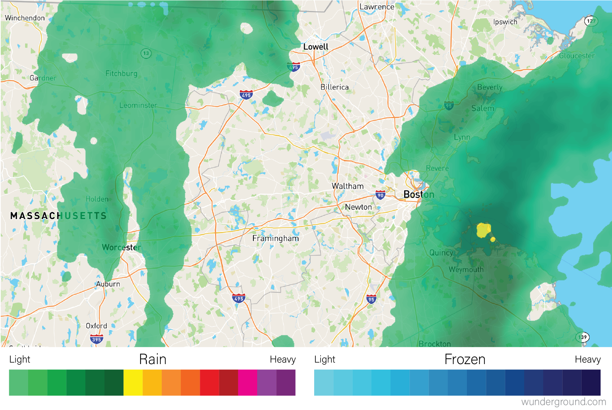

```{r,include=FALSE}
library(tidyverse)
source("0600_data_viz.R")
```

## Plotting Two or More Dimensions .

### Scatter plot .

### Line plot .

```{r}
ggplot(ad_metadata,mapping=aes(x=abeta, y=tau)) +
    geom_line()
```

``` {r}
pivot_longer(ad_metadata,
  c(tau,abeta,iba1,gfap),
  names_to='Marker',
  values_to='Intensity'
  ) %>%
  ggplot(ad_metadata,mapping=aes(x=ID, y=Intensity, group=Marker, color=Marker)) +
    geom_line()
```

### Bubble plot .

### Heatmaps

Heatmaps visualize values associated with a grid of points $(x,y,z)$ as a grid
of colored rectangles, where $x$ and $y$ define the grid point coordinates and
$z$ is a continuous value. A common heatmap you might have seen is the [weather
map](https://en.wikipedia.org/wiki/Weather_map), which plots current or
predicted weather patterns on top of a geographic map:



The color at each grid coordinate, which in this case are spaced closely enough
so we cannot distinguish the boundaries between the rectangles without zooming
in, is proportional to the type and intensity of weather at that location.
In the weather map, the weather values are mapped to a *color scales* that
describe the amount of precipitation as shown in the map legend.

In biology, heatmaps are more typically used to visualize matrices. The concept
is the same as with the weather map, except instead of geographic coordinates
the grid corresponds to the rows and columns of a data matrix, and the color of
each grid point is mapped to a color scale chosen by the designer. The grid of
rectangles is typically not overlayed over anything, as in the weather map, but
is instead the entire visualization.

We can create heatmap in R using the base R
[`heatmap()`](https://www.rdocumentation.org/packages/stats/versions/3.6.2/topics/heatmap)
function. Below is a heatmap visualization of our histological markers from the
AD example:

```{r data viz marker heatmap}
# heatmap() requires a R matrix, and cannot accept a tibble or a dataframe
marker_matrix <- as.matrix(
  dplyr::select(ad_metadata,c(tau,abeta,iba1,gfap))
)
# rownames of the matrix become y labels
rownames(marker_matrix) <- ad_metadata$ID

heatmap(marker_matrix)
```

The lower right portion of the plot is the heatmap, where the matrix values are
visualized on a color gradient from light yellow to dark red.

More precisely, the `heatmap()` function creates a *clustered heatmap*, where
the rows and columns have been [hierarchically
clustered](#hierarchical-clustering) separately and ordered according to how
similar they are to one another. The left and top line diagrams are
[dendrograms](#dendrograms), which depict the similarity between rows and
columns as a tree, where the total branch length summed from one row/column to
another is proportional to the dissimilarity (i.e. numeric distance) of the two.

::: {.box .note}
The base R `heatmap()` function performs many different operations on the input
matrix than just draw a grid of rectangles in proportion to the values. By
default, it also:

* performs [hierarchical clustering](#hierarchical-clustering) of the rows and
columns using a Euclidean distance function and orders them accordingly
* draws [dendrograms](#dendrogram) on the rows and columns according to the
clustering
* scales the data in the rows to have mean zero and standard deviation 1

Each of these defaults can be changed by passing arguments into the function
call. The following turns off all of the extra functionality and produces only a
heatmap of the matrix:

```{r data viz pure heatmap}
heatmap(
  marker_matrix,
  Rowv=NA,
  Colv=NA,
  scale="none",
)
```
Note how the colors in this heatmap are very different for many of the
marker/sample pairs. This illustrates some of the dangers of using heatmaps,
which are described more fully in the [How To Use Heatmaps Responsibly] section
below.
:::

The base R heatmap function has the major drawback that no color key is provided
to indicate how values map to colors. Another heatmap
[`heatmap.2`](https://www.rdocumentation.org/packages/gplots/versions/3.1.1/topics/heatmap.2)
function in the [`gplots` package](https://cran.r-project.org/web/packages/gplots/index.html)
which has a similar interface to `heatmap()`, but allows provides more
parameters to control the behavior of the plot and includes a color key:

```{r heatmap.2}
library(gplots)
heatmap.2(marker_matrix)
```

The extra decoration (dashed and solid vertical lines called *traces* by the
package) provide another way to understand the magnitude of the value in each
cell. Refer to the [`gplots` documentation of
`heatmap2`](https://www.rdocumentation.org/packages/gplots/versions/3.1.1/topics/heatmap.2)
for more information on how to interpret the trace (hint: you may turn it off
with by passing the argument `trace = "none"` to the function call).

Both `heatmap()` and `heatmap.2()` provide a useful method to annotate rows and
columns with a categorical variable. Each of our subjects either has AD or is a
control, and we can add a color bar along the margin of the plot to indicate the
status of each subject:


```{r heatmap margin}
condition_colors <-
  transmute(
    ad_metadata,
    color=if_else(condition == "AD","red","blue")
  )
heatmap(
  marker_matrix,
  RowSideColors=condition_colors$color
)
```

And with `heatmap.2`:

```{r heatmap.2 margin}
heatmap.2(
  marker_matrix,
  RowSideColors=condition_colors$color
)
```

Heatmaps may also be created using ggplot and the
[`geom_tile`](https://ggplot2.tidyverse.org/reference/geom_tile.html) geometry.
This method of generating heatmaps is more "manual" than the other functions
covered so far, and so are both flexible and require more work to obtain certain
functionality (e.g. clustering, color bars on side margins, etc). This geometry
requires the data to be in long format, with one column for `x`, `y`, and `z`
values:

```{r heatmap geom tile}
pivot_longer(
  ad_metadata,
  c(tau,abeta,iba1,gfap),
  names_to="Marker",
  values_to="Intensity"
) %>%
  ggplot(aes(x=Marker,y=ID,fill=Intensity)) +
  geom_tile()
```

Note this ggplot method does not scale or reorder rows or columns.

#### Specifying Heatmap Colors

The colors of the heatmap may be changed by passing one of the [native color
palettes](https://stat.ethz.ch/R-manual/R-patched/library/grDevices/html/palettes.html)
to the heatmap function with the `col` argument:

```{r heatmap cm colors}
# native R colors are:
# - rainbow(n, start=.7, end=.1)
# - heat.colors(n)
# - terrain.colors(n)
# - topo.colors(n)
# - cm.colors(n)
# the n argument specifies the number of colors (i.e. resolution) of the colormap to return
heatmap(marker_matrix,col=cm.colors(256))
```

To change the color using ggplot and `geom_tile()`, use the
[`scale_fill_gradientn`](https://ggplot2.tidyverse.org/reference/scale_gradient.html)
function to specify a different color palette:

```{r heatmap geom tile color change}
pivot_longer(
  ad_metadata,
  c(tau,abeta,iba1,gfap),
  names_to="Marker",
  values_to="Intensity"
) %>%
  ggplot(aes(x=Marker,y=ID,fill=Intensity)) +
  geom_tile() +
  scale_fill_gradientn(colors=cm.colors(256))
```
The native color palettes in R look as follows:

```{r data viz heatmap native palettes,echo=FALSE}
demo.pal <-
  function(n, border = if (n < 32) "light gray" else NA,
           main = paste("color palettes;  n=", n),
           ch.col = c("rainbow(n, start=.7, end=.1)", "heat.colors(n)",
                      "terrain.colors(n)", "topo.colors(n)",
                      "cm.colors(n)"))
{
    nt <- length(ch.col)
    i <- 1:n; j <- n / nt; d <- j/6; dy <- 2*d
    plot(i, i+d, type = "n", yaxt = "n", ylab = "", main = main)
    for (k in 1:nt) {
        rect(i-.5, (k-1)*j+ dy, i+.4, k*j,
             col = eval(str2lang(ch.col[k])), border = border)
        text(2*j*1.3,  (k * j + dy/4)+0.3, ch.col[k])
    }
}
demo.pal(16)
```

Instead of these color palettes, you may use one of the
[ColorBrewer](https://colorbrewer2.org/#type=sequential&scheme=BuGn&n=3)
palettes in the [RColorBrewer
package](https://cran.r-project.org/web/packages/RColorBrewer/index.html)

```{r heatmap colorbrewer palettes,fig.height=8}
library(RColorBrewer)
display.brewer.all()
```

There are very many color palettes to choose from, and you may also specify your
own palettes with as much detail and complexity as you desire. More discussion
on how to choose colors is described in the next section.

#### How To Use Heatmaps Resonsibly .

While heatmaps may seem intuitive, they are actually quite complicated and can
be difficult to create in a way that accurately depicts the underlying matrix.
More to come...
