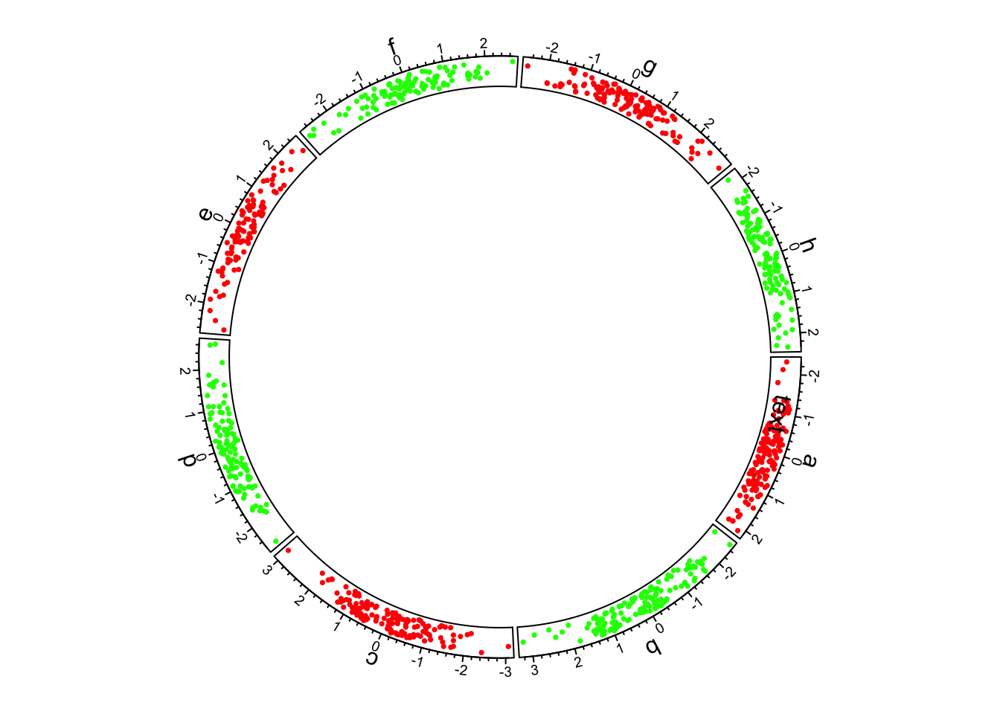

```{r,include=FALSE}
source("0600_data_viz.R")
```


## Other Kind of Plots

### Dendrograms

Dendrograms are visualizations of tree structures (*dendron* means tree in
Greek). In the [graph theory](https://en.wikipedia.org/wiki/Graph_theory) branch
of mathematics, a [tree](https://en.wikipedia.org/wiki/Tree_(graph_theory)) is
defined as a graph composed of nodes and edges in which any two nodes are
connected by exactly one path. Such a graph is also called an *acyclic graph*,
where no paths exist that can be followed from a node back to iself. A full
treatment of trees and graph theory is beyond the scope of this book, but we
will discuss trees to the extent they are necessary to understand how to read a
dendrogram.

The concepts of a dendrogram are illustrated in the following figure:


The tree drawn in a typical dendrogram is created using the output of a
clustering algorithm, e.g. [hierarchical clustering](#hierarchical-clustering)
that groups data points together based on their dissimilarity. Briefly, in the
figure, the data are one dimensional scalars, so the distance between all points
is simply the absolute value of the difference between them. The two closest
points are then merged into a single group, and the pairwise distances are
recomputed for all remaining data points with a summary of this new group (the
group summarization method is specified by the user and is called the [linkage
critera](https://en.wikipedia.org/wiki/Hierarchical_clustering#Linkage_criteria)).
Then the process repeats, where the two nearest data points or summarized groups
are merged into a new group, the new group is summarized, pairwise distances
recomputed, etc. until all the data points have been included in a group. In
this way, all data points are assigned to a *hierarchy* of groups. In general,
any hierarchical grouping of data can be used to generate a dendrogram.

Given a hierarchical clustering result, a dendrogram can be drawn in several
ways in R. Using our AD marker example data, we hierarchically cluster the
subjects based on the content of all their markers and visualize the result as
follows:

```{r dendro full}
library(ggdendro)

# produce a clustering of the data using the hclust for hierarchical clustering
# and euclidean distance as the distance metric
euc_dist <- dist(dplyr::select(ad_metadata,c(tau,abeta,iba1,gfap)))
hc <- hclust(euc_dist, method="ave")

# add ID as labels to the clustering object
hc$labels <- ad_metadata$ID

ggdendrogram(hc)
```

This dendrogram does not produce highly distinct clusters of AD and control
samples with all the data.

To illustrate what a dataset with strong clustering looks like, we draw
multivariate samples from two normal distributions and cluster the results:

```{r dendro strong}
library(patchwork)
library(ggdendro)

well_clustered_data <- tibble(
  ID=c(stringr::str_c("A",1:10),stringr::str_c("B",1:10)),
  f1=c(rnorm(10,0,1),rnorm(10,10,1)),
  f2=c(rnorm(10,0,1),rnorm(10,10,1))
)

scatter_g <- ggplot(well_clustered_data, aes(x=f1,y=f2)) + geom_point()

# produce a clustering of the data using the hclust for hierarchical clustering
# and euclidean distance as the distance metric
euc_dist <- dist(dplyr::select(well_clustered_data,-ID))
hc <- hclust(euc_dist, method="ave")

# add ID as labels to the clustering object
hc$labels <- well_clustered_data$ID

dendro_g <- ggdendrogram(hc)
scatter_g | dendro_g
```

Here, all the A and B samples strongly cluster together, with a large distance
between clusters.

::: {.box .readmore}
* [Dendrograms](https://en.wikipedia.org/wiki/Dendrogram) Wikipedia page
* [`ggdendro` package vignette](https://cran.r-project.org/web/packages/ggdendro/vignettes/ggdendro.html)
:::

### Chord Diagrams and Circos Plots

[Circos](http://circos.ca/) is a software package that creates circular
diagrams originally designed to depict genomic features and data. The software
is capable of making beautiful, information dense figures. The Circos software
itself is written in the [Perl](https://www.perl.org/) programming language, but
the [`circlize` package](https://jokergoo.github.io/circlize_book/book/) brings
these capabilities to R. The following is a basic circos plot created by the
`circlize` package:



The circle is divided up into 8 *sectors* here labeled with letters. There is a
single track added to the plot, where each sector has a 2-dimensional random
dataset plotted within the arc of the sector's track box. Many tracks may be
added to the same plot:


The arches inside the circle are called *chords* and are drawn to indicate there
is a relationship between the coordinates of different sectors. Diagrams with
such chords between sectors are called *chord diagrams*, and some plots are
composed only of coords:


These chord diagrams are often used in genomics studies to illustrate
chromosomal rearrangements:


Read the [circlize documentation](https://jokergoo.github.io/circlize_book/book/)
for more information on how to use this very feature rich package.
