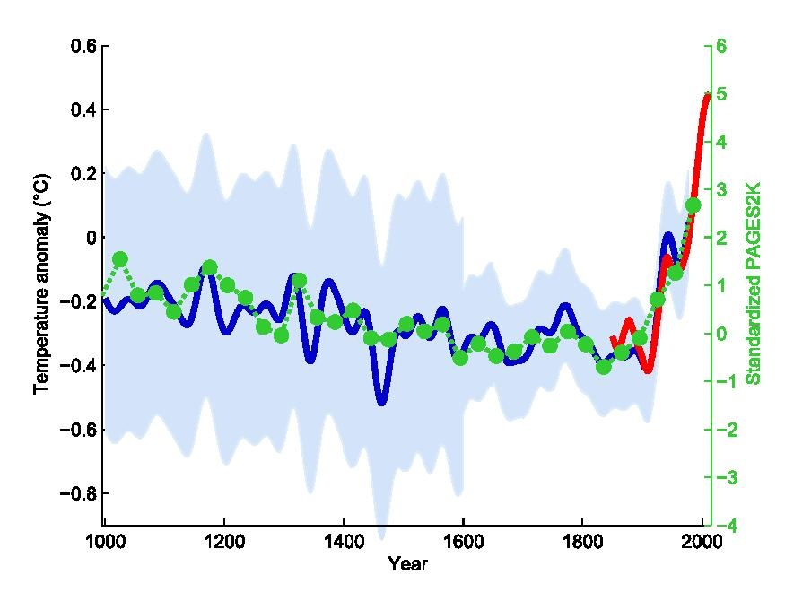
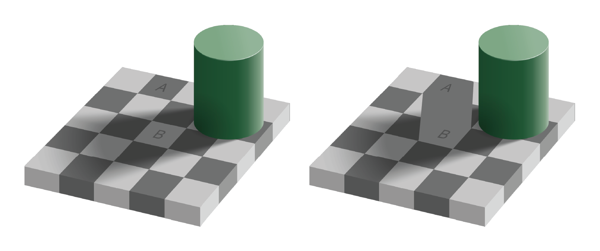
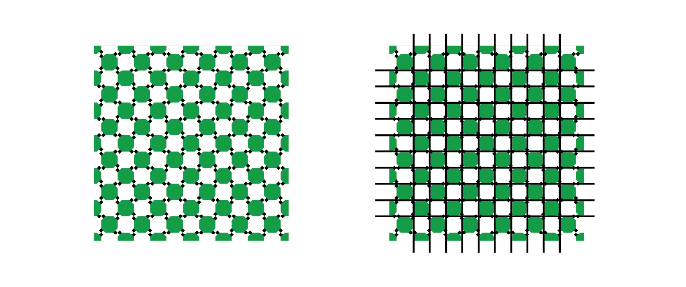
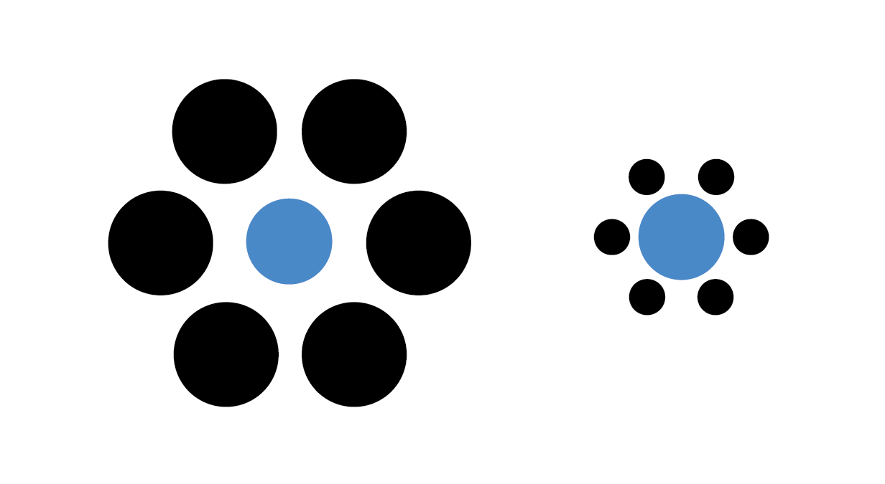
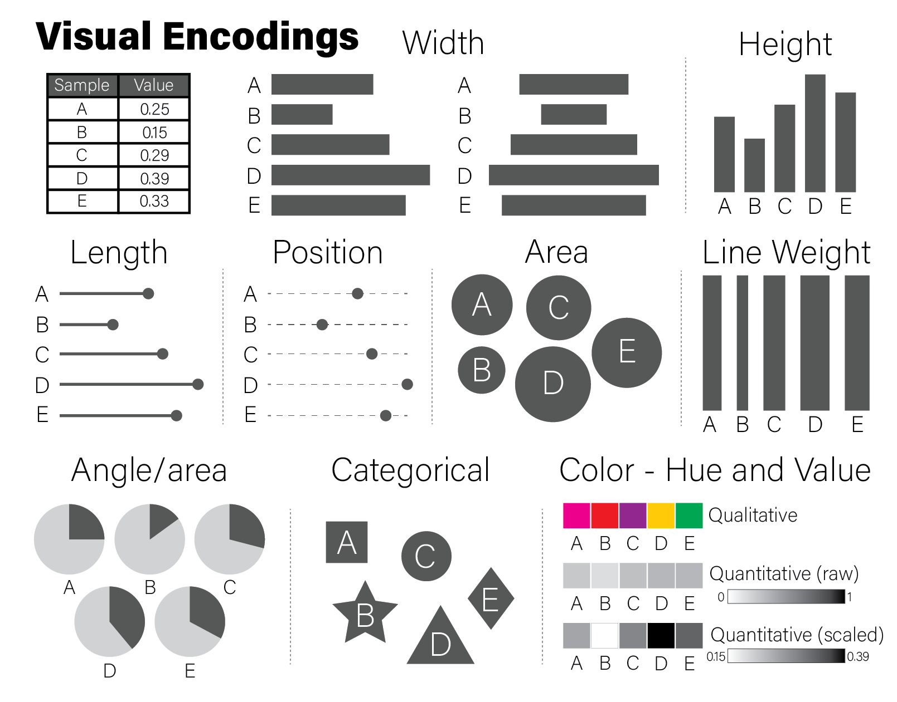
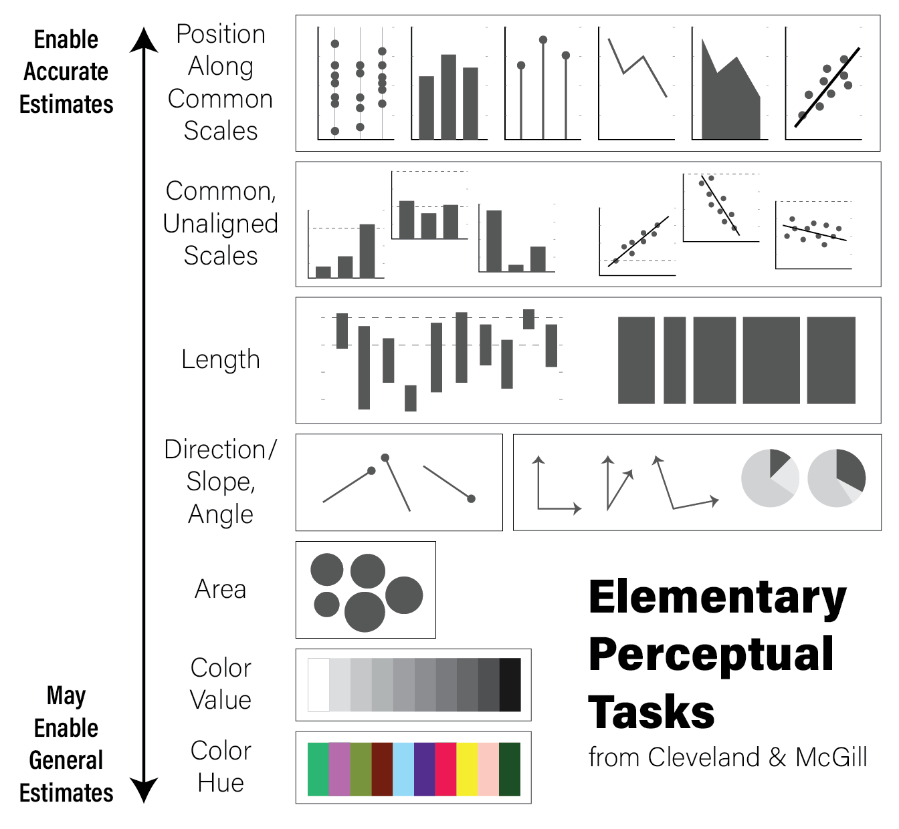

```{r,include=FALSE}
source("0600_data_viz.R")
```

## Responsible Plotting

"Good plots empower us to ask good questions." - Alberto Cairo, How Charts Lie

Plots are the primary vehicles of communicating scientific results. A very
common and useful approach to writing scientific papers is to decide how many
figures are needed to tell the story, and then create plots as necessary to
convey that story. The text plays a supporting role for the figures. Effective
data visualization has immense power to communicate the ideas (and beliefs) of
the chart creator. Consider the famous "hockey stick graph" depicting average
global temperatures created by Jerry Mahlman to describe the pattern of global
warming shown by Mann, Bradkely & Hughes in 1999:



The data and models underlying the graph are very complex, but the story is
clear: the past 100 years has seen a dramatic increase in average temperature in
the northern hemisphere. This chart was one of the main drivers behind renewed
main stream awareness of climate change, in no small part because it is easy to
understand.

Given the power visualization has, and the increasing amount of data created by
and required for daily life, it is ever more important that data visualization
designers understand the principles and pitfalls of effective plotting. There is
no easy solution to accomplishing this, but Alberto Cairo and Enrico Bertini,
two journalists who specialize in data visualization and infographics, lay out
five qualities of an effective visualization, in Cairo's book [the truthful
art](http://www.thefunctionalart.com/p/the-truthful-art-book.html):

1. **It is truthful** - the message conveyed by the visualization expresses some
truth of the underlying data (to the extent that anything is "true")
2. **It is functional** - the visualization is accurate, and allows the reader
to do something useful with the insights they gain
3. **It is insightful** - the visualization should reveal patterns in the data
that would otherwise be difficult or impossible to see and understand
4. **It is enlightening** - the reader should leave the experience of engaging
with the visualization convinced of something, ideally what the designer intends
5. **It is beautiful** - it is visually appealing to its target audience, which
helps the user more easily spend time and engage with the visualization

A full treatment of these ideas are included in, among others, three excellent
books by Alberto Cairo, linked at the end of this section. The sections that
follow describe some of the ideas and concepts that make visualization
challenging and offer some guidance from the books mentioned on how to produce
effective visualizations.

:::{.box .readmore}
All three of these books were written by Alberto Cairo:

* [How Charts Lie](http://www.thefunctionalart.com/p/reviews.html)
* [the funcitonal art](http://www.thefunctionalart.com/p/about-book.html)
* [the truthful art](http://www.thefunctionalart.com/p/the-truthful-art-book.html)
:::

### Visualization Principles

The purpose of data visualization is to illustrate (from the latin *illustrare*,
meaning to light up or illuminate) relationships between quantities. Effective
data visualization takes advantage of our highly evolved [visual perception
system](https://en.wikipedia.org/wiki/Visual_perception) to communicate these
relationships to our cognitive and decision making systems. Therefore, our
visualization strategies should take knowledge of our perceptual biases into
account when deciding how to present data. Poor data visualization choices may
make interpretation difficult, or worse lead us to incorrect inferences and
conclusions.

### Human Visual Perception

The human visual perceptual system is intrinsically integrated with our
cognitive system. This makes it a *predictive* or *interpretive* system, where
patterns of light received by the eye are pre-processed before the relatively
slower executive function parts of our brains can make judgements.
If we compare our perception of the world around us to a cinematic film, this
makes our visual perception less raw video footage and more like a director's
commentary, where we add our interpretations, motivations, experiences, and
anecdotal annotations to the images before we cognitively interpret them. Said
differently, our visuo-cognitive system performs *pattern recognition* on the
information we receive, and annotates the information with the patterns it
thinks it sees. Very often, our cognition predicts patterns that are accurate,
which therefore may be useful for us in making decisions, e.g. how to move out
of the trajectory of a falling tree branch. However, sometimes our pattern
recognition system, which is always *trying* to match patterns, sees patterns
that don't exist. Some of the most well known and well studied examples of these
perceptual errors are *optical illusions.*

Optical illusions are images or animations that reveal the errors and bias of
our perceptual system. Some illusions that are static images appear to move.
Others distort the true relations between lines or shapes, or lead to incorrect
or inconsistent perception of color. Consider the famous [checkerboard shadow
illusion](https://en.wikipedia.org/wiki/Checker_shadow_illusion) created by
Edward H. Adelson in 1995:



The image on the right clearly shows the two squares A and B are the same shade
of grey, though A appears darker than B in the left image. This is because our
perceptual system identifies color by *contrasting* adjacent colors. Since the
colors adjacent to the A and B squares differ, our perception of the colors also
differ. This example illustrates the contrast bias according to the *value*, or
lightness, of the color, but the principle also applies to different hues:


An illusion that shows how our perceptual system distorts relationships between
geometry is as follows:



The pattern of light and dark squares intersecting with the grid makes the lines
appear "wavy" when all the horizontal and vertical lines are in fact straight,
parallel, and perpendicular.

A final example illusion that is relevant for data visualization demonstrates
a similar contextual bias of relative area:



The two blue dots in the image have the same radius, although the dot within
the large black circles appears smaller.

Not only are there illusions that distort our perception of shapes that are
there, but there are also illusions that convince us of the existence of shapes
that are *not* there. The following illusion illustrates the point:


Seeing shapes when they aren't there is nothing new to humans, of course.


::: {.box .note}
In English, there is a word that refers to the human tendency to see patterns
where there are none: "[Pareidolia](https://en.wikipedia.org/wiki/Pareidolia).
is the tendency for perception to impose a meaningful interpretation on a nebulous
stimulus, usually visual, so that one sees an object, pattern, or meaning where
there is none." - Wikipedia accessed 9/21/2023
:::

Each of these perceptual biases relate to how we interpret many common data
visualization strategies. We cannot avoid making these interpretive errors via
our cognition alone, but we can use this knowledge in the design of our plots
to mitigate their effects. To quickly summarize the perceptual biases we have
demonstrated:

1. We perceive the value and hue of colors in contrast to adjacent colors
2. Certain types of geometry interfere with our ability to assess accurate
relationships between geometric shapes
3. We perceive the size (area) of shapes relative to nearby shapes
4. We may perceive shapes where there are none drawn, based on nearby shapes
5. We may perceive shapes that are similar to other familiar shapes, but have no
true relationship

Each of these biases influence how we perceive and interpret plots, as we will
see in the rest of this chapter.

### Visual Encodings

Data visualization is the process of encoding numbers as positions, shapes, and
colors in a two- or sometimes three-dimensional space. There are many different
geometric properties we can use to create an encoding, including:

1. Length, width, or height
2. Position
3. Area
4. Angle/proportional area
5. Shape
6. Hue and value of colors

Examples of each of these encodings is depicted for a fictitious dataset of
values between zero and one in the following figure:



The example encodings in the figure are among the most common and recognizable
elements used in scientific plotting. Every time a reader examines a plot, they
must *decode* it to a (hopefully) accurate mental model of the quantities that
underlie it. Using familiar encodings that a reader will already know how to
interpret makes this decoding cognitively easier, thereby enabling the plot to
be more quickly understood.

Every quantity we wish to plot must be mapped to a visualization using one or
more of these geometric encodings. By combining different variables with
different encodings, we construct more complex plots. Consider the scatter plot,
which contains two continuous values per datum, each of which is mapped to a
visualization with a position encoding:

```{r viz scatter}
tibble(
  x=rnorm(100),
  y=rnorm(100,0,5)
) %>%
  ggplot(aes(x=x,y=y)) +
  geom_point()
```

We might layer on another encoding by introducing a new variable that is the
absolute value of the product of $x$ and $y$ and make the area of each datum
proportional to that value:

```{r viz scatter 2}
data <-  tibble(
  x=rnorm(100),
  y=rnorm(100,0,5),
  `x times y`=abs(x*y)
)
data %>%
  ggplot(aes(x=x,y=y,size=`x times y`)) +
  geom_point()
```

We could layer yet more encodings to color each marker proportional to a value
between 0 and 1, and also change the shape based on a category:

```{r viz scatter 3}
data <- mutate(data,
    z=runif(100),
    category=sample(c('A','B','C'), 100, replace=TRUE)
  )
data %>%
  ggplot(aes(x=x, y=y, size=`x times y`, color=z, shape=category)) +
  geom_point()
```

Let's say the sum of $x$ and $y$ is meaningful as well, and we are interested in
the order of the data along this axis. We can connect all the points with lines
by using a length encoding between adjacent data points after sorting by $x+y$:

```{r viz scatter 4}
data <- mutate(data,
  `x + y`=x+y,
) %>%
  arrange(`x + y`) %>%
  mutate(
    xend=lag(x,1),
    yend=lag(y,1)
  )
data %>%
  ggplot() +
  geom_segment(aes(x=x,xend=xend,y=y,yend=yend,alpha=0.5)) +
  geom_point(aes(x=x, y=y, size=`x times y`, color=z, shape=category))
```

The plot is becoming very busy and difficult to interpret because we have
encoded six different dimensions in the same plot:

1. $x$ value has a positional encoding
2. $y$ value has another positional encoding
3. The product $xy$ has an area encoding
4. $z$ has a quantitative color value encoding
5. category has a categorical encoding to shape
6. The adjacency of coordinates along the $x + y$ axis with a length encoding

Very complex plots may be built by thinking explicitly about how each dimension
of the data are encoded, but the designer (i.e. you) must carefully consider
whether the chosen encodings faithfully depict the relationships in the data.

These common encodings depicted in the earlier figure are not the only
possibilities for mapping visual properties to a set of values. Consider the
violin plot below:

```{r viz violin}
set.seed(1337)
tibble(
  value=rnorm(100),
  category='A'
) %>%
  ggplot(aes(x=category,y=value,fill=category)) +
  geom_violin()
```

Here, `geom_violin()` has preprocessed the data to map the number of values
across the full range of values into a density. The density is then encoded with
a width encoding, where the width of the violin across the range of values,
which is encoded with a position encoding.

Most common chart types are simply combinations of variables with different
encodings. The following table contains the encodings employed for different
types of plots:

+-----------------------------+--------------+---------------------------------------+--------------------------------------------------------+
| Plot                        | $x$ encoding | $y$ encoding                          | note                                                   |
+=============================+==============+=======================================+========================================================+
| [scatter](scatter-plot)     | position     | position                              |                                                        |
+-----------------------------+--------------+---------------------------------------+--------------------------------------------------------+
| [vertical bar](bar-chart)   | position     | height                                |                                                        |
+-----------------------------+--------------+---------------------------------------+--------------------------------------------------------+
| [horizontal bar](bar-chart) | width        | position                              |                                                        |
+-----------------------------+--------------+---------------------------------------+--------------------------------------------------------+
| [lollipop](lollipop-plots)  | position     | height for line + position for "head" |                                                        |
+-----------------------------+--------------+---------------------------------------+--------------------------------------------------------+
| [violin](violin-plots)      | position     | width                                 | $x$ transformed to range, $y$ transformed to densities |
+-----------------------------+--------------+---------------------------------------+--------------------------------------------------------+

#### Elementary Perceptual Tasks

The purpose of visualizations is to enable the reader to construct an accurate
mental model of the relationships or ideas contained within the data. As
discussed in the [Human Visual Perception] section, not all visualizations allow
for easy and accurate judgments of this kind due to the biases of our biological
visuo-cognitive biases. However, some encodings of data allow *more accurate*
judgments than others. William Cleveland and Robert McGill, two statisticians,
proposed a hierarchy of visual encodings that span the spectrum of precision of
our ability to accurately interpret visual information [@Cleveland1984-ay]. They
defined the act of mapping a specific type of encoding to a cognitive model an
*elementary perceptual task.* The hierarchy is depicted in the following figure:



The hierarchy is oriented from least to most cognitively difficult decoding
tasks, where the easier tasks lend themselves to easier comparisons and
judgements. For example, the easiest perceptual task is to compare visual
elements with a position encoding that are all aligned across all charts; the
positional decoding is the same for each chart, even if they use different
stylistic elements. Further down the hierarchy, more cognitive effort is
required to assess the precise relationships between elements of the
plot, therefore possibly reducing the accuracy of our judgements.

This is not to say that it is always better for the reader to make highly
accurate estimates. General trends and patterns may be more readily (and
beautifully) apparent with less accurate encodings. Consider the following
clustered heatmap:

```{r heatmap perceptual task}
# these data have two groups of samples with similar random data profiles
data <- as.matrix(
  tibble(
    A=c(rnorm(10),rnorm(10,2)),
    B=c(rnorm(10),rnorm(10,2)),
    C=c(rnorm(10),rnorm(10,2)),
    D=c(rnorm(10,4),rnorm(10,-1)),
    E=c(rnorm(10,4),rnorm(10,-1)),
    F=c(rnorm(10,4),rnorm(10,-1))
  )
)
rownames(data) <- paste0('G',seq(nrow(data)))
heatmap(data)
```

In this toy example, it may be sufficient for the reader's comprehension to show
that samples A, B, and C cluster together, as do D, E, and F, without requiring
them to know *precisely* how different they are. In this case, the clustering
suggested by the visualization should be presented in some other way that is
more precise as well, for example a statistical comparison with results reported
in a table, to confirm what our eyes tell us.

It is usually a good idea to plot data multiple ways, to ensure the patterns we
see with one encoding are also seen with another. We might consider plotting
the data again using a [parallel coordinates plot](parallel-coordinate-plots):

```{r viz element pcp}
library(GGally)

as_tibble(data) %>% mutate(
  group=c(rep('Group 1',10),rep('Group 2',10))
) %>%
  ggparcoord(columns=1:6,groupColumn=7)
```

For simplicity, we added a new variable `group` that is consistent with the
clustering we observed in the heatmap, which we might have extracted
computationally by cutting the row dendrogram into two flat clusters. The
parallel coordinate plot also visually confirms our interpretation of two
distinct clusters. We may now feel more comfortable including one or the other
plot in a figure, though this author finds the parallel coordinate plot more
accurate and enlightening. Recall the elementary perceptual task hierarchy:
aligned position encodings enable more accurate estimates of data. Heatmaps,
which use color value and hue, enable the least accurate estimates.

### Some Opinionated Rules of Thumb

Effective data visualization is challenging, and there are no simple solutions
or single approaches to doing it well. In this sense, data visualization is as
much an art as a science. This author has some rules of thumb he applies when
visualizing data:

1. **Visualize the same data in multiple ways.** This will help ensure you
aren't being unduly influenced by the quirks of certain encodings or inherent
visuo-cognitive biases.
2. **Perform precise statistical analysis to confirm findings identified when
inspecting plots.** Examine the underlying data and devise statistical tests or
procedures to verify and quantify patterns you see.
3. **Informative is better than beautiful.** Although it may be tempting to make
plots beautiful, this should not be at the expense of clarity. Make them clear
first, then make them beautiful.
4. **No plot is better than a useless plot.** Some plots, while pretty, are
useless in a literal sense; the information contained within the plot is of no
use in either devising followup experiments or gaining insight into the data.
5. **Sometimes a table is the right way to present data.** Tables may be
considered boring, but they are the most accurate representation of the data
(i.e. they ARE the data). Especially for relatively small datasets, a table may
do the job of communicating results better than any plot.
6. **If there is text on the plot, you should be able to read it.** Many results
in biological data analysis have hundreds or thousands of individual points,
each of which has a label of some sort. If the font size for labels is too small
to read, or they substantially overlap each other making them illegible, either
the plot needs to change or the labels should not be drawn. Same goes for axis
labels.
7. **(Almost) every plot should have axis labels, tick marks and labels, a
legend, and a title.** There are a few exceptions to this, but a plot should be
mostly understandable without any help from the text or caption. If it isn't,
it's probably a poor visualization strategy and can be improved.
8. **When using colors, be aware of color blindness.** There are several known
forms of colorblindness in humans. Most default color schemes are "colorblind
friendly" but sometimes these color combinations can be counterinutitive. Check
sites like [ColorBrewer](https://colorbrewer2.org/#type=sequential&scheme=BuGn&n=3)
to find color schemes that are likely to be colorblind friendly.
9. **Make differences visually appear as big as they mean.** Scales on plots can
distort the meaning of the underlying data. For example, consider the following
two plots with identical data:
  
```{r viz misleading scales}
library(patchwork)
data <- tibble(
  percent=c(86,88,87,90,93,89),
  ID=c('A','B','C','D','E','F')
)
g <- ggplot(data, aes(x=ID,y=percent)) +
  geom_bar(stat="identity")

g + coord_cartesian(ylim=c(85,95)) | g
```

The left plot, which had its y axis limited to the values of the data, make the
differences between samples seem visually much larger than they actually are.
If a difference between 87 and 93 percent is in fact meaningful, then this might
be ok, but the context matters.

You will identify your own strategies over time as you practice data
visualization, and these rules of thumb might not work for you. There is no one
right way to do data visualization, and as long as you are dedicated to
representing your data accurately, there is no wrong way.

