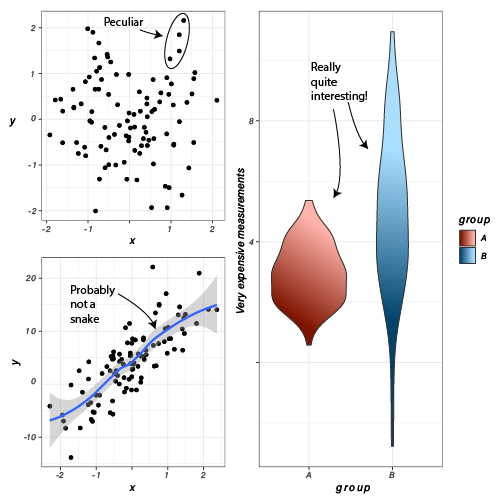

## Publication Ready Plots

ggplot is powerful and flexible tool for creating plots, but it falls a little
short of producing plots directly suitable for publication. This is primarily
due to the default styling provided by the package; standard ggplot formatting
is effective for examining plots on screens, but some elements, such as the
default grey plot background, are unnecessary and sometimes inappropriate for
polished plots in printed journals.

There are two ways to take ggplots the final step to publication quality
figures. The first is by using
[themes](https://ggplot2.tidyverse.org/reference/ggtheme.html) provided by the
ggplot package and customizing specific elements to taste. The second is to
export plots to file in [Scalable Vector
Graphics](https://en.wikipedia.org/wiki/Scalable_Vector_Graphics) format, which
can then be imported into programs like [Adobe
Illustrator](https://www.adobe.com/products/illustrator.html) or
[Inkscape](https://inkscape.org/) to be edited further.


### `ggplot` Themes

Themes in ggplot are combinations of styling elements applied to the different
components of a chart that include everything except the display and styling of
data, which is controlled using geometry and aesthetics. The default theme
produces plots with a grey background, a white grid, no charting area frame, and
standard axis and tick labels:

```{r viz pub default}
base_g <- tibble(
  x=rnorm(100),
  y=rnorm(100)
) %>%
  ggplot(aes(x=x, y=y)) +
  geom_point()

base_g
```

This is fine for displaying on a screen, but if this plot were to be printed on
paper, the solid grey background would use unnecessary ink.

:::{.box .note}
There is a helpful principle in plotting: *use the least amount of ink possible
to produce the desired plot.* This is not just for economic, ink-saving reasons,
but also because sparser plots without superfluous graphic elements allow the
reader to focus more on the data than the styling.
:::

`ggplot` comes with other themes that may be added to plots with
[`theme_X()`](https://ggplot2.tidyverse.org/reference/ggtheme.html) functions.
Another available theme is `theme_bw()`:

```{r viz theme bw}
base_g + theme_bw()
```

This theme replaces the grey background with white, draws light grey grid lines,
and adds a frame around the plotting area. Plots with this theme might be more
suitable for plots displayed with a projector, for example in presentations.

Another theme is `theme_classic()`, which draws only the elements of the plot
that are strictly necessary:

```{r viz classic}
base_g + theme_classic()
```

There are many so-called ["complete
themes"](https://ggplot2.tidyverse.org/reference/ggtheme.html) included with
ggplot. If so desired, all style elements controlled by these complete themes
can be customized using the
[`theme()`](https://ggplot2.tidyverse.org/reference/theme.html) function. A full
treatment of themes is beyond the scope of this chapter, but you may read all
about it in the documentation.

### Exporting to SVG

Even the custom themes and [multipanel figures](multipanel-figures) may not
produce figures that adhere to scientific journal guidelines or your own tastes.
In these instances, all ggplot plots may be saved in  [Scalable Vector
Graphics](https://en.wikipedia.org/wiki/Scalable_Vector_Graphics) (SVG) format.
In contrast with bitmapped file formats like PNG or JPG that store images as a
matrix of pixels, SVG format describes shapes using a mathematical
specification. For example, a circle is expressed in SVG format like:

```xml
<circle cx="50" cy="50" r="50"/>
```
This [<circle> tag](https://developer.mozilla.org/en-US/docs/Web/SVG/Element/circle)
specifies that there should be a circle (ellipse) positioned with the center at
the coordinate (50, 50) with a radius of 50. Illustration software like [Adobe
Illustrator](https://www.adobe.com/products/illustrator.html) or
[Inkscape](https://inkscape.org/) can understand SVG instructions and generate
a visual representation of them. Text can also be included directly in SVG
files. Because these elements are represented mathematically, the illustration
programs that understand them can produce images of any size and resolution,
allowing the designer to create clear, high quality images as required by
journals.

Another benefit of SVG is that the illustration programs that understand them
can also be used to edit the individual elements of the entire plot. For
example, the position of text labels, the font, and the text itself, may be
arbitrarily modified. Consider the following multipanel figure:

```{r viz pub multipanel}
library(patchwork)
g1 <- tibble(
  x=rnorm(100),
  y=rnorm(100)
) %>%
  ggplot(aes(x=x, y=y)) +
  geom_point() +
  theme_bw()

g2 <- tibble(
   x=rnorm(100),
   y=5*x+3+rnorm(100,1,4)
) %>%
  ggplot(aes(x=x, y=y)) +
  geom_point() +
  geom_smooth(method="loess", formula=y ~ x) +
  theme_bw()

g3 <- tibble(
  group=c(rep('A',100),rep('B',100)),
  val=c(rnorm(100,3),rnorm(100,5,3))
) %>%
  ggplot(aes(x=group, y=val,fill=group)) +  
  geom_violin() +
  theme_bw()

(g1 / g2) | g3
```

This figure may be saved to SVG format by using the
[`ggsave()`](https://ggplot2.tidyverse.org/reference/ggsave.html) function:

```{r viz ggsave}
ggsave('multipanel.svg')
```

The image edited in Adobe Illustrator to have a different font and annotations
is as follows:



By combining themes in ggplot with the SVG+illustration software strategy, very
high quality and customized figures can be created with relatively little
effort.
