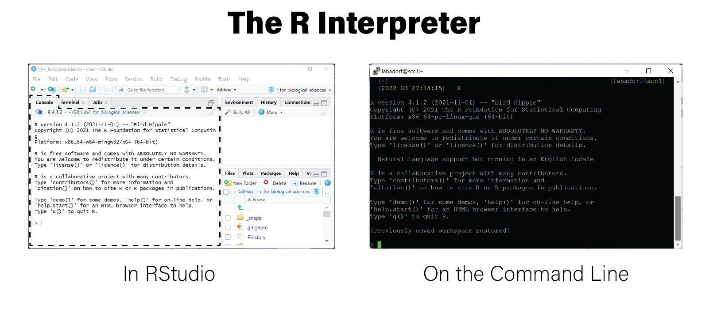

# EngineeRing


## Unit Testing

Writing code that does what you mean for it to do is often harder than it might
seem, especially in R. Also, as your code grows in size and complexity, and you
use good programming practice like [writing functions](#prog-functions),
changing one part of your code may have unexpected effects on other parts that
you didn't change. Unless you are using a programming language that has support
for proof-based [correctness
guarantees](https://en.wikipedia.org/wiki/Correctness_(computer_science)), it
may be impossible to determine if your code is *always* correct. As you might
imagine, so-called "total correctness" is very difficult to attain, and often
requires more time to implement than is practical (unless you're programming
something where correctness is very important, e.g. for a self-driving car).
However, there is a collection of approaches that can give us reasonable
assurances that our code does what we mean for it to do. These approaches are
called *software testing frameworks* that explicitly test our code for
correctness.

There are many different testing frameworks, but they all employ the general
principle that we test our codes correctness by passing it inputs for which we
we know what the output should be. For example, consider the following function
that sums two numbers:

```
add <- function(x,y) {
  return(x+y)
}
```

We can test this function using a known set of inputs and explicitly comparing
the result with the expected output:

```
result <- add(1,2)
result == 3
[1] TRUE
```

Our test instance in this case is input `x=1,y=2` and the expected output is
`3`. By comparing the result of this input with the expected output, we have
showed that at least for these specific inputs the function behaves as intended.
The testing terminology used in this case is *the test passed*. If the result
had been anything other than 3, the test would have *failed*.

The above is an example of a test, but it is an *informal test*; it is not yet
integrated into a framework since we have to manually inspect the result as
passing or failing. In a testing framework, you as the developer of your code
also write tests for your code and runs those tests frequently as your code
evolves to make sure it continues to behave as you expect over time.

The R package [testthat](https://testthat.r-lib.org/) provides such a testing
framework that "tries to make testing as fun as possible, so that you get a
visceral satisfaction from writing tests." It's true that writing tests for your
own code may feel tedious and very not fun, but the tradeoff is that tested code
is more likely to be correct, saving you from potentially embarrassing (or
worse) errors!

Writing tests using `testthat` is very easy, using the example test written
above (remember to install the package using `install.packages("testthat")`
first).

```
library(testthat)
test_that("add() correctly adds things", {
    expect_equal(add(1,2),3)
    expect_equal(add(5,6),11)
  }
)
Test passed
```

`Test passed`! How satisfying! The `test_that` function accepts two arguments:

1. a concise, human readable description of the test
2. one or more tests enclosed by `{}` written using [`expect_X`
  functions](https://testthat.r-lib.org/reference/index.html) from the testthat
  package

In the example above, we are explicitly testing that the result of `add(1,2)` is
equal to `3` and `add(5,6)` is equal to `11`; specifically, we called
`expect_equal`, which accepts two arguments that it uses to test equality. We
have written two explicit *test cases* (i.e. 1+2 == 3 and 5+6 == 11) under the
same test heading.

If we had a mistake in our test such that the expected output was wrong,
`testthat` would inform us not only of the failure, but more details about what
happened compared to what we asked it to expect:

```
test_that("add() correctly adds things", {
    expect_equal(add(1,2),3)
    expect_equal(add(5,6),10)
  }
)
-- Failure (Line 3): add() correctly adds things -------------------------------
add(5, 6) not equal to 10.
1/1 mismatches
[1] 11 - 10 == 1

Error: Test failed
```

In this case, our test case was incorrect, but this would be very helpful
information to have if we had correctly specified input and expected output and
the test failed! It means we did something wrong, but now we are aware of it and
can fix it.

The general testing strategy usually involves writing an R script that only
contains tests like the example above *and not analysis code*; the tests
in your test script call the functions you have written in your other scripts
to check for their correctness exactly like above. Then, whenever you make
substantial changes to your analysis code, you can simply run your test script
to check whether everything went ok. Of course, as you add more functions to
your analysis script you need to add new tests for that code. If we had put our
test above in a script file called `test_functions.R` we could run them on our
analysis code like the following:

```
add <- function(x,y) {
return(x+y)
}
testthat::test_file("test_functions.R")

== Testing test_functions.R =======================================================
[ FAIL 0 | WARN 0 | SKIP 0 | PASS 2 ] Done!
```

::: {.box .note}
The ultimate testing strategy is called [*test driven
development*](https://en.wikipedia.org/wiki/Test-driven_development) where you
write your tests before developing *any* analysis code, even for functions that
don't exist yet. Imagine we decide we need a new function that multiplies two
numbers together and haven't written it yet. `testtthat` can handle the
situation where you call a function that isn't defined yet:

```
test_that("mul() correctly multiplies things",{
expect_equal(mul(1,2),2)
})
-- Error (Line 1): new function ------------------------------------------------
Error in `mul(1, 2)`: could not find function "mul"
Backtrace:
 1. testthat::expect_equal(mul(1, 2), 2)
 2. testthat::quasi_label(enquo(object), label, arg = "object")
 3. rlang::eval_bare(expr, quo_get_env(quo))

Error: Test failed
```

In this case, the test failed because `mul()` is not defined yet, but you have
already done the hard part of writing the test! Now all you have to do is write
the `mul()` function and keep working on it until the tests pass. Writing tests
first and analysis code later is a great way to be thoughtful about how your
code is structured, along with the usual benefit of testing that it means your
code is more likely to be correct.
:::

::: {.box .readmore}
* [Testing - R packages](https://r-pkgs.org/tests.html)
* [testthat Reference](https://testthat.r-lib.org/reference/index.html)
:::

## Toolification

RStudio is a highly effective tool for developing R code, and most analyses we
conduct are suitable for running in its interactive environment. However, there
are certain circumstances where running R scripts in this interactive manner is
not optimal or even suitable:

1. The same script must be run on many different inputs
2. The data that is to be analyzed is stored on a system where interactive
RStudio session are not available
3. The script takes a very long time to run (e.g. days to weeks)
4. The computational demands of the analysis exceed the resources available on
the computer where RStudio is being run (e.g. a personal laptop has limited
memory)

In these cases, it is necessary to run R scripts outside of RStudio, often on
a command line interface (CLI) like that found on linux clusters and cloud based
virtual machines. While most scripts can be run in an R interpreter on the 
CLI and produce the same behavior, there are some steps that help
convert an R script into a tool that can be run in this way. This process of
transforming an R script in to a more generally usable tool that is run on the
CLI is termed *toolification* in this text. The following sections describe some
strategies for *toolifying* and running R scripts developed in RStudio on the
CLI.

### The R Interpreter

It bears mentioning that RStudio and R are related but independent programs.
Specifically, RStudio runs the R program behind its interface using what is
called the [*R interpreter*](https://www.oreilly.com/library/view/r-in-a/9781449358204/ch05s09.html).
When you run R on a CLI, you are given an interactive interface where commands
written in the R language can be evaluated. In RStudio, the interpreter that is
running behind the scenes can be accessed in the Console tab at the bottom right:



The interpreter by itself is not very useful, since most meaningful analyses
require many lines of code be run sequentially as a unit. The interpreter can be
helpful to test out individual lines of code and examine help documentation for
R functions.

The simplest way to run an R script from the command line is to first run an R
interpreter and then use the [`source()` function](https://www.rdocumentation.org/packages/base/versions/3.6.2/topics/source),
which accepts a filename for an R script as its first argument an executes all
lines of code in the script.

```
$ cat simple_script.R
print('hello moon')
print(1+2)
print(str(c(1,2,3,4)))
$ R
> source("simple_script.R")
[1] "hello moon"
[1] 3
 num [1:4] 1 2 3 4
```

However, this method requires some interactivity, namely by running an R
interpreter first, so it is not sufficient to run in a non-interactive fashion.
We may need to run our script without any interactivity, for example when it is
a part of a computational pipeline.

### `Rscript`

The R program also includes the [`Rscript` command](https://www.rdocumentation.org/packages/utils/versions/3.6.2/topics/Rscript)
that can be run on the command line:

```
$ Rscript
Usage: /path/to/Rscript [--options] [-e expr [-e expr2 ...] | file] [args]

--options accepted are
  --help              Print usage and exit
  --version           Print version and exit
  --verbose           Print information on progress
  --default-packages=list
                      Where 'list' is a comma-separated set
                        of package names, or 'NULL'
or options to R, in addition to --no-echo --no-restore, such as
  --save              Do save workspace at the end of the session
  --no-environ        Don't read the site and user environment files
  --no-site-file      Don't read the site-wide Rprofile
  --no-init-file      Don't read the user R profile
  --restore           Do restore previously saved objects at startup
  --vanilla           Combine --no-save, --no-restore, --no-site-file
                        --no-init-file and --no-environ

'file' may contain spaces but not shell metacharacters
Expressions (one or more '-e <expr>') may be used *instead* of 'file'
See also  ?Rscript  from within R
```

This CLI command accepts an R script as an input and executes the commands in
the file as if they had been passed to `source()`, for example:

```
$ cat simple_script.R
print('hello moon')
print(1+2)
print(str(c(1,2,3,4)))
$ Rscript simple_script.R
[1] "hello moon"
[1] 3
 num [1:4] 1 2 3 4
$
```

This is the simplest way to toolify an R script; simply run it on the command
line with `Rscript`. Toolifying simple R scripts that do not need to accept
inputs to execute on different data generally require no changes.

:::{.box .note}
`Rscript` is a convenience function that runs the following `R` command:

```
$ Rscript simple_script.R # is equivalent to:
$ R --no-echo --no-restore --file=simple_script.R
```

If for some reason you cannot run `Rscript` directly, you can use these
arguments with the `R` command to attain the same result.
:::

### `commandArgs()`

However, sometimes we may wish to control the behavior of a script directly from
the command line, rather than editing the script directly for every different
execution. To pass information into the script when it is run, we can pass
arguments with the `Rscript` command:

```
$ Rscript simple_script.R abc
[1] "hello moon"
[1] 3
 num [1:4] 1 2 3 4
```

Although we passed in the argument `abc`, the output of the script didn't change
because the script wasn't written to receive it. In order for a script to gain
access to the command line arguments, we must call the [`commandArgs()`
function](https://www.rdocumentation.org/packages/R.utils/versions/2.11.0/topics/commandArgs):

```r
args <- commandArgs(trailingOnly=TRUE)
```

Now when we execute the script, the arguments passed in are available in the
`args` variable:

```
$ cat echo_args.R
print(commandArgs(trailingOnly=TRUE))
$ Rscript echo_args.R abc
[1] "abc"
$ Rscript echo_args.R abc 123
[1] "abc" "123"
$ Rscript echo_args.R # no args
character(0)
```

In the last case when no arguments were passed, R is telling us the `args`
variable is a character vector of length zero.

:::{.box .note}
By default, the `commandArgs()` function will return the full command that was
run, including the `Rscript` command itself and any additional arguments:

```
$ Rscript -e "commandArgs()" abc 123
[1] "/usr/bin/R"
[2] "--no-echo"
[3] "--no-restore"
[4] "-e"
[5] "commandArgs()"
[6] "--args"
[7] "abc"
[8] "123"
```

The `trailingOnly=TRUE` argument returns only the arguments provided at the end
of the command, after the `Rscript` portion:
```
$ Rscript -e "commandArgs(trailingOnly=TRUE)" abc 123
[1] "abc" "123"
```

Note you can provide individual commands instead of a script to `Rscript` with
the `-e` argument.
:::

The `commandArgs()` function is all that is needed to toolify a R script.
Consider a simple script named `inspect_csv.R` that loads in any CSV file and
summarizes it as a tibble:

```r
args <- commandArgs(trailingOnly=TRUE)
if(length(args) != 1) {
  cat("Usage: simple_script.R <csv file>\n") # cat() writes characters to the screen
  cat("Provide exactly one argument that is a CSV filename\n")
  quit(save="no", status=1)
}
fn <- args[1]
library(tidyverse)
read_csv(fn)
```

We can now run the script with `Rscript` and give it the filename of a CSV file:

```
$ cat data.csv
gene,sampleA,sampleB,sampleC
g1,1,35,20
g2,32,56,99
g3,392,583,444
g4,39853,16288,66928
$ Rscript inspect_csv.R data.csv
── Attaching packages ─────────────────────────────────────── tidyverse 1.3.1 ──
✔ ggplot2 3.3.5     ✔ purrr   0.3.4
✔ tibble  3.1.6     ✔ dplyr   1.0.7
✔ tidyr   1.2.0     ✔ stringr 1.4.0
✔ readr   2.1.2     ✔ forcats 0.5.1
── Conflicts ────────────────────────────────────────── tidyverse_conflicts() ──
✖ dplyr::filter() masks stats::filter()
✖ dplyr::lag()    masks stats::lag()
Rows: 4 Columns: 4
── Column specification ────────────────────────────────────────────────────────
Delimiter: ","
chr (1): gene
dbl (3): sampleA, sampleB, sampleC

ℹ Use `spec()` to retrieve the full column specification for this data.
ℹ Specify the column types or set `show_col_types = FALSE` to quiet this message   .
# A tibble: 4 × 4
  gene  sampleA sampleB sampleC
  <chr>   <dbl>   <dbl>   <dbl>
1 g1          1      35      20
2 g2         32      56      99
3 g3        392     583     444
4 g4      39853   16288   66928
```

Note the input handling of the arguments, where the usage of the script and a
helpful error message is printed out before the script quits if there was not
exactly one argument provided. 

In the example above, a filename was passed into the script as an argument. A
filename is encoded as a character string in this case, and `commandArgs()`
always produces a vector of strings. If we need to pass in arguments to control
numerical values, we will need to parse the arguments first. Consider the
following R implementation of the linux command `head`, which prints only the
top $n$ lines of a file to the screen:

```r
args <- commandArgs(trailingOnly=TRUE)
if(length(args) != 2) {
      cat("Usage: head.R <filename> <N>\n")
  cat("Provide exactly two arguments: a CSV filename and an integer N\n")
    quit(save="no", status=1)
}

# read in arguments
fn <- args[1]
n <- as.integer(args[2])

# the csv output will include a header row, so reduce n by 1
n <- n-1

# suppressMessages() prevents messages like library loading text from being printed to the screen
suppressMessages(
    {
        library(tidyverse, quietly=TRUE)
        read_csv(fn) %>%
            slice_head(n=n) %>%
            write_csv(stdout())
    }
)

```

We again tested the number of arguments passed in for correct usage, and then
assigned the arguments to variables. The `n` argument is cast from a character
string to an integer in the process, enabling its use in the
`dplyr::slice_head()` function. We can print out the first three lines of a file
as follows:

```
$ Rscript head.R data.csv 3
gene,sampleA,sampleB,sampleC
g1,1,35,20
g2,32,56,99
```

Reading command line arguments into variables in a script can become tedious if
your script has a large number of arguments. Fortunately, the [`argparser`
package](https://www.rdocumentation.org/packages/argparser/versions/0.7.1) can help handle many of the
repetitive operations, including specifying arguments, providing default values,
automatically casting to appropriate types like numbers, and printing out usage
information:

```{r argparser}
library(argparser, quietly=TRUE)
parser <- arg_parser("R implementation of GNU coreutils head command")
parser <- add_argument(parser, "filename", help="file to print lines from")
parser <- add_argument(parser, "-n", help="number of lines to print", type="numeric", default=10)
parser <- parse_args(parser, c("-n",3,"data.csv"))
print(paste("printing from file:",parser$filename))
print(paste("printing top n:",parser$n))
```

With this library, we can rewrite our `head.R` script to be more concise:

```r
library(argparser, quietly=TRUE)

# instantiate parser
parser <- arg_parser("R implementation of GNU coreutils head command")

# add arguments
parser <- add_argument(
  parser,
  arg="filename",
  help="file to print lines from"
)
parser <- add_argument(
  parser,
  arg="--top",
  help="number of lines to print",
  type="numeric",
  default=10,
  short='-n'
)

args <- parse_args(parser)

fn <- args$filename

# the csv output will include a header row, so reduce n by 1
n <- args$top-1

suppressMessages(
    {
        library(tidyverse, quietly=TRUE)
        read_csv(fn) %>%
            slice_head(n=n) %>%
            write_csv(stdout())
    }
)
```

Note we didn't have to explicitly parse the `top` argument as an integer because
`type="numeric"` handled this for us. We can print out the top three lines of
our file like we did above using the new parser and arguments:

```
$ Rscript head.R -n 3 data.csv
gene,sampleA,sampleB,sampleC
g1,1,35,20
g2,32,56,99
```

We can also inspect the usage by passing the `-h` flag:

```
$ Rscript head.R -h
usage: head.R [--] [--help] [--opts OPTS] [--top TOP] filename

R implementation of GNU coreutils head command

positional arguments:
  filename    file to print lines from

flags:
  -h, --help  show this help message and exit

optional arguments:
  -x, --opts  RDS file containing argument values
  -n, --top   number of lines to print [default: 10]
```

These are the only tools required to toolify our R script.

:::{.box .important}
Note that scripts developed in RStudio can be run on the command line, but
scripts written for CLI use with the strategies above cannot be easily run
inside RStudio! However, if you followed good practices and implemented your
script as a set of functions, you can easily write a CLI wapper script that
calls those functions, thereby enabling you to continue developing your code in
RStudio and maintain CLI tool functionality.
:::

## Parallel Processing

Most modern computers have multiple processing or CPU cores, e.g. a 4-core or
8-core processor. This principally means that these computers can execute
multiple processes simultaneously thereby dividing the wall clock time required
to run the computations on a one core machine by a factor equal to the number of
cores the machine has. This can be a very meaningful performance improvement,
e.g. an 8 core machine could reduce the running time of a computation from a
week to less than a day. Some data centers possess compute nodes with 28 or even
64 cores, meaning a computation that would normally run for two months could
complete in a single day if all cores are used! Processes that are running at
the same time on different cores are said to be running *in parallel*, while
a computation that is not parallelized runs *serially*.

### Brief Introduction to Parallelization

Not all computations can be parallelized, and some can only be made parallel by
using sophisticated mathematical models and algorithms. However, certain classes
of problems are [*pleasingly
parallel*](https://en.wikipedia.org/wiki/Embarrassingly_parallel), meaning their
structure makes it easy if not trivial to divide into parts that can be run in
parallel. In general, how "parallelizeable" a computation is depends on how the
subparts of the computation relate to one another.

Consider the problem of mapping [high throughput sequencing
reads](#high-throughput-sequencing) against a reference genome. If the task is
to identify the location(s) in the genome where each read matches, the locations
of one read do not influence the locations of another read; they are independent
of each other. Since they are independent, in principle they can be done in
parallel, meaning that, again *in priniple*, every one of the millions of reads
could be aligned against the genome at the same time. This would mean the wall
clock time required to align all the reads in a multi-million read dataset would
take as long as it takes to align a single read. This makes short read alignment
a pleasingly parallel problem. Unfortunately, in practice there are technical
constraints preventing this increase in performance, but most modern alignment
programs like [`bwa`](http://bio-bwa.sourceforge.net/bwa.shtml) and
[`STAR`](https://github.com/alexdobin/STAR) exploit this inherently parallel
structure to improve performance by using multiple cores at the same time.

In general, splitting up a computation into pieces that can run in parallel does
not always lead to performance improvements. There are several ways computations
are constrained based on which aspects of the algorithm or program require the
most time to run. Briefly, an algorithm can be:

* *compute-bound* - the computations take the largest amount of time
* *memory-bound* - the amount of main memory (i.e. RAM) on the machine determines how quickly the computation can complete
* *input/output (IO)-bound* - writing to and from hard disk takes the most time
* *network-bound* - transfering data over a network, usually between processes running in parallel, takes the most time

These concepts are covered in the field of [high-performance computing](https://en.wikipedia.org/wiki/High-performance_computing) and are
beyond the scope of this class. However, for the purposes of this section, the
problems we are concerned with when parallelizing computations are
**compute-bound** computations.

:::{.box .note}
Parallelism can be attained on both the multiprocessor and the distributed
computing level. In distributed computing, different subtasks of a
parallelizable computation are executed on different physical computers. Each
of these subtasks could possibly be further parallelized using multiple cores on
each system. In cluster computing or cloud environments, enormous performance
improvements can be attained by utilizing both levels of parallelization. For
example, if you submit 100 jobs via `qsub` to a compute cluster and they all run
at the same time, and each job uses 16 cores on its local machine, that amounts
to a 1,600x speedup. This parallelism would reduce a computation taking over 4
years to run in a single day!
:::

### `apply` and Friends Are Pleasingly Parallel

In R, loops are most efficiently expressed using the [`apply`
function](#apply-and-friends) and its variants `lapply` and `vapply`. Recall
that these functions accept a function and a collection of inputs, usually a
list. The `apply` function iterates over the input collection and executes the
function on each of them. In general, the inputs are assumed to be independent,
and the function does not have any outside dependencies. This is precisely the
pattern needed for pleasantly parallel tasks. In general, any iteration using an
`apply` function can be parallelized in R.

### The `parallel` package

R can leverage multiple core architectures to execute processes in parallel with
the [`parallel` package], which is installed as a base R package. The main
function in this package that enables parallelism is
[`mclapply()`](https://stat.ethz.ch/R-manual/R-devel/library/parallel/html/mclapply.html),
or `m`ulti`c`ore `apply`. `mclapply` accepts all of the same arguments as
`lapply` and a few additional starting with `mc.`. The argument to `mclapply`
that enables parallelism is `mc.cores`, which specifies the number of cores to
use when executing tasks in parallel.

:::{.box .important}
`mclapply` is *not* available on Windows, only Mac and linux.
:::

Consider the following script `mclapply.R` which runs a function that prints out
its input with the current time and then waits (i.e. sleeps) for three seconds:

```r
library(parallel)

args <- commandArgs(trailingOnly=TRUE)
cores <- as.integer(args[1])

ret <- mclapply(
    1:10,
    function(x) {
         print(paste(Sys.time(),'process',x))
         Sys.sleep(3)
    },
    mc.cores=cores
)
```

Note the number of cores to be used is passed in as a command line argument. If
we run the script with one core, we can see the functions run serially:

```
$ Rscript mclapply.R 1
[1] "2022-03-23 20:33:09 process 1"
[1] "2022-03-23 20:33:12 process 2"
[1] "2022-03-23 20:33:15 process 3"
[1] "2022-03-23 20:33:18 process 4"
[1] "2022-03-23 20:33:21 process 5"
[1] "2022-03-23 20:33:24 process 6"
[1] "2022-03-23 20:33:27 process 7"
[1] "2022-03-23 20:33:30 process 8"
[1] "2022-03-23 20:33:33 process 9"
[1] "2022-03-23 20:33:36 process 10"

```

If we instead run the script with three cores, we can see from the printed times
that the functions are executed in groups of 3:

```
$ Rscript mclapply.R 3
[1] "2022-03-23 20:29:56 process 1"
[1] "2022-03-23 20:29:56 process 2"
[1] "2022-03-23 20:29:56 process 3"
[1] "2022-03-23 20:29:59 process 4"
[1] "2022-03-23 20:29:59 process 5"
[1] "2022-03-23 20:29:59 process 6"
[1] "2022-03-23 20:30:02 process 7"
[1] "2022-03-23 20:30:02 process 8"
[1] "2022-03-23 20:30:02 process 9"
[1] "2022-03-23 20:30:05 process 10"
```

Finally, if we use 10 cores (and the machine we are using has at least 10
cores), all the functions execute simultaneously:

```
- Rscript mclapply.R 10
[1] "2022-03-23 20:34:59 process 1"
[1] "2022-03-23 20:34:59 process 2"
[1] "2022-03-23 20:34:59 process 3"
[1] "2022-03-23 20:34:59 process 4"
[1] "2022-03-23 20:34:59 process 5"
[1] "2022-03-23 20:34:59 process 6"
[1] "2022-03-23 20:34:59 process 7"
[1] "2022-03-23 20:34:59 process 8"
[1] "2022-03-23 20:34:59 process 9"
[1] "2022-03-23 20:34:59 process 10"
```

This introduction to parallelization in R will likely be sufficient for most
simple parallel tasks, but there are many details that we won't cover here. For
more in-depth explanation of how parallelism in R works refer to the links in
the read more box below.

:::{.box .readmore}
* [Parallel Computation](https://bookdown.org/rdpeng/rprogdatascience/parallel-computation.html) section of R Programming for Data Science, by Roger Peng
* [Quick Intro to Parallel Computing in R](https://nceas.github.io/oss-lessons/parallel-computing-in-r/parallel-computing-in-r.html), National Center for Ecological Analysis & Synthesis
* [mclapply documentation](https://stat.ethz.ch/R-manual/R-devel/library/parallel/html/mclapply.html)
* [Parallel processing with R on Windows](https://waterprogramming.wordpress.com/2020/03/16/parallel-processing-with-r-on-windows/), Water Programming Blog, Reed Lab, Cornell
:::

## Object Oriented Programming in R

[Object-orietned programming](https://en.wikipedia.org/wiki/Object-oriented_programming)
(OOP) is a programming paradigm that encapsulates related code and data into
conceptual "objects". These objects generally are used to organize code and make
it easier to write by passing these encapsulated data and code together as a
unit. There are several different styles of OOP, and a programming language my
implement more than one style, or none at all.

Although R is primarily a [functional programming
language](#functional-programming) it does support OOP in several different
ways. Hadley Wickham has written an [excellent book chapter on OOP in
R](https://adv-r.hadley.nz/oo.html) and thus is not replicated here.

::: {.box .readmore}
* [OOP in R](https://adv-r.hadley.nz/oo.html) by Hadley Wickam
:::

## Building R Packages

Packages are the fundamental unit of reproducible code in R. Most of the time,
we as practitioners simply use packages that have been provided by others.
However, sometimes, when we have developed a methodology that others might find
useful, it may be advantageous to write our own R packages and share them with
the community. Writing an R package involves creating a directory with a
specific structure and adding code, documentation, and package metadata in a
way that allows it to be distributed.

Hadley Wickham and Jenny Bryan have written an excellent book on how to write
[R packages](https://r-pkgs.org/). If ever you need to write your own R package,
this should be the only place you need to go.

::: {.box .readmore}
* [R packages](https://r-pkgs.org/index.html) by Hadley Wickam and Jenny Bryan
:::
