```{r, echo=FALSE}
knitr::opts_chunk$set(eval = FALSE, attr.source='.numberLines') 
library(shiny)
```

# R Shiny

## Introduction
R Shiny is an R package that enables seamless creation of interactive web applications using exclusively R. This is quite the feat since R is very much _not_ a web programming language like JavaScript. It allows for data scientists like us, who are much more comfortable creating scripts and analyses, to leverage their skills and make attractive, functional web apps to share with their collaborators and beyond.  

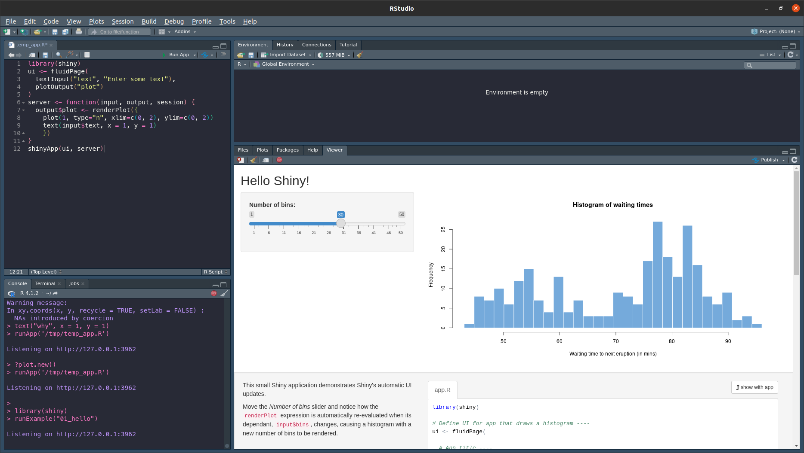

Shiny is much easier to use thanks to its built-in shorthands for common web elements. A paragraph tab, used for normal text, can be types with `p("Text")` instead of HTML's clunkier `<p>Text</p>`. This applies to even more complicated objects like buttons, sliders, and outputting plots and tables.  

This chapter will bring you through the basics of constructing an app, and the nature of reactive programming. It is still R, it will still mostly feel like R, but Shiny is a veneer of utility that turns your average data scientist into a web developer fully equipped to impress any lab peer.

### How does a web page work? 
Before we get into the the nuts and bolts of Shiny's usefulness, we should first outline the need for this library. A typical, static (meaning it is the same every time you visit it) webpage has three components:
1. **HTML** - hypertext markup language, the bones of the web page
2. **CSS** - cascading style sheets, the design and aesthetic portions
3. **JavaScript** - a programming language made for the web, used for making web pages interactive and adaptive.

Normally, these elements are create separately in different files, placed onto a web server, and delivered to the user when they load that web page. You're probably with one or all three of these in one sense or another, and you can see how they work by opening up your browser's console.

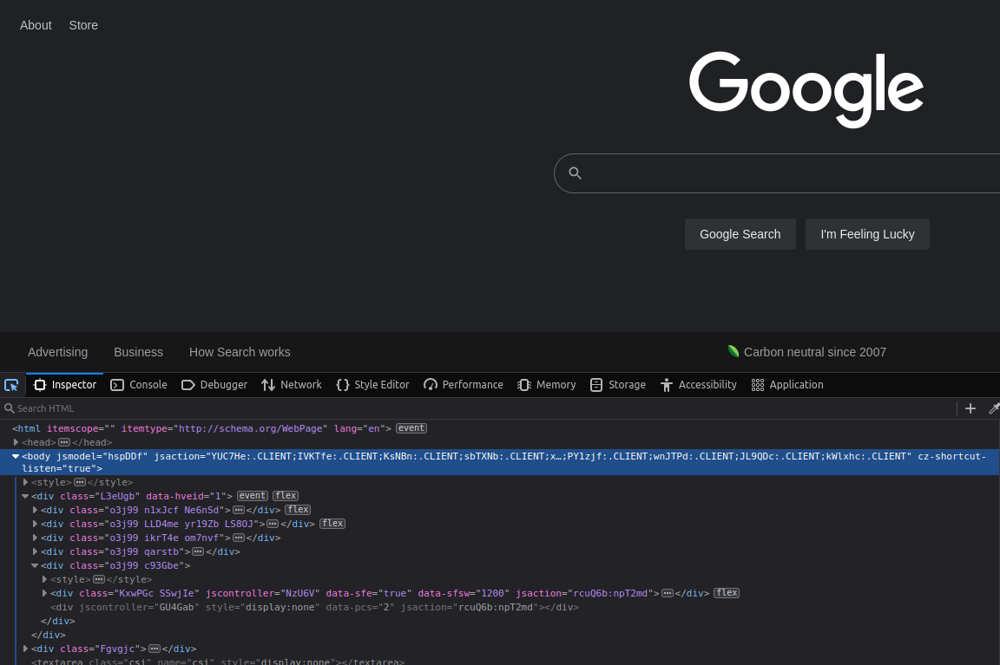

Dealing with all of those HTML tags (things that look like this: `<p>Woa</p>`) is _far_ too much work, so we can use Shiny to not only put together the bones of our website, we can easily customize the CSS and JavaScript elements as well, which will give our applications a fully configurable R-like feel for our users who are hungry for pretty data science and bioinformatics.


#### Getting started and development
Getting start with Shiny is easy whether you're on SCC or your own computer. Simple select a new project, choose new directory, and select the Shiny option as seen below.


::: {.box .important}
###### Exercise 0 - Exercises {-}
This chapter has exercises! Woo! Launch R on your machine or on SCC or on both! Install Shiny using `install.packages("shiny")`, then load with `library(shiny)`. Follow along in these boxes!
:::

::: {.box .tldr}
Further reading:  
- Parts of this chapter are adapted from [Hadley Wickham's Book on Shiny](https://mastering-shiny.org/index.html)  
- The [Official R Shiny Cheat Sheet](https://raw.githubusercontent.com/rstudio/cheatsheets/main/shiny.pdf)  
- Further widgets for unique outputs: [HTML Widgets](http://www.htmlwidgets.org/)
:::

## Application Structure
R Shiny applications are split into two sections: the UI and the server. In web development, these are usually known as the **front end** and the **back end**. The front end is the portion of the application that deal with the users. This is the web page, the design, the login screen, the code that controls what the user can see and do. The back end is everything the user doesn't see, the structure behind the web page that supports functionality: the database, processing data. One Shiny application controls both aspects of this paradigm. The UI creates a simple web page and allows for customizable inputs and control of displays, the server manages those inputs and transforms them into outputs the user can see.  

In many cases the front end runs on the user's machine (web browser) and the back end lives on another computer, usually a server. In development of a Shiny app these will be on the same machine, but if you wish to actually publish your web page for others to use then the application will run on a server and communicate with a user elsewhere.

#### A simple example {-}
```{r, eval=FALSE, attr.source='.numberLines'}
library(shiny)
ui <- fluidPage("Hello, worm!")
server <- function(input, output, session) { }
shinyApp(ui, server)
```
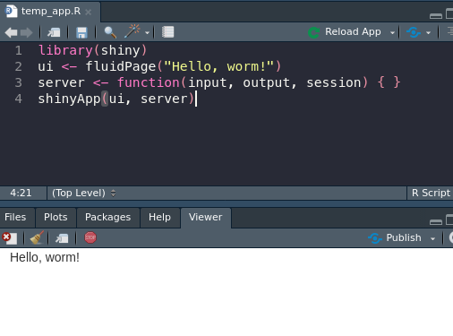

This is the simplest Shiny app structure, which displays the text we pass into UI (the front end) and then doing absolutely nothing else (relatable). The first line loads R Shiny as a package, the second creates our simple user interface and text output, line three controls the back end (which again, does nothing), and the final line launches our app using the objects created in lines two and three.  

In order to build some actual content in our app, we'll first look at the UI, what the user sees.

### UI Design
Much like the rest of the content in this course (and I'm sure you're sick of hearing this), user interfaces and user design could be taught as its own course. There are innumerable ways for people to interact with software, and designing that software to make them the least angry possible is now your focus. 

R Shiny makes designing what a user sees fairly easy for us. Gone are the days of opening up a text editor to tweak HTML tags, we can just use built in functions like `span()` and `div()` to organize our page.

For example, copying our above extra simple app, I could paste in a whole text block to get a new line of text:
```{r}
ui <- fluidPage(
  paste("Nothing beside remains. Round the decay",
  "Of that colossal wreck, boundless and bare",
  "The lone and level sands stretch far away.")
)
```
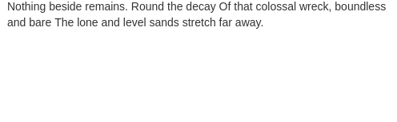

But that's all rather clunky. And what if I want to include some other elements in between? Or an image, a link? We can do better than just a big block of text next to some plots. Instead we can use `p()` tags, short for paragraph, to split things up more reasonably and add more convenient customization:
```{r}
ui <- fluidPage(
  p("Nothing beside remains. Round the decay"),
  p("Of that colossal wreck, boundless and bare"),
  img(src="https://coloringhome.com/coloring/RiA/yEj/RiAyEjzKT.gif", 
      style="width:300px;height:200px;"),
  p("The lone and level sands stretch far away."),
  markdown(">Percy Bysshe Shelley")
)
```
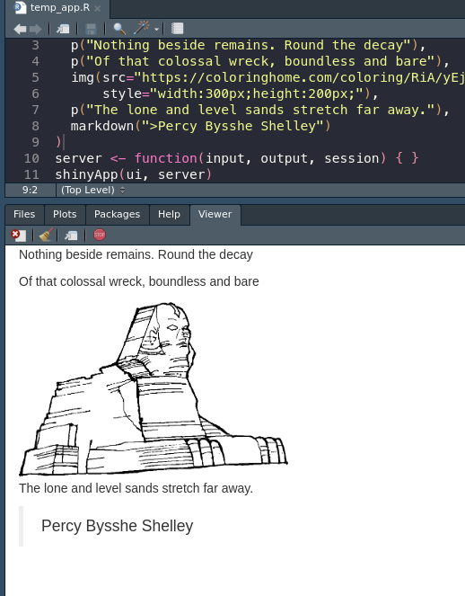

::: {.box .note}
We still need to include commas at the end, since these tags are essentially _arguments_ being passed to the `fluidPage()` function. This is **not** the case for the server side object, which is a normal function and will be split up by line breaks.
:::

Much nicer! This Shelley tribute page is really coming together. Let's talk about some specific interactive elements that we can use to actually work with the user!

::: {.box .important}
###### Exercise 1 - UI Functions {-}
Let's try out some HTML tags. Go to [this link](https://shiny.rstudio.com/reference/shiny/1.6.0/builder.html) to see all of the options! Play around with trying to display some in your app. 
```{r}
library(shiny)
ui <- fluidPage(
  p("This is an easy paragraph"),
  br(), # this is a line break
  h1("A big heading"),
  h6("A small heading")
)
server <- function(input, output, session) { }
shinyApp(ui, server)
```
:::

#### Inputs
Built-in inputs are one of the major draws to Shiny. Instead of dealing with fickle JavaScript and the DOM (a.k.a. we get to skip half of BF768), we get to type one line of R code and it is all taken care of for us! 

```{r}
ui <- fluidPage(
  sliderInput(inputId = "pyramids", min = 0, max = 10, 
              label = "How many pyramids are there?", value = 0, step = 1)
)
```
Let's break down this function very quickly:
1. **inputId = ** - The input ID is the string of text (unique, no numbers or special characters) that we can use inside the server function to identify this input. If I want to know how many pyramids the user selected, then I can call `input$pyramids`. More on this later.
2. **max =, min =** - Controls the upper and lower bounds of the slider.
3. **label = ** - Text to display to the user about the slider.
4. **value = ** - What value should the slider start at?
5. **step = * - The amount the slider can move by. Useful if more (or less) precise input is required.

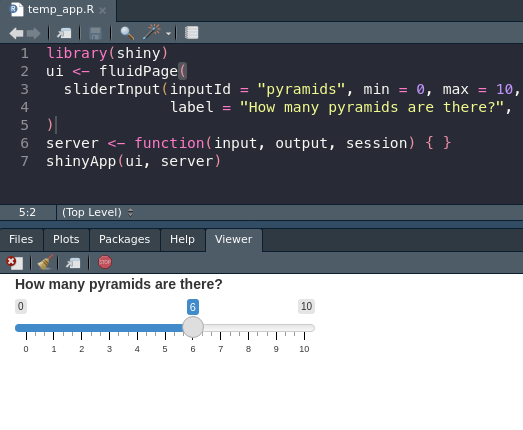

The most vital part, and something that all input functions share, is the inputId. This text is used to manage this bit of input data in the server function, and is there for the connection between what the user does and how our app manages it.

```{r}
ui <- fluidPage(
  dateInput("birthday", "When is your birthday?"),
  fileInput("photo", paste0("Please upload an embarassing photo of you at the ",
                            "Christmas party")),
  radioButtons("button", "Which is your favorite?", 
               choices = c("Fall", "Winter", "Spring", "Pyramids"))
)
```
This generates multiple inputs I can get the results from using `input$birthday`, `input$photo`, and `input$button`. 

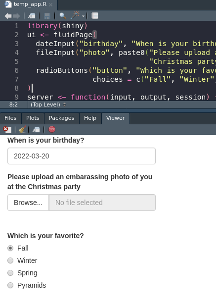

::: {.box .note}
The results of the file upload are nested. If I were to ask for a CSV, and needed to load that with `read.csv()`, I would need to use `input$csv$datapath` to point R at the uploaded object.
:::

For a better idea of the common and useful input options, see the Shiny docs or the cheat sheet. For additional, cooler, fancier input options try `shinyWidgets::shinyWidgetsGallery()`.

#### Outputs
Now that we have a beautiful UI page that takes user input we can figure out _where_ on the page to put it. This part is also relatively easy, every kind of output has a corresponding output function. If I want to insert a base plot or ggplot, I use `plotOutput()`. A table or data frame or tibble would go through `tableOutput()`.  

One advanced option is to use `uiOutput()` to place input options and HTML **back into** the front end. This can be used to create some very nice effects, such as inserting results only when one option is selected or spawning a follow up question to an option. Here's a small example:
```{r}
library(shiny)
ui <- fluidPage(radioButtons("button", "Peanut butter or jelly?", 
                             c("Peanut butter", "Jelly")),
                uiOutput("choice"))
server <- function(input, output, session) {
  output$choice <- renderUI({
    if (input$button == "Peanut butter") {
      radioButtons("pbChoice", "PB is great. Bread or english muffin?",
                   c("Bread", "English Muffin"))
    } else {
      radioButtons("jellychoice", "What kind of jelly?",
        c("Strawberry", "Raspberry", "Toxic sludge"))
    }
  })
}
shinyApp(ui, server)
```
This is our first example of the server function...doing anything...but we're gonna ignore exactly what or why it's doing anything so I can comment on `uiOutput()`. Based on the if-else statement on line 7, our follow up question changes. This can be used to show/hide responses for users. A user hits a check box indicated they're a veteran, you can insert more questions about their veteran status or info.

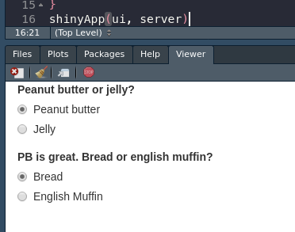

We will figure out this whole server thing in more detail once we have made our page look as pretty as possible.

#### Sidebar-Main
Now that we have all these functions to populate our page with the most inane content possible, we're gonna start running into issues with organization. Even with our mastery of HTML elements, it will prove difficult to fit everything we want into one blank page:
```{r}
ui <- fluidPage(
  HTML(paste(rep("<p>All work and no play makes Jack a dull boy</p>", 1000), 
        collapse = ""))
)
```
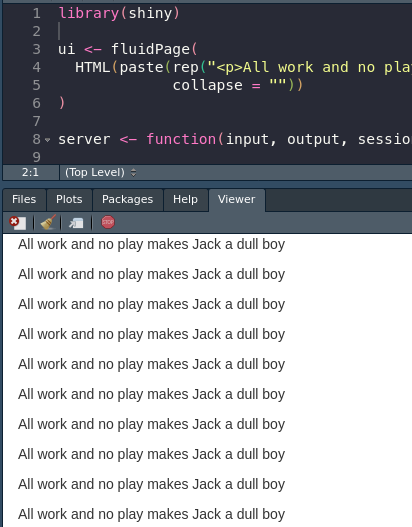
Instead, we can use the popular Sidebar layout to help organize our web page. This works by placing two functions inside the UI argument: `sidebarPanel()` and `mainPanel()`. This offers us nice compartmentalization of design without demanding too many arguments or details from us as we put it together. Very useful for quick apps that you don't need to make look that good. We just need to nest our two panels inside `sidebarLayout()` like so:

```{r}
ui <- fluidPage(
  titlePanel("I never get tired of these inane examples."),
  sidebarLayout(
    sidebarPanel(
      HTML(paste(rep("<p>This is the sidebar</p>", 10), collapse = ""))),
    mainPanel(
      h1("and this is the main panel!"))
    ))
```
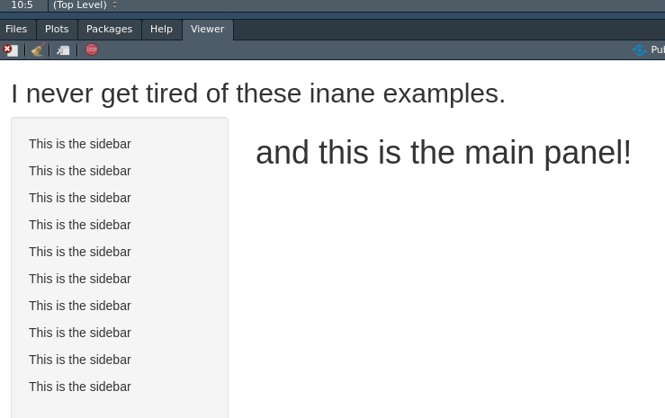

We can add other elements, like `titlePanel()`, to bring the app together. Notice that the title panel is located _outside_ of the `sidebarLayout()` call, since we don't want it inside our sidebar or main panel elements. **Nesting the functions is the same as the nesting of the layout.**

#### FluidPage
There is an alternative to the sidebar-main panel layout, which is a little constricting if you don't want this super big sidebar taking up everything. The FluidPage (which we have been using as our parent function this whole time! Woa!) can allow for a more grid-like customization of the application. 

While there are a lot of ways to control the height and width of your fluid rows, we'll look at a quick example to see a comically bad example of doing so. 

```{r}
ui <- fluidPage(style = 'background-color: #007BA7',
                fluidRow(style = 'background-color: #F3A712',
                         p("I'm in the first row!"), 
                         column(style = 'background-color: #A8C686',
                                width = 4,
                                p("Left columm!")),
                         column(style = 'background-color: #DB162F',
                                width = 8,
                                p("Right column!"))),
                fluidRow(style = 'background-color: #E6BCCD',
                         p("I'm in the second row!"),
                         column(style = 'background-color: #BEE3DB',
                                width=6,
                                p("Left, lower")),
                         column(style = 'background-color: #9D44B5',
                                width=6,
                                p("Right, lower!"))))
```
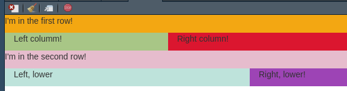

The main gist is that each `fluidRow()` creates a new row inside whatever function it is, and then you can use the `column` function inside each row to further split up the page. Then, you can use the same input and output functions inside each of these, along with whatever normal HTML you wish. The overall, standard width of the page is 12 unnamed shiny units, so keep ensure your widths don't add up to more than 12.


::: {.box .important}
###### Exercise 2 - FluidPage Collage {-}
Try using `fluidPage()`, `fluidRow()`, and `column()` to create a collage of images! You can easily include an image in your Shiny app using `img(src="img.url")`.
```{r}
library(shiny)
ui <- fluidPage(
  fluidRow(
    column(width = 6,
           img(src="https://extension.umn.edu/sites/extension.umn.edu/files/styles/caption_medium/public/big-spittlebug-fig3_0.jpg?itok=dQJIfJw4")),
    column(width = 6,
           img(src="https://www.gardeningknowhow.com/wp-content/uploads/2021/05/rhododendron-leafhopper-400x300.jpg"))
  )
)
server <- function(input, output, session) { }
shinyApp(ui, server)
```
:::

### Server Functionality
Once we have a place in the front end, we can start to manipulate the server side to control and run out application. The interface is nothing without the back end it controls; the back end is where we can start to write our R and manipulate data to inform the user.

The server function has two components we worry about: the `input`, which delivers to us information from the user, and `output`, which we can pass data and objects to be rendered by our webpage.

```{r}
library(shiny)
ui <- fluidPage(
  radioButtons("radio", label = "Number of points", choices = c(10, 20)),
  plotOutput("plot")
)
server <- function(input, output, session) {
  output$plot <- renderPlot({
    plot(rnorm(input$radio), 1:input$radio)
  })
}
shinyApp(ui, server)
```

#### Input
We can pick apart this teeny example application to see how inputs translate to the server function. When we create our radio buttons, we assign the input id "radio". The application is started and the first choice, 10, is selected by default. That value is immediately entered into the `input` variable in the server. When a user selects a different option, the new value is updated inside the `input` variable.

We can reference the `input` variable inside our server to change our plot in this case. If I select the button for 20 instead of 10, the random number of points put into `plot()` changes from 10 to 20. The variable is static, so I can use it multiple times in my server function.

#### Output
Finally, the server function delivers this output _back_ to the web interface. In this example, we created a `plotOutput()` below the radio buttons to display our plot. Inside the server function, we use `output$plot` to match the output ID we created in `plotOutput()`. The rendered plot is then inserted into that part of the document. This process of matching IDs mirrors the input process.

::: {.box .important}
###### Exercise 3 - Inputs and Outputs {-}
Now that you can connect inputs and outputs try to combine a couple! Here is a short list of inputs:
- `dateInput()`
- `radioButtons()`
- `textInput()`
And outputs:
- `imageOutput()`
- `plotOutput()`
- `textOutput()`
See the cheat sheet and docs for more! Here is a little example, try something else:
```{r}
library(shiny)
ui <- fluidPage(
  textInput("text", "Enter some text"),
  plotOutput("plot")
)
server <- function(input, output, session) {
  output$plot <- renderPlot({
    plot(1, type="n", xlim=c(0, 2), ylim=c(0, 2))
    text(input$text, x = 1, y = 1)
    })
}
shinyApp(ui, server)
```
:::

There are a number of base outputs types: tables, plots, UI (for additional elements), and so on. There are also additional libraries for elements like maps, networks, and even 3D objects. DataTables are especially useful for sharing data with users.
```{r}
library(shiny)
library(DT)
ui <- fluidPage(dataTableOutput("dt"))
server <- function(input, output, session) {
  output$dt <- DT::renderDataTable(
    DT::datatable(iris, extensions = 'Buttons', class = "display",
                  options = list(paging = TRUE, searching = TRUE, 
                                 fixedColumns = TRUE, autoWidth = TRUE,
                                 ordering = TRUE, dom = 'Bfrtip',
                                 buttons = c('copy', 'csv'))))
  }
shinyApp(ui, server)
```
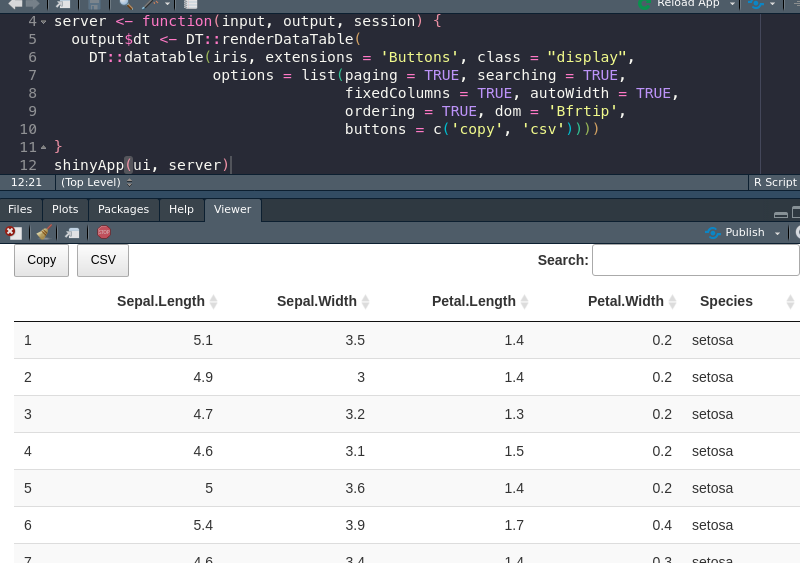

And here is a cool example using a package I've never tried before.
```{r}
library(shiny)
library(threejs)
ui <- fluidPage(
  sliderInput("maxz", "Height of graph", 5, 25, 10),
  scatterplotThreeOutput("scatterplot")
)
server <- function(input, output, session) {
  output$scatterplot <- renderScatterplotThree({
    z <- seq(-10, input$maxz, 0.01)
    x <- cos(z)
    y <- sin(z)
    scatterplot3js(x,y,z, color=rainbow(length(z)))
  })
}
shinyApp(ui, server)
```
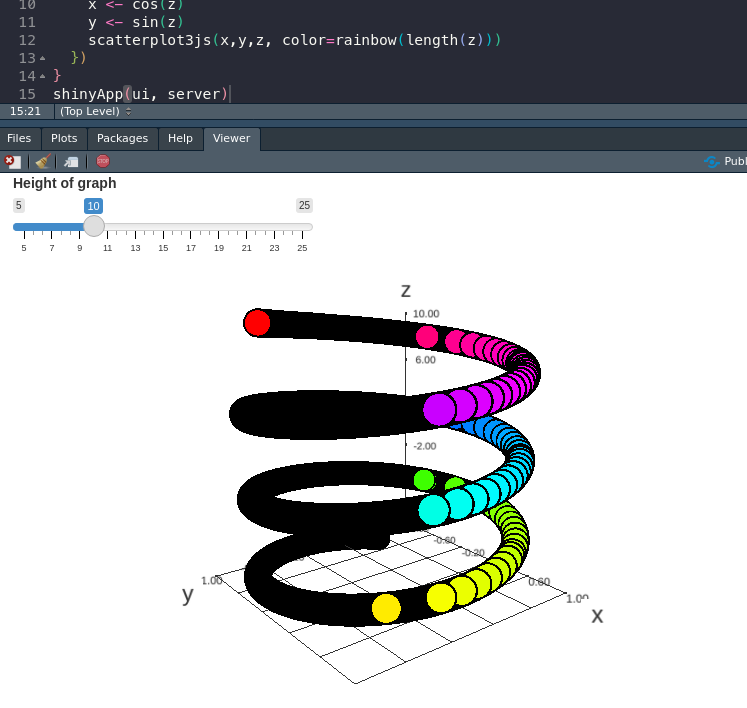
##### Traceback
One essential feature for Shiny is determining why errors crop up. You may have some familiarity with this kind of troubleshooting in base R, but because Shiny is abstracting our R into an entire application, the errors can turn into edlritch horrors without compare.  

One main tool is automatic, and that is the traceback. When a shiny app fails in a specific way, the error printed lists how the application arrived at that issue. Each function used is listed, in reverse order, from when it was called. In this way, we can track down exactly where our problem lies.
```{r}
library(shiny)

f <- function(x) g(x)
g <- function(x) h(x)
h <- function(x) x * 2

ui <- fluidPage(
  selectInput("n", "N", 1:10),
  plotOutput("plot")
)
server <- function(input, output, session) {
  output$plot <- renderPlot({
    n <- f(input$n)
    plot(head(cars, n))
  }, res = 96)
}
shinyApp(ui, server)
```
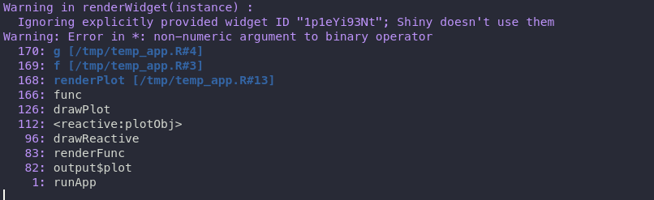

The above application fails because of the three functions at the beginning.

Now that I know the error is limited to my `f()` function on line 13, I can do one of two things:
1. I can use a `print()` statement to try and deduce why this is failing.
2. I can enable the debugger to take a step by step approach to how my code is running.

Debugging...well...you could write a course based on it. However, printing is often a useful quick and dirty technique for parsing your code troubles quickly. Because it sounds like my argument is a problem, and my only input right now is `input$n`, let me see what that looks like with `print(input$n)` and `print(typeof(input$n))`.

A quick `as.numeric()` will fix my app right up and allow me to plot car data? 🚗 🏎️

::: {.box .important}
###### Exercise 4 - Print Output {-}
While not the most nuanced debugging strategy, sliding a `print()` statement into your code is a tried and true method of figuring out what your code is doing. Can you figure out where we can put a `print()` statement here to see what our input is doing when a button is changed?
```{r}
library(shiny)
ui <- fluidPage(radioButtons("hey",
                             "woa cool bugs",
                             c("One", "Two")),
                textOutput("out"))
server <- function(input, output, session) {
  output$out <- renderText({
    # ?
  })
}
shinyApp(ui, server)
```
:::


## Reactivity
There is one final hurdle to understanding Shiny at an intermediate level. For the entirety of this course, and probably of your programming career the code you have written has been run sequentially. You start a script, load the library, load the data, execute the functions, and return the result. There's never any chance for code to be run out of order because it is only designed to go in one direction. The style of programming we are used to is called **imperative programming**.

Unfortunately, Shiny not only runs out of order, but can be run multiple times. A user can start the app, trigger one function to run, and then click a button and change the data entirely. Our applications need to be flexible enough to handle this situation, but if we were to write it in the way we were used to then a user would be left looking out outdated results.

Enter **declarative programming**, or **reactivity**.  

Reactivity is the idea that our code can react when changes are made to its inputs. This is perfect for R Shiny since our users are constantly getting in our way and changing inputs left and right (it's okay we want them to do this). Imperative programming is telling your software to go and make you a sandwich. It will follow the prescribed instructions and make the same sandwich every time. We ask our reactive program, Shiny, to make sure there is a sandwich whenever we open the fridge, and maybe change the sandwich whenever we move our sandwich slider.

R Shiny has a lot of different levels of reactivity, but we'll be using one cool idea which is the reactive expression.  

Say I have an application that reads in a CSV of rainfall data and spits our a graph along with some statistics. I load my data and calculate the mean raininess over the last week or what have you. Next, I load in my data _again_ and I run ggplot to plot a histogram of number of toads rained in a certain zip code.  

With what we have learned in Shiny so far, I can only do these processes separately, once in each `output$x <-` section. Not only does this mean I need to write my uploading multiple times, I _also_ need to parse the data more than once. It may be trivial for my rainfall data that spans two rows, but if your application needs to parse a lot of data then all of sudden your user is stuck looking at blank results and the angry emails will just pour into your inbox (with or without toads).

To solve this, in a Shiny way, we use a _reactive expression_. This is somewhat like a function that runs every time an input changes. The best part is that the results are _cached_, meaning they aren't re-run unless they absolutely must be. This means I can load the data once and plot and process it without loading anything again.

```{r}
server <- function(input, output, session) {
  dataset <- reactive({
    read.csv(input$data$datapath, header = TRUE)
  })

  output$plot <- renderPlot({
    ggplot(dataset(), aes(x = Toads, y = cm_rain_week))
  })
  
  output$stats <- renderTable({
    csv <- dataset()
    data.frame(mean = mean(csv$Toads))
  })
}
```

Reactivity can be used to control the flow of data and actions through your application. You can stop a plot from updating until a button is pressed, or ensure your user doesn't see errors by waiting until every input is selected until progressing.

I don't think you could teach a _whole_ class on reactivity in Shiny but maybe a little more than one or two lectures.


## Publishing
Finally, we have our app ready, and we need to put it somewhere. We could host it ourselves, that's not too hard, but what if we want to share on the World Wide Web (www for short)? 

One option is using [shinyapps.io](https://www.shinyapps.io/) to host our completed app on the cloud. We get like a few hours a month free for hosting, and there's a fun little button in RStudio that let's us do it automatically.

Follow the sign up steps to log into shinyapps.io and then us rsconnect to setup the connection to your app.

::: {.box .important}
###### Exercise 5 - Art {-}
If you thought this Shiny stuff was stuffy and boring, you might be right! But it can also make art, really easily!

Try to get the following code working, and then visit [here](https://github.com/taytayp/aRt) to see what other functions are available and try to do your own! Uncomment line 1 to install the package, you may need to run `install.packages("devtools")` first.
```{r}
# devtools::install_github("taytayp/aRt")
library(aRt)
library(shiny)

ui <- fluidPage(
  column(width=6,
  sliderInput("slide", "How many hills?", 2, 20, 2),
  radioButtons("pal", "What color?", 
               c("ag_Sunset", "Earth", "Tropic", "Sunset", "SunsetDark"))),
  column(width=6, plotOutput("plot", width = "400px", height = "400px"))
)
server <- function(input, output, session) {
  output$plot <- renderPlot(
    fading(n_layers=input$slide, n_points=1, col_palette=input$pal)
  )
}
shinyApp(ui, server)
```
:::
