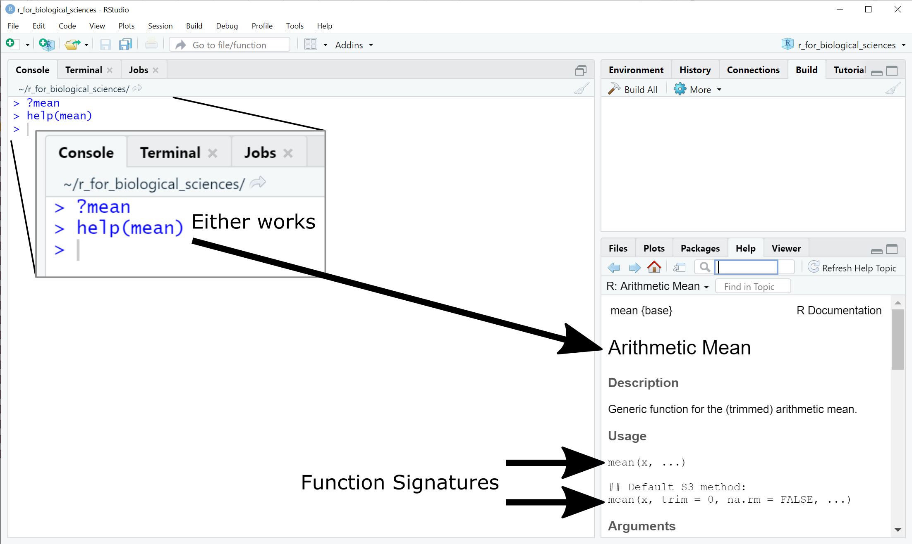
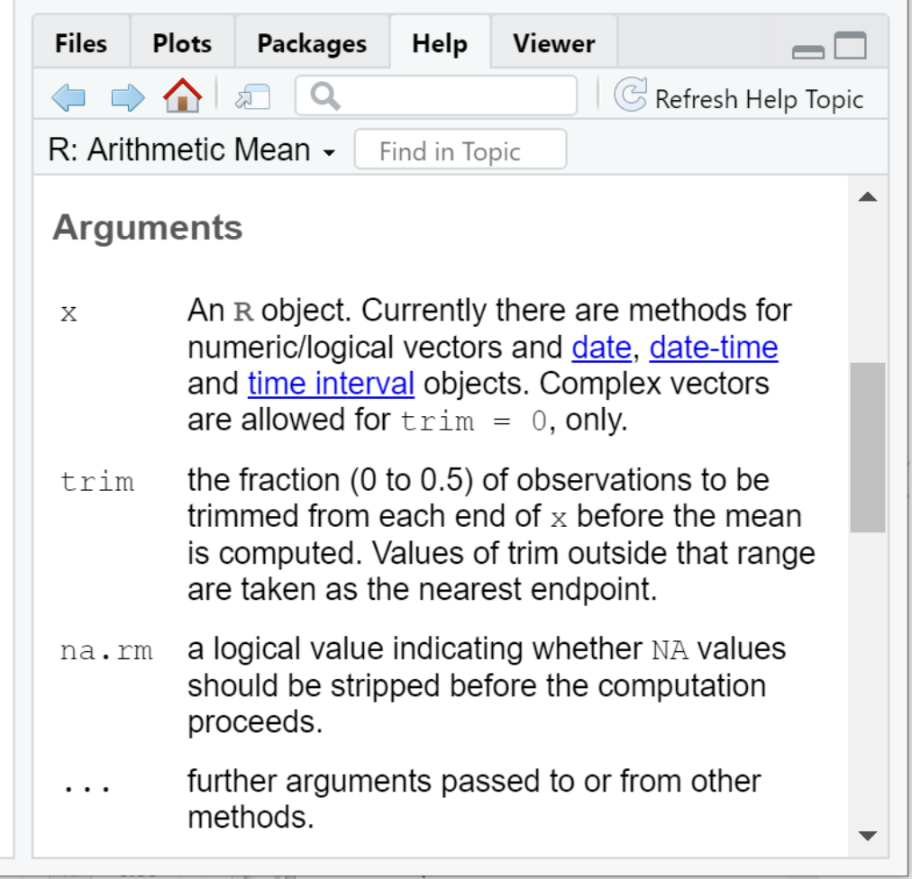

# R Programming {#prog-basics}

## Before you begin

If you have not done so already, be sure to follow the [R Language](#prelim-r),
[RStudio](#prelim-rstudio), and [The R Script](#prog-the-r-script), and [The
Scripting Workflow](#prog-workflow) sections before working through this
chapter. The guidance in these sections will set you up for success!

## Introduction

As with other subjects covered so far, the basic syntax of R is covered very
well in other free online materials. Some of those excellent resources are
linked at the end of this section, but a brief overview of the concepts and
syntax are covered here. The code examples below can be written into a script
and evaluated as described above or entered on the R Console directly and run by
pressing `Enter`.

## R Syntax Basics {#prog-r-syntax}

At its core, R (like all programming languages) is basically a fancy calculator.
The syntax of most basic arithmetic operations in R should be familiar to you:

```
1 + 2 # addition
[1] 3
3 - 2 # subtraction
[1] 1
4 * 2 # multiplication
[1] 8
4 / 2 # division
[1] 2
1.234 + 2.345 - 3.5*4.9 # numbers can have decimals
[1] -13.571
1.234 + (2.345 - 3.5)*4.9 # expressions can contain parentheses
[1] -4.4255
2**2 # exponentiation
[1] 4
4**(1/2) # square root
[1] 2
9**(1/3) # cube root
[1] 3
```
The `[1]` lines above are the output given by R when the preceding expression
is executed. Any portion of a line starting with a `#` is a comment and ignored
by R.

R also supports storing values into symbolic placeholders called *variables*, or
*objects*. An expression like those above can be assigned into a variable with a
name using the `<-` operator:

```{r, results='hide'}
new_var <- 1 + 2
```

Variables that have been assigned a value can be placed in subsequent
expressions anywhere where their value is evaluated:

```
new_var - 2
[1] 1
another_var <- new_var * 4
```

::: {.box .note}
The correct way to assign a value to a variable in R is with the `<-` syntax,
unlike many other programming languages which use `=`. However, although the `=`
assignment syntax does work in R:

```{r}
new_var = 2 # works, but is not common convention!
```
this is considered bad practice and may cause confusion later. You should always
use the `<-` syntax when assigning values to variables!
:::

::: {.box .note}
In R, the period `.` does not have a special meaning like it does in many other
languages like python, C, javascript, etc. Therefore, `new.var` is a valid
variable name just like `new_var`, even though it may look strange to those
familiar with these other languages. While including `.` in your R variable
names is valid, the results that you will use in programs written in other
languages that do have a meaning for this character. Therefore, it is good
practice to avoid using `.` characters in your variable names to reduce the
chances of conflicts later.
:::

::: {.box .readmore}
* [Hands-On Programming with R](https://rstudio-education.github.io/hopr/basics.html)
* [R for Data Science - Workflow basics](https://r4ds.had.co.nz/workflow-basics.html)
:::

## Basic Types of Values {#prog-types}

The most common type of value in R is the number, e.g. `1.0` or `1e-5` for
$10^{-5}$. For most practical purposes, R does not distinguish between numbers
with fractional parts (e.g. `1.123`) and integers (e.g. `1`); a number is a
number. In addition to numbers, there are some other types of values that are
special in R:

* **logical or boolean values** - `TRUE` or `FALSE`. Internally, R stores `TRUE`
as the number `1` and `FALSE` as the number `0`. Generally, R interprets
non-zero numbers as `TRUE` and `0` as `FALSE`, but it is good practice to supply
the tokens `TRUE` or `FALSE` when an argument expects a logical value.
* **missing values** - `NA`. `NA` is a special value that indicates a value is
missing.
* **missing vectors** - `NULL`. Similar to `NA`, `NULL` indicates that a vector,
rather than a value, is missing. Vectors will be described in the [next section
on data strutures](prog-struct).
* **factors** - Factors are a complex type used in statistical models and are
covered in [greater detail later](ds-model)
* **infinity** - `Inf` and `-Inf`. These values encode what R understands to be
positive or negative infinity, or any number divided by `0`.
* **impossible values** - `NaN`. This value corresponds to the mathematically
'impossible' or undefined value of `0/0`.
* **character data** - `"value"`. R can store character data in the form of
strings. Note R does not interpret string values by default, so `"1"` and `1`
are distinct.
* **dates and times** - R has a basic type to store dates and times (together
termed a *datetime*, which includes both components). Internally, R stores
datetimes as the fractional number of days since January 1, 1970, using negative
numbers for earlier dates.
* **complex numbers** - R can store complex numbers using the `complex`
function.

::: {.box .warning}
Unsurprisingly, R cannot perform computations on `NA`, `NaN`, or `Inf` values.
Each of these values have an 'infectious' quality to them, where if they are
mixed in with other values, the result of the computation reverts to the first
of these values encountered:

```
# this how to create a vector of 4 values in R
x <- c(1,2,3,NA)
mean(x) # compute the mean of values that includes NA
[1] NA
mean(x,na.rm=TRUE) # remove NA values prior to computing mean
[1] 2
mean(c(1,2,3,NaN))
[1] NaN
mean(c(NA,NaN,1))
[1] NA
```

If your code produces values that are not numbers as you expect, this suggests
there are one of these values in your input, and need to be handled explicitly.
:::

::: {.box .readmore}
* [The difference between NA and NaN in R](https://www.r-bloggers.com/2012/08/difference-between-na-and-nan-in-r/)
* [R for Data Science - Dates and date-times](https://r4ds.had.co.nz/vectors.html#dates-and-date-times)
* [Dates and times in R](https://www.stat.berkeley.edu/~s133/dates.html)
* [Complex numbers in R](https://stat.ethz.ch/R-manual/R-devel/library/base/html/complex.html)
:::

## Data Structures {#prog-struct}

### Vectors

Data structures in R (and other languages) are ways of storing and organizing
more than one value together. The most basic data structure in R is a one
dimensional sequence of values called a
[vector](https://www.rdocumentation.org/packages/base/versions/3.6.2/topics/vector):

```
# the c() function creates a vector
x <- c(1,2,3)
[1] 1 2 3
```
The vector in R has a special property that all values contained in the vector
must have the same type, from the list [described above](#prog-types). When
constructing a vector, R will [coerce
values](https://rstudio-education.github.io/hopr/r-objects.html#coercion) to the
most general type if it encounters values of different types:

```
c(1,2,"3")
[1] "1" "2" "3"
c(1,2,TRUE,FALSE)
[1] 1 2 1 0
c(1,2,NA) # note missing values stay missing
[1] 1 2 NA
c("1",2,NA,NaN) # NA stays, NaN is cast to a character type
[1] "1" "2" NA "NaN"
```

In addition to having a single type, vectors also have a length, which is
defined as the number of elements in the vector:

```
x <- c(1,2,3)
length(x)
[1] 3
```

Internally, R is much more efficient at operating on vectors than individual
elements separately. With numeric vectors, you can perform arithmetic operations
on vectors of compatible size just as easily as individual values:

```
c(1,2) + c(3,4)
[1] 4 6
c(1,2) * c(3,4)
[1] 3 8
c(1,2) * c(3,4,5) # operating on vectors of different lengths raises warning, but still works
[1] 3 8 5
Warning message:
In c(1, 2) * c(3, 4, 5) :
  longer object length is not a multiple of shorter object length
```

::: {.box .warning}
In the example above, we multiplied a vector of length 2 with a vector of length
3:

```
c(1,2) * c(3,4,5) # operating on vectors of different lengths raises warning, but still works
[1] 3 8 5
Warning message:
In c(1, 2) * c(3, 4, 5) :
  longer object length is not a multiple of shorter object length
```

Rather than raise an error and aborting, R merely emits a warning message about
the vectors not having divisible lengths. So how did R decide the third value
should be 5? Because R cycles through each vector and multiplies the values
element-wise until the longest vector has had an operation performed on all its
values:

```
c(1,2) * c(3,4,5) # yields: 1*3 2*4 1*5
[1] 3 8 5
Warning message:
In c(1, 2) * c(3, 4, 5) :
  longer object length is not a multiple of shorter object length
c(1,2) * c(3,4,5,6) # yields: 1*3 2*4 1*5 2*6
[1] 3 8 5 12
```

R will sometimes work in ways you don't expect. Be careful to read warnings and
check that your code does what you expect!
:::

### Matrices

A matrix in R is simply the 2 dimensional version of a vector. That is, it is
a rectangle of values that all have the same type, e.g. number, character,
logical, etc. A matrix may be constructed using the vector notation described
above and specifying the number of rows and columns the matrix should have, and
Instead of having a length like a vector, it has $m \times n$ dimensions:

```
# create a matrix with two rows and three columns containing integers
A <- matrix(c(1,2,3,4,5,6)
       nrow = 2, ncol = 3, byrow=1
      )
A
[,1] [,2] [,3]
[1,]    1    2    3
[2,]    4    5    6
dim(A) # the dim function prints out the dimensions of the matrix, rows first
[1] 2 3
```

Because a matrix is 2 dimensional, it can be transposed from $m \times n$ to be
$n \times m$ using the `t()` function:

```
# A defined above as a 2 x 3 matrix
t(A)
[,1] [,2]
[1,]    1    4
[2,]    2    5
[3,]    3    6
dim(t(A))
[1] 3 2
```

::: {.box .readmore}
[Hands-On Programming with R - Atomic Vectors](https://rstudio-education.github.io/hopr/r-objects.html#atomic-vectors)
[R for Data Science - Vectors](https://r4ds.had.co.nz/vectors.html)
[Advanced R - Vectors](https://adv-r.hadley.nz/vectors-chap.html)
:::

### Lists and data frames

Vectors and matrices have the special property that all items must be of the
same type, e.g. numbers. Lists and data frames are data structures that do not
have this requirement. Similar to vectors, lists and data frames are both one
dimensional sequences of values, but the values can be of mixed types. For
instance, the first item of a list may be a vector of numbers, while the second
is a vector of character strings. These are the most flexible data structures in
R, and are among the most commonly used.

Lists can be created using the `list()` function:

```
my_list <- list(
  c(1,2,3),
  c("A","B","C","D")
)
my_list
[[1]]
[1] 1 2 3

[[2]]
[1] "A" "B" "C" "D"
my_list[[1]] # access the first item of the list
[1] 1 2 3
my_list[[2]] # access the second item of the list
[1] "A" "B" "C" "D"
```

The arguments passed to `list()` define the values and their order of the list.
In the above example, the list has two elements: one vector of 3 numbers and one
vector of 4 character strings. Note you can access individual items of the list
using the `[[N]]` syntax, where `N` is the 1-based index of the element.

Lists can also be defined and indexed by name:

```
my_list <- list(
  numbers=c(1,2,3),
  categories=c("A","B","C","D")
)
my_list
$numbers
[1] 1 2 3

$categories
[1] "A" "B" "C" "D"
my_list$numbers # access the first item of the list
[1] 1 2 3
my_list$categories # access the second item of the list
[1] "A" "B" "C" "D"
```

The elements of the list have been assigned the names `numbers` and `categories`
when creating the list, though any valid R identifier names can be used. When
elements are associated with names they can be accessed using the `list$name`
syntax.

Lists and data frames are the same underlying data structure, however differ in
one important respect: *the elements of a data frame must all have the same
length, while the elements of a list do not.* You may create a data frame with
the `data.frame()` function:

```
my_df <- data.frame( # recall '.' has no special meaning in R
  numbers=c(1,2,3),
  categories=c("A","B","C","D")
)
Error in data.frame(c(1, 2, 3), c("A", "B", "C", "D")) :
  arguments imply differing number of rows: 3, 4
my_df <- data.frame(
  numbers=c(1,2,3),
  categories=c("A","B","C")
)
my_df
  numbers categories
1       1          A
2       2          B
3       3          C
my_df$numbers
[1] 1 2 3
my_df[1] # numeric indexing also works, and returns a subset data frame
  numbers
1       1
2       2
3       3
my_df[1]$numbers
[1] 1 2 3
# this syntax is [<row>,<column>], and if either is omitted return all
my_df[,1] # return all rows of the first column as a vector
[1] 1 2 3
my_df$categories
[1] "A" "B" "C"
```

Note the data frame is printed as a matrix with element names as columns and
automatically numbered rows. You may access specific elements of a data frame in
a number of ways:

```
my_df$numbers[1] # extract the first value of the numbers column
[1] 1
my_df[1,1] # same as above, recall the [<row>,<column>] syntax
[1] 1
my_df$categories[3] # extract the third value of the categories column
[1] "C"
```


::: {.box .note}
In the examples above, the operation of extracting out different parts of a
vector, matrix, list, or data frame is called *subsetting.* R provides many
different ways to subset a data structure and discussing all of them is beyond
the scope of this book. However, mastering subsetting will help your code be
more concise and correct. See the Read More link on Subsetting below:

[Advanced R - Subsetting](https://adv-r.hadley.nz/subsetting.html)
:::

::: {.box .readmore}
[Advanced R - Data Structures](http://adv-r.had.co.nz/Data-structures.html)
[Advanced R - Subsetting](https://adv-r.hadley.nz/subsetting.html)
:::

## Logical Tests and Comparators

As mentioned above, R recognizes logical values as a distinct type. R provides
all the conventional infix logical operators:

```
1 == 1 # equality
[1] TRUE
1 != 1 # inequality
[1] FALSE
1 < 2 # less than
[1] TRUE
1 > 2 # greater than
[1] FALSE
1 <= 2 # less than or equal to
[1] TRUE
1 >= 2 # greater than or equal to
```

These operators also work on vectors, albeit with the same caveats about vector
length as noted earlier:

```
x <- c(1,2,3)
x == 2
[1] FALSE TRUE FALSE
x < 1
[1] FALSE FALSE FALSE
x < 3
[1] TRUE TRUE FALSE
c(1,2) == c(1,3)
[1] TRUE FALSE
c(1,2) != c(1,3)
[1] FALSE TRUE
c(1,2) == c(1,2,3)
[1] TRUE TRUE FALSE
Warning message:
In c(1, 2, 3) == c(1, 2) :
  longer object length is not a multiple of shorter object length
```

R also provides many functions of the form `is.X` where `X` is some type or
condition (recall that `.` is not a special character in R):

```
is.numeric(1) # is the argument numeric?
[1] TRUE
is.character(1) # is the argument a string?
[1] FALSE
is.character("ABC")
[1] TRUE
is.numeric(c(1,2,3)) # recall a vector has exactly one type
[1] TRUE
is.numeric(c(1,2,"3"))
[1] FALSE
is.na(c(1,2,NA))
[1] FALSE FALSE TRUE
```

::: {.box .readmore}
[Quick-R - Operators](https://www.statmethods.net/management/operators.html)
:::

## Functions

Just as a variable is a symbolic representation of a value, a function is a
symbolic representation of code. In other words, a function allows you to
substitute a short name, e.g. `mean`, for a set of operations on a given input,
e.g. the sum of a set of numbers divided by the number of numbers. R provides a
[very large number of functions](https://rdrr.io/r/) for common operations in
its default environment, and more functions are provided by packages you can
install separately.

Encapsulating many lines of code into a function is useful for (at least) five
distinct reasons:

1. Make your code more concise and readable
2. Allow you to avoid writing the same code over and over (i.e. reuse it)
3. Allow you to systematically test pieces of your code to make sure they do
   what you intend
4. Allow you to share your code easily with others
5. Program using a functional programming style (see note box below)

::: {.box .note}
At its core, R is a *functional programming language.* The details of what this
means are outside the scope of this book, but as the name implies this refers to
the language being structured around the use of functions. While this property
has technical implications on the structure of the language, a more important
consequence is the style of programming it entails. The functional programming
style (or *paradigm*) has many advantages, including generally producing
programs that are more concise, predictable, provably correct, and performant.
provides a good starting point for learning about functional programming.
:::

In order to do anything useful, a function must generally be able to accept
and execute on different inputs; e.g. the `mean` function wouldn't be very
useful if it didn't accept a value! The terminology used in R and many other
programming languages for this is the function must *accept* or allow you to
*pass it arguments.* In R, functions accept arguments using the following
*pattern:

```
# a basic function signature
function_name(arg1, arg2) # function accepts exactly 2 arguments
```

Here, `arg1` and `arg2` are *formal arguments* or *named arguments*, indicating
this function accepts two arguments. The name of the function (i.e.
`function_name`) and the pattern of arguments it accepts is called the
function's *signature.* Every function has at least one signature, and it is
critical to understand it in order to use the function properly.

In the above example, `arg1` and `arg2` are *required* arguments. This means
that the function will not execute without exactly two arguments provided and
will raise an error if you try otherwise:

```
mean() # compute the arithmetic mean, but of what?
Error in mean.default() : argument "x" is missing, with no default
```

How do you know what arguments a function requires? All functions provided by
base R and many other packages include detailed documentation that can be
accessed directly through RStudio using either the `?` or `help()`:



The second signature of the `mean` function introduces two new types of syntax:

**Default argument values** - e.g. `trim = 0`. These are formal arguments that
have a default value if not provided explicitly.

**Variable arguments** - `...`. This means the `mean` function can accept
arguments that are not explicitly listed in the signature.

With these definitions, we can now understand the Arguments section of the help
documentation:



In other words:

* `x` is the vector of values (more on this in the [next section on data
structures](prog-struct)) we wish to compute the arithmetic mean for
* `trim` is a fraction (i.e. a number between 0 and 0.5) that instructs R to
remove a portion of the largest and smallest values from `x` prior to computing
the mean.
* `na.rm` is a logical value (i.e. either `TRUE` or `FALSE`) that instructs R to
remove `NA` values from `x` before computing the mean.

::: {.box .note}
All function arguments can be specified by name, regardless of whether there is
a default value or not. For instance, the following two `mean` calls are
equivalent:

```
# this generates 100 normally distributed samples with mean 0 and standard deviation 1
my_vals <- rnorm(100,mean=0,sd=1)
mean(my_vals)
[1] -0.05826857
mean(x=my_vals)
[1] -0.05826857
```

To borrow from [the Zen of
Python](https://www.python.org/dev/peps/pep-0020/#id2), "Explicit is better than
implicit." Being explicit about which variables are being passed as which
arguments will almost always make your code easier to read and more likely to do
what you intend.
:::

::: {.box .warning}
**The `...` argument catchall can be very dangerous.** It allows you to provide
arguments to a function that have no meaning, and R will not raise an error.
Consider the following call to `mean`:

```
# this generates 100 normally distributed samples with mean 0 and standard deviation 1
my_vals <- rnorm(100,mean=0,sd=1)
mean(x=my_vals,tirm=0.1)
[1] -0.05826857
```

Did you spot the mistake? The `trim` argument name has been misspelled as
`tirm`, but R did not report an error. Compare the value of mean without the
typo:

```
mean(x=my_vals,trim=0.1)
[1]-0.02139839
```

The value we get is different, because R recognizes `trim` but not `tirm` and
changes its behavior accordingly. Not all functions have the `...` catchall in
their signatures, but many do and so you must be diligent when supplying
arguments to function calls!
:::

::: {.box .readmore}
* [R for Data Science - Functions](https://r4ds.had.co.nz/functions.html)
* [rdrr.io - Base R Function Reference](https://rdrr.io/r/)
* [This tutorial](https://www.tutorialspoint.com/functional_programming/index.htm)
* [Advanced R - Functional Programming](https://adv-r.hadley.nz/fp.html)
:::

### DRY: Don't Repeat Yourself {#prog-dry}

Sometimes you will find yourself writing the same code more than once to perform
the same operation on different data. For example, one common data
transformation is *standardization* or *normalization* which entails taking a
series of numbers, subtracting the mean of all the numbers from them, and
dividing each by the standard deviation of the numbers:

```
# 100 normally distributed samples with mean 20 and standard deviation 10
my_vals <- rnorm(100,mean=20,sd=10)
my_vals_norm <- (my_vals - mean(my_vals))/sd(my_vals)
mean(my_vals_norm)
[1] 0
sd(my_vals_norm)
[1] 1
```

Later in your code, you may need to standardize a different set of values, so
you decide to copy and paste your code from above and replace the variable name
to reflect the new data:

```
# new samples with mean 40 and standard deviation 5
my_other_vals <- rnorm(100,mean=40,sd=5)
my_other_vals_norm <- (my_other_vals - mean(my_other_vals))/sd(my_vals)
mean(my_other_vals_norm)
[1] 0
sd(my_other_vals_norm) # this should be 1!
[1] 0.52351
```

Notice the mistake? We forgot to change the variable name `my_vals` to
`my_other_vals` in our pasted code, which produced an incorrect result. Good
thing we checked!

In general, if you are copying and pasting code from one part of your script to
another, you are repeating yourself and have to do a lot of work to be sure you
have modified your copy correctly. Copying and pasting code is tempting from an
efficiency standpoint, but introduces may opportunities for (often undetected!)
errors.

[Don't Repeat Yourself](https://en.wikipedia.org/wiki/Don%27t_repeat_yourself)
(DRY) is a principle of software development that emphasizes recognizing and
avoiding writing the same code over and over by encapsulating code. In R, this
is most easily done with functions. If you notice yourself copying and pasting
code, or writing the same pattern of code more than once, this is an excellent
opportunity to write your own function and avoid repeating yourself!

### Writing your own functions

R allows you to define your own function using the following syntax:

``` {r}
function_name <- function(arg1, arg2, ...) {
  # code that does something with arg1, arg2, etc
  return(some_result)
}
```

You define the name of your function, the number of arguments it accepts and
their names, and the code within the function, which is also called the function
*body*. Taking the example above, I would define a function named `standardize`
*that accepts a vector of numbers, subtracts the mean from all the values, and
*divides them by the standard deviation:

```
standardize <- function(x) {
  res <- (x - mean(x))/sd(x)
  return(res)
}

my_vals <- rnorm(100,mean=20,sd=10)
my_vals_std <- standardize(my_vals)
mean(my_vals_std)
[1] 0
sd(my_vals_std)
[1] 1

my_other_vals <- rnorm(100,mean=40,sd=5)
my_other_vals_std <- standardize(my_other_vals)
mean(my_other_vals_std)
[1] 0
sd(my_other_vals_std)
[1] 1
```

Notice above we are assigning the value of the `standardize` function to new
variables. In R and other languages, the result of a function is *returned* when
the function is called; the value returned is called the *return value*. The
`return()` function makes it clear what the function is returning.

::: {.box .note}
The `return()` function is not strictly necessary in R; the result of the last
line of code in the body of a function is returned by default. However, to again
to borrow from [the Zen of
Python](https://www.python.org/dev/peps/pep-0020/#id2), "Explicit is better than
implicit." Being explicit about what a function returns by using the `return()`
function will make your code less error prone and easier to understand.
:::

### Scope

In programming, there is a critically important concept called *scope*. Every
variable and function you define when you program has a scope, which defines
where in the rest of your code the variable can be accessed. In R, variables
defined outside of a function have *universal* or *top level scope*, i.e. they
can be accessed from anywhere in your script. However, variables defined
*inside* functions can only be accessed from within that function. For example:

```
x <- 3
multiply_x_by_two <- function() {
  y <- x*2 # x is not defined as a parameter to the function, but is defined outside the function
  return(y)
}
x
[1] 3
multiply_x_by_two()
[1] 6
y
Error: object 'y' not found
```

Notice that the variable `x` is accessible within the function
`multiply_x_by_two`, but the variable `y` is *not* accessible outside that
function. The reason that `x` is accessible within the function is that
`multiply_x_by_two` *inherits the scope where it is defined*, which in this case
is the top level scope of your script, which includes `x`. The scope of `y` is
limited to the body of the function between the `{` `}` curly braces defining
the function.

**Accessing variables within functions from outside the function's scope is very
bad practice!** Functions should be as self contained as possible, and any
values they need should be passed as parameters. A better way to write the
function above would be as follows:

```
x <- 3
multiply_by_two <- function(x) {
  y <- x*2 # x here is defined as whatever is passed to the function!
  y
}
x
[1] 3
multiply_by_two(6)
[1] 12
x # the value of x in the outer scope remains the same, because the function scope does not modify it
[1] 3
```

Every variable and function you define is subject to the same scope rules above.
Scope is a critical concept to understand when programming, and grasping how it
works will make your code more predictable and less error prone.

::: {.box .readmore}
[Scope in R](https://www.geeksforgeeks.org/scope-of-variable-in-r/)
:::

##  Iteration

In programming, iteration refers to stepping sequentially through a set or
collection of objects, be it a vector of numbers, the columns of a matrix, etc.
In non-functional languages like python, C, etc. there are particular *control
structures* that implement iteration, commonly called *loops*. If you have
worked with these languages, you may be familiar with *for* and *while* loops,
which are some of these iteration control structures. However, R was designed to
execute iteration in a different way than these other languages, and provides
two forms of iteration: vectorized operations, and functional programming with
`apply()`.

::: {.box .warning}
Note that R does have `for` and `while` loop support in the language. However,
these loop structures often have poor performance, and should generally be
avoided in favor of the functional style of iteration described below.

[How To Avoid For Loops in R](https://www.r-bloggers.com/2018/09/how-to-avoid-for-loop-in-r/)

If you really, really want to learn how to use for loops in R, read this, but
don't say I didn't warn you when your code slows to a crawl for unknown reasons:

[R for Data Science - for loops](https://r4ds.had.co.nz/iteration.html#for-loops)
:::

### Vectorized operations

The simplest form of iteration in R comes in vectorized computation. This sounds
fancy, but it just means R intrinsically knows how to perform many operations on
vectors and matrices as well as individual values. We have already seen examples
of this above when performing arithmetic operations on vectors:

```
x <- c(1,2,3,4,5)
x + 3 # add 3 to every element of vector x
[1] 4 5 6 7 8
x * x # elementwise multiplication, 1*1 2*2 etc
[1] 1 4 9 16 25
x_mat <- matrix(c(1,2,3,4,5,6),nrow=2,ncol=3)
x_mat + 3 # add 3 to every element of matrix x_mat
[,1] [,2] [,3]
[1,]    4    6    8
[2,]    5    7    9
# the * operator always means element-wise
x_mat * x_mat
     [,1] [,2] [,3]
[1,]    1    9   25
[2,]    4   16   36
```

In addition to simple arithmetic operations, R also has syntax for
vector-vector, matrix-vector, and matrix-matrix operations, like matrix
multiplication and dot products:

```
# the %*% operator stands for matrix multiplication
x_mat %*% c(1,2,3) # [ 2x3 ] * [ 3 ]
     [,1]
[1,]   22
[2,]   28
x_mat %*% t(x_mat) # recall t() is the transpose function, making [ 2x3 ] * [ 3x2 ]
     [,1] [,2]
[1,]   35   44
[2,]   44   56
```

These forms of implicit iteration are very powerful, and the R program has been
highly optimized to perform these operations very quickly. If you can cast your
iteration into a vector or matrix multiplication, it is a good idea to do so.
For other more complex or custom iteration, we must first talk briefly about
functional programming.

### Functional programming

R is a functional programming language at its core, which means it is designed
around the use of functions. In the previous section, we saw that functions are
defined and assigned to names just like variables. This means that functions can
be passed to other functions just like variables! Consider the following
example.

Let's consider a general formulation of vector transformation:

$$
\bar{\mathbf{x}} = \frac{\mathbf{x} - t_r(\mathbf{x})}{s(\mathbf{x})}
$$

Here, $\mathbf{x}$ is a vector of real numbers, and $\bar{\mathbf{x}}$ is
defined as a vector of the same length where each value has had some average
or central value $t_r(\mathbf{x})$ subtracted from it, and is divided by a scaling
factor $s(\mathbf{x})$ to control the range of resulting values. Both
$t_r(\mathbf{x})$ and $s(\mathbf{x})$ are scalars (i.e. individual numbers) and
dependent upon the values of $\mathbf{x}$. If $t_r$ is arithmetic mean and $s$ is
standard deviation, we have defined the standardization transformation mentioned
in earlier examples:

```
x <- rnorm(100, mean=20, sd=10)
x_zscore <- (x - mean(x))/sd(x)
```

However, there are many different ways to define the central value of a set of
numbers:

* arithmetic mean
* [geometric mean](https://en.wikipedia.org/wiki/Geometric_mean)
* median
* mode
* [and many more](https://en.wikipedia.org/wiki/Mean#Other_means)

Each of these central value methods accepts a vector of numbers, but their
behaviors are different, and are appropriate in different situations. Likewise,
there are many possible scaling strategies we might consider:

* standard deviation
* rescaling factor (e.g. set data range to be between -1 and 1)
* scaling to unit length (all values sum to 1)
* [and others](https://en.wikipedia.org/wiki/Feature_scaling)

We may wish to explore these different methods without writing entirely new code
for each combination when trying out different transformation techniques.

In R and other functional languages, we can easily accomplish this by *passing
functions as arguments to other functions*. Consider the following R function:

```
# note R already has a built in function named "transform"
my_transform <- function(x, t_r, s) {
  return((x - t_r(x))/s(x))
}
```

This should look familiar to the equation presented earlier, except now in code
the arguments `t_r` and `s` are passed as arguments. If we wished to transform
using a [Z-score normalization](https://en.wikipedia.org/wiki/Standard_score),
we could call `my_transform` as follows:

```
x <- rnorm(100,mean=20,sd=10)
x_zscore <- my_transform(x, mean, sd)
mean(x_zscore)
[1] 0
sd(x_zscore)
[1] 1
```

In the `my_transform` function call, the second and third arguments are the
names of the `mean` and `sd` functions, respectively. In the definition of
`my_transform` we use the syntax `t_r(x)` and `s(x)` to indicate that these
arguments should be treated as functions. Using this strategy, we could just as
easily define a transformation using `median` and `sum` for `t_r` and `s` if we
wished to:

```
x <- rnorm(100,mean=20,sd=10)
x_transform <- my_transform(x, median, sum)
median(x_transform)
[1] 0
sum(x_transform) # this quantity does not have an a priori known value (or meaning for that matter, it's just an example)
[1] 0.013
```

We can also write our own functions and pass them to get the `my_transform`
function to have desired behavior. The following scales the values of `x` to
have a range of $[0,1]$:

```
data_range <- function(x) {
  return(max(x) - min(x))
}
# my_transform computes: (x - min(x))/(max(x) - min(x))
x_rescaled <- my_transform(x, min, data_range)
min(x_rescaled)
[1] 0
max(x_rescaled)
[1] 1
```

The `data_range` function simply subtracts the minimum value of `x` from the
maximum value and returns the result.

This feature of passing functions as arguments to other functions is a
fundamental property of functional programming languages. Now we are ready to
finally talk about how iteration is performed in R.

::: {.box .readmore}
* [Advanced R - Functional Programming](https://adv-r.hadley.nz/fp.html)
* [Functional Programming Tutorial](https://www.tutorialspoint.com/functional_programming/index.htm)
:::

### `apply()` and friends

When working with lists and matrices in R, there are often times when you want
to perform a computation on every row or every column separately. A common
example of this in data science mentioned above is feature standardization.
Earlier we wrote a [Z-score
transformation](https://en.wikipedia.org/wiki/Standard_score) that accepts a
vector, subtracts the mean from each element, and divides the result by the
standard deviation of the data. This ensures the data has a mean and standard
deviation of 0 and 1, respectively. However, this function only operates on a
single vector of numbers. Large datasets have many *features*, each of which may
be individual vectors, that we desire to perform this same Z-score
transformation on separately. In other words, we have one function that we wish
to execute on either every row or every column of a matrix and return the
result. This is a form of iteration that can be implemented in a functional
style using the `apply` function.

This is the signature of the `apply` function, from the RStudio `help(apply)`
page:

```
apply(X, MARGIN, FUN, ..., simplify = TRUE)
```

Here, `X` is a matrix (i.e. a rectangle of numbers) that we wish to perform a
computation on for either each row or each column. `MARGIN` indicates whether
the matrix should be traversed by rows (`MARGIN=1`) or columns (`MARGIN=2`).
`FUN` is the name of a function that accepts a vector and returns either a
vector or a scalar value that we wish to execute on either the rows or columns.
`apply()` then executes `FUN` on each row or column of `X` and returns the
result. For example:

```
zscore <- function(x) {
  return((x-mean(x))/sd(x))
}
# construct a matrix of 50 rows by 100 columns with samples drawn from a normal distribution
x_mat <- matrix(
  rnorm(100*50, mean=20, sd=5),
  nrow=50,
  ncol=100
)
# z-transform the rows of x_mat, so that each column has mean,sd of 0,1
x_mat_zscore  <- apply(x_mat, 2, zscore)
# we can check that all the columns of x_mat_zscore have mean close to zero with apply too
x_mat_zscore_means <- apply(x_mat_zscore, 2, mean)
# note: due to machine precision errors, these results will not be exactly zero, but are very close
# note: the all() function returns true if all of its arguments are TRUE
all(x_mat_zscore_means<1e-15)
[1] TRUE
```

The same approach can be used when `X` is a list or data frame rather than a
matrix using the `lapply()` function (hint: the `l` in `lapply` stands for
"list"). Here is the function signature for `lapply`:

```
lapply(X, FUN, ...)
```

Recall that lists and data frames can be thought of as vectors where each
element can be its own vector. Therefore, there is only one axis along which to
iterate on the elements and there is not `MARGIN` argument as in `apply`. This
function returns a new list of the same dimension as the original list with
elements returned by `FUN`:

```
x <- list(
  feature1=rnorm(100,mean=20,sd=10),
  feature2=rnorm(100,mean=50,sd=5)
)
x_zscore <- lapply(x, zscore)
# check that the means are close to zero
x_zscore_means <- lapply(x_zscore, mean)
all(x_zscore_means < 1e-15)
[1] TRUE
```

This functional programming pattern might be counter intuitive at first, but it
is well worth your while to learn.

::: {.box .readmore}
[R for Data Science - Iteration](https://r4ds.had.co.nz/iteration.html)
:::

## Installing Packages

Advanced functionality in R is provided through *packages* written and supported
by R community members. With the exception of [bioconductor
packages](#bio-bioconductor), all R packages are hosted on the [Comprehensive R
Archive Network](https://cran.r-project.org/) (CRAN) web site. At the time of
writing, there are [more than 18,000
packages](https://cran.r-project.org/web/packages/index.html) hosted on CRAN
that you can install. To install a package from CRAN, use the `install.packages`
function in the R console:

```
# install one package
install.packages("tidyverse")
# install multiple packages
install.packages(c("readr","dplyr"))
```

::: {.box .note}
As mentioned above, many packages used in biological data analysis are not
hosted on CRAN, but in [Bioconductor](#bio-bioconductor). The Bioconductor
project's mission is "to develop, support, and disseminate free open source
software that facilitates rigorous and reproducible analysis of data from
current and emerging biological assays." Practically, this means Bioconductor
packages are subject to stricter standards for documentation, coding conventions
and structure, and standards compliance compared with the relatively more lax
CRAN package submission process.
:::

## Troubleshooting and Debugging {#prog-debugging}

**Bugs in code are normal.** You are not a bad programmer if your code has bugs
(thank goodness!). However, some bugs can be very difficult to fix, and some are
even difficult to find. You will spend a substantial amount of time debugging
your code in R, especially as you are learning the language and its many quirks.
You will encounter R error and warning messages routinely during development,
and not all of them are straightforward to understand. It is important that you
learn how to seek the answers to the problems R reports on your own; your
colleagues (and instructors!) will thank you for it.

There is no standard approach to debugging, but here we borrow ideas from
[Hadley Wickam's excellent section on debugging in his Advanced R
book](https://adv-r.hadley.nz/debugging.html#debugging-strategy):

1. **Google!** - copy and paste the error into google and see what comes back.
   Especially when starting out, the errors you receive have been encountered
   countless times by others before you, and solutions/explanations of them are
   already out there. If you aren't already familiar with [Stack
   Overflow](https://stackoverflow.com/), you will be very soon.
2. **Make it repeatable** - When you encounter an error, don't change anything
   in your code and try again to make sure you get the same error again. This
   may require you to isolate the code with the error in a different setting to
   make it more easy to run. If you do, this means the error is repeatable, or
   replicable, and you can now try modifying the code in question to see if and
   how the error changes.
3. **Find out where the bug is*** - Most bugs involve multiple lines of code,
   only a subset of which contains the actual error. Sometimes the exact line
   where the error occurs is obvious, but other times the error is a consequence
   of a mistake assumption made earlier in the code.
4. **Fix it and test it** - When you have identified the specific issue causing
   the bug, modify the code so it produces the correct result and then
   rigorously test your fix to make sure it is correct. Sometimes making one
   change to code causes side effects elsewhere in your code in ways that are
   difficult to predict. Ideally, you have already written [unit
   tests](#prog-testing) that explicitly test parts of your code, but if not you
   will need to use other means of convincing yourself that your fix worked.

This debugging process will become second nature as you work more in R.

Practically speaking, the most basic debugging method is to run code that isn't
working the way it should, print out intermediate results to inspect the state
of your variables, and make adjustments accordingly. In RStudio, the Environment
Inspector in the top right of the interface makes inspecting the current values
of your variables very easy. You can also easily execute lines of code from your
script in the interpreter at the bottom right using `Cntl-Enter` and test out
modifications there.

Sometimes you will be working with highly nested data structures like lists of
lists. These objects can be difficult to inspect due to their size. The `str()`
function, which stands for `str`ucture, will pretty print an object with its
values and its structure:

```
nested_lists <- list(
  a=list(
      item1=c(1,2,3),
      item2=c('A','B','C')
  ),
  b=list(
      var1=1:10,
      var2=100:110,
      var3=1000:1010
  ),  
  c=c(10,9,8,7,6,5)
)
nested_lists
$a
$a$item1
[1] 1 2 3

$a$item2
[1] "A" "B" "C"


$b
$b$var1
 [1]  1  2  3  4  5  6  7  8  9 10

$b$var2
 [1] 100 101 102 103 104 105 106 107 108 109 110

$b$var3
 [1] 1000 1001 1002 1003 1004 1005 1006 1007 1008 1009 1010
str(nested_lists)
List of 3
 $ a:List of 2
  ..$ item1: num [1:3] 1 2 3
  ..$ item2: chr [1:3] "A" "B" "C"
 $ b:List of 3
  ..$ var1: int [1:10] 1 2 3 4 5 6 7 8 9 10
  ..$ var2: int [1:11] 100 101 102 103 104 105 106 107 108 109 ...
  ..$ var3: int [1:11] 1000 1001 1002 1003 1004 1005 1006 1007 1008 1009 ...
 $ c: num [1:6] 10 9 8 7 6 5
```

The output `str` is more concise and descriptive than simply printing out the
object.

RStudio has many more debugging tools you can use. Check out the section on
debugging in Hadley Wickam's Advanced R book in the Read More box for
description of these tools.

::: {.box .readmore}
[Hands-On Programming with R - Debugging R Code](https://rstudio-education.github.io/hopr/debug.html)
[Advanced R - Debugging](https://adv-r.hadley.nz/debugging.html)
:::

## Coding Style and Conventions {#prog-style}

Some very common worries among new programmers is: "Is my code terrible? How do
I write good code?" There is no gold standard for what makes code "good", but
there are some questions you can ask of your code as a guide:

### Is my code correct?

Does it produce the desired output? This is pretty obviously important in
principle, but it can be difficult to be sure that your code is correct. This is
especially difficult if your codebase is large and complicated as it tends to
become over time. While simple [trial and error](#prog-debugging) is an effective
first approach, a more reliable albeit time- and thought-intensive strategy is
to write [explicit tests](#prog-testing) for your code and run them regularly.

### Does my code follow the [DRY principle](#prog-dry)?

Don't Repeat Yourself (DRY) is a powerful and helpful strategy to make your
code more reliable. This typically involves identifying common patterns in your
code and moving them to functions or objects.

### Did I choose concise but descriptive variable and function names?

Variable and function names should be descriptive when necessary and not too
long. Try to put yourself in the shoes of someone who is reading your code for
the first time and see if you can figure out what it does. Better yet, offer to
buy a friend a coffee in return for them looking at it!

### Did I use indentation and naming conventions consistently throughout my code?

Consistently formatted code is much easier to read (and possibly understand)
than inconsistent code. Consider the following code example:

```
calcVal <- function(x, a, arg=2) { return(sum(x*a)**2)}
calc_val_2 <- function(x, a, b, arg) {
res <- sum(b+a*x)**arg
return(res)}
```

This code is inconsistent in several ways:

* naming conventions - `calcVal` is camel case, `calc_val_2` is snake case
* new lines and whitespace - `calcVal` is all on one line, `calc_val_2` is on
  multiple lines
* unhelpful indentation - `calc_val_2` has a function body that is not indented,
  and the close curly brace is appended to the last line of the body
* unhelpful function and argument names - the function names describe very
  little about what the functions do, and the argument names `x`, `a`, etc are
  not very descriptive about what they represent
* unused function arguments - the `arg` argument in `calcVal` isn't used
  anywhere in the function
* the two functions appear to do something very similar and could be made
  simpler using a default argument

A more consistent version of this code might look like:

```
exponent_product <- function(x, a, offset=0, arg=2) {
  return(sum(offset+a*x)**arg)
}
```

This code is much cleaner, more consistent, and easier to read.

### Did I write comments, especially when what the code does is not obvious?

Sometimes what a piece of code does is obvious from looking at it:

```
x <- x + 1
```

Clearly this line of code takes the value of `x`, whatever it is, and adds 1 to
it. However, it may not be obvious *why* a piece of code does what it does. In
these cases, it may be very helpful to record your thinking about a line of code
as a comment:

```
# add 1 as a pseudocount
x <- x + 1
```

Then when you or someone else reads the code, it will be obvious what you were
thinking when you wrote it. In your career, you *will* encounter situations
where you need to figure out what you were thinking when you wrote a piece of
code. **Endeavor to make future you proud of current you!**

### How easy would it be for someone else to understand my code?

If someone else who has never seen my code before is asked to run and understand
it, how easy would it be for them to do so?

### Is my code easy to maintain/change?

This is related to the previous question, but is distinct in that understanding
what code does is just the first step in being able to make desired changes to
it.
