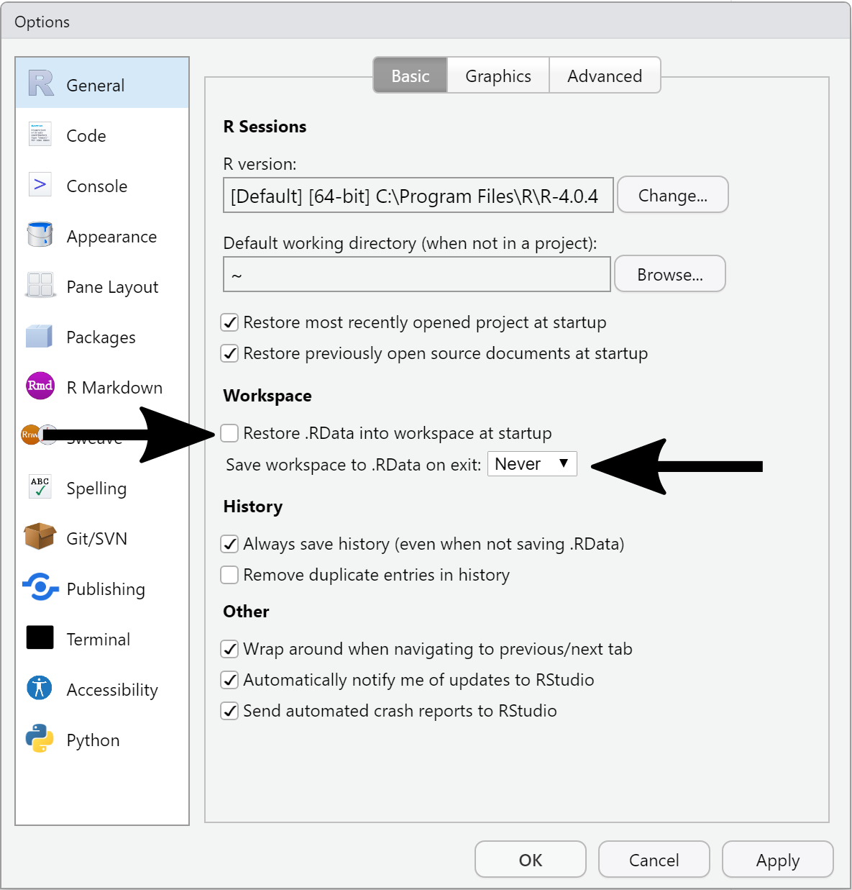

# R Programming

## Before you begin

All the examples and instructions in this chapter assume you have [installed
R](#prelim-r) are using [RStudio]. Be sure to [turn off automatic environment
saving in RStudio][Rstudio]! Because this is so important, here it is again:

::: {.box .important}
By default, RStudio preserves your R environment when you shut it down and
restores it when you start it again.

**This is very bad practice!**

The state of your R environment, which includes
the values stored in variables, the R packages loaded, etc. from previously
executed code is transient and may not reflect the results your code produces
when run alone.

Open the Tools > Global Options... menu and:
1. Uncheck "Restore .RData into workspace at startup"
2. Set "Save workspace to .RData on exit:" to "Never"

{width=75%}

The book R for Data Science has an [excellent
chapter](https://r4ds.had.co.nz/workflow-projects.html#workflow-projects) on why
this is a problem and how to change the RStudio setting to avoid it.
:::

::: {.box .readmore}
* [What They Forgot To Teach You About R - Always start R with a blank
slate](https://rstats.wtf/save-source.html#always-start-r-with-a-blank-slate)
:::

## The R Script {#prog-the-r-script}

Before we cover the R language itself, we should talk about how you should run
your code and where it should live. [As mentioned](#prelim-r), R is both a
programming language and an environment where you can run code written in that
language. The environment is a program (confusingly also called R) that allows
you to interact with it and run simple lines of code one at a time. This
environment is very useful for learning how the language works and
troubleshooting, but it is not suitable for recording and running large, complex
analyses that require many lines of code. Therefore, **all important R code
should be written and saved in a file before you run it!** The code may not be
correct, and the interactive R environment is helpful for debugging and
troubleshooting, but as soon as the code works it should be saved to the file
and rerun from there.

With this in mind, the basic unit of an R analysis is the **R script**. An R
script is a file that contains lines of R code that run sequentially as a unit
to complete one or more tasks. Every R script file has a name, which you choose
and should be descriptive but concise about what the script does; ``script.R``,
``do_it.R``, and
``a_script_that_implements_my_very_cool_but_complicated_analysis_and_plots.R``
are generally poor names for scripts, whereas `analyze_gene_expression.R` might
be more suitable.

In RStudio, you can create a new script file in the current directory using the
`File -> New File -> R Script` menu item or the new R Script button at the top
of the screen:

{width=25%}

Your RStudio configuration should now enable you to write R code into the
(currently unsaved) file in the top left portion of the screen (labeled in the
figure as "File Editor").

{width=75%}

You are now nearly ready to start coding in R!

::: {.box .readmore}
* [How to name files](https://speakerdeck.com/jennybc/how-to-name-files) Some
  useful and advanced tips on how to name files
:::

## The Scripting Workflow {#prog-workflow}

But hold on, we're still not quite ready. As mentioned above, **all important R
code should be written and saved in a file before you run it!** Your scripts
will very quickly contain many lines of code that are meant to be run in
sequential order. While developing your code it is very helpful to run each
individual line separately, building up your script incrementally over time. To
illustrate how to do this, we will begin with a simple R code that stores the
result of an arithmetic expression to a new variable:

```{r}
# stores the result of 1+1 into a variable named 'a'
a <- 1+1
```

The concepts in this line of code will be covered in greater depth later, but
for now an intuitive understanding will suffice to explain the development
workflow in RStudio.

When developing, this is the suggested sequence of operations:

1. Save your file (naming if necessary on the first save) with `Ctrl-s` on
   Windows or `Cmd-s` on Mac
2. Execute the line or lines of code in your script you wish to evaluate using
   `Ctrl-Enter` on Windows or `Cmd-Enter` on Mac. By default only the line with
   the cursor is executed; you may click and drag with the mouse to select
   multiple lines to execute if needed.
3. The executed code will be evaluated in the Console window, where you may
   inspect the result and modify the code if necessary.
4. You may inspect the definitions of any variables you have declared in the
   Environment tab at the upper right.
5. When you have verified that the code you executed does what you intend,
   ensure the code in the file you started from is updated appropriately.
6. Go to step 1

The above steps are depicted in the following figure:

{width=75%}

Over time, you will gain comfort with this workflow and become more flexible
with how you use RStudio.

::: {.box .important}
If you followed the [instructions][Before you begin] above and prevented RStudio
from saving your environment when you exit the program (which you should! Did I
mention you should?!), none of the results of code you previously ran will be
available upon starting a new RStudio session. Although this may seem
inconvenient, this is an excellent opportunity to verify that your script in its
current state does what you intend for it to do.

**It is extremely easy to ask R to do things you don't mean for it to do!**

Rerunning your scripts from the beginning in a new RStudio session is an
excellent way to guard against this kind of error. This short page summarizes
this very well, you should read it:

* [What They Forgot To Teach You About R - Always start R with a blank
slate](https://rstats.wtf/save-source.html#always-start-r-with-a-blank-slate)
:::

::: {.box .readmore}
* [R for Data Science - Workflow: scripts](https://r4ds.had.co.nz/workflow-scripts.html)
* [RStudio IDE cheatsheet](https://www.rstudio.com/resources/cheatsheets/)
  (scroll down the page to find the cheatsheet entitled "RStudio IDE cheatsheet")
:::

## Basics {#prog-basics}

As with other subjects covered so far, the basic syntax of R is covered very
well in other free online materials. Some of those excellent resources are
linked at the end of this section, but a brief overview of the syntax is covered
here. The code examples below can be written into a script and evaluated as
described above or entered on the R Console directly and run by pressing
`Enter`.

### R Syntax Basics

At its core, R (like all programming languages) is basically a fancy calculator.
The syntax of most basic arithmetic operations in R should be familiar to you:

```
# addition, subtraction, multiplication, division
1 + 2
[1] 3
3 - 2
[1] 1
4 * 2
[1] 8
4 / 2
[1] 2
1.234 + 2.345 - 3.5*4.9 # numbers can have decimals
[1] -13.571
1.234 + (2.345 - 3.5)*4.9 # expressions can contain parentheses
[1] -4.4255
# exponentiation
2**2
[1] 4
4**(1/2) # square root
[1] 2
9**(1/3) # cube root
[1] 3
```
The `[1]` lines above are the output given by R when the preceding expression
is executed. Any portion of a line starting with a `#` is a comment and ignored
by R.

R also supports storing values into symbolic placeholders called *variables*, or
*objects*. An expression like those above can be assigned into a variable with a
name using the `<-` operator:

```{r, results='hide'}
new_var <- 1 + 2
```

Variables that have been assigned a value can be placed in subsequent
expressions anywhere where their value is evaluated:

```
new_var - 2
[1] 1
another_var <- new_var * 4
```

::: {.box .note}
The correct way to assign a value to a variable in R is with the `<-` syntax,
unlike many other programming languages which use `=`. However, although the `=`
assignment syntax does work in R:

```{r}
new_var = 2 # works, but is not common convention!
```
this is considered bad practice and may cause confusion later. You should always
use the `<-` syntax when assigning values to variables!
:::

### Functions

A function is a R provides a large number of

### DRY: Don't Repeat Yourself

### Unit Testing

### Troubleshooting/Debugging Strategies

### RMarkdown & knitr

::: {.box .readmore}
* [R for Data Science - Workflow basics](https://r4ds.had.co.nz/workflow-basics.html)
:::

## Data Structures & Iteration {#prog-struct}

## Coding Style and Conventions {#prog-style}

## Pipelines & Workflows {#prog-workflows}
