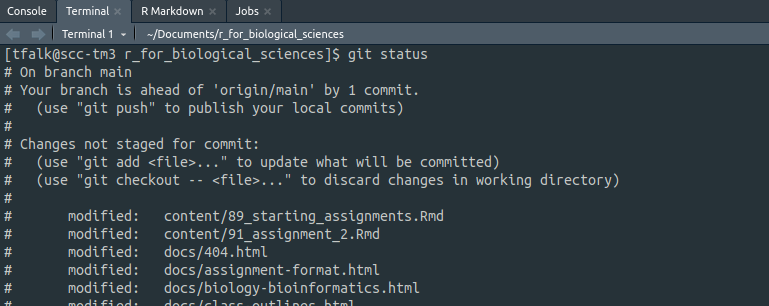

# Starting an Assignment {-}
> :^) good luck

When starting a project there are a small number of steps to get things set up _just_ right in order to have a smooth and seamless experience. While it is absolutely possible to complete these projects on your own machine and your own installation of R and RStudio, it will be easier and faster to do your work on BU's SCC. The experience will be more straightforward and basically identical to doing it on your own.

## Starting your own `git` repository and cloning it {-}
In our development of these assignments we used git and [github.com](github.com) to manage our updates and allow for easy sharing. We can now pass these repositories (repos) along to you using GitHub classroom so you can follow the steps within.

## Contents {-}
Each assignment will have these following files within, roughly:  
```
├── reference_report.html
├── main.R
├── README.md
├── report.Rmd
└── test_main.R
```
- **reference_report.html** - This is the completed "report" of the assignment. You will be endeavoring to replicate this while completing the assignment, with some room for creative differences in elements like plotting.
- **main.R** - This is the main R script in the assignment, where you will be doing a lot of your _programming_. This script contains function definitions and descriptions, but with functions that are empty. Complete the functions as described in the script and ensure they pass the tests.
- **README.md** - Every repository _should_ have a README. Usually it contains useful information about installation, usage, and licensing. In this case, it will have helpful links back to assignment instructions.
- **report.Rmd** - Another empty file, this markdown script will `source()` your `main.R` script, loading the functions into its environment. There will be empty code blocks throughout this document, use the functions you developed in `main.R` to replicate the figures or match the captions seen in `finalized_report.pdf`.
- **test_main.R** - This is a completed testing script produced by us to help you quickly determine how will your code is running. This file **sources** your `main.R` file, meaning it runs it to completion and stores any functions and variables in the active environment. It then runs tests to ensure your functions are working in a predictable way. Tests are incredibly valuable tools, and potentially one of the strongest in a programmer's toolkit.

::: {.box .important}
Most assignments beyond assignment 1 have a complementary guide hosted on the website page. These go into more background about how functions and tests work so use them if you're feeling stuck or would like more context. [https://bu-bioinfo.github.io/r_for_biological_sciences/assignment-format.html](Assignment Format)
:::

## GitHub tutorial {-}
1. Find your assignment link
2. Clone your repository, you will see a new repo in the form: `myusername/assignment-X`
3. Inside this repo, click the big <font color="green">**g r e e n**</font> button and copy the HTTP link to your repository.
4. Login to [https://scc-ondemand.bu.edu/](SCC interactive). Start an interactive R session (Interactive Apps > RStudio Server), use the default settings but increase the hours to like 12 or something. Or if you like high pressure situations set it to like 20 minutes.
5. Once your session is loaded and you are login in, select the "New Project" button below the "Edit" button.  
6. With the prompt open, select `Version Control` > `git`, and paste your repo's url into the first prompt. Feel free to rename the project, but also like don't? That's confusing. You can change where this folder is setup on SCC, but I find `~/Documents` or `~/Documents/BF591` to be a good home for organizing my various projects.   

7. You will need to login to complete this process, enter your GitHub username and password when prompted.
8. R will download all of the repository contents, and add an `.RProj` file to the directory. This RProject file is useful for switching between R assignments in RStudio. This context menu is in the top right of the RStudio interface:  


## Committing and Pushing with R (and without) {-}
With the RProject set up, you now have a directory on SCC that has cloned your remote repository in GitHub. At this moment all of the files are the same, since you have made no progress on your assignment (depressing, I know). In a burst of productive energy, you will start to make changes to `main.R` and write your beautiful, buggy functions. Once you're done for a little bit, what next? You could leave it on SCC and it would probably be pretty safe, but what if you want to share this code easily? Or if a cataclysm strikes Western Massachusetts? Your changes are gone and life will have lost all meaning.  

To prevent this cataclysm, you must **add**, **commit**, and **push** your code back to GitHub.

## Using RStudio {-}
1. Save the files you want to commit, and select the Git tab in the top right viewer (by default).  

2. You'll notice the files you changed are listed here, along with varying symbols. A question mark **?** means the file is untracked, an **M** means a tracked file has been modified. A **D** means a tracked file has been deleted. If I select a file I want to add back to GitHub, I can tick the checkbox and it will switch to the left column. This is called **staging** a file.  

3. Once I've staged all the files I want to add, I can click on the **Commit** button. This brings up another window, which will again list the files you are staging and actually show you the differences you're making (this is called the **diff**, based on the GNU utility of the same name). The most important part is the **Commit** box. A commit is a series of file updates made together, typically to solve a task. It is **paramount** that you include commit messages, so you can track what it is you're doing with your work! Just a sentence is usually enough to describe what the changes in this commit are doing.

4. Once you've pressed the commit button, all that's left to do is to **push** your commit. This sends the commit to GitHub where it can safely live forever, duplicated across the world and safe from most cataclysms.  

5. In the same vein, the **pull** button is useful if your GitHub has been updated more recently than your current SCC directory. This can happen if you're editing these files from another computer or on [GitHub.com](GitHub.com) directly.

## Using the command line {-}
That was kind of a lot of clicking and funny little menus, and my doctor says I am at high risk for a repetitive stress injury, so can't I just use my keyboard instead? Yes, of course. We'll use the terminal, which is also built-in to RStudio but really just emulates the standard bash terminal that you would use to interact with SCC normally.

1. Click on the terminal tab at the bottom of your layout (default).  
  
2. Marvel at the wonderful monospace font and rest your hands upon the keyboard. To see how the directory is doing, we can type `git status` to see what files have been changed. Wow! Looks like I have a lot of stuff to deal with. What's nice is the `git` command offers a lot of helpful tips for getting me on my way.

3. I want to add these files, and I really don't care how many I had so I am going to use `git add *`, which basically adds everything that can be found in the current directory. If I only wanted one or two things, I could specify `git add file1.txt file2.txt` and leave the other files alone.
4. Once I have added (or removed `git rm file1.txt`) the files I want to commit, I simply use `git commit -m "Added a lot more content to tutorials!` to create the commit and add my **very important message**. Messages are not mandatory but if you slack on being descriptive you will regret it when you come back later to figure out what in God's name you were doing that day.
5. Finally, with my commit done and files added, I simply say `git push` to send my wonderful code back to GitHub, and I can sit back and marvel at my handiwork.

Put simply, the three commands `git add *`, `git commit -m "message"`, and `git push` will save the changes to your code and keep your repository up to date. Easier than clicking around RStudio but both ways are super valid!
