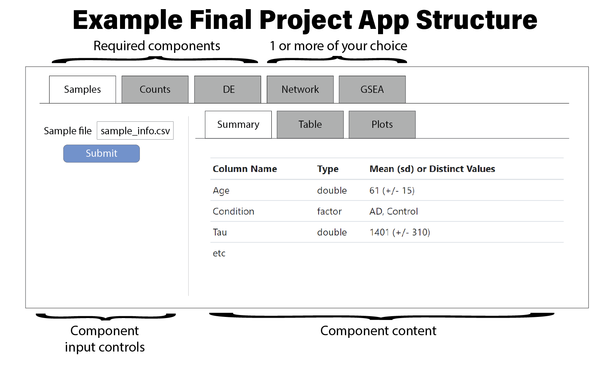

# Final Project {-}

For the final project you will develop an R Shiny application that features
multiple bioinformatics processes implemented in R. Your application must
contain three mandatory components followed by a fourth component of your
choice, as described below. You may organize your application however you wish,
but it must be integrated into one singular application; four separate
applications will not be acceptable. However, it may be helpful to develop each
component as its own app, and then combine when all are complete. We suggest a
layout like the following:

Part of this project is to identify the data necessary to be loaded into this
application. We will provide sets of starting information, but you will need to
use the R code you’ve written for assignments one through seven to process the
raw data into an appropriate format to be loaded into your Shiny application.
Different processing steps and analyses will be required for each dataset, so
you must investigate each dataset closely to understand what is available and
what must be done yourself.

Collaboration is encouraged but sharing code is forbidden. Your final submission
will include a GitHub repository containing the app and data as well as a five
minute pre-recorded screen grab video presentation offering a demonstration of
your application. We will view this presentation and grade your project based on
how well it fits the following criteria and the contents and quality of your
coding.

## General Guidelines

* Simple file input validation (check if it’s CSV or TSV that is well formatted,
error message otherwise)
* Write comments in your code elaborating on functions, Shiny commands, or code
that is not immediately obvious to someone who isn’t familiar with your code
* Your App should be user friendly. Buttons need to have labels on them. Text
descriptions are put in the UI to describe what each section and input is
doing.
* (Optional) Data sharing across different tabs. E.g. After analysis is done in
the differential expression tab, proceed to the GSEA tab, which will
automatically load the results from the differential expression tab.

## Video Presentation Guidelines

* A screen recorded presentation detailing the ins and outs of the Shiny application (Zoom can be used to record)
* Narrate all steps of your presentation as you go
* Presentations should be no more than 5 minutes and should include:
  - A brief introduction, tour, and demonstration of each tab in your application
  - Discuss some of the challenges and solutions you used while programming
  - A very brief explanation of the input data and how it was generated. For
  example: “The data was comparing control and lung cancer samples from Paper et
  al. I filtered the counts matrix to only contain genes where no more than half
  of the samples within each condition had 0 counts. I then performed DE on the
  counts matrix comparing A vs. B using DESeq2 with default parameters and
  considered genes to be significant with a FDR < .15”
* Quick walkthrough of Shiny functionalities checklist

We recommend writing a script first to use during your presentation. The average
number of spoken words per minute in English is ~140, so you might use that as a
guide for length.

## Input Data Sets

We have identified several different datasets that you may use for your
projects. Each is a gene expression dataset generated with RNASeq data, and has
both sample information and a counts matrix available. You will need to identify
the data files containing this information with the references provided below
and perform any necessary pre-processing (e.g. counts normalization,
differential expression, etc.) to make the data suitable for your app. Each
dataset has a slightly different way of obtaining the data, so this should be
your first step. The app components described later on this page indicate what
the input should be using the language provided here.

Some hints:

* You will need to investigate the data available in each of the provided
  sources to find sample info. For some of the datasets, it might be easier to
  simply create a sample info matrix based on filenames, but others will need
  more detailed (e.g. covariate) information that you will need to find and use.
* You will need to closely examine the available counts matrices to understand
  what they are and how they have been processed.
* Some of the datasets have precomputed differential expression statistics. You
  may use these analyses, but be sure you understand what comparison you are
  using when describing your dataset and demonstrating your app.

You may choose from the following datasets when building and demonstrating your
app:

### Soybean cotyledon gene expression across development

  This experiment assayed gene expression in the cotyledons, or embryonic
  leaves, for soybean plants at different ages after planting.

  * [bigPint R package](https://rdrr.io/bioc/bigPint/man/se_soybean_cn_sub.html)

### Post-mortem Huntington's Disease prefrontal cortex compared with neurologically healthy controls

This dataset profiled gene expression with RNASeq in post-mortem human
dorsolateral prefrontal cortex from patients who died from Huntington's
Disease and age- and sex-matched neurologically healthy controls.

* [mRNA-Seq Expression profiling of human post-mortem BA9 brain tissue for Huntington's Disease and neurologically normal individuals](https://www.ncbi.nlm.nih.gov/geo/query/acc.cgi?acc=GSE64810)

### Transcriptional Reversion of Cardiac Myocyte Fate During Mammalian Cardiac Regeneration

This dataset profiled gene expression with RNASeq in murine cardiac tissue
across different stages of development to identify genes associated with
the loss of these cell's capacity to regenerate.

* [Transcriptional Reversion of Cardiac Myocyte Fate During Mammalian Cardiac Regeneration](https://www.ncbi.nlm.nih.gov/geo/query/acc.cgi?acc=GSE64403)

### Molecular mechanisms underlying plasticity in a thermally varying environment

This dataset profiled gene expression with RNASeq in drosophila melanogaster
at different stages of development exposed to constant or fluctuating
temperatures.

* [Molecular mechanisms underlying plasticity in a thermally varying environment](https://www.ncbi.nlm.nih.gov/geo/query/acc.cgi?acc=GSE150450)
* [Salachan, Paul Vinu, and Jesper Givskov Sørensen. 2022. “Molecular Mechanisms Underlying Plasticity in a Thermally Varying Environment.” Molecular Ecology, April. https://doi.org/10.1111/mec.16463.](https://onlinelibrary.wiley.com/doi/10.1111/mec.16463)

**Note:** This article is not open; you will need to find the article through
the library of your academic institution

### Your own idea

You may identify a gene expression dataset of your own interest. The dataset
must have:

* A publication associated with it
* A publicly available raw or normalized gene counts matrix with at least 6
  samples and 5,000 genes
* Available sample information that allows you to compute a differential
expression analysis

Be sure to explain the background of the dataset in your demonstration video.

## Required Components

### Sample Information Exploration

**Inputs**:

* Sample information matrix in CSV format

**Shiny Functionalities**:

* Tab with a summary of the table that includes a summary of the type and values in each column, e.g.:
  Number of rows: X
  Number of columns: Y

  | Column Name | Type   | Mean (sd) or Distinct Values |
  |-------------|--------|------------------------------|
  | Age         | double | 61 (+/- 15)                  |
  | Condition   | factor | AD, Control                  |
  | Tau         | double | 1401 (+/- 310)               |
  | etc         |        |                              |

* Tab with a data table displaying the sample information, with sortable columns
* Tab with histograms, density plots, or violin plots of continuous variables.
  - If you want to make it fancy, allow the user to choose which column to plot
   and another column to group by!

### Counts Matrix Exploration

**Inputs**:

* Normalized counts matrix, by some method or other, in CSV format

**Shiny Functionalities**:

*

### Differential Expression

**Inputs**:

* Results of a differential expression analysis in CSV format.
  - If results are already made available, you may use those
  - Otherwise perform a differential expression analysis using DESeq2, limma, or
    edgeR from the provided counts file

**Shiny Functionalities**:

* You must include a filtering step as a part of your analysis. All differential
  expression libraries have filtering capabilities.
* Create a tab in your shiny application that can load the counts file, analyze
  it, and create a relevant plot or table to illustrate the differential
  expression results. You may use a volcano plot or choose other relevant ways
  to plot differentially expressed genes (such as the bigPint library).
* In this tab, design a user interface to control the level of filtering that
  your analysis performs on the count data.
* Plots and or tables should be used to illustrate how this filtering can impact
  the results of a dataset
    - Recommendation: Use a slide bar input to specify a FDR p-value cutoff, and
      another slide bar input to specify another filter criteria, for example,
      absolute log2 FC. After clicking a button, show the table of the top X
      genes (ranked by p-value), and a volcano plot containing all the genes
      with the significant genes (identified by the filter criteria selected)
      colored differently.

## Choose-your-own Adventure

### Gene Set Enrichment Analysis

**Input**:

Create a table of fgsea results from the differential expression data.

Choose an appropriate ranking metric (S2N, LogFoldChange, signed log(pvalue), etc.
Run fgsea with appropriate parameters (minsize and maxsize for gene sets, they already did it this way in assignment #5) against gene set of their choice
Unnest leading edge column (leading edge genes stored as list), save each in column delimited by something other than comma or tab.
Save the results to a CSV/TSV

**Shiny Functionalities**:

* Tab 1
  - Sidebar
    + Upload from file (FileInput) - simple validation of CSV/TSV
    + Slider to adjust number of top pathways to plot (Reactive)

  - Main Panel
    + Barplot of fgsea NES for top pathways selected by slider
    + Click on barplot for pathway to display table entry (On Click)

* Tab 2
  - Sidebar
      + Slider to filter table by padj (Reactive)
      + Download button to export current filtered and displayed table results
      + Radio buttons to select all, positive or negative NES pathways (Reactive)

  - Main panel
      + Sortable DT table

### Network Analysis

**Input**:

Create a table (not in your Shiny app. do it in a general R session) that you
can draw a network from

Example: gene-gene correlation matrix (draw an edge between two vertices when
their correlation value reaches a certain threshold), top significantly
differentially expressed genes for several different phenotypes, or any other
matrices you like.

The number of vertices should be at least 10. Recommendation: around 15-30
vertices with a total number of edges around 2 to 5 times of the number of
vertices may be a good one to work with.

**Shiny Functionalities**:

* Upload the table containing the information to draw a network.
  - Hint: there’s no requirement of the format of the table, but one of the
    easiest way is to make it to have two columns named “from” and “to” which
    are vertices to be used, and a column “weight” to indicate edge weight
* After clicking a button, draw the network. Basic igraph plot is okay.
  - Vertices should be colored NOT by the default color in igraph
  - Labels on vertices are optional. Make your own choice depending on the
    density of your network.
  - (Optional) You can also explore other interactive plotting packages
* Choose at least one in this question. After clicking a button, show a table
  output of the top 5 vertices with the highest… (one of the following) and
  their value.
  - Degree
  - Closeness centrality
  - Betweenness centrality
* The user can select two vertices, click a button, and show the shortest path
  between them. What required in this question are:
  - Two drop down menus (selectizeInput) to select two vertices
  - (Optional) It would be great if it prevents the user from selecting the same
    vertices. You can either use ​updateSelectizeInput, or, implement a checking
    step to make sure the two vertices are not the same.
  - A button
  - Show the shortest path as text output

### RShiny Test Suite

Instead of creating a fourth tab as a part of this project, you will instead
create a test application file for use with the “testthat” or “shinytest”
packages.

testthat can be used to create a headless (no visual elements) shiny application
where you can set inputs and use testthat functions like expect_equal() to
compare outputs. shinytest involves manually recording the state of the
application and comparing subsequent runs to this state.

Create a test file that uses either or both packages to test various parts of
your application. Each tab must have at least 5 distinct tests that measure
inputs and outputs of your application (so at least 15 total).

Tests should be relevant and should test parts of the application relevant to
the app’s running. For instance, a test confirming a counts file was filtered
correctly would be acceptable. Tests can measure the output of functions inside
your application or the output$
of the app itself.

Spend a portion of your presentation video running the test to show what is
working (or what doesn’t) and discuss briefly your approach to writing and
running the tests. Your test file will be reviewed with your project submission.

### Differential Expression Exploratory Analysis

**Input**:
Differential Expression results
[Optional] Allow the program to access your previous differential expression results from the earlier section
Allow user to choose which kind of exploratory analysis to perform. Must have at
least 3 exploratory analysis options (PCA, heatmapping, clustering, sample
scatterplot, sample difference… Or any other appropriate plot. If you choose
analyses to perform outside of the aforementioned options, please explain what
they are and what they do on your app)

Appropriate interface which allows the user to set plot options. Suggestions
include filtering cutoffs, color options, plot title…

**Shiny Functionalities**:

* Import data
* Analysis selection with an appropriate method of selection
* Once the analysis option has been selected, allow the user to edit the
  analysis-relevant parameters in a way that is user friendly. Points will be
  deducted if you try to emulate any of these in spirit or in exact
  - [Optional] If you allowed your user to select a subset of the data, display
    the table of data used [in a different tab or otherwise]
* When parameters have been set, allow the user to click a button to enable
  display of the desired plot

### Visualization of Individual Gene Expression(s)

**Input**:

Upload data of gene expression
Allow user to filter genes by specific criteria to find them easier (search/filter by name, p-value, id…
Allow user to select samples if necessary
[optional] Allow user to adjust format so they can display multiple genes across
a sample, specific gene expression across multiple samples, display multiple
genes in multiple samples…

Choosing to stick to one format instead is okay.

**Shiny Functionalities**:
* Data upload and processing where necessary
* Upon completion of upload and processing, display a table of gene, sample
  names with relevant information.
* Allow the user to filter, search, and select gene(s), sample(s) in a way that
  makes sense to produce your desired output.
* Allow the user to edit display parameters for visual elements like colors.

Example usage from a journal article: (taken from Koch et al (2018) doi:
10.1165/rcmb.2017-0430TR )

### Custom Option

We have explored a number of different bioinformatics topics in this class and
BF528, but there are many more. If you would like to create your own fourth
component, draft a small proposal of what you would like your Shiny app to do
and what data it will use and send that to Adam or any of the TAs.

General requirements:
* Have 3 to 5 input elements (e.g. upload handler, radio selection input, text
  input, drop down menu, slidebar input, color selection…)
* Have 2 to 3 output elements (e.g. plots, table, text…)
* Basic preprocessing of the data before input to Shiny app is required. You
  don’t need to do a comprehensive analysis, but it should not be “download
  something then use it directly”. You may refer to other sections above to see
  the amount of pre-processing required.
* You may also adopt one of the pre-defined optional tab above (Gene Set
  Enrichment Analysis, Network Analysis, RShiny Test Suite) with some slight
  modifications (e.g. a different types of plot)
