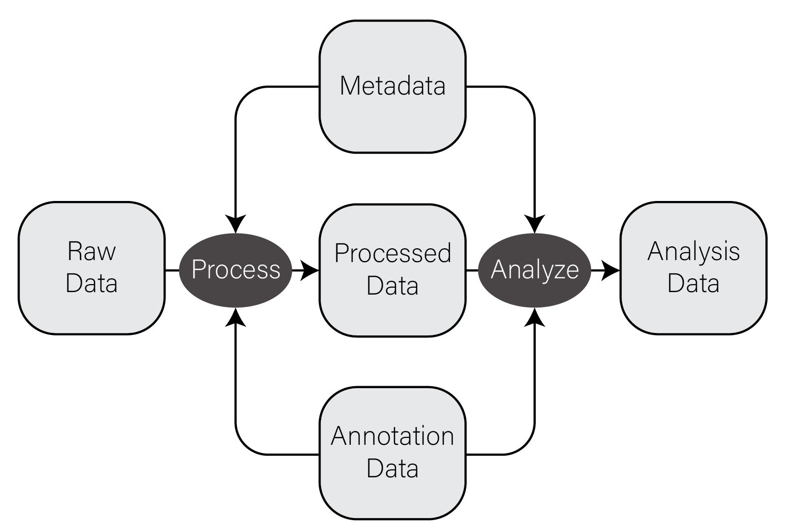
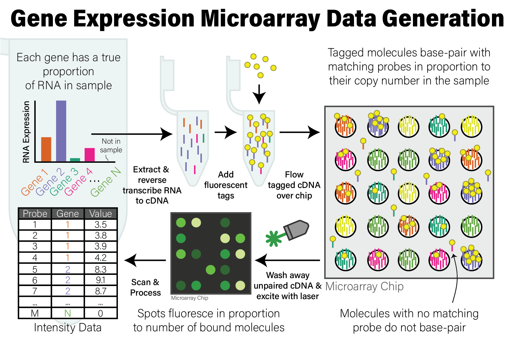

```{r bioinfo setup, include=FALSE}
if (!require("BiocManager", quietly = TRUE))
    install.packages("BiocManager")

BiocManager::install(c("SummarizedExperiment","affydata"), update=FALSE, ask=FALSE)
library(tidyverse)
library(patchwork)
```

# Biology & Bioinformatics

## R in Biology {#bio-r}

R became popular in biological data analysis in the early to mid 2000s, when
[microarray
technology](https://www.genome.gov/genetics-glossary/Microarray-Technology) came
into widespread use enabling researchers to look for statistical differences in
gene expression for thousands of genes across large numbers of samples. As a
result of this popularity, a community of biological researchers and data
analysts created a collection of software packages called
[Bioconductor](https://www.bioconductor.org/), which made a vast array of
cutting edge statistical and bioinformatic methodologies widely available.

Due to its ease of use, widespread community support, rich ecosystem of
biological data analysis packages, and to it being free, R remains one of the
primary languages of biological data analysis. The language's early focus on
statistical analysis, and later transition to data science in general, makes it
very useful and accessible to perform the kinds of analyses the new data science
of biology required. It is also a bridge between biologists without a
computational background and statisticians and bioinformaticians, who invent
new methods and implement them as R packages that are easily accessible by all.
The language and the package ecosystems and communities it supports continue to
be a major source of biological discovery and innovation.

As a data science, biology benefits from the main strengths of R and [the
tidyverse](#dw-tidyverse) when combined with the powerful analytical techniques
available in Bioconductor packages, namely to manipulate, visualize, analyze,
and communicate biological data.

## CSV Files

The most common, convenient, and flexible data file format in biology and
bioinformatics is the *character-delimited* or *character-separated text file*.
These files are plain text files (i.e. not the native file format of any
specific program, like Excel) that generally contain rectangles of data. When
formatted correctly, you can think of these files as containing a grid or matrix
of data values with some number of columns, each of which has the same number of
values. Each line of these files has some number of data values separated by a
consistent character, most commonly the comma which are called [comma-separated
value, or "CSV", files](https://en.wikipedia.org/wiki/Comma-separated_values)
and filenames typically end with the extension `.csv`. Note that
other characters, especially the <Tab> character, may be used to create valid
files in this format, and all the same general principles apply. This is an
example of a simple CSV file:

```
id,somevalue,category,genes
1,2.123,A,APOE
4,5.123,B,"HOXA1,HOXB1"
7,8.123,,SNCA
```

Some properties and principles of CSV files:

* The first line often but not always contains the column names of each column
* Each value is delimited by the same character, in this case `,`
* Values can be any value, including numbers and characters
* When a value contains the delimiting character (e.g. HOXA1,HOXB1 contains a
  `,`), the value is wrapped in double quotes
* Values can be missing, indicated by sequential delimiters (i.e. `,,` or one
  `,` at the end of the line, if the last column value is missing)
* There is no delimiter at the end of the lines
* To be well-formatted *every line must have the same number of delimited
  values*

These same properties and principles apply to all character-separated files,
regardless of the specific delimiter used. If a file follows these principles,
they can be loaded very easily into R or any other data analysis setting.

## Types of Biological Data {#bio-data-types}

In very general terms, there are five types of data used in biological data
analysis: raw/primary data, processed data, analysis results, metadata, and
annotation data.

**Raw/primary data.** These data are the primary observations made by whatever
instruments/techniques we are using for our experiment. These may include
high-throughput sequencing data, mass/charge ratio data from mass spectrometry,
16S rRNA sequencing data from metagenomic studies, SNPs from genotyping assays,
etc. These data can be very large and are often not efficiently processed using
R. Instead, specialized tools built outside of R are used to first process the
primary data into a form that is amenable to analysis.

**Processed data.** Processed data is the result of any analysis or
transformation of primary data into an intermediate, more interpretable form.
For example, when performing gene expression analysis with RNASeq, short reads
that form the primary data are typically aligned against a genome and then
counted against annotated genes, resulting in a count for each gene in the
genome. Typically, these counts are then combined for many samples into a single
matrix and subject to downstream analyses like differential expression.

**Analysis results.** Analysis results aren't data *per se*, but are the results
of analysis of primary data or processed results. For example, in gene
expression studies, a first analysis is often differential expression, where
each gene in the genome is tested for expression associated with some outcome
of interest across many samples. Each gene then has a number of statistics and
related values, like log2 fold change, nominal and adjusted p-value, etc. These
forms of data are usually what we use to form interpretations of our datasets
and therefore we must manipulate them in much the same way as any other dataset.

**Metadata.** In most experimental settings, multiple samples have been
processed and had the same primary data type collected. These samples also have
information associated with them, which is here termed *metadata*, or "data
about data". In our gene expression of post mortem brain experiments mentioned
above, the information about the individuals themselves, including age at death,
whether the person had a disease, the measurements of tissue quality, etc. is
the metadata. The primary and processed data and metadata are usually stored in
different files, where the metadata (or *sample information* or *sample data*,
etc) will have one column indicating the unique identifier (ID) of each sample.
The processed data will typically have columns named for each of the sample IDs.

**Annotation data.** A tremendous amount of knowledge has been generated about
biological entities, e.g. genes, especially since the publication of the human
genome. Annotation data is publicly available information about the features we
measure in our experiments. This may come in the form of the coordinates in a
genome where genes exist, any known functions of those genes, the domains found
in proteins and their relative sequence, gene identifier cross references across
different gene naming systems (e.g. symbol vs Ensembl ID), single nucleotide
polymorphism genomic locations and associations with traits or diseases, etc.
This is information that we use to aid in interpretation of our experimental
data but generally do not generate ourselves. Annotation data comes in many
forms, some of which are in CSV format.

The figure below contains a simple diagram of how these different types of data
work together for a typical biological data analysis.



## Common Biological Data Matrices

Typically the first data set you will work with in R is *processed data* as
described in the previous section. This data has been transformed from primary
data in some way such that it (usually) forms a numeric matrix with features
as rows and samples as columns. The first column of these files usually contains
a feature identifier, e.g. gene identifier, genomic locus, probe set ID, etc and
the remaining columns have numerical values, one per sample. The first row is
usually column names for all the columns in the file. Below is an example of one
of these files from a microarray gene expression dataset loaded into R:

```r
intensities <- read_csv("example_intensity_data.csv")
intensities
# A tibble: 54,675 x 36
   probe     GSM972389 GSM972390 GSM972396 GSM972401 GSM972409 GSM972412 GSM972413 GSM972422 GSM972429
   <chr>         <dbl>     <dbl>     <dbl>     <dbl>     <dbl>     <dbl>     <dbl>     <dbl>     <dbl>
 1 1007_s_at      9.54     10.2       9.72      9.68      9.35      9.89      9.70      9.67      9.87
 2 1053_at        7.62      7.92      7.17      7.24      8.20      6.87      6.62      7.23      7.45
 3 117_at         5.50      5.56      5.06      7.44      5.19      5.72      5.87      6.15      5.46
 4 121_at         7.27      7.96      7.42      7.34      7.49      7.76      7.44      7.66      8.02
 5 1255_g_at      2.79      3.10      2.78      2.91      3.02      2.73      2.78      3.56      2.83
 6 1294_at        7.51      7.28      7.00      7.18      7.38      6.98      6.90      7.54      7.66
 7 1316_at        3.89      4.36      4.24      3.94      4.20      4.34      4.06      4.24      4.11
 8 1320_at        4.65      4.91      4.70      4.78      5.06      4.71      4.55      4.58      5.10
 9 1405_i_at      8.03      7.47      5.42      7.21      9.48      6.79      6.57      8.50      6.36
10 1431_at        3.09      3.78      3.33      3.12      3.21      3.27      3.37      3.84      3.32
# ... with 54,665 more rows, and 26 more variables: GSM972433 <dbl>, GSM972438 <dbl>, GSM972440 <dbl>,
#   GSM972443 <dbl>, GSM972444 <dbl>, GSM972446 <dbl>, GSM972453 <dbl>, GSM972457 <dbl>,
#   GSM972459 <dbl>, GSM972463 <dbl>, GSM972467 <dbl>, GSM972472 <dbl>, GSM972473 <dbl>,
#   GSM972475 <dbl>, GSM972476 <dbl>, GSM972477 <dbl>, GSM972479 <dbl>, GSM972480 <dbl>,
#   GSM972487 <dbl>, GSM972488 <dbl>, GSM972489 <dbl>, GSM972496 <dbl>, GSM972502 <dbl>,
#   GSM972510 <dbl>, GSM972512 <dbl>, GSM972521 <dbl>
```

The file has 54,676 rows, consisting of one header row which R loads in as the
column names, and the remaining are probe sets, one per row. There are 36
columns, where the first contains the probe set ID (e.g. `1007_s_at`) and the
remaining 35 columns correspond to samples.

### Biological data is NOT Tidy!

As mentioned in the [tidy data](#tidy data) section, the tidyverse packages
assume data to be in so-called "tidy format", with variables as columns and
observations as rows. Unfortunately, certain forms of biological data are
typically available in the opposite orientation - variables are in rows and
observations are in columns. This is primarily true in feature data matrices,
e.g. gene expression counts matrices, where the number of variables (e.g. genes)
is much larger than the number of samples, which tend to be small very small
compared with the number of features. This format is convenient for humans to
interact with using, e.g. spreadsheet programs like Microsoft Excel, but can
unfortunately make performing certain operations on them challenging in
tidyverse.

For example, consider the microarray expression dataset in the previous section.
Each of the 54,676 rows is a probeset, and each of the 35 numeric columns is a
sample. This is a very large number of probesets to consider, especially if we
plan to conduct a statistical test on each, which would impose a substantial
[multiple hypothesis testing](#multiple-hypothesis-testing) burden on our
results. We may therefore wish to eliminate probesets that have very low
variance from the overall dataset, since these probesets are not likely to have
a detectable statistical difference in our tests. However, computing the
variance for each probeset is a computation *across all columns*, not on columns
themselves, and this is not what tidyverse is designed to do well. Said
differently, R and tidyverse do not operate by default on the rows of a data
frame, tibble, or matrix.

Both base R and tidyverse are optimized to perform computations on columns, not
rows. The reasons for this are buried in the details of how the R program itself
was written to organize data internally and are beyond the scope of this book.
The consequence of this design choice is that, while we can perform operations
on the rows rather than the columns of a data structure, our code may perform
very poorly (i.e. take a very long time to run).

When working with these datasets, we have a couple options to deal with this
issue:

* **Pivot into long format.** As described in the [Rearranging Data] section, we
  can rearrange our tibble to be more amenable to certain computations. In our
  earlier example, we wish to group all of our measurements by probeset and
  compute the variance of each, then possibly filter out probesets based on low
  variance. We can therefore combine `pivot_longer()`, `group_by()`,
  `summarize()`, and finally `left_join()` to perform this operation. Exactly
  how to do this is left as an exercise in [Assignment 1].

* **Compute row-wise statistics using `apply()`.** As described in [Iteration],
  R is a functional programming language and implements iteration in a
  functional style using the `apply()` function. The [`apply()
  function`](#apply-and-friends) accepts a `MARGIN` argument of 1 or 2 if the
  provided function is to be applied to the columns or rows, respectively. This
  method can be used to compute a summary statistic on each row of a tibble and
  the result saved back into the tibble using the column set operator:

  ```r
  intensity_variance <- apply(intensities, 2, var)
intensities$variance <- intensity_variance
  ```


## Bioconductor {#bio-bioconductor}

[Bioconductor](https://www.bioconductor.org/) is an organized collection of
strictly biological analysis methods packages for R. These packages are hosted
and maintained outside of [CRAN](https://cran.r-project.org/) because the
maintainers enforce [a more rigorous set of coding quality, testing, and
documentation
standards](https://bioconductor.org/developers/package-guidelines/) than is
required by normal R packages. These stricter requirements arose from a
recognition that software packages are generally only as usable as their
documentation allows them to be, and also that many if not most of the users of
these packages are not statisticians or experienced computer programmers.
Rather, they are people like us: biological analysis practitioners who may or
may not have substantial coding experience but must analyze our data
nonetheless. The excellent documentation and community support of the
bioconductor ecosystem is a primary reason why R is such a popular language in
biological analysis.

Bioconductor is divided into roughly two sets of packages: *core maintainer*
packages and user contributed packages. The core maintainer packages are among
the most critical, because they define a set of common objects and classes (e.g.
the [ExpressionSet class](https://www.bioconductor.org/packages/devel/bioc/vignettes/Biobase/inst/doc/ExpressionSetIntroduction.pdf)
in the [Biobase package](https://bioconductor.org/packages/release/bioc/html/Biobase.html))
that all Bioconductor packages know how to work with. This common base provides
consistency among all Bioconductor packages thereby streamlining the learning
process. User contributed and maintained packages provide specialized
functionality for specific types of analysis.

Bioconductor itself must be installed prior to installing other Bioconductor
packages. To [install bioconductor], you can run the following:

```r
if (!require("BiocManager", quietly = TRUE))
    install.packages("BiocManager")
BiocManager::install(version = "3.14")
```

::: {.box .warning}
Bioconductor undergoes regular releases indicated by a version, e.g. `version =
"3.14"` at the time of writing. Every bioconductor package also has a version,
and each of those versions may or may not be compatible with a specific version
of Bioconductor. To make matters worse, Bioconductor versions are only
compatible with certain versions of R. Bioconductor version 3.14 requires R
version 4.1.0, and will not work with older R versions. These versions can cause
major version compatibility issues when you are forced to use older versions of
R, as may sometimes be the case on managed compute clusters. There is not a good
general solution for ensuring all your packages work together, but the general
best rule of thumb is to use the most current version of R and all packages at
the time when you write your code.
:::

The `BiocManager` package is the only Bioconductor package installable using
`install.packages()`. After installing the BiocManager package, you may then
install bioconductor packages:

```r
# installs the affy bioconductor package for microarray analysis
BiocManager::install("affy")
```

One key aspect of Bioconductor packages is consistent and helpful documentation;
every package page on the Bioconductor.org site lists a block of code that will
install the package, e.g. for the [affy
package](https://www.bioconductor.org/packages/release/bioc/html/affy.html). In
addition, Biconductor provides three types of documentation:

* [Workflow tutorials](https://bioconductor.org/packages/release/workflows/) on
  how to perform specific analysis use cases
* [Package vignettes](https://bioconductor.org/help/package-vignettes/) for
  every package, which provide a worked example of how to use the package that
  can be adapted by the user to their specific case
* Detailed, consistently formatted reference documentation that gives precise
  information on functionality and use of each package

The thorough and useful documentation of packages in Bioconductor is one of the
reasons why the package ecosystem, and R, is so widely used in biology and
bioinformatics.

The base Bioconductor packages define convenient data structures for storing and
analyzing many types of data. Recall earlier in the [Types of Biological Data]
section, we described five types of biological data: primary, processed,
analysis, metadata, and annotation data. Bioconductor provides a convenient
class for storing many of these different data types together in one place,
specifically the SummarizedExperiment class in the [package of the same
name](https://bioconductor.org/packages/release/bioc/html/SummarizedExperiment.html)
package. An illustration of what a SummarizedExperiment object stores is below,
from the Bioconductor maintainer's paper in Nature:


As you can see from the figure, this class stores processed data (`assays`),
metadata (`colData` and `exptData`), and annotation data (`rowData`). The
SummarizedExperiment class is used ubiquitously throughout the Bioconductor
package ecosystem, as are other core classes some of which we will cover later
in this chapter.

## Gene Identifiers

### Gene Identifier Systems

Since the first genetic sequence for a gene was determined in 1965 - [an alanine
tRNA in yeast](https://pubmed.ncbi.nlm.nih.gov/14263761/)[@Holley1965-tu] -
scientists have been trying to give them names. In 1979, [formal guidelines for
the nomenclature used for human genes was
proposed](https://pubmed.ncbi.nlm.nih.gov/295268/)[@Shows1979-iw] along with the
founding of the Human Gene Nomenclature Committee [@Bruford2020-zs], so that
researchers would have a common vocabulary to refer to genes in a consistent
way. In 1989, this committee was placed under the auspices of the Human Genome
Organisation (HUGO), becoming the HUGO Gene Nomenclature Committee (HGNC). The
HGNC has been the official body providing guidelines and gene naming authority
since, and as such HGNC gene names are often called *gene symbols*.

::: {.box .note}
As per @Bruford2020-zs, the official human gene symbol guidelines are as
follows:

1. Each gene is assigned a unique symbol, HGNC ID and descriptive name.
2. Symbols contain only uppercase Latin letters and Arabic numerals.
3. Symbols should not be the same as commonly used abbreviations
4. Nomenclature should not contain reference to any species or “G” for gene.
5. Nomenclature should not be offensive or pejorative.

:::

Gene symbols are the most human-readable system for naming genes. The gene
symbols *BRCA1*, *APOE*, and *ACE2* may be familiar to you as they are involved
in common diseases, namely breast cancer, Alzheimer's Disease risk, and
SARS-COV-2, respectively. Typically, the gene symbol is an acronym that roughly
represents a label of what the gene is or does (or was originally found to be or
do, as many genes are subsequently discovered to be involved in entirely
separate processes as well), e.g. *APOE* represents the gene [apolipoprotein
E](https://www.ensembl.org/Homo_sapiens/Gene/Summary?db=core;g=ENSG00000130203;r=19:44905791-44909393).
This convention is convenient for humans when reading and identifying genes.
However, standardized though the symbol conventions may be, they are not always
easy for computers to work with, and ambiguities can cause mapping problems.

Other gene identifier systems developed along with other gene information
databases. In 2000, the [Ensembl](https://www.ensembl.org/) genome browser was
launched by the [Wellcome Trust](https://wellcome.org/), a charitable foundation
based in the United Kingdom, with the goal of providing automated annotation of
the human genome. The Ensembl Project, which supports the genome browser,
recognized even before the publication of the human genome that manual
annotation and curation of genes is a slow and labor intensive process that
would not provide researchers around the world timely access to information. The
project therefore created a set of automated tools and pipelines to collect,
process, and publish rapid and consistent annotation of genes in the human
genome. Since its initial release, Ensembl now supports over 50,000 different
genomes.

Ensembl assigns a automatic, systematic ID called the Ensembl Gene ID to every
gene in its database. Human Ensembl Gene IDs take the form `ENSG` plus an 11
digit number, optionally followed by a period delimited version number. For
example, at the time of writing the BRCA1 gene has an Ensembl Gene ID of
`ENSG00000012048.23`. The stable ID portion (i.e. `ENSGNNNNNNNNNNN`) will remain
associated with the gene forever (unless the gene annotation [changes
"dramatically" in which case it is
retired](http://useast.ensembl.org/Help/View?id=181)). The `.23` is the version
number of the gene annotation, meaning this gene has been updated 22 times (plus
its initial version) since addition to the database. The additional version
information is very important for reproducibility of biological analysis, since
conclusions drawn by results of these analyses are usually based on the most
current information about a gene which are continually updated over time.

::: {.box .note}
Ensembl maintains annotations for many different organisms, and the gene
identifiers for each genome contain codes that indicate which organism the gene
is for. Here are the codes for genes in several different species:

+----------------+-------------------------+----------------------+
| Gene ID Prefix | Organism                |  Example             |
+================+=========================+======================+
| `ENSG`         | Homo sapiens            | [ENSG00000139618](https://useast.ensembl.org/Homo_sapiens/Gene/Summary?db=core;g=ENSG00000139618;r=13:32315086-32400268)    |
+----------------+-------------------------+----------------------+
| `ENSMUSG`      | Mus musculus (mouse)    | [ENSMUSG00000017167](https://useast.ensembl.org/Mus_musculus/Gene/Summary?db=core;g=ENSMUSG00000017167;r=11:101061349-101081550) |
+----------------+-------------------------+----------------------+
| `ENSDARG`      | Danio rerio (zebrafish) | [ENSDARG00000024771](https://useast.ensembl.org/Danio_rerio/Gene/Summary?db=core;g=ENSDARG00000024771;r=18:5213338-5227420;t=ENSDART00000033574) |
+----------------+-------------------------+----------------------+
| `ENSMMUG`      | Macaca mulata (Macaque) | [ENSMMUG00000020312](https://useast.ensembl.org/Macaca_mulatta/Gene/Summary?db=core;g=ENSMMUG00000020312;r=5:65376507-65505566) |
+----------------+-------------------------+----------------------+
| `ENSVPAG`      | Vicugna pacos (Alpaca)  | [ENSVPAG00000001990](https://useast.ensembl.org/Vicugna_pacos/Gene/Summary?db=core;g=ENSVPAG00000001990;r=GeneScaffold_2392:178775-179671;t=ENSVPAT00000001989) |
+----------------+-------------------------+----------------------+
:::

Ensembl Gene IDs and gene symbols are the most commonly used gene identifiers.
The [GENCODE project](https://www.gencodegenes.org/) which provides consistent
and stable genome annotation releases for human and mouse genomes, uses these
two types of identifiers with its official annotations.

::: {.box .note}
Ensembl provides stable identifiers for transcripts as well as genes. Transcript
identifiers correspond to distinct patterns of exons/introns that have been
identified for a gene, and each gene has one or more distinct transcripts.
Ensembl Transcript IDs have the form `ENSTNNNNNNNNNNN.NN` similar to Gene IDs.
:::

::: {.box .note}
Ensembl is not the only gene identifier system besides gene symbol. Several
other databases have devised and maintain their own identifiers, most notably
[Entrez Gene IDs]([UCSC Gene IDs]() used by the [NCBI Gene
database](https://www.ncbi.nlm.nih.gov/gene) which assigns a unique integer to
each gene in each organism, and the [Online Mendelian Inheritance in Man
(OMIM)](https://www.omim.org/) database, which has identifiers that look like
`OMIM:NNNNN`, where each OMIM ID refers to a unique gene or human phenotype.
However, the primary identifiers used in modern human biological research remain
Ensembl IDs and official HGNC gene symbols.
:::

### Mapping Between Identifier Systems

A very common operation in biological analysis is to map between gene identifier
systems, e.g. you are given Ensembl Gene ID and want to map to the more
human-recognizable gene symbols. Ensembl provides a service called
[BioMart](https://www.ensembl.org/biomart/martview) that allows you to download
annotation information for genes, transcripts, and other information maintained
in their databases. It also provides limited access to external sources of
information on their genes, including cross references to HGNC gene symbols and
some other gene identifier systems. The Ensembl website has [helpful
documentation](https://useast.ensembl.org/info/data/biomart/index.html) on how
to use BioMart to download annotation data using the web interface.

In addition to downloading annotations as a CSV file from the web interface,
Ensembl also provides [the biomaRt Bioconductor
package](https://useast.ensembl.org/info/data/biomart/biomart_r_package.html) to
allow programmatic access to the same information directly from R. There is [much
more information in the Ensembl
databases](https://useast.ensembl.org/info/genome/index.html) than gene
annotation data that can be accessed via BioMart, but we will provide a brief
example of how to extract gene information here:

```r
# this assumes biomaRt is already installed through bioconductor
library(biomaRt)

# the human biomaRt database is named "hsapiens_gene_ensembl"
ensembl <- useEnsembl(biomart="ensembl", dataset="hsapiens_gene_ensembl")

# listAttributes() returns a data frame, turn into a tibble to help with formatting
as_tibble(listAttributes(ensembl))
# A tibble: 3,143 x 3
   name                          description                  page        
   <chr>                         <chr>                        <chr>       
 1 ensembl_gene_id               Gene stable ID               feature_page
 2 ensembl_gene_id_version       Gene stable ID version       feature_page
 3 ensembl_transcript_id         Transcript stable ID         feature_page
 4 ensembl_transcript_id_version Transcript stable ID version feature_page
 5 ensembl_peptide_id            Protein stable ID            feature_page
 6 ensembl_peptide_id_version    Protein stable ID version    feature_page
 7 ensembl_exon_id               Exon stable ID               feature_page
 8 description                   Gene description             feature_page
 9 chromosome_name               Chromosome/scaffold name     feature_page
10 start_position                Gene start (bp)              feature_page
# ... with 3,133 more rows
```

The `name` column provides the programmatic name associated with the attribute
that can be used to retrieve that annotation information using the `getBM()`
function:

```r
# create a tibble with ensembl gene ID, HGNC gene symbol, and gene description
gene_map <- as_tibble(
  getBM(
    attributes=c("ensembl_gene_id", "hgnc_gene_symbol", "description"),
    mart=ensembl
  )
)
gene_map
# A tibble: 68,012 x 3
   ensembl_gene_id hgnc_symbol description                                                               
   <chr>           <chr>       <chr>                                                                     
 1 ENSG00000210049 MT-TF       mitochondrially encoded tRNA-Phe (UUU/C) [Source:HGNC Symbol;Acc:HGNC:748~
 2 ENSG00000211459 MT-RNR1     mitochondrially encoded 12S rRNA [Source:HGNC Symbol;Acc:HGNC:7470]       
 3 ENSG00000210077 MT-TV       mitochondrially encoded tRNA-Val (GUN) [Source:HGNC Symbol;Acc:HGNC:7500]
 4 ENSG00000210082 MT-RNR2     mitochondrially encoded 16S rRNA [Source:HGNC Symbol;Acc:HGNC:7471]       
 5 ENSG00000209082 MT-TL1      mitochondrially encoded tRNA-Leu (UUA/G) 1 [Source:HGNC Symbol;Acc:HGNC:7~
 6 ENSG00000198888 MT-ND1      mitochondrially encoded NADH:ubiquinone oxidoreductase core subunit 1 [So~
 7 ENSG00000210100 MT-TI       mitochondrially encoded tRNA-Ile (AUU/C) [Source:HGNC Symbol;Acc:HGNC:748~
 8 ENSG00000210107 MT-TQ       mitochondrially encoded tRNA-Gln (CAA/G) [Source:HGNC Symbol;Acc:HGNC:749~
 9 ENSG00000210112 MT-TM       mitochondrially encoded tRNA-Met (AUA/G) [Source:HGNC Symbol;Acc:HGNC:749~
10 ENSG00000198763 MT-ND2      mitochondrially encoded NADH:ubiquinone oxidoreductase core subunit 2 [So~
# ... with 68,002 more rows
```

With this Ensembl Gene ID to HGNC symbol mapping in hand, you can combine the
tibble above with other tibbles containing gene information by [joining them
together](#relational-data).

::: {.box .note}
BioMart/biomaRt is not the only ways to map different gene identifiers. The
Bioconductor package
[AnnotateDbi](https://bioconductor.org/packages/release/bioc/html/AnnotationDbi.html)
also provides this functionality in a flexible format independent of the Ensembl
databases. This package includes not only gene identifier mapping and
information, but also identifiers from technology platforms, e.g. probe set IDs
from [microarrays](#microarrays), that can help when working with these types of
data. The package also allows comprehensive and flexible [homolog
mapping](#mapping-homologs). As with all Bioconductor packages, the
AnnotationDbi documentation is well written and comprehensive, though knowledge
of [relational databases](https://en.wikipedia.org/wiki/Relational_database) is
helpful in understanding how the packages work.
:::

::: {.box .readmore}
* [Ensembl BioMart portal](https://www.ensembl.org/biomart/martview)
* [Ensembl BioMart web portal documentation](https://useast.ensembl.org/info/data/biomart/index.html)
* [biomaRt Bioconductor documentation](http://www.bioconductor.org/packages/release/bioc/html/biomaRt.html)
:::

### Mapping Homologs

Sometimes it is necessary to link datasets from different organisms together by
orthology. For example, in an experiment performed in mice, we might be
interested in comparing gene expression patterns observed in the mouse samples
to a publicly available human dataset. In these contexts, we must link gene
identifiers from one organism to their corresponding homologs in the other.
BioMart enables us to extract these linked identifiers by explicitly [connecting
different biomaRt
databases](https://bioconductor.org/packages/release/bioc/vignettes/biomaRt/inst/doc/accessing_ensembl.html#given-the-human-gene-tp53-retrieve-the-human-chromosomal-location-of-this-gene-and-also-retrieve-the-chromosomal-location-and-refseq-id-of-its-homolog-in-mouse.)
with the `getLDS()` function:

```r
human_db <- useEnsembl("ensembl", dataset = "hsapiens_gene_ensembl")
mouse_db <- useEnsembl("ensembl", dataset = "mmusculus_gene_ensembl")
orth_map <- as_tibble(
  getLDS(attributes = c("ensembl_gene_id", "hgnc_symbol"),
       mart = human_db,
       attributesL = c("ensembl_gene_id", "mgi_symbol"),
       martL = mouse_db
  )
)
orth_map
# A tibble: 26,390 x 4
   Gene.stable.ID  HGNC.symbol Gene.stable.ID.1   MGI.symbol
   <chr>           <chr>       <chr>              <chr>     
 1 ENSG00000198695 MT-ND6      ENSMUSG00000064368 "mt-Nd6"  
 2 ENSG00000212907 MT-ND4L     ENSMUSG00000065947 "mt-Nd4l"
 3 ENSG00000279169 PRAMEF13    ENSMUSG00000094303 ""        
 4 ENSG00000279169 PRAMEF13    ENSMUSG00000094722 ""        
 5 ENSG00000279169 PRAMEF13    ENSMUSG00000095666 ""        
 6 ENSG00000279169 PRAMEF13    ENSMUSG00000094741 ""        
 7 ENSG00000279169 PRAMEF13    ENSMUSG00000094836 ""        
 8 ENSG00000279169 PRAMEF13    ENSMUSG00000074720 ""        
 9 ENSG00000279169 PRAMEF13    ENSMUSG00000096236 ""        
10 ENSG00000198763 MT-ND2      ENSMUSG00000064345 "mt-Nd2"  
# ... with 26,380 more rows
```

The `mgi_symbol` field refers to the gene symbol assigned in the [Mouse Genome
Informatics database](https://www.jax.org/research-and-faculty/resources/mouse-genome-informatics)
maintained by [The Jackson Laboratory](https://www.jax.org/).

## Gene Expression

Gene expression is the process by which information from a gene is used in the
synthesis of functional gene products that affect a phenotype. While gene
expression studies are often focused on protein coding genes, there are many
other functional molecules, e.g. [transfer
RNAs](https://www.genome.gov/genetics-glossary/Transfer-RNA),
[lncRNAs](https://en.wikipedia.org/wiki/Long_non-coding_RNA), etc, that are
produced by this process. The gene expression process has many steps and
intermediate products, as depicted in the following figure:


The specific parts of the genome that code for genes are copied, or
*transcribed* into RNA molecules called *transcripts*. In lower organisms like
bacteria, these RNA molecules are passed on directly to ribosomes, which
translate them into proteins. In most higher organisms like eukaryotes, these
initial transcripts, called *pre-messenger RNA (pre-mRNA) transcripts* are
further processed such that certain parts of the transcript, called *introns*,
are spliced out and the flanking sequences, called *exons*, are concatenated
together. After this splicing process is complete, the pre-mRNA transcripts
become mature *messenger RNA (mRNA) transcripts* which go on to be exported from
the nucleus and loaded into ribosomes in the cytoplasm to undergo translation
into proteins.

In gene expression studies, the relative abundance, or number of copies, of RNA
or mRNA transcripts in a sample is measured. The measurements are non-negative
numbers that are proportional to the relative abundance of a transcript with
respect to some reference, either another gene, or in the case of high
throughput assays like microarrays or high throughput sequencing, relative to
measurements of all distinct transcripts examined in the experiment.
Conceptually, the larger the magnitude of a transcript abundance measurement,
the more copies of that transcript were in the original sample.

There are many ways to measure the abundance of RNA transcripts; the following
are some of the common methods at the time of writing:

* Light absorbance - RNA absorbs ultraviolet light with wavelength 260 nm, which
can be used to determine RNA concentration in a sample using specialized equipment
* [Northern blot](https://www.genome.gov/genetics-glossary/Northern-Blot) -
measures relative abundance of an RNA with a specific sequence
* [quantitative polymerase chain reaction
(qPCR)](https://www.thermofisher.com/blog/ask-a-scientist/what-is-qpcr/) -
measures relative abundance of an RNA with a specific sequence using [PCR
amplification](https://en.wikipedia.org/wiki/Polymerase_chain_reaction)
* [Oligonucleotide and microarrays](#microarrays) - measures relative abundance
of thousands of genes simultaneously using known DNA probe sequences and
fluorescently tagged RNA molecules
* [High throughput RNA sequencing (RNASeq)](#rnaseq) - measures thousands to
millions of RNA fragments simultaneously in proportion to their relative
abundance

While any of the measurement methods above may be analyzed in R, the high
throughput methods (i.e. microarray, high throughput sequencing) are the primary
concern of this chapter. These methods generate measurements for thousands of
transcripts or genes simultaneously, requiring the power and flexibility of
programmatic analysis to process in a practical amount of time. The remainder of
this chapter is devoted to understanding the specific technologies, data types,
and analytical strategies involved in working with these data.

::: {.box .important}
Gene expression measurements are almost always inherently relative, either due
to limitations of the measurement methods (e.g. microarrays, described below) or
because measuring all molecules in a sample will almost always be prohibitively
expensive, have diminishing returns, and it is very difficult if not impossible
to determine if all the molecules have been measured. This means we cannot in
general associate the numbers associated with the measurements with an absolute
molecular copy number. An important implication of the inherent relativity of
these measurements is: **absence of evidence is not evidence of absence**. In
other words, if a transcript has an abundance measurement of zero, this does
*not necessarily imply that the gene is not expressed*. It may be that the gene
is indeed expressed, but the copy number is sufficiently small that it was not
detected by the assay.
:::

### Gene Expression Data in Bioconductor

The [SummarizedExperiment
container](https://bioconductor.org/packages/release/bioc/html/SummarizedExperiment.html)
is the standard way to load and work with gene expression data in Bioconductor.
This container requires the following information:

* `assays` - one or more measurement assays (e.g. gene expression) in the form of a feature by sample matrix
* `colData` - metadata associated with the samples (i.e. columns) of the assays
* `rowData` - metadata associated with the features (i.e. rows) of the assays
* `exptData` - additional metadata about the experiment itself, like protocol, project name, etc

The figure below illustrates how the SummarizedExperiment container is
structured and how the different data elements are accessed:


Many Bioconductor packages for specific types of data, e.g.
[limma](#differential-expression--microarrays-limma) create these
SummarizedExperiment objects for you, but you may also create your own by
assembling each of these data into data frames manually:

```{r load summarizedexperiment, include=FALSE}
library(SummarizedExperiment)
intensities <- readr::read_delim("example_intensity_data.csv",delim=" ")
rowData <- intensities["probeset_id"]
intensities <- as.data.frame(
  dplyr::select(intensities, -probeset_id)
)
rownames(intensities) <- rowData$probeset_id
colData <- tibble(
  sample_name=colnames(intensities),
  condition=sample(c("case","control"),ncol(intensities),replace=TRUE)
)
se <- SummarizedExperiment(
   assays=list(intensities=intensities),
   colData=colData,
   rowData=rowData
)
```


```r
# microarray expression dataset intensities
intensities <- readr::read_delim("example_intensity_data.csv",delim=" ")

# the first column of intensities tibble is the probesetId, extract to pass as rowData
rowData <- intensities["probeset_id"]

# remove probeset IDs from assay and turn into a base R dataframe so that we can assign rownames, since tibbles don't support row names
intensities <- as.data.frame(
  select(intensities, -probeset_id)
)
rownames(intensities) <- rowData$probeset_id

# these column data are made up, but you would have a sample metadata file to use
colData <- tibble(
  sample_name=colnames(intensities),
  condition=sample(c("case","control"),ncol(intensities),replace=TRUE)
)

se <- SummarizedExperiment(
   assays=list(intensities=intensities),
   colData=colData,
   rowData=rowData
)
se
```

```
## class: SummarizedExperiment
## dim: 54675 35
## metadata(0):
## assays(1): intensities
## rownames(54675): 1007_s_at 1053_at ... AFFX-TrpnX-5_at AFFX-TrpnX-M_at
## rowData names(1): probeset_id
## colnames(35): GSM972389 GSM972390 ... GSM972512 GSM972521
## colData names(2): sample_name condition
```

Detailed documentation of how to create and use the SummarizedExperiment is available in the [SummarizedExperiment vignette](https://bioconductor.org/packages/release/bioc/vignettes/SummarizedExperiment/inst/doc/SummarizedExperiment.html#constructing-a-summarizedexperiment).

::: {.box .note}
SummarizedExperiment is the successor to the older
[ExpressionSet](https://www.bioconductor.org/packages/devel/bioc/vignettes/Biobase/inst/doc/ExpressionSetIntroduction.pdf)
container. Both are still used by Bioconductor packages, but
SummarizedExperiment is more modern and flexible, so it is suggested for use
whenever possible.
:::

### Microarrays


Microarrays are devices that measure the relative abundance of thousands of
distinct DNA sequences simultaneously. Short (~25 nucleotide) single-stranded
DNA molecules called *probes* are deposited on a small glass slide in a grid of
spots, where each spot contains many copies of a probe with identical sequence.
The probe sequences are selected *a priori* based on the purpose of the array.
For example, gene expression microarrays have probes that correspond to the
coding regions of the genome for a species of interest, while genotyping
microarrays use sequences with known variants found in a population of genomes,
most often the human population. Microarrays of the same type (e.g. human gene
expression) all have the same set of probes. The choice of DNA sequence probes
therefore determines what the microarray measures and how to interpret the data.
The design of a microarray is illustrated in the following figure.


A microarray device generates data by applying a specially prepared DNA sample
to it; the sample usually corresponds to a single biological specimen, e.g. an
individual patient. The preparation method for the sample depends on what is
being measured:

* When measuring DNA directly, e.g. genetic variants, the DNA itself is
  biochemically extracted
* When measuring gene expression via RNA abundance, RNA is first extracted and
  then reverse transcribed to complementary DNA (cDNA)

In either case, the molecules that will be applied to the microarray are DNA
molecules. After extraction and preparation, the DNA molecules are then randomly
cut up into shorter molecules (i.e. *sheared*) and each molecule has a molecular
tag biochemically ligated to it that will emit fluorescence when excited by a
specific wavelength of light. This tagged DNA sample is then washed over the
microarray chip, where DNA molecules that share sequence complementarity with
the probes on the array pair together. After this treatment, the microarray is
washed to remove DNA molecules that did not have a match on the array, leaving
only those molecules with a sequence match that remain bound to probes.

The microarray chip is then loaded into a scanning device, where a laser with a
specific wavelength of light is then shone onto the array, causing the spots
with tagged DNA molecules associated with probes to fluoresce, and other spots
remain dark. A high resolution image is taken of the fluorescent array, and the
image is analyzed to map the intensity of the light on each spot to a numeric
value proportional to its intensity. The reason for this is that, since each
spot has many individual probe molecules contained within it, the more copies of
the corresponding DNA molecule were in the sample, the more light the spot
emits. In this way, the relative abundance of all probes on the array are
measured simultaneously. The process of generating microarray data from a sample
is illustrated in the following figure.



After the microarray has been scanned, the relative copy number of the DNA in
the sample matching the probes on the microarray are expressed as the intensity
of fluorescence of each probe. The raw intensity data from the scan has been
processed and analyzed by the scanner software to account for technical biases
and artefacts of the scanning instrument and data generation process. The data
from a single scan is processed and stored in a file in [CEL
format](https://www.affymetrix.com/support/developer/powertools/changelog/gcos-agcc/cel.html),
a proprietary data format that stores the raw probe intensity data that can be
loaded for downstream analysis.

On a high level, there are three steps involved in analyzing gene expression
microarray data:

1. **Summarization of probes to probesets.** Each gene is represented by
multiple probes with different sequences. Summarization is a statistical
procedure that computes a single value for each probeset from its corresponding
probes.
2. **Normalization.** This includes removing background signal from individual
arrays as well as adjusting probeset intensities so that they are comparable
across multiple sample arrays.
3. **Quality control.** Compare all normalized samples within a sample set to
identify, mitigate, or eliminate potential outlier samples.
4. **Analysis.** Using the quality controlled expression data, Implement
statistical analysis to answer research questions.

The full details of microarray analysis are beyond the scope of this book.
However in the following sections we cover some of the basic entry points to
performing these steps in R and Bioconductor.

### Microarray Data in Bioconductor

The CEL data files from a set of microarrays can be loaded into R for analysis
using the [`affy` Bioconductor
package](https://www.bioconductor.org/packages/release/bioc/html/affy.html).
This package provides all the functions necessary for loading the data and
performing key preprocessing operations. Typically, two or more samples were
processed in this way, resulting in a set of CEL files that should be processed
together. These CEL files will typically be all stored in the same directory,
and may be loaded using the `affy::ReadAffy` function:

```r
# read all CEL files in a single directory
affy_batch <- affy::ReadAffy(celfile.path="directory/of/CELfiles")

# or individual files in different directories
cel_filenames <- c(
  list.files( path="CELfile_dir1", full.names=TRUE, pattern=".CEL$" ),
  list.files( path="CELfile_dir2", full.names=TRUE, pattern=".CEL$" )
)
affy_batch <- affy::ReadAffy(filenames=cel_filenames)
```

The `affy_batch` variable is a `AffyBatch` container, which stores information
on the probe definitions based on the type of microarray, probe-level intensity
for each sample, and other information about the experiment contained within the
CEL files.

The `affy` package provides functions to perform probe summarization and
normalization. The most popular method to accomplish this at the time of writing
is called Robust Multi-array Average or RMA [@Irizarry2003-hn], which performs
summarization and normalization of multiple arrays simultaneously. Below, the
RMA algorithm is used to normalize an example dataset provided by the
[`affydata`](https://bioconductor.org/packages/release/data/experiment/html/affydata.html)
Bioconductor package.

::: {.box .note}
Certain Bioconductor packages provide example datasets for use with companion
analysis packages. For example, the `affydata` package provides the `Dilution`
dataset, which was generated using two concentrations of cDNA from human liver
tissue and a central nervous system cell line. To load a data package into R,
first run `library(<data package>)` and then `data(<dataset name>)`.
:::

```{r microarray norm, cache=TRUE}
library(affy)
library(affydata)
data(Dilution)

# normalize the Dilution microarray expression values
# note Dilution is an AffyBatch object
eset_rma <- affy::rma(Dilution,verbose=FALSE)

# plot distribution of non-normalized probes
# note rma normalization takes the log2 of the expression values,
# so we must do so on the raw data to compare
raw_intensity <- as_tibble(exprs(Dilution)) %>%
  mutate(probeset_id=rownames(exprs(Dilution))) %>%
  pivot_longer(-probeset_id, names_to="Sample", values_to = "Intensity") %>%
  mutate(
    `log2 Intensity`=log2(Intensity),
    Category="Before Normalization"
  )

# plot distribution of normalized probes
rma_intensity <- as_tibble(exprs(eset_rma)) %>%
  mutate(probesetid=featureNames(eset_rma)) %>%
  pivot_longer(-probesetid, names_to="Sample", values_to = "log2 Intensity") %>%
  mutate(Category="After RMA Normalization")

dplyr::bind_rows(raw_intensity, rma_intensity) %>%
  ggplot(aes(x=Sample, y=`log2 Intensity`)) +
  geom_boxplot() +
  facet_wrap(vars(Category))
```

Above, we first apply RMA to the `Dilution` microarray dataset using the
`affy::rma()` function. Then we plot the log 2 intensities of the probes in each
array, first using the raw intensities and then after RMA normalization. The
effect of normalization is clearly visible, where the quartiles of the probe
intensity distributions have been adjusted to be consistent across arrays and
the dynamic range of probe values has been controlled.

::: {.box .readmore}
[`affy` Bioconductor package](https://www.bioconductor.org/packages/release/bioc/html/affy.html)
[`affydata` Bioconductor package](https://bioconductor.org/packages/release/data/experiment/html/affydata.html)
[Microarray probes and probe sets](https://www.ncbi.nlm.nih.gov/pmc/articles/PMC3902802/)
[Irizarry et al. - RMA Algorithm Details](https://bioconductor.org/packages/release/data/experiment/html/affydata.html)
:::

### Differential Expression: Microarrays (limma) .

[limma](https://bioconductor.org/packages/release/bioc/html/limma.html), which
is short for `li`near `m`odels of `mi`croarrays, is one of the [top most
downloaded](https://bioconductor.org/packages/stats/) Bioconductor packages.
limma is utilized for analyzing microarray gene expression data, with a focus on
analyses using linear models to integrate _all_ of the data from an experiment.
limma was developed for microarray analysis prior to the development of
sequencing based gene expression methods (i.e. [RNASeq]) but has since added
functionality to analyze other types of gene expression data.

limma excels at analyzing these types of data as it can support arbitrarily
complex experimental designs while maintaining strong statistical power. An
experiment with a large number of conditions or predictors can still be analyzed
even with small sample sizes.

his brief example is from the limma User Guide chapter 15, and covers loading
and processing data from an RNA-seq experiment. We go into more depth while
working with limma in assignment 6.

Without going into too much detail, the `design` variable is how we inform limma
of our experimental conditions, and where limma draws from to construct its
linear models correctly. This design is relatively simple, just four samples
belonging to two different conditions (the `swirls` here refer to the swirl of
zebra fish, you can just see them as a phenotypic difference)

```r
design <- data.frame(swirl = c("swirl.1", "swirl.2", "swirl.3", "swirl.4"),
                     condition = c(1, -1, 1, -1))
dge <- DGEList(counts=counts)
keep <- filterByExpr(dge, design)
dge <- dge[keep,,keep.lib.sizes=FALSE]
```
`DGEList()` is a function from edgeR, of which limma borrows some loading and
filtering functions. This experiment filters by expression level, and uses
square bracket notation (`[]`) to reduce the number of rows.

Finally, the expression data is transformed into CPM, counts per million, and
a linear model is applied to the data with `lmFit()`. `topTable()` is used to view the most
differentially expressed data.
```r
# limma trend
logCPM <- cpm(dge, log=TRUE, prior.count=3)
fit <- lmFit(logCPM, design)
fit <- eBayes(fit, trend=TRUE)
topTable(fit, coef=ncol(design))
```

- What is limma?
  - One of many packages utilized for analyzing microarray gene expression data, with a
  focus on linear models
  - Can compare RNA targets in an arbitrarily complex way
  - Designed for complex experiments with a variety of condtions
- What types of analysis can limma perform?
  - "applicable to data from any quantitative gene expression technology including
  microoarrays, RNA-seq and quantitative PCR"
  -
- How is limma different from normal linear models?
  - "The hallmark of the limma approach is the use of linear models to analyse
  entire experiments as an integrated whole rather than making piece-meal
  comparisons between pairs of treatments."
  -
- How do we run a microarray analysis with limma?
  - We do an in-depth analysis of _multiple_ microarray analysis packages in
  assignment 6, but for now...

::: {.box .readmore}
[Homepage](https://bioinf.wehi.edu.au/limma/)
[BioConductor](https://bioconductor.org/packages/release/bioc/html/limma.html)
[Publication](https://www.ncbi.nlm.nih.gov/pmc/articles/PMC4402510/)  
:::

### High Throughput Sequencing .

What is high throughput sequencing (HTS)? What does HTS data look like? What
does HTS measure, and what kinds of questions can we answer with it? How is HTS
data analyzed? (How) do we analyze it in R?

### Count Data .

What is count data? Where does it come from? What are the statistical properties
of counts and how do those properties influence our choice of analysis methods (
i.e. Poisson/negative binomial distribution, regularized log transformation to
normality, etc)?

### RNASeq .

What is RNASeq? What does RNASeq measure (steady state RNA copy number)?

### Differential Expression: RNASeq .

How do we analyze RNASeq data (i.e. differential expression) in R? What are
DESeq2/EdgeR, why are they different than other differential expression methods?
How do we interpret DE results?

## Genomic Intervals .

What are genomic intervals? What do they mean and how do we use them? How do we
load intervals into R and use them in our analyses?

### Gene Set Enrichment Analysis

With the constant evolution of high-throughput sequencing (HTS) technologies,
the size and dimensionality of data generated has been ever increasing. The
question of interest has shifted from how do we generate the data to how do we
make meaningful biological interpretations on a genome-wide level. The simplest
and most common output of HTS experiments is a list of "interesting" genes. In
the specific case of differential gene expression analysis, it is possible and
quite common to obtain hundreds or even thousands of differentially expressed
genes in a single experiment that may be directly or indirectly related to the
phenotype of interest.

While it can be helpful and fruitful to research these genes individually, this
form of personal inspection is limited by one's domain knowledge and by the size
of the results. On a biological level, it is complicated by the fact that most
processes are often coordinated by the actions of many genes/gene products
working in concert. Cellular signaling pathways, phenotypic differences or
responses to various stimuli are typically associated with changes in the
expression pattern of many genes that share common biological functions or
regulation.

Gene set enrichment analysis is an umbrella term for methods designed to analyze
expression data and capture changes in higher-level biological processes and
pathways by organizing genes into biologically relevant groups or gene sets. We
will discuss the background of two common gene set enrichment analyses
(over-representation analysis and rank-based Gene Set Enrichment Analysis),
their advantages and disadvantages, and walk-through an example of how they can
each be implemented in R. Before this, we will briefly touch upon the definition
of a gene set and describe how to construct or obtain gene sets.

### Gene Sets

Gene sets are curated lists of genes that are grouped together by some logical
association or pre-existing domain knowledge. Their primary use is to facilitate
the biological interpretation of expression data by capturing high-level
interactions between biologically relevant groups of genes. These sets are
highly flexible and may be constructed based on any *a priori* knowledge or
classification. For example, one could define a gene set that includes all genes
that are members of the same biochemical pathway or a gene set that consists of
all genes that are induced upon treatment with a particular pharmacological
agent. While it is perfectly valid to construct new gene sets, there are many
existing and curated collections of gene sets that are maintained and
contributed to by communities of scientists throughout the world. Below, we will
highlight some of the major collections that are commonly used and cited in
published work:

__[KEGG Pathways](https://www.genome.jp/kegg/pathway.html)__

The Kyoto Encyclopedia of Genes and Genomes (KEGG) is a repository for
biological pathway information that the authors describe as a means to
"computerize functional interpretations as part of the pathway reconstruction
process based on the hierarchically structured knowledge about the genomic,
chemical, and network spaces". The KEGG Pathways database consists of maps
displaying the functional and regulatory relationships of genes within various
metabolic and cell signaling pathways. The KEGG offers a web service that allows
for the extraction of the genes and other information belonging to specific
pathways.

__[GO Annotations](http://geneontology.org/docs/go-annotations/)__

The Gene Ontology provides a network representation of biological systems from
the molecular-level to the organismal level by defining a graph based
representation of connected terms using a controlled vocabulary. At a high
level, GO annotations consist of three broad ontologies termed molecular
function, cellular component, and biological process. The molecular function is
the specific activity a gene product performs on a molecular level (i.e. a
protein kinase would be annotated with *protein kinase activity*). The
biological process defines the higher-level programs and pathways that's
accomplished by the activities of the gene product (i.e. if we take our previous
example of a protein kinase, it's biological process might be assigned as
*signal transduction*). The cellular component refers to the localization of the
gene product within the cell (i.e. the cellular component of a protein kinase
might be *cytosol*). A gene product can be annotated with zero or more terms
from each ontology, and these annotations are based on multiple levels of
evidence from published work. The GO annotations may be accessed or downloaded
directly from their own website, and there exist a number of web services that
use GO annotations in the background ([DAVID](https://david.ncifcrf.gov),
[enrichR](https://maayanlab.cloud/Enrichr/), etc.)

__[Molecular Signatures Database](http://www.gsea-msigdb.org/gsea/msigdb/)__

The Molecular Signatures Database (MSigDB) is a collection of gene sets curated,
maintained and provided by the Broad Institute and UC San Diego. Although
intended and designed for specific use with the Gene Set Enrichment Analysis
Methodology, they are freely available and only require proper attribution for
other uses. The MSigDB consists of 9 major collections of gene sets: H (hallmark
gene sets), C1 (positional gene sets), C2 (curated gene sets), c3 (regulatory
target gene sets), c4 (computational gene sets), c5 (ontology gene sets), c6
(oncogenic signature gene sets), c7 (immunologic signature gene sets), c8 (cell
type signature gene sets). They are available in formats ready for use in the
GSEA methodology and other formats that are easily imported into various
settings for custom use. The gene sets as well as the GSEA methodology are
available directly from their website. There are a number of R-specific packages
that have been developed for working directly with these gene sets such as
[GSEABase](https://bioconductor.org/packages/release/bioc/html/GSEABase.html) or
[fgsea](http://bioconductor.org/packages/release/bioc/html/fgsea.html), which we
will discuss later.

### Working with gene sets in R

We will walk through two quick examples of how to read in an example collection
of gene sets. We will utilize the Hallmarks gene set collection, downloaded
directly from the MSigDB website, which consists of 50 gene sets representing
well-defined biological processes and generated by aggregating together many
pre-existing gene sets. The MSigDB provides these gene set collections in the
GMT format. These files are tab-delimited and each row in the format represents
one gene set with the first column being the name of the gene set, and the
second column a short description. The remaining columns each represent a gene
and unequal lengths of columns per row is allowed. As is, the GMT format is
designed to work specifically with the GSEA methodology developed and provided
by the Broad Institute. However, we will also show two ways to manually parse
these gene collections for exploration and further use in R.

The first way to parse these gene sets would be to use various tidyverse
functions that you should be familiar with already to construct a tibble.
Essentially, we read the file, rename the first two columns for convenience, and
use a combination of `pivot_longer()` and `group_by()` to quickly access genes
by pathway. Below, we have the results of these operations and used them to
display a summary of the number of genes in all the pathways contained with the
hallmark pathways gene collection.

```{r read in GMT file using tidyverse, warning=FALSE, message=FALSE}
read_delim('h.all.v7.5.1.symbols.gmt', delim='\t', col_names=FALSE) %>%
  dplyr::rename(Pathway = X1, Desc=X2) %>%
  dplyr::select(-Desc) %>%
  pivot_longer(!Pathway, values_to='genes', values_drop_na=TRUE, names_to = NULL) %>%
  group_by(Pathway) %>%
  summarise(n=n())
```
We can see that there are 50 total pathways in the hallmarks gene collection
that contain varying numbers of genes. We discarded the description column and
if we were to save the results after using `pivot_longer()` instead of piping
them to `group_by` and `summarise()`, we would have a tibble in the "long"
format with each row representing a single pathway and single gene.

However, there do exist various packages that have been developed to
specifically handle gene set data in R such as the previously mentioned
GSEABase. This is a collection of functions and class-based objects that
facilitate working with gene sets. The foundation of the GSEABase package is the
GeneSet and GeneSetCollection classes which store gene sets and metadata or a
collection of GeneSet objects, respectively. We will use the GSEABase package to
read in the collection of gene sets we previously downloaded.

```{r, include=FALSE}
if (!require("BiocManager", quietly = TRUE))
    install.packages("BiocManager")

BiocManager::install("GSEABase")
```

```{r GSEABase read and access GMT data, warning=FALSE, message=FALSE}
library('GSEABase')
hallmarks_gmt <- getGmt(con='h.all.v7.5.1.symbols.gmt')
hallmarks_gmt
```
If we simply access the hallmarks_gmt variable, we can see that it is a
GeneSetCollection object containing `r length(names(hallmarks_gmt))` total gene
sets which encompass 4383 unique identifiers or HGNC symbols. Although this
package supports a range of functions, we will focus on the basics. For a more
thorough description of the classes and methods, please read their extended
documentation available
[here](https://bioconductor.org/packages/release/bioc/manuals/GSEABase/man/GSEABase.pdf).

The geneIds method will return a list with each pathway as a named vector of associated gene ids:
```{r GeneSetCollection method geneIds}
head(geneIds(hallmarks_gmt), 2)
```

The names method will return all of the gene set names contained within a specific collection:
```{r GeneSetCollection method names}
head(names(hallmarks_gmt),2)

```

We can access a specific gene set contained within this collection by referring
to its name and using the following notation:

```{r access the Adipogenesis gene set}
hallmarks_gmt[['HALLMARK_ANGIOGENESIS']]
```
Simply accessing the object will provide a high-level summary of the information
contained within. To access a specific value of this GeneSet object, we would
call one of the slots (a core concept in object-oriented programming). In our
particular case, we could extract the gene names contained assigned to this
GeneSet by calling the `geneIds` slot as shown below to return a vector of the
gene names. We can see the first five below and also the length of the returned
vector by using the base R `length()` function:

```{r sample geneIds slot}
head(hallmarks_gmt[['HALLMARK_ANGIOGENESIS']]@geneIds)
```

```{r sample geneIds length}
length(hallmarks_gmt[['HALLMARK_ANGIOGENESIS']]@geneIds)
```

GSEABase includes a number of built-in functions for reading gene sets in from
various sources and performing common operations such as set intersections, set
differences, and ID conversions. We will demonstrate the usage of some of these
in the next section covering Over-representation analysis.

## Over-representation Analysis .

One of the most common ways to utilize gene sets to evaluate gene expression
results is to perform Over-representation Analysis (ORA). Let us assume that we
have obtained a list of differentially expressed genes from an experiment. We
are curious to know if within this list of differentially expressed genes, do we
see an *over-representation* or *enrichment* of genes belonging to gene sets of
interest? In more general terms, the goal of ORA is to determine how likely it
is that there is a non-random association between a gene being differentially
expressed and having membership in a chosen (and ideally relevant) gene set. In
R, we can do a simple ORA by utilizing a Fisher's exact test and a contingency
table.

For a purely hypothetical example, let us assume that we have performed
differential gene expression analysis between two different cell lines. We
obtain a list of 10,000 total genes (our background) discovered in the
experiment and find that at our chosen statistical threshold, 1,000 of these are
differentially expressed. To keep things simple, we will perform a single ORA
test against the Hallmarks Angiogenesis gene set using a sample list of 1000
differentially expressed genes selected from data generated by [Marisa et al.
2013](https://pubmed.ncbi.nlm.nih.gov/23700391/). The Hallmarks Angiogenesis
gene set consists of 36 genes and we find that 13 of these are also present in
our list of differentially expressed genes.

:::{.box .warning}
Please note that we are removing this list of genes from its original meaning
and context found in the publication and simply using it to demonstrate the
basic steps occurring during ORA. All of these numbers and lists were
arbitrarily chosen and this experimental setup is purely hypothetical.

Another issue to note is that typically the "background" list should represent
the entire pool of genes from which any differentially expressed genes could
have been selected. For expression experiments, it is typical to choose all of
the detected genes (regardless of significance) as the background. The number of
genes in the organism's genome could potentially also be an appropriate
"background"   

Also, it is important to keep in mind that in reality, ORA is nearly always
performed on a larger scale against a variety of different gene sets. This
allows for the unbiased discovery of potentially novel and unexpected enrichment
in other biological areas of interest. It also necessitates the need for
multiple-testing correction, which we have discussed in [multiple hypothesis
testing](#multiple-hypothesis-testing).
:::

To begin, we would want to prepare a contingency table which describes the
various overlaps between our sets of interest. For a 2x2 contingency table,
these four values will be:

1. Genes present in our list of differentially expressed genes and present in our gene set
2. Genes present in our list of differentially expressed genes and not present in our gene set
3. Genes not present in our list of differentially expressed genes and present in our gene set
4. Genes not present in our list of differentially expressed genes and not present in our gene set

To demonstrate what this would look like, we have manually constructed a
contingency table with labels and totals added below. If you look at the margins
of the table and recall the previously given values above, you can reconstruct
the logic used to generate each of the values in all the cells.

```{r example contingency table, echo=FALSE}
Total <- sum
row_names = c('In Gene Set', 'Not in Gene Set')
col_names = c('Differentially Expressed', 'Not Differentially Expressed')

knitr::kable(addmargins(matrix(c(13, 987, 23, 8977), nrow=2, dimnames=list(row_names, col_names)), FUN=Total, quiet=TRUE))
```

For the purposes of this example, we are reading in our differentially expressed
genes from an external file, but this vector could be generated in any number of
ways depending upon where and how your results are stored. Following good coding
practices, we will write a small function that takes this list of DE genes and a
GeneSet object to programmatically generate a contingency table:

:::{.box .note}
There are many ways to construct a contingency table. This is just one way that
was chosen to make calculations of the values contained within the table
transparent and easy to understand.
:::

```{r mock function to make contingency table}
#load and read our list of DE genes contained within a newline delimited txt file
de_genes <- scan('example_de_list.txt', what=character(), sep='\n')

#define a function that takes a list of DE genes, and a specific GeneSet from a GeneSetCollection to generate a contingency table
#using set operations in GSEABase
make_contingency <- function(de_list, GeneSetobj) {


  #make our de list into a simple GeneSet object using GSEABase
  de_geneset <- GeneSet(de_list, setName='1000 DE genes')

  #If we had the full results, we could determine this value without manually setting it
  background_len <- 10000

  #Calculate the values inside the contingency table using set operations
  de_in <- length((de_geneset & GeneSetobj)@geneIds)
  de_notin <- length(setdiff(de_geneset, GeneSetobj)@geneIds)
  set_notde <- length(setdiff(GeneSetobj, de_geneset)@geneIds)
  notin_notde <- background_len - (de_in + de_notin + set_notde)


  #return a matrix of the contingency values
  return(matrix(c(de_in, de_notin, set_notde, notin_notde), nrow=2))


}

contingency_table <- make_contingency(de_genes, hallmarks_gmt[['HALLMARK_ANGIOGENESIS']])
contingency_table
```

We perform the Fisher's Exact test using the built-in R function `fisher.test()`
and view the summarized output by simply calling the variable where we stored
the test results:

```{r fisher test}
fisher_results <- fisher.test(contingency_table, alternative='greater')
fisher_results
```

:::{.box .note}
Specific values of the results can be accessed by the \$notation (i.e.
fisher_results$p.value). The full list of returned values may be found in the R
documentation for `fisher.test()`
:::

Back to our hypothetical example and focusing on the p-value returned of `r
fisher_results$p.value`, we can interpret this as the probability of randomly
obtaining results as or more extreme than what we observed assuming the null
hypothesis that there is no association between differential expression and gene
set membership is true. Based on these results and if this p-value was below our
pre-determined statistical threshold, we could make the conclusion that there is
an *enrichment* or *over-representation* of our differentially expressed genes
from this experiment in the Hallmark Angiogenesis gene set. Relating this back
to the experiment, we might hypothesize that the differences between our two
cell lines might be driving gene expression changes that result in alterations
in genes involved in angiogenesis. This *might* motivate potential further *in
vitro* experiments on these cell lines, including migration and proliferation
assays, that could reveal if this enrichment of angiogenesis genes is reflected
at a phenotypic or functional level.

ORA is a quick and useful way to generate further hypotheses to investigate
specific mechanisms of action or regulation. For example, after identifying a
gene set as being *enriched* or *over-represented*, one could further test the
specific genes in the set by examining their directionality of change or asking
if dependent pathways/networks are also perturbed.

One major limitation of ORA is that it relies on the choice of arbitrary
statistical thresholds to define "interesting" or "differentially expressed"
genes. To reiterate again, p-value thresholds hold no inherent biological
meaning and are subjectively determined. Changing the p-value threshold may
result in dramatic differences in the outcome of ORA. Additionally, expression
datasets may measure tens of thousands of genes in a single experiment, and
filtering by a p-value threshold may discard potentially useful information.

ORA (though often modified with slightly different statistical methodologies) is
implemented in a number of different R packages such as
[topGO](https://bioconductor.org/packages/release/bioc/html/topGO.html) or
various web services including [DAVID](https://david.ncifcrf.gov) and
[enrichR](https://maayanlab.cloud/Enrichr/)

### Rank-based Analysis .

What is GSEA and how does it work? How is it different than over-representation
analysis, both as a method and with respect to the input it accepts? How do we
implement GSEA in R (use the fgsea package)?

## Biological Networks .

What are biological networks? What do they represent (networks encode
relationships between entities)? Why are biological networks useful and what can
we learn from them?

### Biological Pathways .

What is a biological pathway? Why are they important, and how are they useful?

### Gene Regulatory Networks .

What are gene regulatory networks? Why are they important? How do we identify
them (data driven correlation, wetlab experiments, others?)? How are they
useful?

### Protein-Protein Interaction Network .

What are protein-protein interaction (PPI) networks? What information do they
represent (direct association, functional association, etc)? Where does PPI
information come from (datasets, databases, etc)? What are some ways we can use
PPI information when interpreting other biological data (like differential
expression? not sure)?

### WGCNA .

What is WGCNA? What problem does WGCNA attempt to solve, and how is it different
than other classes of analysis methods (e.g. differential expression)? What data
are appropriate for use in WGCNA? How do we run an interpret a WGCNA analysis in
R?

## Single Cell Sequencing Analysis .

### Single Cell Sequencing .

What is the goal of single cell sequencing? How is it generated, and what does
it measure? What questions can we ask of single cell data that we cannot ask of
other types of sequencing data? How is single cell data loaded into R?

### Single Cell Analysis .

What is the general analytical workflow for single cell analysis? Why do we
perform each step along the analysis path? What are key parameters that we must
choose that influence the results? How do we perform single cell analysis in R
(Seurat)?

### Single Cell Clustering .

### Dimensionality Reduction & Projection .

PCA, tSNE, UMAP

### Single Cell Data Visualization .

### Single Cell Marker Analysis .
