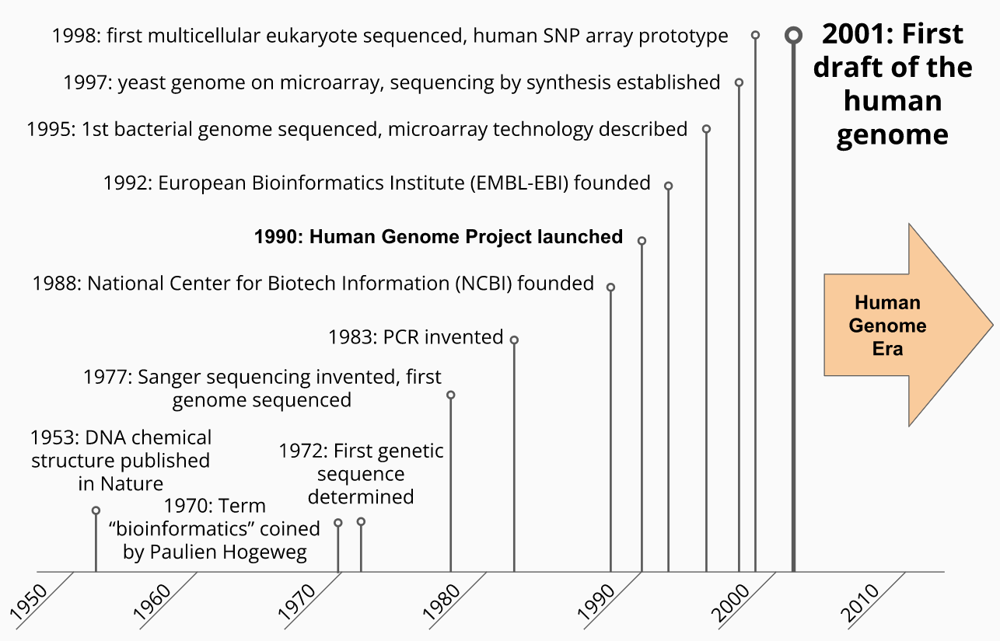

# Data in Biology {#data-bio}

## A Brief History of Data in Molecular Biology

Molecular biology became a data science in 1953 when the structure of DNA was
determined. Prior to this advance, biochemical assays of biological systems
could make general statements about the characteristics and composition of
biological macromolecules (e.g. there are two types of nucleic acids - those
made of ribose (RNA) and deoxyribose (DNA)) and some quantitative statements
about those compositions (e.g. there are roughly equal concentrations of purines
- adenine, guanine - and pyrimidines - cytosine, thymine - in any single
chromosome). However, once it was shown that each nucleic acid molecule had a
specific (and eventually
[measurable](https://en.wikipedia.org/wiki/DNA_sequencing)) sequence, this
opened the possibility of defining the genetic signature of every living thing
on Earth which, in principle, would enable us to understand how life works from
its most basic components. A tantalizing prospect, to say the least.

It is perhaps a happy coincidence that our computational and data storage
technologies began developing around the same time these molecular biology
advances were being made. While [mechanical
computers](https://en.wikipedia.org/wiki/Difference_engine) had existed for more
than a hundred years and [arguably
longer](https://en.wikipedia.org/wiki/Mechanical_calculator), the first modern
computer, the [Atanasoff-Berry
Computer (ABC)](https://en.wikipedia.org/wiki/Atanasoff%E2%80%93Berry_computer), was
invented by John Vincent Atanasoff and Clifford Berry in 1942 at what is now
Iowa State University. Over the following decades, the speed, sophistication,
and reliability of computing machines increased exponentially, enabling ever
larger and faster computations to be performed.

The development of computational capabilities necessitated technologies that
stored information that these machines could use, both for instructions to tell
the computers what operations they should perform and data they should use to
perform them. Until the 1950s, the most commonly available [mechanical data
storage technologies](https://en.wikipedia.org/wiki/Data_storage) like
writing, [phonographic
cylinders](https://en.wikipedia.org/wiki/Phonograph_cylinder) and disks (a.k.a.
records), and [punch cards](https://en.wikipedia.org/wiki/Punched_card) were
impractical or unsuitable to create and store the amount of data needed by these
computers. A newer technology, magnetic storage, [originally proposed in 1888 by
Oberlin
Smith](https://books.google.com/books?id=zYVMAAAAYAAJ&pg=RA2-PA116#v=onepage&q&f=false)
quickly became the standard way digital computers read and stored information.

With these technological advances, the second half of the 20th century saw rapid
advances in our ability to determine and study the properties and function of
biological molecular sequences, primarily DNA and RNA (although the first
biological sequences scientists determined were proteins composed of amino acids
using methods independently invented by [Frederick
Sanger](https://www.whatisbiotechnology.org/index.php/exhibitions/sanger/insulin)
and [Pehr Edman](https://en.wikipedia.org/wiki/Pehr_Victor_Edman)).

In 1970, [Pauline Hogeweg](https://en.wikipedia.org/wiki/Paulien_Hogeweg) and
Ben Hesper defined the new discipline of *bioinformatics* as "the study of
informatic processes in biotic systems" (in fact, the original term was
[proposed in Dutch](https://www.ncbi.nlm.nih.gov/pmc/articles/PMC3068925/),
Hogeweg and Hesper's native language). This early form of bioinformatics was a
subfield of [theoretical
biology](https://en.wikipedia.org/wiki/Mathematical_and_theoretical_biology),
studied by those who recognized that biological systems, much like our computer
systems, can be viewed as information storage and processing systems themselves.

This broad definition of bioinformatics began narrowing in practice to the study
of genetic information as the amount of molecular sequence data we collected
grew. By the early 1980s, biological sequence data stored on magnetic tape were
being created and studied using new [pattern recognition
algorithms](https://en.wikipedia.org/wiki/Pattern_recognition) on computers,
which were becoming more widely available at academic and research institutions.
At the same time, the idea of determining the complete sequence of the human
genome was born, leading to the inception of the [The Human Genome
Project](https://www.genome.gov/human-genome-project) and the present modern
[post genomic era](https://en.wikipedia.org/wiki/Postgenomic_era).

## Biology as a Mature Data Science

The completion of the first draft human genome ushered in a revolution in how we
understand ourselves as humans, from our evolutionary history, our ancestry, our
traits, and our health. It provided fundamentally new and empirical tools and
approaches to human genetic and biomedical research, and the technologies and
techniques that were developed in the completion of the draft sequence formed
the foundation for genetic research in non-human systems as well.

While the focus of the human genome project was on determining the DNA sequence
of the human genome, this sequence and the technologies used to ascertain it
provide us with opportunities to learn many other properties of genomes and
biological systems by analyzing the data with different approaches. For example,
knowing the complete sequence of a genome also provides information on the
number of genes it contains, how repetitive the sequence is, and when combined
with genetic sequences of other individuals or organisms, how closely related
genes or even organisms as a whole are. Thanks to [the central
dogma](https://en.wikipedia.org/wiki/Central_dogma_of_molecular_biology), the
gene sequences also give us information about the intermediate RNA molecule and
resultant proteins encoded by a genome, creating opportunities for new, ideas,
hypotheses, experiments, and even new data-generating assays and approaches.
These advances are causing exponential growth of different types of biological
data and its volume, necessitating ever more powerful and sophisticated
computational resources and analytical methods with no signs of slowing.

The biochemical instruments used to produce these data

* precision
* accuracy
* throughput
* cost
