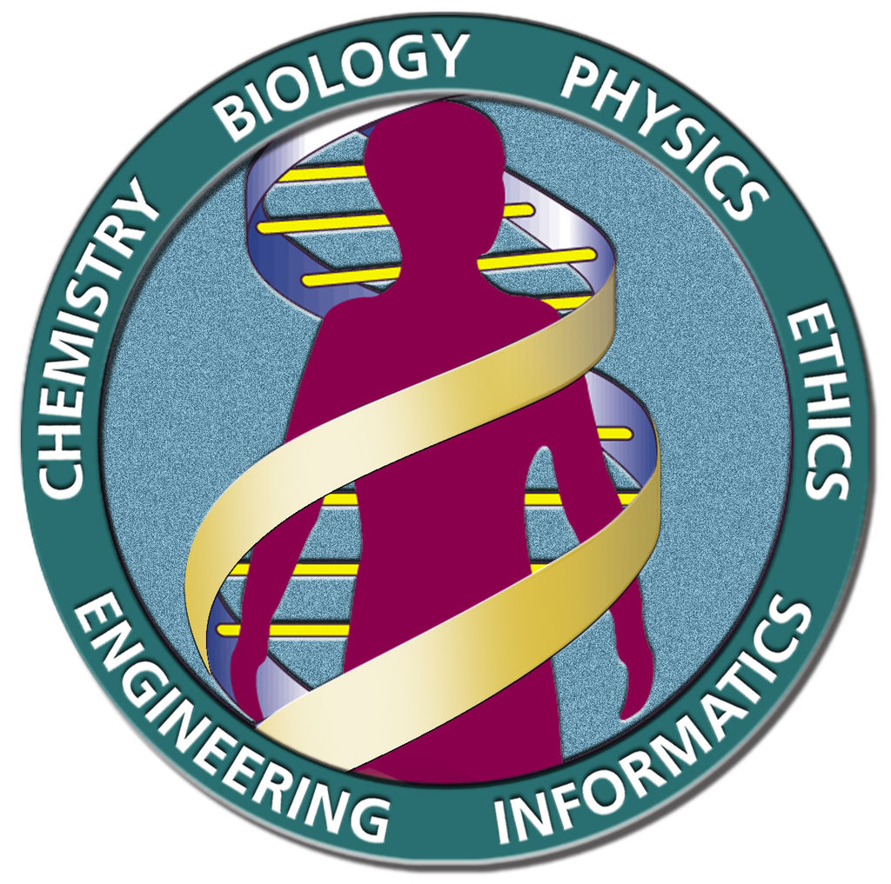
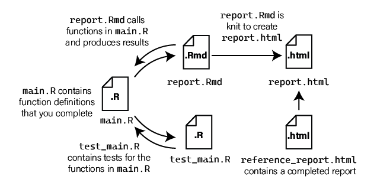
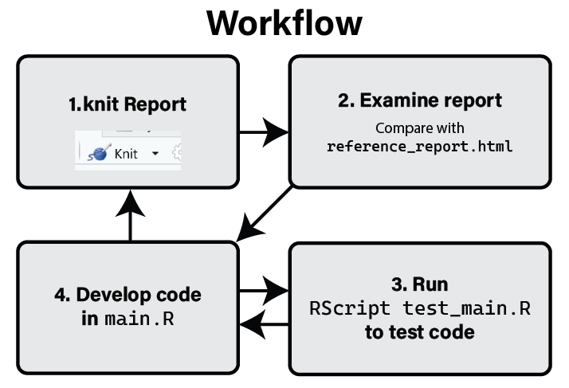

```{r setup, include=FALSE}
knitr::opts_chunk$set(echo = FALSE)
```


## Biology as Data Science {.flexbox .vcenter}

The sequencing of the human genome ushered in the "post-genome" biological
revolution

<div class="centered">
**Biology is now a data science**


</div>

## Domains of Biological Data Analysis

Modern biological data analysis requires skills and knowledge from many domains:

* molecular biology, genetics, biochemistry
* statistics, mathematics
* computer science
* programming & software engineering
* data visualization
* high performance & cloud computing

**No one person can be expert in all these areas!**

Experts create tools and techniques that we can use.

## The R Programming Language

* R is a *statistical programming language*
* [https://www.r-project.org/](https://www.r-project.org/)
* Designed to conduct statistical analyses and visualize data
* **NOT** a general purpose programming language!


## tidyverse {.flexbox .vcenter}

<div class="columns-2">


* `tidyverse` is a set of R packages first developed by [Hadley Wickham](http://hadley.nz/)
* [https://www.tidyverse.org/](https://www.tidyverse.org/)
* Transforms R into a data science language
* Adds functionality and avoids some pitfalls of base R

</div>

## Book & Course Objectives {.build .larger}

> **Learn R and its related packages to analyze biological data**

> **Communicate results of R analyses with effective visualizations and notebooks**

> **Learn how to use the RStudio development environment**

> **Write correct and reproducible code using formal testing strategies**

> **Share analyses with others using RShiny applications**

## Course Topics

* [Base R programming](../prog-basics.html)
* [Data wrangling with `tidyverse`](../data-wrangling.html)
* [RStudio](../preliminaries.html#prelim-rstudio)
* [Data visualization](../data-visualization.html)
* [Core biological data analysis packages (Bioconductor, etc)](../biology-bioinformatics.html)
* [Communicating results (R Notebooks)](../communicating-with-r.html)
* [Version control (git+github)](../preliminaries.html#prelim-git)
* [Software testing](../engineering.html#unit-testing)
* [Rshiny](../rshiny.html)

## Who This Book Is For

You are: a practicing biologist wishing to learn how to use R to analyze
biological data

We assume a basic working knowledge of:

* genetics
* genomics
* molecular biology
* biochemistry
* statistics

We endeavor to explain required background whenever possible to relax these
assumptions

## Sources and References | R Materials

* [Hands-On Programming with R](https://rstudio-education.github.io/hopr/), by Garrett Grolemund
* [R for Data Science](https://r4ds.had.co.nz/), by Hadley Wickam, Garrett Grolemund, et al
* [Advanced R](https://adv-r.hadley.nz/), by Hadley Wickam
* [STAT 545 - Data wrangling, exploration, and analysis with R](https://stat545.com/index.html)
* [What They Forgot to Teach You About R](https://rstats.wtf/index.html)
* [Reproducible Analysis with R](https://nceas.github.io/sasap-training/materials/reproducible_research_in_r_fairbanks/), by State of Alaska's Salmon and People Project, NCEAS
* [Data Science for Psychologists](https://bookdown.org/hneth/ds4psy/), by Hansjörg Neth

## Sources and References | Data visualization

* [How Charts Lie: Getting Smarter about Visual Information](https://wwnorton.com/books/9781324001560/about-the-book), by Alberto Cairo
* [The Functional Art - An Introduction to Information Graphics and Visualization](http://www.thefunctionalart.com/), by Alberto Cairo
* [The Truthful Art - Data, Charts, and Maps for Communication](http://www.thefunctionalart.com/p/the-truthful-art-book.html), by Alberto Cairo

## Course Structure

* Weekly lectures
* 7 assignments, roughly one per week
* [Final project: RShiny application](../final-project.html) combining the techniques you learned in the assignments
* Grading:

  + Assignments 5% each (35% total)
  + Final project 60%
  + Class attendance/participation 5%

* Will have zoom on for lectures, but recordings will not be made available

## Assignments

* Detailed instructions are in the book

  - [Getting started](../starting-an-assignment.html)
  - [Assignment Overview](../assignment-overview.html)

* Assignments hosted on GitHub
* We will use GitHub Classroom to make them available

## Assignment Structure

* Each assignment has similar format and workflow, files:

  ```
  ├── reference_report.html
  ├── main.R
  ├── README.md
  ├── report.Rmd
  └── test_main.R
  ```

## Assignment Repository Structure



## Assignment Workflow


