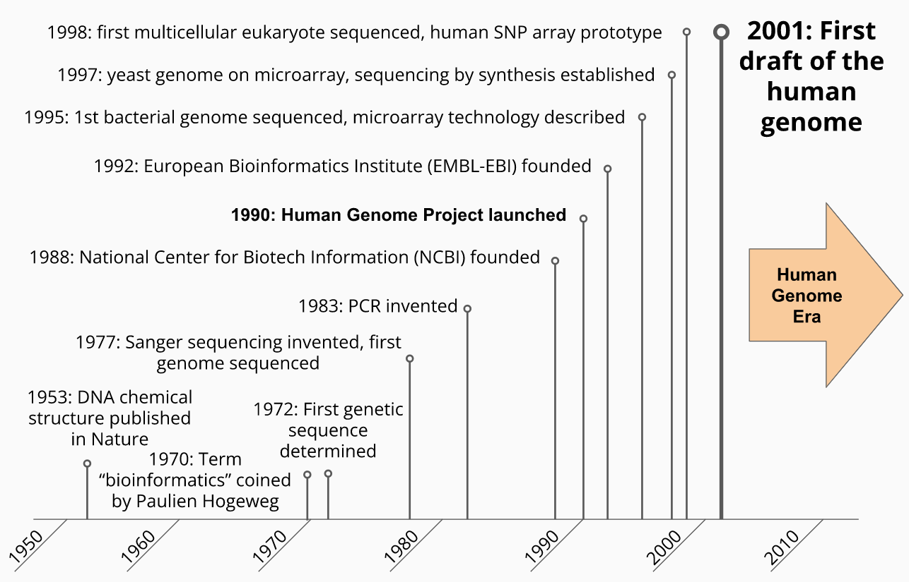
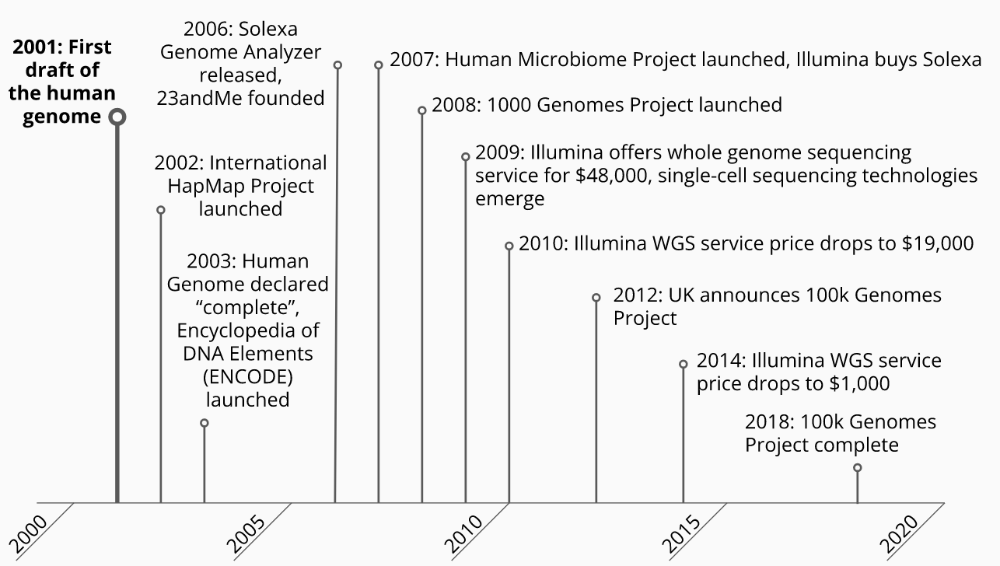
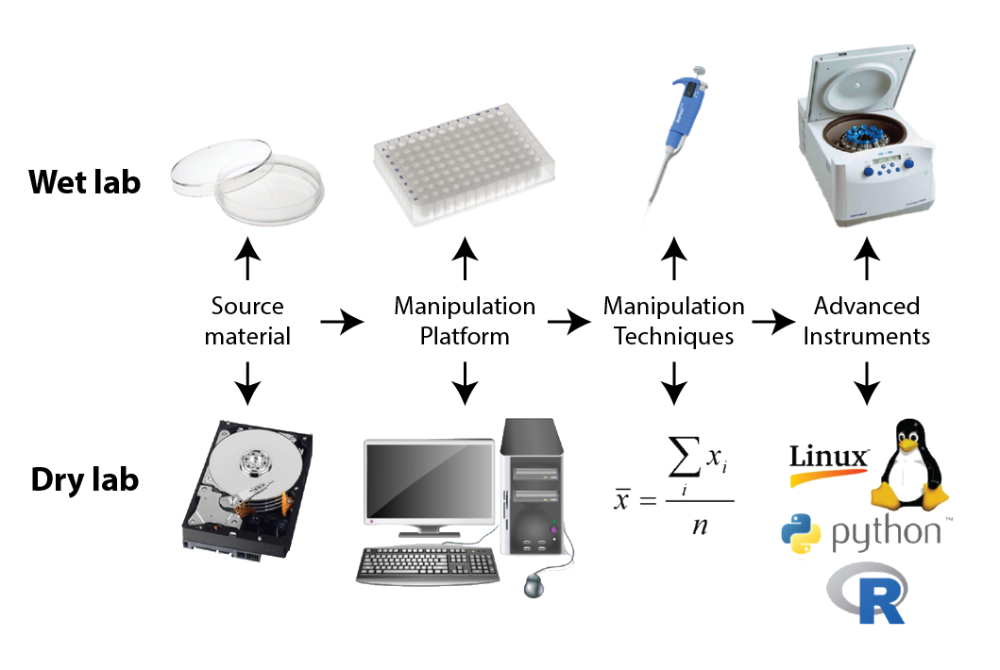

```{r setup, include=FALSE}
knitr::opts_chunk$set(echo = FALSE)
```

## Introduction

* Molecular biology became a data science in 1953 with the determination of the DNA chemical structure
* Digital computer technology and data storage technologies developed around the same time
* Amino acid first biological sequences determined, followed by nucleotides
* *bioinformatics* defined by Pauline Hogeweg and Ben Hesper in 1970:

  > "the study of informatic processes in biotic systems"

* Expanded in early 1980s as the volume of sequence data grew
* Human genome project was formally launched in 1990

## Biological Data Timeline



## Biological Data Timeline | Human Genome Era



## The Biologist's Tools


