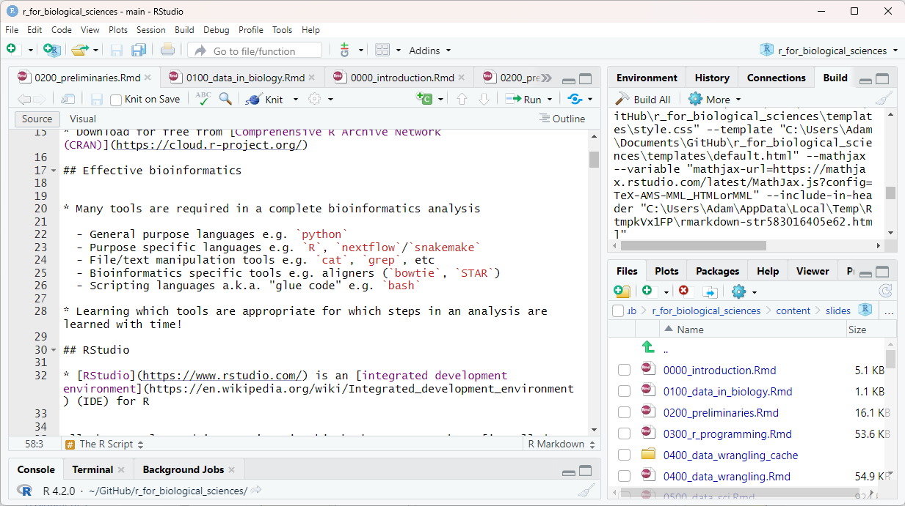

## The R Language

* R is a free, open source programming language and computing environment
* R is a *statistical* programming language
  - **not** a general purpose programming language (like python)!
* Designed for data manipulation, analysis, and visualization  
* Download for free from [Comprehensive R Archive Network (CRAN)](https://cloud.r-project.org/)

## Effective bioinformatics


* Many tools are required in a complete bioinformatics analysis

  - General purpose languages e.g. `python`
  - Purpose specific languages e.g. `R`, `nextflow`/`snakemake`
  - File/text manipulation tools e.g. `cat`, `grep`, etc
  - Bioinformatics specific tools e.g. aligners (`bowtie`, `STAR`)
  - Scripting languages a.k.a. "glue code" e.g. `bash`

* Learning which tools are appropriate for which steps in an analysis are learned with time!

## RStudio

* [RStudio](https://www.rstudio.com/) is an [integrated development environment](https://en.wikipedia.org/wiki/Integrated_development_environment) (IDE) for R

<div class="centered">

</div>

## RStudio Basic Interface

<div class="centered">

</div>

## Turn Off Environment Restore in RStudio!

* By default, RStudio preserves your R environment when you shut it down and
  restores it when you start it again.
* **This is very bad practice!** Turn it off right away!
* Open the Tools > Global Options... menu and:

  1. Uncheck "Restore .RData into workspace at startup"
  2. Set "Save workspace to .RData on exit:" to "Never"

## Turn Off Environment Restore!

<div class="centered">

</div>

## The R Script

* R is both a programming language and a computing environment
* A R program contains many lines of code that are executed in sequence
* A *R script* is a file that contains lines of R code
* Name your R script names to be descriptive but concise:

  - Bad: `do_it.R`
  - Better but still bad: `a_script_with_very_cool_analysis_and_plots.R`
  - Better: `analyze_gene_expression.R`

## Create a new R Script in RStudio

<div class="columns-2">


* `File -> New File -> R Script`

</div>

## The Scripting Workflow

* Common workflow:

  1. Write and save code into your R script
  2. Execute the lines of code you are working on with:
     * `Control-Enter` on Windows
     * `Command-Enter` on Mac
  3. Code will execute in Console window, where you may execute other commands
     to examine results
  4. You may inspect the variables you have defined in the Environment pane
  5. Make adjustments to your R script if needed
  6. Go to step 1


## Example script


```{r}
# stores the result of 1+1 into a variable named 'a'
a <- 1+1
```

## The Scripting Workflow

<div class="center">


</div>

# git + github

## git motivation

* Code you write changes over time
* We would like to maintain previous versions of code, in case new changes break the code
* Simple approach: make copies of scripts and rename them:

  - Original script: `my_R_script.R`
  - New analysis is required: `my_R_script_v2.R`
  - Found bug in new analysis: `my_R_script_v2_BAD.R`
  - Script with fixed bug: `my_R_script_v2_final.R`
  - Changes after manuscript revision: `my_R_script_v2_final_revision.R`
  - And so on...

## A note on bugs...

* A *bug* is a piece of code that produces an incorrect or undesirable result
* **Bugs are normal!** You're not a bad programmer if your code has bugs.
* There are two types of bugs:

  1. Syntax bugs: bugs due to incorrect language usage, which R will tell you
     about and can (usually) be easily identified and fixed
  2. Logic bugs: the code you write is syntactically correct, but does something
     other than what you intend

## Enter `git`

* We want to preserve old versions of code
* We **don't** want to clutter our directories with out dated files
* [git](https://git-scm.com/) is a free, open source [version control](https://en.wikipedia.org/wiki/Version_control) software program.
* Version control software is used to track and record changes to code over time
* Many developers may work on the same software project concurrently from different parts of the world
* Can be used on the command line, or with [graphical user interface applications](https://git-scm.com/downloads/guis) for popular operating systems.

## `git` concepts

* **repository (or repo)**: a collection of files in a directory that you
  have asked git to track (run ``git init`` in a new directory)
* Each file you wish to track must be explicitly added to the repo
* When you modify a tracked file, git will notice those differences
* Tracked changes by making a **commit**
  - A commit takes a snapshot of all the tracked files in the repo at the
  time the commit is made
  commit message that describes what was done)
* Each commit has a date and time associated with it. The files in the
  repo can be reset to exactly the state they were in at any commit,
  thus preserving all previous versions of code.

##  Basic `git` workflow

At the beginning, create new repo `git init .` or with graphical interface

1. Create/modify files
2. Add changes with `git add <filename>...`
3. Check changes with `git status`, verify changes are as intended
4. Commit changes with `git commit -m "<commit message"`
5. Go to 1

## Git hosting platforms (GitHub)

* `git` software only works on your local computer with local
repositories
* To share this code with others, and receive others' contributions, repo must be made available in a centralized location
* [github.com](https://github.com) is a free web application that hosts git repos
* Note: There is no formal relationship between git and GitHub - the only connection between GitHub and git
is that GitHub hosts git repos.

## GitHub Basics

* First you must have an account on GitHub
* Create a new repo on GitHub
* Then:

  - *If you do not already have a local git repo:* ``clone`` your GitHub repo to create a local copy connected
    to GitHub
  - *If you already have a local git repo:* Follow the instructions on the GitHub
    to connect your local repo to the GitHub as a `remote`

* Now your local repo is connected to the same repo on GitHub
* Changes you make to your local files can be sent, or ``push``ed to the repo on GitHub

## `git`+GitHub Workflow

1. Get (pull) any changes from GitHub with `git pull`
2. Create/modify files
3. Add changes with `git add <filename>...`
4. Check changes with `git status`, verify changes are as intended
5. Commit changes with `git commit -m "<commit message"`
6. Send (push) changes to GitHub with `git push`
7. Go to 1
