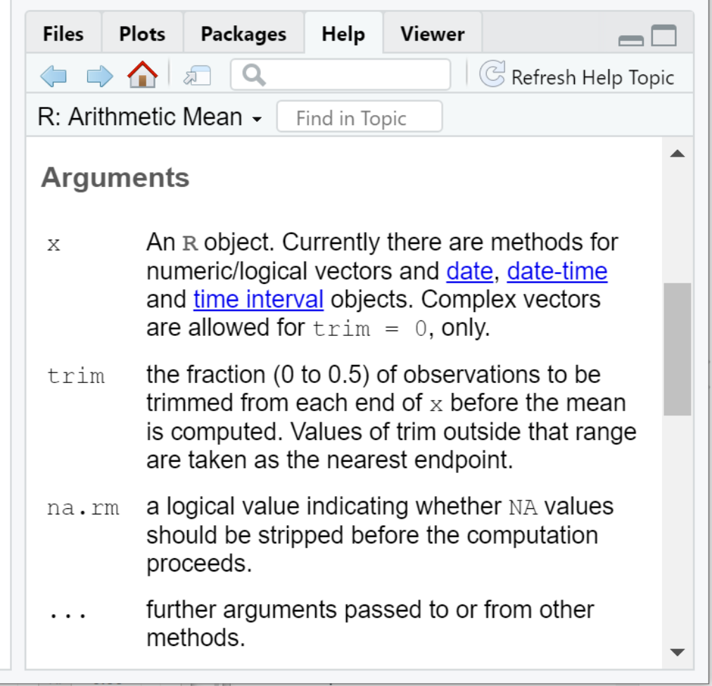

## R Syntax Basics {#prog-r-syntax}

* R (like all programming languages) is basically a fancy calculator:

  ```r
  1 + 2 # addition
  [1] 3
  3 - 2 # subtraction
  [1] 1
  4 * 2 # multiplication
  [1] 8
  4 / 2 # division
  [1] 2
  ```

* The `[1]` lines above are the output given by R when the preceding expression is run
* Any portion of a line starting with a `#` is a comment and ignored
by R

## R Arithmetic Continued

```r
1.234 + 2.345 - 3.5*4.9 # numbers can have decimals
[1] -13.571
1.234 + (2.345 - 3.5)*4.9 # expressions can contain parentheses
[1] -4.4255
2**2 # exponentiation
[1] 4
4**(1/2) # square root
[1] 2
9**(1/3) # cube root
[1] 3
```

## Reading R

* R assigns values to symbolic placeholders called *variables*
* Expressions can be assigned into a variable with a name using the `<-` operator:

  ```r
  new_var <- 1 + 2
  ```

* Variables values are used in later execution:

  ```r
  new_var - 2
  [1] 1
  another_var <- new_var * 4
  ```

## Note: "`<-`" vs "`=`"

* The correct way to assign a value to a variable in R is with the `<-` syntax
* Many other programming languages which use `=`
* `=` assignment syntax does work in R:

  ```r
  new_var = 2 # works, but is not common convention!
  ```

* BUT this is considered bad practice and may cause confusion later
* You should always use the `<-` syntax when assigning values to variables!

## Note: `.` has no special meaning in R

* the period `.` does not have a special meaning like it does in many other
languages like python, C, javascript, etc.
* e.g. `new.var` is a valid variable name just like `new_var`
* It is good practice to avoid using `.` characters in your variable names to reduce the
chances of conflicts and confusion

## Basic Types of Values

* The *type* of a variable refers to the kind of value it holds, e.g.
  - Number
  - Characters (string)
  - Logical (`TRUE`/`FALSE`)

## Basic Types: Numeric

* A single number e.g. `1.0` or `1e-5` for $10^{-5}$
* No distinction between fractional (e.g. `1.123`) and integer numbers (`1`)
* `TRUE`/`FALSE` - *Logical* or *boolean* values
  - `TRUE` stored as the number `1`
  - `FALSE` stored as the number `0`
  - Non-zero numbers considered "true" in R, zero considered "false"
* `Inf`/`-Inf` - *Infinity* - special type that indicates division by 0
* `NaN` - "impossible" value for the expression `0/0`
* **complex numbers** - R can store complex numbers using the `complex` function

## `NA`, `NaN`, and `Inf`

* R cannot perform computations on `NA`, `NaN`, or `Inf` values
* These values have an 'infectious' quality to them
* When mixed in with other values, the result of the computation reverts to the first
of these values encountered:

  ```r
  # this how to create a vector of 4 values in R
  x <- c(1,2,3,NA)
  mean(x) # compute the mean of values that includes NA
  [1] NA
  mean(x,na.rm=TRUE) # remove NA values prior to computing mean
  [1] 2
  mean(c(1,2,3,NaN))
  [1] NaN
  mean(c(NA,NaN,1))
  [1] NA
  ```

## Missingness

* R can handle missing values
* `NA` - a special value that indicates a value is missing
* `NULL`. Similar to `NA`, `NULL` indicates that a vector, rather than a value, is missing
* More on vectors later

## Other Types

* **factors** - Factors are a complex type used in statistical models and are
covered in greater detail later
* **character data** - `"value"`. R can store character data in the form of
strings. Note R does not interpret string values by default, so `"1"` and `1`
are distinct.
* **dates and times** - basic type to store dates and times (together
termed a *datetime*, which includes both components
  - Internally, R stores datetimes as the fractional number of days since
    January 1, 1970, using negative numbers for earlier dates.

# Data Structures {#prog-struct}

## Vectors

* Data structures in R (and other languages) are ways of storing and organizing
more than one value together
* Most basic data structure in R is a one dimensional sequence of values called a
[vector](https://www.rdocumentation.org/packages/base/versions/3.6.2/topics/vector):

  ```r
  # the c() function creates a vector
  x <- c(1,2,3)
  [1] 1 2 3
  ```

* The vector in R has a special property that *all values contained in the vector
must have the same type*

## Vectors continued

* When constructing a vector, R will [coerce
  values](https://rstudio-education.github.io/hopr/r-objects.html#coercion) to
  the most general type if it encounters values of different types:

  ```r
  c(1,2,"3")
  [1] "1" "2" "3"
  c(1,2,TRUE,FALSE)
  [1] 1 2 1 0
  c(1,2,NA) # note missing values stay missing
  [1] 1 2 NA
  c("1",2,NA,NaN) # NA stays, NaN is cast to a character type
  [1] "1" "2" NA "NaN"
  ```

## Vectors continued

* vectors also have a length, which is defined as the number of elements in the vector

  ```r
  x <- c(1,2,3)
  length(x)
  [1] 3
  ```

## Vector operations

* R is much more efficient at operating on vectors than individual elements
  separately
* With numeric vectors, you can perform arithmetic operations on vectors of
compatible size just as easily as individual values

  ```r
  c(1,2) + c(3,4)
  [1] 4 6
  c(1,2) * c(3,4)
  [1] 3 8
  ```

## Vector arithmetic warning!

* R multiplies vectors of different length in a strange way:

  ```r
  c(1,2) * c(3,4,5) # lengths 2 and 3 not evenly divisible!
  [1] 3 8 5
  Warning message:
  In c(1, 2) * c(3, 4, 5) :
    longer object length is not a multiple of shorter object length
  ```

* Cycles through values in each vector until all values are used
* Above, `c(1,2) * c(3,4,5)`  yields: $1*3$, $2*4$, $1*5$, **weird!**
* When the vector lengths *are* evenly divisible, no warning raised:

  ```r
  c(1,2) * c(3,4,5,6) # yields: 1*3 2*4 1*5 2*6
  [1] 3 8 5 12
  ```

## Factors

* Factors are objects that R uses to handle categorical variables
  - i.e. variables that can take one of a distinct set of values for each sample
* We create a factor from a vector of character strings using the [`factor()`
  function](https://www.rdocumentation.org/packages/base/versions/3.6.2/topics/factor)

  ```r
  case_status <- factor(
    c('Disease','Disease','Disease',
      'Control','Control','Control'
    )
  )
  case_status
  [1] Disease Disease Disease Control Control Control
  Levels: Control Disease
  ```

## Factors are numeric vectors

* The distinct values in the factor are called *levels*
* Internally, a factor is stored as a vector of integers where each level has
  the same value:

  ```r
  as.numeric(case_status)
  [1] 2 2 2 1 1 1
  str(case_status)
   Factor w/ 2 levels "Control","Disease": 2 2 2 1 1 1
  ```

* By default, R assigns integers to levels in alphanumeric order
  - e.g. `"Control"` is set to 1, `"Disease"` is set to 2

## Changing Factor Level Numbers

* You can change which levels are assigned to which number
* The integers assigned to each level can be specified explicitly when creating
  the factor:

  ```r
  case_status <- factor(
    c('Disease','Disease','Disease','Control','Control','Control'),
    levels=c('Disease','Control')
  )
  case_status
  [1] Disease Disease Disease Control Control Control
  Levels: Control Disease
  str(case_status)
   Factor w/ 2 levels "Disease","Control": 1 1 1 2 2 2
  ```

## Character data are loaded as factors

* The base R functions `read.csv`/`read.table` load columns with character
  values as factors by default
* You may turn this off with `stringsAsFactors=FALSE` to `read.csv()`
* You may change the level mapping of an existing factor by *releveling* it
  by passing a factor into the `factor()` function and specifying new levels

  ```r
  str(case_status)
   Factor w/ 2 levels "Disease","Control": 1 1 1 2 2 2
  factor(case_status, levels=c("Control","Disease"))
   Factor w/ 2 levels "Control","Disease": 2 2 2 1 1 1
  ```

## Matrices

* A matrix in R is simply the 2 dimensional version of a vector
* i.e. a rectangle of values that all have the same type, e.g. number, character,
  logical, etc.
* Constructed using the vector notation described above and specifying the
  number of rows and columns the matrix should have
* Instead of having a length like a vector, it has $m \times n$ dimensions

## Matrix construction example

```r
# create a matrix with two rows and three columns containing integers
A <- matrix(c(1,2,3,4,5,6)
       nrow = 2, ncol = 3, byrow=1
      )
A
[,1] [,2] [,3]
[1,]    1    2    3
[2,]    4    5    6
dim(A) # prints out the dimensions of the matrix, rows first
[1] 2 3
```

## Transposing matrices

* Matrices can be transposed from $m \times n$ to be $n \times m$ using the
  `t()` function

  ```r
  A
  [,1] [,2] [,3]
  [1,]    1    2    3
  [2,]    4    5    6
  t(A)
  [,1] [,2]
  [1,]    1    4
  [2,]    2    5
  [3,]    3    6
  dim(t(A))
  [1] 3 2
  ```

## Lists and data frames

* Vectors and matrices have the special property that all items must be of the
  same type
* Lists and data frames are data structures that do not have this requirement
* Lists and data frames are both one dimensional sequences of values

## Lists

* Lists can be created using the `list()` function:

  ```r
  my_list <- list(
    c(1,2,3),
    c("A","B","C","D")
  )
  my_list
  [[1]]
  [1] 1 2 3

  [[2]]
  [1] "A" "B" "C" "D"
  my_list[[1]] # access the first item of the list
  [1] 1 2 3
  my_list[[2]] # access the second item of the list
  [1] "A" "B" "C" "D"
  ```

## List entries can have names

* Lists can also be defined and indexed by name:

  ```r
  my_list <- list(
    numbers=c(1,2,3),
    categories=c("A","B","C","D")
  )
  my_list
  $numbers
  [1] 1 2 3

  $categories
  [1] "A" "B" "C" "D"
  my_list$numbers # access the first item of the list
  [1] 1 2 3
  my_list$categories # access the second item of the list
  [1] "A" "B" "C" "D"
  ```

## Data frames

* Lists and data frames are the same underlying data structure
* The elements of a data frame must all have the same length
* The elements of a list do not need to have all the same length

## Creating data frames

* You may create a data frame with `data.frame()`:

  ```r
  my_df <- data.frame( # recall '.' has no special meaning in R
    numbers=c(1,2,3),
    categories=c("A","B","C","D")
  )
  Error in data.frame(c(1, 2, 3), c("A", "B", "C", "D")) :
    arguments imply differing number of rows: 3, 4
  my_df <- data.frame(
    numbers=c(1,2,3),
    categories=c("A","B","C")
  )
  my_df
    numbers categories
  1       1          A
  2       2          B
  3       3          C
  ```

## Accessing data frame elements

* Can access data frame elements by their name:

  ```r
  my_df <- data.frame( # recall '.' has no special meaning in R
    numbers=c(1,2,3),
    categories=c("A","B","C","D")
  )
  my_df$numbers
  [1] 1 2 3
  my_df[1] # numeric indexing returns a subset data frame
    numbers
  1       1
  2       2
  3       3
  ```

## Accessing data frame elements cont'd

  ```r
  my_df[1]$numbers
  [1] 1 2 3
  # this syntax is [<row>,<column>], and if either is omitted return all
  my_df[,1] # return all rows of the first column as a vector
  [1] 1 2 3
  my_df$categories
  [1] "A" "B" "C"
  ```

## Accessing data frame elements cont'd

* You may access specific elements of a data frame in a number of ways:

  ```r
  my_df$numbers[1] # extract the first value of the numbers column
  [1] 1
  my_df[1,1] # same as above, recall the [<row>,<column>] syntax
  [1] 1
  my_df$categories[3] # extract 3rd value of the categories column
  [1] "C"
  ```

# Logical Tests and Comparators

## Logical Tests and Comparators

* R recognizes logical values as a distinct type
* R provides all the conventional infix logical operators:

  ```r
  1 == 1 # equality
  [1] TRUE
  1 != 1 # inequality
  [1] FALSE
  1 < 2 # less than
  [1] TRUE
  1 > 2 # greater than
  [1] FALSE
  1 <= 2 # less than or equal to
  [1] TRUE
  1 >= 2 # greater than or equal to
  ```

## Logical Tests on Vectors

* Logical tests are applied to each element of vectors:

  <pre class="codeblock">
  x <- c(1,2,3)
  x == 2
  [1] FALSE TRUE FALSE
  x < 1
  [1] FALSE FALSE FALSE
  c(1,2) == c(1,3)
  [1] TRUE FALSE
  c(1,2) != c(1,3)
  [1] FALSE TRUE
  c(1,2) == c(1,2,3)
  [1] TRUE TRUE FALSE
  Warning message:
  In c(1, 2, 3) == c(1, 2) :
    longer object length is not a multiple of shorter object length
  </pre>

## Testing the type of a variable

* R provides many functions of the form `is.X` where `X` is some type or condition

  ```r
  is.numeric(1) # is the argument numeric?
  [1] TRUE
  is.character(1) # is the argument a string?
  [1] FALSE
  is.character("ABC")
  [1] TRUE
  is.numeric(c(1,2,3)) # recall a vector has exactly one type
  [1] TRUE
  is.numeric(c(1,2,"3"))
  [1] FALSE
  is.na(c(1,2,NA))
  [1] FALSE FALSE TRUE
  ```

# Functions

## Functions Intro

* A *function* is a symbolic representation of code
* R provides [very large number of functions](https://rdrr.io/r/) for common operations
* You can (will, and should) write your own functions
* Functions are useful for:
  1. Making your code more concise and readable
  2. Allow you to avoid writing the same code over and over (i.e. reuse it)
  3. Allow you to systematically test pieces of your code
  4. Allow you to share your code easily with others
  5. Program using a functional programming style

## Functional Programming

* R is a *functional programming language*
* Emphasizes using functions
* Advantages of programs written in functional programming languages
  * Concise
  * Predictable
  * Provably correct
  * Performant (e.g. easily parallelizable)

## Function Definitions

* Functions usually accept and execute on different inputs
* e.g. the `mean` function wouldn't be very useful if it didn't accept a value

  ```r
  mean(c(1,2,3))
  [1] 2
  ```
* The function must *accept* or allow you to *pass it arguments*

  ```r
  # a basic function signature
  function_name(arg1, arg2) # function accepts 2 arguments
  ```

## Function Terminology

```r
# a basic function signature
function_name(arg1, arg2) # function accepts 2 arguments
```

* `arg1` and `arg2` are *arguments* indicating this function accepts two arguments
* `function_name` is the name of the function
* The pattern of arguments it accepts is called the function's *signature.*
* Every function has at least one signature
* `arg1` and `arg2` are *positional* arguments (i.e. order matters)

## Most Functions Require Passed Arguments

* Functions will raise an error if they don't receive arguments they expect:

  ```r
  mean() # compute the arithmetic mean, but of what?
  Error in mean.default() : argument "x" is missing, with no default
  ```
* The specific arguments a function accepts is called the function *signature*
* You can find details about a function signatures using the documentation, as described next

## R Function Documentation

{width=100%}

## R Function Signatures

* These are the function signatures for the `mean()` function:

  ```r
  mean(x, ...)

  ## Default S3 method:
  mean(x, trim = 0, na.rm = FALSE, ...)
  ```

* This function has two signatures
* The names of the arguments in the signature (e.g. `x`) are the variable names
  the function uses in its code to refer to the parameters you pass
* The named arguments in a function signature are called *parameters* or
  *formal arguments*

## R Function Signatures Continued

```r
mean(x, ...)

## Default S3 method:
mean(x, trim = 0, na.rm = FALSE, ...)
```

* The second signature of the `mean` function introduces two new types of syntax:
  * **Default argument values** - e.g. `trim = 0` named arguments that have a
    default value if not provided explicitly.
  * **Variable arguments** - `...`. This means the `mean` function can accept
    arguments that are not explicitly listed in the signature. This syntax is
    called [dynamic dots](https://rlang.r-lib.org/reference/dyn-dots.html).

## R Function Arguments

{width=60%}


## Specifying Arguments By Name

* All function arguments can be specified by name

  ```r
  # generate 100 normally distributed samples with mean 0 and
  # standard deviation 1
  my_vals <- rnorm(100,mean=0,sd=1)
  mean(my_vals)
  [1] -0.05826857
  mean(x=my_vals)
  [1] -0.05826857
  ```

* To borrow from [the Zen of Python](https://www.python.org/dev/peps/pep-0020/#id2):

  | "Explicit is better than implicit."

* Passing arguments with their names can help avoid bugs!

## Beware of `...` dynamic dots

* **The `...` argument catchall can be very dangerous.**
* It allows you to provide arguments to a function that have no meaning...
* and R will not raise an error:

  ```r
  # generates 100 normally distributed samples with mean 0 and
  # standard deviation 1
  my_vals <- rnorm(100,mean=0,sd=1)
  mean(x=my_vals,tirm=0.1)
  [1] -0.05826857
  ```

* Did you spot the mistake?

## Beware of `...` dynamic dots

```r
# generates 100 normally distributed samples with mean 0 and
# standard deviation 1
my_vals <- rnorm(100,mean=0,sd=1)
mean(x=my_vals,tirm=0.1)
[1] -0.05826857
mean(x=my_vals,trim=0.1)
[1]-0.02139839
```

## DRY: Don't Repeat Yourself

* [Don't Repeat Yourself](https://en.wikipedia.org/wiki/Don%27t_repeat_yourself)
  (DRY) is a principle in software engineering
* You may find yourself writing the same code multiple times
* DRY == Encapsulate common code into your own functions

  ```r
  # 100 normally distributed samples with mean 20 and standard deviation 10
  my_vals <- rnorm(100,mean=20,sd=10)
  # standardize
  my_vals_norm <- (my_vals - mean(my_vals))/sd(my_vals)
  mean(my_vals_norm)
  [1] 0
  sd(my_vals_norm)
  [1] 1
  ```

* If find yourself copying and pasting code from one part of your script to another,
  you are repeating yourself!

## Writing your own functions

* R allows you to define your own functions
* Example that adds two arguments together:

  ```r
  sum_args <- function(arg1, arg2) {
    # code that does something with arg1, arg2, etc
    some_result <- arg1 + arg2
    return(some_result) # explicit return
  }

  sum_args <- function(arg1, arg2) {
    # code that does something with arg1, arg2, etc
    arg1 + arg2 # implicit return is last expression in function
  }
  ```

* You choose function name, arguments, implementation

## Custom function definition example

* Example for `standardize()` function:

  ```r
  standardize <- function(x) {
    res <- (x - mean(x))/sd(x)
    return(res)
  }

  my_vals <- rnorm(100,mean=20,sd=10)
  my_vals_std <- standardize(my_vals)
  c(mean(my_vals_std), sd(my_vals_std))
  [1] 0 1

  my_other_vals <- rnorm(100,mean=40,sd=5)
  my_other_vals_std <- standardize(my_other_vals)
  c(mean(my_other_vals_std), sd(my_other_vals_std))
  [1] 0 1
  ```

## A Note On Returning Values

* The `return()` function is not strictly necessary in R

  ```r
  standardize <- function(x) {
    res <- (x - mean(x))/sd(x)
    return(res)
  }
  ```

* The result of the last line of code executed in the body of a function is
  returned by default
* However, to again to borrow from [the Zen of Python](https://www.python.org/dev/peps/pep-0020/#id2):

  > "Explicit is better than implicit."

* Being explicit about what a function returns by using the `return()` function
  will make your code less error prone and easier to understand

## Scope

* In programming, every variable you define has a *scope*
* A variable's scope defines which parts of the code have access to that variable
* A variable with *universal* or *top-level scope* can be accessed anywhere in a
  program
* Variables defined *inside* functions can only be accessed from within that
  function

## Scope continued

```r
x <- 3
multiply_x_by_two <- function() {
  # x is defined outside the function
  # but is inside this function's scope
  y <- x*2
  return(y)
}
```

* `x` and `multiply_x_by_two` have universal scope
* `y` scope is limited to within the `multiply_x_by_two` function

## Scope continued

* The `multiply_x_by_two` function accesses `x` from the *outer scope*

  ```r
  x <- 3
  multiply_x_by_two <- function() {
    # x is defined outside the function
    # but is inside this function's scope
    y <- x*2
    return(y)
  }
  ```
* In general, **accessing variables within functions from outside the function's scope is very
bad practice!**

## Scope continued

* Functions should be as self contained as possible, any values they need should be passed as parameters
* This is better:

  ```r
  x <- 3
  multiply_by_two <- function(x) {
    # x is now bound to the formal argument to the function
    # not x in the outer scope
    y <- x*2
    y
  }
  ```

##  Iteration

* Iteration refers to stepping sequentially through a set or collection of
  objects
* In non-functional languages like python, C, etc. there are particular *control
  structures* that implement iteration, commonly called *loops*
* E.g. `for` and `while` loops in python/Java/C
* R has these features, but is designed to iterate in a *functional* way
* Iteration in R should be done in two ways:
  - vectorized operations
  - functional programming with `apply()`

## Warning about loops in R

* Note that R does have `for` and `while` loop support in the language
* However, these loop structures can have poor performance
* Preference should generally be given to the functional style of iteration

  [How To Avoid For Loops in R](https://www.r-bloggers.com/2018/09/how-to-avoid-for-loop-in-r/)

* If you really, really want to learn how to use for loops in R, read this, but
  don't say I didn't warn you when your code slows to a crawl for unknown reasons:

  [R for Data Science - for loops](https://r4ds.had.co.nz/iteration.html#for-loops)

## Vectorized operations

* R knows how to perform many operations on vectors and matrices as well as
  individual values

  ```r
  x <- c(1,2,3,4,5)
  x + 3 # add 3 to every element of vector x
  [1] 4 5 6 7 8
  ```

* Equivalent python:

  ```python
  x = [1, 2, 3, 4, 5]
  # list comprehension
  new_x = [x_i+3 for x_i in x]
  # for loop
  new_x = []
  for x_i in x:
    new_x.append(x_i+3)
  ```

## Vectorized operations on matrices

* Matrices also support element-wise operations

  ```r
  x_mat <- matrix(c(1,2,3,4,5,6),nrow=2,ncol=3)
  x_mat + 3 # add 3 to every element of matrix x_mat
  [,1] [,2] [,3]
  [1,]    4    6    8
  [2,]    5    7    9
  # the * operator always means element-wise
  x_mat * x_mat
       [,1] [,2] [,3]
  [1,]    1    9   25
  [2,]    4   16   36
  ```

## Linear algebra operations

* R also has syntax for vector-vector, matrix-vector, and matrix-matrix
  operations

  ```r
  # the %*% operator stands for matrix multiplication
  x_mat %*% c(1,2,3) # [ 2x3 ] * [ 3 ]
       [,1]
  [1,]   22
  [2,]   28
  # recall t() is the transpose function, making [ 2x3 ] * [ 3x2 ]
  x_mat %*% t(x_mat) # dot product
       [,1] [,2]
  [1,]   35   44
  [2,]   44   56
  ```

* R is optimized for vectorized computation, if you can cast your iteration into
  a vector or matrix multiplication, it is a good idea to do so.

## Functional programming

* R is a functional programming language, designed around the use of functions
* Every function can be passed as a variable just like those bound to values
* This means functions can be passed to other functions

## Mathematical example

* Consider a general formulation of vector transformation:

$$
\bar{\mathbf{x}} = \frac{\mathbf{x} - t_r(\mathbf{x})}{s(\mathbf{x})}
$$

* $\mathbf{x}$ is a vector of real numbers
* $t_r(\mathbf{x})$ is a function that takes $\mathbf{x}$ and returns a scalar
  (e.g. a central tendency like an arithmetic mean)
* $s(\mathbf{x})$ is a function that takes $\mathbf{x}$ and computes a scalar scaling factor
* $\bar{\mathbf{x}}$ is defined as a vector of the same length where each value
  has had some average

## Mathematical example continued

$$
\bar{\mathbf{x}} = \frac{\mathbf{x} - t_r(\mathbf{x})}{s(\mathbf{x})}
$$

* There are many different ways to define the central value $t_r(\mathbf{x})$ of
  a set of numbers:

  - arithmetic mean, [geometric mean](https://en.wikipedia.org/wiki/Geometric_mean),
    median, mode, [and many more](https://en.wikipedia.org/wiki/Mean#Other_means)

* Similarly for scaling strategies $s(\mathbf{x})$:

  - standard deviation, rescaling factor (e.g. set data range to be between -1 and 1),
    scaling to unit length (all values sum to 1), [and others](https://en.wikipedia.org/wiki/Feature_scaling)

## Passing functions as functions

* Consider our standardization function from earlier:

  ```r
  standardize <- function(x) {
    res <- (x - mean(x))/sd(x)
    return(res)
  }
  ```

* We have hard coded `mean()` and `sd()` as our central tendency and scale functions
* We can pass these functions as parameters instead:

  ```r
  # note R already has a built in function named "transform"
  my_transform <- function(x, t_r, s) {
    return((x - t_r(x))/s(x))
  }
  ```

## Passing functions as functions

* With the `my_transform` function:

  ```r
  # note R already has a built in function named "transform"
  my_transform <- function(x, t_r, s) {
    return((x - t_r(x))/s(x))
  }
  ```

* We can perform [Z-score normalization](https://en.wikipedia.org/wiki/Standard_score)
  by passing `mean` and `sd` as `t_r` and `s`, respectively:

  ```r
  x <- rnorm(100,mean=20,sd=10)
  x_zscore <- my_transform(x, mean, sd) # functions passed as arguments
  mean(x_zscore)
  [1] 0
  sd(x_zscore)
  [1] 1
  ```

## Generalized Transformation Function

* Can use any functions for `t_r` and `s` so long as they accept a vector of
  numbers as first argument:

  ```r
  x <- rnorm(100,mean=20,sd=10)
  x_transform <- my_transform(x, median, sum)
  median(x_transform)
  [1] 0
  # this quantity does not have an a priori known value
  # (or meaning for that matter, it's just an example)
  sum(x_transform)
  [1] 0.013
  ```

## Custom Transformations

* We can also write our own functions and pass them to `my_transform`
* The following scales the values of `x` to have a range of $[0,1]$:

  ```r
  data_range <- function(x) {
    return(max(x) - min(x))
  }
  # my_transform computes: (x - min(x))/(max(x) - min(x))
  x_rescaled <- my_transform(x, min, data_range)
  min(x_rescaled)
  [1] 0
  max(x_rescaled)
  [1] 1
  ```

## `apply()` and friends

* Passing functions as arguments allows us to iterate over collections
* There are three `apply()` related functions you should use:
  - `lapply(X, FUN)` - for when you want a list returned
  - `vapply(X, FUN, FUN.VALUE)` - for when you want a vector returned
  - `apply(X, FUN, MARGIN)` -  for when `X` is 2 dimensional (e.g. a matrix)
* Note:
  - `sapply()` is also available
  - this function automatically `s`implifies the result, i.e. it "guesses" what
    type of output you want
  - Can make your code unpredictable!
  - Recommend against using `sapply()`!

## `vapply()` for vectors

* The `vapply()` function is used for this, with the following signature:

  ```r
  vapply(X, FUN, FUN.VALUE, ...)
  ```

* `X` is one-dimensional collection of items (i.e. a list or vector)
* `FUN` is the name of a function that can accept any of the items in the list
* `FUN.VALUE` is an example value to indicate the type of the returned vector
  (recall all items in a vector must have the same type)
* `vapply()` returns a new vector of type `typeof(FUN.VALUE)` the same length as
  `X` where each item has had the function `FUN` applied to it

## `vapply()` example

* Consider the vectorized addition from above:

  ```r
  x <- c(1,2,3,4,5)
  x + 3
  [1] 4 5 6 7 8
  ```

* We can do the equivalent operation with `vapply`

  ```r
  x <- c(1,2,3,4,5)
  add3 <- function(i) {
    i + 3
  }
  # below the 0 means we want a numeric vector back
  vapply(x, add3, 0)
  [1] 4 5 6 7 8
  ```

## Functional operations on 2 dimensions

* Recall the [Z-score transformation](https://en.wikipedia.org/wiki/Standard_score) defined earlier:

  ```r
  standardize <- function(x) {
    res <- (x - mean(x))/sd(x)
    return(res)
  }
  ```

* This function operates on a single vector
* We sometimes want to transform each row or column of a matrix separately
* The `apply()` function allows a function to be applied to either rows or columns
  of a 2 dimensional data structure like a matrix or data frame

## The `apply()` function

* This is the signature of the `apply` function, from the RStudio `help(apply)` page:

  ```r
  apply(X, MARGIN, FUN, ..., simplify = TRUE)
  ```

* `X` is a matrix or data frame (i.e. a rectangle of numbers)
* `MARGIN` indicates whether function should be applied on rows (`MARGIN=1`) or columns (`MARGIN=2`)
* `FUN` is the name of a function that accepts a vector and returns either a vector or a scalar value
* `apply()` then executes `FUN` on each row or column of `X` and returns the result

## `apply()` example

```r
zscore <- function(x) {
  return((x-mean(x))/sd(x))
}
# construct matrix of 50x100 normally distributed samples
x_mat <- matrix( rnorm(100*50, mean=20, sd=5),
  nrow=50,
  ncol=100
)
# z-transform the rows so that each column has mean,sd of 0,1
x_mat_zscore  <- apply(x_mat, 2, zscore)
# check columns of x_mat_zscore have mean close to zero with apply
x_mat_zscore_means <- apply(x_mat_zscore, 2, mean)
# note: due to machine precision errors, these results will not be
# exactly zero, but are very close
# note: the all() function returns true if all elements are TRUE
all(x_mat_zscore_means<1e-15)
[1] TRUE
```

## `lapply()` Function

* `lapply()` iterates over the elements of `X` and returns a list with the result

  ```r
  lapply(X, FUN, ...)
  ```

* Example:

  ```r
  x <- list(
    feature1=rnorm(100,mean=20,sd=10),
    feature2=rnorm(100,mean=50,sd=5)
  )
  x_zscore <- lapply(x, zscore)
  # check that the means are close to zero
  x_zscore_means <- lapply(x_zscore, mean)
  all(x_zscore_means < 1e-15)
  [1] TRUE
  ```

## Installing Packages

* Advanced functionality in R is provided through *packages* written and supported
by R community members
* With the exception of [bioconductor
packages](#bio-bioconductor), all R packages are hosted on the [Comprehensive R
Archive Network](https://cran.r-project.org/) (CRAN) web site
* There are [more than 18,000 packages](https://cran.r-project.org/web/packages/index.html) hosted on CRAN
* To install a package from CRAN, use the `install.packages` function in the R console:

  ```r
  # install one package
  install.packages("tidyverse")
  # install multiple packages
  install.packages(c("readr","dplyr"))
  ```

## Saving and Loading R Data

* Matrices and data frames can be written to file tabular form (e.g. CSV files)
* Sometimes it is convenient to save complicated R objects and data structures
like lists to a file that can be read back into R easily
* [`saveRDS()` and `readRDS()`](https://stat.ethz.ch/R-manual/R-devel/library/base/html/readRDS.html)
 functions do this

## `saveRDS()` and `readRDS` example

```r
a_complicated_list <- list(
    categories = c("A","B","C"),
    data_matrix = matrix(c(1,2,3,4,5,6),nrows=2,ncols=3),
    nested_list = list(
      a = c(1,2,3),
      b = c(4,5,6)
    )
)
saveRDS(a_complicated_list, "a_complicated_list.rda")

# later, possibly in a different script
a_complicated_list <- readRDS("a_complicated_list.rda")
```

# Troubleshooting and Debugging

## Troubleshooting and Debugging

* **Bugs in code are normal**
* Two kinds of bugs:
  - Syntax errors - code will not run, R will tell you about it
  - Logic errors - code does run, but produces incorrect results
* You are not a bad programmer if your code has bugs
* Some bugs can be very difficult to fix, and some are even difficult to find
* You will spend a substantial amount of time debugging your code in R, especially as you are learning
* Be patient with yourself and others

## Finding questions and answers

* "It's always ok to ask for help, but it's always to your advantage to figure it out yourself."
* You will encounter R error and warning messages routinely during development,
and not all of them are straightforward to understand.
* It is important that you learn how to seek the answers to the problems R reports on your own
* Your colleagues (and instructors!) will thank you for it.

## Debugging Strategies

* There is no standard approach to debugging
* Ideas borrowed from [Hadley Wickam's excellent section on debugging in his Advanced R book](https://adv-r.hadley.nz/debugging.html#debugging-strategy)

## Debugging strategy 1: Google!

* Copy and paste the error into google and see what comes back
*  Especially when starting out, the errors you receive have been encountered
   countless times by others before you
* Solutions/explanations of them are already out there
* If you aren't already familiar with [Stack Overflow](https://stackoverflow.com/), you will be very soon

## Debugging strategy 2: Make it repeatable

* When you encounter an error, don't change anything in your code right away
* Try again to make sure you get the same error again
* This may require you to isolate the code with the error in a different setting to make it easier to run
* If you do, this means the error is repeatable, or replicable, and you can now try modifying the code in question to see if and how the error changes.

## Debugging strategy 3: Where is the bug?

* **Finding out where the bug is can be hard!**
* Most bugs involve multiple lines of code,
* Only a subset of which contains the actual error
* Sometimes the exact line where the error occurs is obvious, but other times the error is a consequence of a mistake assumption made earlier in the code.

## Debugging strategy 4: Fix it, test it

* When you have identified the specific issue causing
   the bug, modify the code so it produces the correct result
* Then rigorously test your fix to make sure it is correct
* Sometimes making one change to code causes side effects elsewhere in your code in ways that are difficult to predict
* Ideally, you have already written [unit tests](#prog-testing) that explicitly test parts of your code
* If not you will need to use other means of convincing yourself that your fix worked.

## Debugging tools in RStudio

* The most basic debugging loop is:

  1. Write code
  2. Run code
  3. Print out results
  4. Compare to expected result
  5. Go to 1

* RStudio, the Environment Inspector in the top right of the interface makes inspecting the current values of your variables very easy
* You can also easily execute lines of code from your script in the interpreter at the bottom right
* The `str()` function can be helpful when in an interpreter and not in RStudio
* RStudio has many more debugging tools you can use
* Check out the section on [Debugging](https://adv-r.hadley.nz/debugging.html) in Hadley Wickam's Advanced R book

## Coding Style and Conventions {#prog-style}

* Common worries I get from students:
  * "Is my code terrible?"
  *"How do I write good code?"
* There is no gold standard for what makes code "good"
* BUT there are some questions you can ask of your code as a guide

## Is my code correct?

* Does it produce the desired output?
* It can be harder to be sure of this than you might think, especially as your code becomes more complicated
* Simple trial and error is an effective first approach
* A more reliable albeit time- and thought-intensive strategy is
  to write explicit tests for your code and run them regularly
* **The homework assignments use explicit tests**

## Does my code follow the DRY principle

* Don't Repeat Yourself (DRY) is a powerful and helpful strategy to make your
  code more reliable
* This typically involves identifying common patterns in your code and moving
them to functions or objects

## Did I choose concise but descriptive variable and function names?

* Variable and function names should be descriptive when necessary and not too
long
* Try to put yourself in the shoes of someone who is reading your code for
the first time
* Can you can figure out what it does?
* Better yet, offer to buy a friend food/a beverage in return for them looking at it!

## Coding Convention Consistency

* Did I use indentation and naming conventions consistently throughout my code?
* Consistently formatted code is much easier to read (and possibly understand)
than inconsistent code

## Poor Consistency Example

* Consider the code:

  ```r
  calcVal <- function(x, a, arg=2) { return(sum(x*a)**2)}
  calc_val_2 <- function(x, a, b, arg) {
  res <- sum(b+a*x)**arg
  return(res)}
  ```

## Issues With This Code

This code is inconsistent in several ways:

* naming conventions - `calcVal` camel case, `calc_val_2` snake case
* new lines and whitespace - `calcVal` is all on one line, `calc_val_2` is on
  multiple lines
* unhelpful indentation - `calc_val_2` function body not indented,
  close curly brace is appended to the last line
* unhelpful function and argument names - the function/parameter names don't describe what they do/mean
* unused function arguments - the `arg` argument in `calcVal` isn't used
  anywhere in the function
* the two functions appear to do something very similar and could be made
  simpler using a default argument

## Better Consistency Example

A more consistent version of this code might look like:

```r
exponent_product <- function(x, a, offset=0, arg=2) {
  return(sum(offset+a*x)**arg)
}
```

This code is much cleaner, more consistent, and easier to read.

## Did I write comments, especially when what the code does is not obvious?

* Sometimes what a piece of code does is obvious from looking at it:

  ```r
  x <- x + 1
  ```

* However, it may not be obvious *why* a piece of code does what it does
* Consider recording your thinking about a line of code as a comment:

```r
# add 1 as a pseudocount
x <- x + 1
```

* Then when you or someone else reads the code, it will be obvious what you were
  thinking when you wrote it
* You *will* encounter situations where **you need to figure out what you yourself were thinking** when you wrote a piece of code
* **Endeavor to make future you proud of current you!**

## How easy would it be for someone else to understand my code?

* If someone else who has never seen my code before is asked to run and understand it...
* How easy would it be for them to do so?

## Is my code easy to maintain/change?

* Well written code is easier to understand
* Code that is easy to understand is easier to modify than abstruse code
* You will gain a sense for this over time

## The `styler` package

* Consistently formatted code is generally much easier to read than inconsistently formatted code
* Consistent formatting may also allow you to identify syntax and
logic errors much more easily than it might be otherwise
* The [`styler`
package](https://cran.r-project.org/web/packages/styler/vignettes/introducing_styler.html)
is an R package that can automatically format your code to make it consistent in a number of ways
* When you install styler with `install.packages("styler")` in RStudio, a new entry is available in the Addins menu:

  

* These Addins allow you to let styler format your code for you according to some reasonable (albeit arbitrary) conventions.
