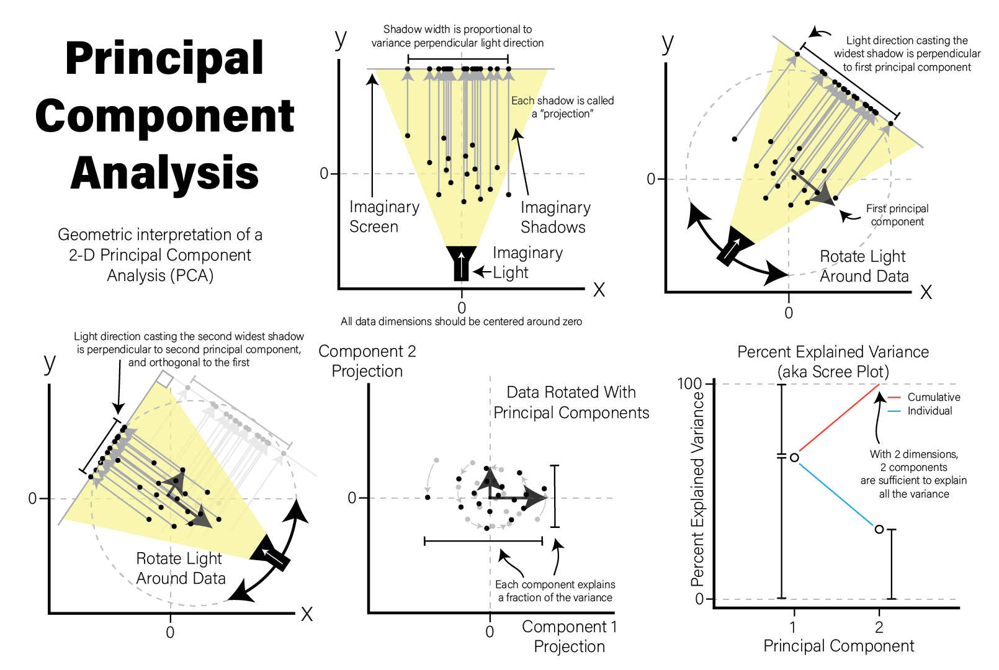
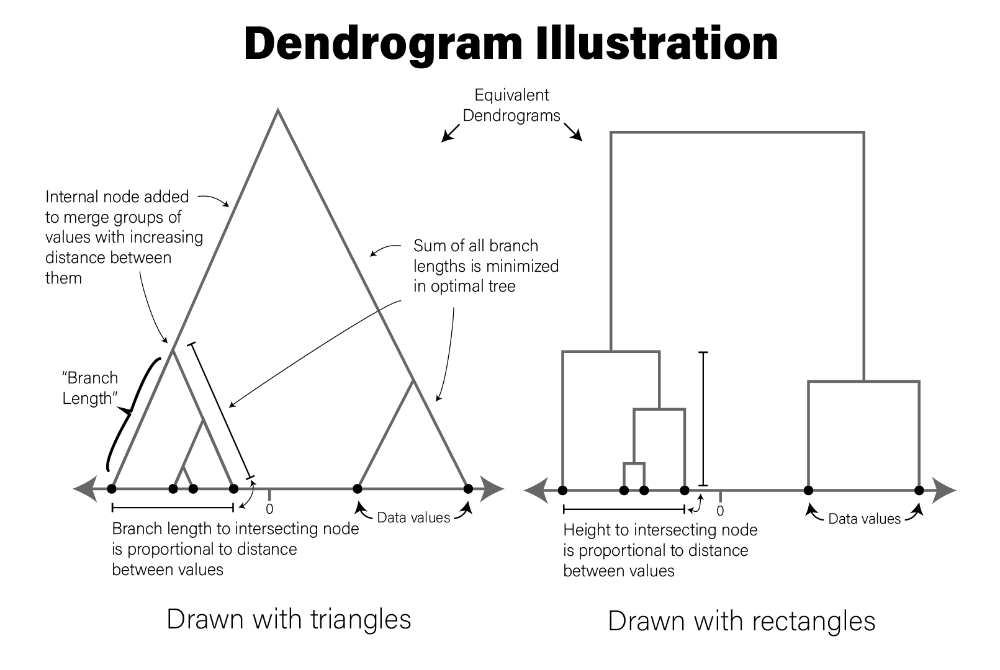

```{r data sci setup, include=FALSE}
library(tidyverse)
```

# Data Science

## Data Modeling

Data modeling goal:

* describe a dataset using a relatively small number of mathematical relationships, or
* use some parts of a dataset to try to accurately predict other parts of the dataset

## Models are human inventions

Models:

* reflect our beliefs about the way the universe works
* can identify patterns within a dataset that are the result of causal relationships
* separate meaningful signal of interest from noise
* *the model itself does not identify or even accurately reflect those causal effects*
* summarizes patterns and we as scientists are left to interpret those patterns

## Data Modeling Principles

1. **Data are never wrong.**
2. **Not all data are useful.**
3. **"All models are wrong, but some are useful."** - George Box
4. **Data do not contain causal information.**
   * i.e. "Correlation does not mean causation."
5. **All data have noise.** 

## Types of Models

* **Scientific model**:
  - conceptual representation of our belief of the universe
  - proposes causal explanations for phenomenon, i.e. *hypotheses*
  - helps us design experiments and collect data to test the accuracy of the model
* **Statistical model**:
  - maps a scientific model onto a mechanical procedure
  - quantifies how well our scientific model explains a dataset
  
*The scientific model and statistical model are related but independent choices we make*

## Data Exploration

* We might lack sufficient information to form a scientific model
* Must first gain knowledge by examining data
* Can then possibly generate a scientific model 
* This step sometimes called *exploratory data analysis* (EDA)

## A Worked Modeling Example

Consider three imaginary genes measured in Parkinson's Disease (PD) patients blood:

```{r data modeling pd, echo=TRUE}
set.seed(1337)
gene_exp <- tibble(
  sample_name = c(str_c("P",1:100), str_c("C",1:100)),
  `Disease Status` = factor(c(rep("PD",100),rep("Control",100))),
  `Gene 1` = c(rnorm(100,255,10), rnorm(100,250,10)),
  `Gene 2` = c(rnorm(100,520,100), rnorm(100,600,60)),
  `Gene 3` = c(rnorm(100,500,40), rnorm(100,330,40))
)
```

## A Worked Modeling Example

```{r}
gene_exp
```

## Data Exploration

```r
pivot_longer(
  gene_exp,
  c(`Gene 1`, `Gene 2`, `Gene 3`),
  names_to="Gene",
  values_to="Expression"
) %>% ggplot(
    aes(x=`Disease Status`,y=Expression,fill=`Disease Status`)
  ) +
  facet_wrap(vars(Gene)) +
  geom_violin()
```

## Data Exploration

```{r data modeling violin, echo=FALSE}
pivot_longer(
  gene_exp,
  c(`Gene 1`, `Gene 2`, `Gene 3`),
  names_to="Gene",
  values_to="Expression"
) %>% ggplot(
    aes(x=`Disease Status`,y=Expression,fill=`Disease Status`)
  ) +
  facet_wrap(vars(Gene)) +
  geom_violin()
```

## Observations

```{r data modeling violin 2, fig.dim=c(8,2), echo=FALSE}
pivot_longer(
  gene_exp,
  c(`Gene 1`, `Gene 2`, `Gene 3`),
  names_to="Gene",
  values_to="Expression"
) %>% ggplot(
    aes(x=`Disease Status`,y=Expression,fill=`Disease Status`)
  ) +
  facet_wrap(vars(Gene)) +
  geom_violin()
```

* Gene 1 does not look different between PD and control
* Gene 2 looks to have different means, but distributions overlap
* Gene 3 is very different in PD versus control
* Qualitative observations: *We made them with our eyes*
* How do we quantify these observations?

## Questions We Might Ask

* How much higher is Gene 3 expression in PD than control?
* If I know/suspect a patient has PD, what Gene 3 expression might we expect
  them to have?
* If all I know about a patient is their gene expression, how likely is it that
  they have PD?

# Data Summarization

## Data Summarization

* *data summarization* - process of finding a lower-dimensional representation of larger dataset
* A histogram is a summarization:

```{r data sci summ hist, fig.dim=c(8,2.5)}
ggplot(gene_exp, aes(x=`Gene 1`)) +
  geom_histogram(bins=30,fill="#a93c13")
```

## Point Estimates

* *point estimate*: data summarized to a single number
* Represent a data distribution's *central tendency*.
* e.g. `

```{r data sci summ hist2, fig.dim=c(8, 2)}
ggplot(gene_exp, aes(x=`Gene 1`)) +
  geom_histogram(bins=30,fill="#a93c13") +
  geom_vline(xintercept=mean(gene_exp$`Gene 1`))
```

## Poor Point Estimates

```r
library(patchwork)
well_behaved_data <- tibble(data = rnorm(1000))
# introduce some outliers
data_w_outliers <- tibble(data = c(rnorm(800), rep(5, 200))) 

g_no_outlier <- ggplot(well_behaved_data, aes(x = data)) +
  geom_histogram(fill = "#56CBF9", color = "grey", bins = 30) +
  geom_vline(xintercept = mean(well_behaved_data$data)) +
  ggtitle("Mean example, no outliers")

g_outlier <- ggplot(data_w_outliers, aes(x = data)) +
  geom_histogram(fill = "#7FBEEB", color = "grey", bins = 30) +
  geom_vline(xintercept = mean(data_w_outliers$data)) +
  ggtitle("Mean example, big outliers")

g_no_outlier | g_outlier
```

## Poor Point Estimates

```{r fig.align="center", fig.height=4, echo=FALSE}
library(patchwork)
well_behaved_data <- tibble(data = rnorm(1000))
# introduce some outliers
data_w_outliers <- tibble(data = c(rnorm(800), rep(5, 200))) 

g_no_outlier <- ggplot(well_behaved_data, aes(x = data)) +
  geom_histogram(fill = "#56CBF9", color = "grey", bins = 30) +
  geom_vline(xintercept = mean(well_behaved_data$data)) +
  ggtitle("Mean example, no outliers")

g_outlier <- ggplot(data_w_outliers, aes(x = data)) +
  geom_histogram(fill = "#7FBEEB", color = "grey", bins = 30) +
  geom_vline(xintercept = mean(data_w_outliers$data)) +
  ggtitle("Mean example, big outliers")

g_no_outlier | g_outlier
```

## Other Point Estimates

```r
g_no_outlier <- ggplot(well_behaved_data, aes(x = data)) +
  geom_histogram(fill = "#AFBED1", color = "grey", bins = 30) +
  geom_vline(xintercept = median(well_behaved_data$data)) +
  ggtitle("Median example")

g_outlier <- ggplot(data_w_outliers, aes(x = data)) +
  geom_histogram(fill = "#7FBEEB", color = "grey", bins = 30) +
  geom_vline(xintercept = median(data_w_outliers$data)) +
  ggtitle("Median example, big outliers")

g_no_outlier | g_outlier
```

## Other Point Estimates

```{r fig.align="center", fig.height=4, echo=FALSE}
g_no_outlier <- ggplot(well_behaved_data, aes(x = data)) +
  geom_histogram(fill = "#AFBED1", color = "grey", bins = 30) +
  geom_vline(xintercept = median(well_behaved_data$data)) +
  ggtitle("Median example")

g_outlier <- ggplot(data_w_outliers, aes(x = data)) +
  geom_histogram(fill = "#7FBEEB", color = "grey", bins = 30) +
  geom_vline(xintercept = median(data_w_outliers$data)) +
  ggtitle("Median example, big outliers")

g_no_outlier | g_outlier
```

## Dispersion

* *Dispersion* describes the "spread" of the data
* e.g. standard deviation `sd()`

```{r data sci summ sd, fig.dim=c(8,2)}
g1_mean <- mean(gene_exp$`Gene 1`)
g1_sd <- sd(gene_exp$`Gene 1`)
ggplot(gene_exp, aes(x=`Gene 1`)) +
  geom_histogram(bins=30,fill="#a93c13") +
  geom_vline(xintercept=g1_mean) +
  geom_segment(x=g1_mean-g1_sd, y=10, xend=g1_mean+g1_sd, yend=10)
```

## Standard deviation

* measure how close values are to the mean

```r
data <- tibble(data = c(rnorm(1000, sd=1.75)))
ggplot(data, aes(x = data)) +
  geom_histogram(fill = "#EAC5D8", color = "white", bins = 30) +
  geom_vline(xintercept = seq(-3,3,1) * sd(data$data)) +
  xlim(c(-6, 6)) +
  ggtitle("Standard deviations aplenty", paste("SD:", sd(data$data)))
```

## Standard deviation

```{r taylor sd, fig.align="center", echo=FALSE}
data <- tibble(data = c(rnorm(1000, sd=1.75)))
ggplot(data, aes(x = data)) +
  geom_histogram(fill = "#EAC5D8", color = "white", bins = 30) +
  geom_vline(xintercept = seq(-3,3,1) * sd(data$data)) +
  xlim(c(-6, 6)) +
  ggtitle("Standard deviations aplenty", paste("SD:", sd(data$data)))
```


## Normal Distribution

* *Central tendency* and *dispersion* estimates describe a *normal distribution*
* Can visually inspect fit of a distribution to data:

```r
g1_mean <- mean(gene_exp$`Gene 1`)
g1_sd <- sd(gene_exp$`Gene 1`)
ggplot(gene_exp, aes(x=`Gene 1`)) +
  geom_histogram(
    aes(y=after_stat(density)),
    bins=30,
    fill="#a93c13"
  ) +
  stat_function(fun=dnorm,
    args = list(mean=g1_mean, sd=g1_sd),
    linewidth=2
  )
```
## Normal Distribution

```{r, echo=FALSE}
g1_mean <- mean(gene_exp$`Gene 1`)
g1_sd <- sd(gene_exp$`Gene 1`)
ggplot(gene_exp, aes(x=`Gene 1`)) +
  geom_histogram(
    aes(y=after_stat(density)),
    bins=30,
    fill="#a93c13"
  ) +
  stat_function(fun=dnorm, args = list(mean=g1_mean, sd=g1_sd), linewidth=2)
```

## Our First Model

* We chose to express the dataset as a normal distribution parameterized by:
  - arithmetic mean - `r round(g1_mean)`
  - standard deviation - `r round(g1_sd)`

$$
Gene\;1 \sim \mathcal{N}(254, 11)
$$

## Other distributions

```r
g_norm <- ggplot(tibble(data = rnorm(5000)), aes(x = data)) +
  geom_histogram(fill = "#D0FCB3", bins = 50, color = "gray") +
  ggtitle("Normal distribution", "rnorm(n = 1000)")

g_unif <- ggplot(tibble(data = runif(5000)), aes(x = data)) +
  geom_histogram(fill = "#271F30", bins = 50, color = "white") +
  ggtitle("Uniform distribution", "runif(n = 1000)")

g_logistic <- ggplot(tibble(data = rlogis(5000)), aes(x = data)) +
  geom_histogram(fill = "#9BC59D", bins = 50, color = "black") +
  ggtitle("Logistic distribution", "rlogis(n = 1000)")

g_exp <- ggplot(tibble(data = rexp(5000, rate = 1)), aes(x = data)) +
  geom_histogram(fill = "#6C5A49", bins = 50, color = "white") +
  ggtitle("Exponential distribution", "rexp(n = 1000, rate = 1)")

(g_norm | g_unif) / (g_logistic | g_exp)
```

## Other distributions

```{r fig.align="center", echo=FALSE}
g_norm <- ggplot(tibble(data = rnorm(5000)), aes(x = data)) +
  geom_histogram(fill = "#D0FCB3", bins = 50, color = "gray") +
  ggtitle("Normal distribution", "rnorm(n = 1000)")

g_unif <- ggplot(tibble(data = runif(5000)), aes(x = data)) +
  geom_histogram(fill = "#271F30", bins = 50, color = "white") +
  ggtitle("Uniform distribution", "runif(n = 1000)")

g_logistic <- ggplot(tibble(data = rlogis(5000)), aes(x = data)) +
  geom_histogram(fill = "#9BC59D", bins = 50, color = "black") +
  ggtitle("Logistic distribution", "rlogis(n = 1000)")

g_exp <- ggplot(tibble(data = rexp(5000, rate = 1)), aes(x = data)) +
  geom_histogram(fill = "#6C5A49", bins = 50, color = "white") +
  ggtitle("Exponential distribution", "rexp(n = 1000, rate = 1)")

(g_norm | g_unif) / (g_logistic | g_exp)
```

## Some notes on our model

We chose to model our gene 1 expression data using a normaly distribution
parameterized by the arithmetic mean and standard deviation

1. **Our model choice was totally subjective** 
2. **We can't know if this is the "correct" model for the data** 
3. **We don't know how well our model describes the data yet** 

# Linear Models

## Linear Models

* Data distributions are *descriptive*
* They may not be *informative*
* Recall one of our scientific questions:
  - If all I know about a patient is their gene expression, how likely is it that
    they have PD?
* Our model doesn't answer this question yet

## The Linear Model

* *linear model*: any statistical model that relates one outcome variable as a
linear combination (i.e. sum) of one or more explanatory variables
* For the mathematically inclined:

$$
Y_i = \beta_0 + \beta_1 \phi_1 ( X_{i1} ) + \beta_2 \phi_2 ( X_{i2} ) + \ldots + \beta_p \phi_p ( X_{ip} ) + \epsilon_i
$$

## Back To Working Example

* [beeswarm plot](#beeswarm-plot) plot of Gene 3:

```{r lin model gene 3 violin, fig.dim=c(8,3)}
library(ggbeeswarm)
ggplot(gene_exp, aes(x=`Disease Status`, y=`Gene 3`, color=`Disease Status`)) +
  geom_beeswarm()
```

## Plot Same Data Differently

```r
exp_summ <- pivot_longer( gene_exp, c(`Gene 3`)
  ) %>%
  group_by(`Disease Status`) %>%
  summarize(mean=mean(value),sd=sd(value))

pd_mean <- filter(exp_summ, `Disease Status` == "PD")$mean
c_mean <- filter(exp_summ, `Disease Status` == "Control")$mean

ggplot(gene_exp, aes(x=`Gene 3`, fill=`Disease Status`)) +
  geom_histogram(bins=20, alpha=0.6,position="identity") +
  annotate("segment", x=c_mean, xend=pd_mean, y=20, yend=20,
    arrow=arrow(ends="both", angle=90)) +
  annotate("text", x=mean(c(c_mean,pd_mean)), y=21, hjust=0.5,
    label="How different?")
```

## Plot Same Data Differently

```{r, echo=FALSE}
exp_summ <- pivot_longer(
  gene_exp,
  c(`Gene 3`)
) %>%
  group_by(`Disease Status`) %>%
  summarize(mean=mean(value),sd=sd(value))

pd_mean <- filter(exp_summ, `Disease Status` == "PD")$mean
c_mean <- filter(exp_summ, `Disease Status` == "Control")$mean

ggplot(gene_exp, aes(x=`Gene 3`, fill=`Disease Status`)) +
  geom_histogram(bins=20, alpha=0.6,position="identity") +
  annotate("segment", x=c_mean, xend=pd_mean, y=20, yend=20, arrow=arrow(ends="both", angle=90)) +
  annotate("text", x=mean(c(c_mean,pd_mean)), y=21, hjust=0.5, label="How different?")
```

## Estimate Difference

* make a point estimate of this difference by simply subtracting the means:

```{r lin model point diff}
pd_mean - c_mean
```

In other words, this point estimate suggests that on average Parkinson's
patients have `r round(pd_mean-c_mean,1)` greater expression than Controls.

## Visualizing this Difference

```{r lin model gene 3 fit, fig.dim=c(8,3)}
ggplot(gene_exp, aes(x=`Disease Status`, y=`Gene 3`,
                     color=`Disease Status`)) +
  geom_beeswarm() +
  annotate("segment", x=0, xend=3,
           y=2*c_mean-pd_mean, yend=2*pd_mean-c_mean)
```

## Linear Model Terminology

* Our difference is an *estimate*, but how good is it?
* Linear models estimate both the difference *and* our confidence in that estimate
* Mathematically:
  - $$Gene 3 = \beta_0 + \beta_1*Disease Status$$
* $\beta_0$ and $\beta_1$ are called *coefficients*
  - $\beta_0$ is our intercept term
  - $\beta_1$ is our point estimate of difference between PD and Control
* Computing these coefficients is called *fitting the model*
* This style of analysis is called *linear regression*
  
## Linear Models in  R

* In R, specify formula like `Y ~ X`, or `Gene 3 ~ Disease Status`

```{r lin model lm}
fit <- lm(`Gene 3` ~ `Disease Status`, data=gene_exp)
fit
```

## `lm()` Fit


```{r lin model summary}
summary(fit)
```

## Computing Fit: naive

```{r lin mod all fits naive}
# naive solution
fit1 <- lm(`Gene 1` ~ `Disease Status`, data=gene_exp)
fit2 <- lm(`Gene 2` ~ `Disease Status`, data=gene_exp)
fit3 <- lm(`Gene 3` ~ `Disease Status`, data=gene_exp)
```

## Computing Fit

```{r lin mod all fits}
gene_stats <- lapply(
  c("Gene 1", "Gene 2", "Gene 3"),
  function(gene) {
    model <- paste0('`',gene,'`',' ~ `Disease Status`')
    fit <- lm(model, data=gene_exp)
    v <- c(gene,
           coefficients(fit),
           summary(fit)$coefficients[2,4]
           )
    names(v) <- c("Gene", "Intercept", "PD", "pvalue")
    return(v)
  }
  ) %>%
  bind_rows() # turn the list into a tibble

# compute FDR from nominal p-values
gene_stats$padj <- p.adjust(gene_stats$pvalue,method="fdr")
```

## Computed Fit

```r
gene_stats
## A tibble: 3 × 5
#  Gene   Intercept  PD       pvalue      padj
#  <chr>  <chr>      <chr>    <chr>       <dbl>
#1 Gene 1 250.410    6.959    3.921e-06   3.92e- 6
#2 Gene 2 597.763    -93.629  2.373e-13   3.56e-13
#3 Gene 3 334.577    164.094  1.727e-66   5.18e-66
```

## Plotting fit

```{r lin model 3 genes, echo=FALSE}
pd_mean <- mean(filter(gene_exp,`Disease Status`=="PD")$`Gene 1`)
c_mean <- mean(filter(gene_exp,`Disease Status`=="Control")$`Gene 1`)
g1 <- ggplot(gene_exp, aes(x=`Disease Status`, y=`Gene 1`, color=`Disease Status`)) +
  geom_beeswarm() +
  annotate("segment", x=0, xend=3, y=2*c_mean-pd_mean, yend=2*pd_mean-c_mean) +
  theme(legend.position="none")

pd_mean <- mean(filter(gene_exp,`Disease Status`=="PD")$`Gene 2`)
c_mean <- mean(filter(gene_exp,`Disease Status`=="Control")$`Gene 2`)
g2 <- ggplot(gene_exp, aes(x=`Disease Status`, y=`Gene 2`, color=`Disease Status`)) +
  geom_beeswarm() +
  annotate("segment", x=0, xend=3, y=2*c_mean-pd_mean, yend=2*pd_mean-c_mean) +
  theme(legend.position="none")

pd_mean <- mean(filter(gene_exp,`Disease Status`=="PD")$`Gene 3`)
c_mean <- mean(filter(gene_exp,`Disease Status`=="Control")$`Gene 3`)
g3 <- ggplot(gene_exp, aes(x=`Disease Status`, y=`Gene 3`, color=`Disease Status`)) +
  geom_beeswarm() +
  annotate("segment", x=0, xend=3, y=2*c_mean-pd_mean, yend=2*pd_mean-c_mean) +
  theme(legend.position="none")
g1 | g2 | g3
```

## Generalized Linear Models

* Linear regression makes strong assumptions about the distribution of the data
* [Generalized linear
models](https://en.wikipedia.org/wiki/Generalized_linear_model) that allow these
  assumptions to be relaxed
* Mathematically, function $g$ allows different relationships between $X$ and $Y$:

$$Y = g^{-1}(\beta_0 + \beta_1 \phi_1 ( X_{i1} ) + \beta_2 \phi_2 ( X_{i2} ) + \ldots + \beta_p \phi_p ( X_{ip} ))$$

## Flavors of Linear Models

* **Logistic regression**
* **Multinomial regression**
* **Poisson regression**
* **Negative binomial regression**

# Statistical Distributions

## Statistical Distributions

* Statistics was created to quantify uncertainty
* Statistics provides tools to separate *signal* from *noise*
* The *statistical distribution* is a tool we can use to estimate and quantify
  uncertainty

## Random Variables

* A random variable is an object or quantity which:
  - depends upon random events
  - can have samples drawn from it
* Each random variable has a potential set of possible outcomes (e.g. a real
  number, an integer, a category, a mathematical tree)
* Each possible outcome has some probability of appearing, relative to other outcomes
* The complete mapping of relative probabilities to outcomes for a random variable
  forms a *distribution*
  
## Random Variable Examples

* a six-sided die
* a coin
* transcription of a gene

## Random Variable Notation

* Usually notated as capital letters, like $X,Y,Z,$ etc
* A sample drawn from a random variable is usually notated as a lowercase of the
  same letter
* e.g. $x$ is a sample drawn from the random variable $X$
* Distribution of random variable usually described like
  - "$X$ follows a binomial distribution"
  - "$Y$ is a normally distributed random variable"
* Probability of a random variable taking one of its possible values: $P(X = x)$

## Statistical Distribution Basics

* A statistical distribution is a function that maps **the possible
values for a variable to how often they occur**
* Alternatively, distribution describes the probability of seeing a single value, or a
range of values, relative to all other possible values

```r
tibble(
  x = seq(-4,4,by=0.1),
  `Probability Density`=dnorm(x,0,1)
) %>%
  ggplot(aes(x=x,y=`Probability Density`)) +
  geom_line() +
  labs(title="Probability Density Function for a Normal Distribution")

```

## Normal Distribution

```{r stat normal, echo=FALSE}
tibble(
  x = seq(-4,4,by=0.1),
  `Probability Density`=dnorm(x,0,1)
) %>%
  ggplot(aes(x=x,y=`Probability Density`)) +
  geom_line() +
  labs(title="Probability Density Function for a Normal Distribution")

```


## Probability Density Functions

* *probability density function* (PDF) defines probability associated with every
  possible value of a random variable
* Many PDFs have a closed mathematical form
* The PDF for the normal distribution is:

$$
P(X = x|\mu,\sigma) = \frac{1}{\sigma\sqrt{2\pi}}e^{\frac{-(x-\mu)^2}{2\sigma}}
$$

## PDFs

$$
P(X = x|\mu,\sigma) = \frac{1}{\sigma\sqrt{2\pi}}e^{\frac{-(x-\mu)^2}{2\sigma}}
$$

* Notation $P(X = x|\mu,\sigma)$ - "the probability that the random
variable $X$ takes the value $x$, given mean $\mu$ and standard deviation
$\sigma$"
* Normal distribution is a *parametric distribution* because PDF requires two parameters
* *Non-parametric distributions* do not require parameters, but are determined from data

## Probability Mass Functions

* PDFs only defined for continuous distributions, with infinite possible values
* Discrete distributions have a finite set of possible values
* *Probability mass functions* discrete distribution analog for PDFs

```{r stat pois, echo=FALSE, fig.dim=c(8,3)}
tibble(
  x = seq(0,10,by=1),
  `Probability Density`=dpois(x,3)
) %>%
  ggplot(aes(x=x,y=`Probability Density`)) +
  geom_bar(stat="identity") +
  labs(title="Probability Mass Function for a Poisson Distribution")
```

## Note: Probability of Zero

* In probability theory, if a plausible event has a probability of zero, this
  *does not mean that event can never occur*
* Every specific value in a continuous distribution that supports all real
  numbers has a probability of zero
* PDF allows us to reason about the *relative likelihood* of
  observing values in one range of the distribution compared with the others

## Cumulative Distribution Function

* PDF provides the probability density of specific values within the
distribution
* Sometimes we want probability of a value being less/greater than or equal to a particular value
* *Cumulative distribution function* (CDF) useful for this purpose

```r
tibble(
  x = seq(-4,4,by=0.1),
  PDF=dnorm(x,0,1),
  CDF=pnorm(x,0,1)
) %>%
  ggplot() +
  geom_line(aes(x=x,y=PDF,color="PDF")) +
  geom_line(aes(x=x,y=CDF,color="CDF"),linetype="dashed")
```

## PDF vs CDF

```{r stat pdf cdf, echo=FALSE}
tibble(
  x = seq(-4,4,by=0.1),
  PDF=dnorm(x,0,1),
  CDF=pnorm(x,0,1)
) %>%
  ggplot() +
  geom_line(aes(x=x,y=PDF,color="PDF")) +
  geom_line(aes(x=x,y=CDF,color="CDF"), linetype="dashed")
```

## CDF

* CDF corresponds to area under density curve up to value of $x$
* 1 minus that value is the area under the curve greater than that value

```{r stat cdfs, echo=FALSE, fig.dim=c(8,3.5)}
d <- tibble(
  x = c(-4,4),
) 
g <- ggplot(d,aes(x=x)) +
  stat_function(fun=dnorm,mapping=aes(color="PDF")) +
  geom_point(aes(x=x,y=y),data=tibble(x=c(1.37),y=c(pnorm(1.37)))) +
  stat_function(fun=pnorm,linetype="dashed",mapping=aes(color="CDF"))+
  geom_segment(
    aes(x=x,y=y,xend=xend,yend=yend),
    data=tibble(x=1.37,xend=1.37,y=pnorm(1.37),yend=0),
    linetype="dashed"
    )

(g + stat_function(fun=dnorm,
                xlim=c(-4,1.37),
                geom="area",
                alpha=0.2,
                ) + labs(title=str_c("P(X < x| x=1.37) = ",round(pnorm(1.37),2)))) /
(g + stat_function(fun=dnorm,
                xlim=c(1.37,4),
                geom="area",
                alpha=0.2
                ) + labs(title=str_c("P(X > x| x=1.37) = ",round(1-pnorm(1.37),2))))
```


## Generating random samples

* CDF is useful for generating samples from the distribution

```{r stat inv cdf, echo=FALSE}
d <- tibble(
  p=runif(1000,0,1),
  x=qnorm(p,0,1)
)
unif <- ggplot(d,aes(y=x)) +
  geom_histogram(bins=30)
norm <- ggplot(d,aes(x=p)) +
  geom_histogram(bins=30)
scatter <- ggplot(d,aes(x=p,y=x)) +
  geom_point() +
  stat_function(
    fun=qnorm,
    xlim=c(0,1),
    linetype="dashed",
    color="red"
    )
 
norm + plot_spacer() + scatter + unif + 
  plot_layout(
    ncol = 2, 
    nrow = 2, 
    widths = c(4, 1),
    heights = c(1, 4)
  ) 
```

## Distributions in R

* Four key operations we perform with distributions:

1. Calculate probabilities using the PDF
2. Calculate cumulative probabilities using the CDF
3. Calculate the value associated with a cumulative probability
4. Sample values from a parameterized distribution

* Each of these operations has a dedicated function for each different distribution

## Distributions in R

* Each distribution has a family of 4 functions
* Functions end with shortened name of distribution, e.g. `norm` for normal distribution
* Distribution functions prefixed by `d`, `p`, `q`, and `r`, e.g.

1. `dnorm(x, mean=0, sd=1)` - PDF of the normal distribution
2. `pnorm(q, mean=0, sd=1)` - CDF of the normal distribution
3. `qnorm(p, mean=0, sd=1)` - inverse CDF; accepts quantiles between 0 and 1 and returns the
value of the distribution for those quantiles
4. `rnorm(n, mean=0, sd=1)` - generate `n` samples from a normal distribution

## Distributions in R

+-------------------+------------------------------+
| Distribution      | Probability Density Function |
+===================+==============================+
| Normal            | `dnorm(x,mean,sd)`           |
+-------------------+------------------------------+
| t Distribution    | `dt(x,df)`                   |
+-------------------+------------------------------+
| Poisson           | `dpois(n,lambda)`            |
+-------------------+------------------------------+
| Binomial          | `dbinom(x, size, prob)`      |
+-------------------+------------------------------+
| Negative Binomial | `dnbinom(x, size, prob, mu)` |
+-------------------+------------------------------+
| Exponential       | `dexp(x, rate)`              |
+-------------------+------------------------------+
| $\chi^2$          | `dchisq(x, df)`              |
+-------------------+------------------------------+

* [many more distributions available](https://www.stat.umn.edu/geyer/old/5101/rlook.html)

# Types of Distributions

## Types of Distributions

* Broadly 2 types of distributions:
  - Continuous - defined for real numbers within a range
  - Discrete - defined for all objects within a set
* A distribution may be either:
  - Theoretical (aka parametric) - defined by a parameterized family of mathematical functions
  - Empirical (aka non-parametric) - defined by data
  
## Discrete Distributions

* Discrete distributions defined over countable, possibly infinite sets
* Events take one of a set of discrete values
* Common discrete distributions include
  - binomial (e.g. coin flips)
  - multinomial (e.g. dice rolls)
  - Poisson (e.g. number of injuries by horse kick per day)

## Bernoulli random trails

* *Bernoulli trial* = a coin flip
* 2 outcomes with probabilities of $p$ and $1-p$
* Consider a coin flip:
  - $Pr(X = 0) = Pr(X = 1) = 0.5$ - coin is fair
  - $Pr(X = 0) = 0.1, Pr(X = 1) = 0.9$ - coin is not fair
* Consider dice roll where we count a 6 as a success and any other roll as failure:
  - $Pr(X = 0) = 5/6, Pr(X = 1) = 1/6$ - if dice are fair

## Bernoulli random trials

```r
library(statip) # NB: not a base R distribution
# dbern(x, prob, log = FALSE)
# qbern(p, prob, lower.tail = TRUE, log.p = FALSE)
# pbern(q, prob, lower.tail = TRUE, log.p = FALSE)
# rbern(n, prob)
rbern(10, 0.5)
```

## Bernoulli random trials

```{r, include=FALSE}
library(statip)
```

```{r}
rbern(10, 0.5)
```

## Binomial distribution

* Consider a sequence of coin flips, where chance of heads is $p$
* What is the probability of seeing $x$ heads out of $n$ flips?
* The *binomial distribution* models this situation

$$
Pr(X = x|n,p) = {n \choose x} p^x (1-p) ^{(n-x)}
$$

## Binomial distribution

```r
# dbinom(x, size, prob, log = FALSE)
# pbinom(q, size, prob, lower.tail = TRUE, log.p = FALSE)
# qbinom(p, size, prob, lower.tail = TRUE, log.p = FALSE)
# rbinom(n, size, prob)
rbinom(10, 10, 0.5)
```

## Binomial distribution

```{r}
rbinom(10, 10, 0.5)
```

```{r}
mean(rbinom(1000, 10, 0.5))
```

## Geometric distribution

* Consider a sequence of coin flips, where chance of heads is $p$
* What is the probability of seeing $x$ consecutive tails before a head?
* The *geometric distribution* models this situation

$$
Pr(X = x|p) = (1-p)^x p
$$

## Geometric distribution

```r
# dgeom(x, prob, log = FALSE)
# pgeom(q, prob, lower.tail = TRUE, log.p = FALSE)
# qgeom(p, prob, lower.tail = TRUE, log.p = FALSE)
# rgeom(n, prob)
rgeom(10, 0.5)
```

## Geometric distribution

```{r}
rgeom(10, 0.5)
```

## Poisson  

* Consider an event that occurs zero or more times in a particular time period
  at a known constant average rate $\lambda$
* What is the probability of seeing $k$ events in a time period?

$$
Pr(X=k|\lambda) = \frac {\lambda^k e^{-\lambda}} {k!}
$$

## Poisson

```r
# dpois(x, lambda, log = FALSE)
# ppois(q, lambda, lower.tail = TRUE, log.p = FALSE)
# qpois(p, lambda, lower.tail = TRUE, log.p = FALSE)
# rpois(n, lambda)
rpois(10, 5)
```

## Poisson

```{r}
rpois(10, 5)
```

```{r}
mean(rpois(1000, 5))
```

## Negative binomial distribution

* Consider a sequence of coin flips, where chance of heads is $p$
* What is the probability of seeing $x$ tails by the time we see the $r$ heads?

$$
Pr(X = x|r,p) = \frac {x+r-1} {r-1} p^r {(1-p)}^x
$$

## Negative binomial distribution

```r
# dnbinom(x, size, prob, mu, log = FALSE)
# pnbinom(q, size, prob, mu, lower.tail = TRUE, log.p = FALSE)
# qnbinom(p, size, prob, mu, lower.tail = TRUE, log.p = FALSE)
# rnbinom(n, size, prob, mu)
rnbinom(10, 10, 0.5)
```

## Negative binomial distribution

```{r}
# dnbinom(x, size, prob, mu, log = FALSE)
# pnbinom(q, size, prob, mu, lower.tail = TRUE, log.p = FALSE)
# qnbinom(p, size, prob, mu, lower.tail = TRUE, log.p = FALSE)
# rnbinom(n, size, prob, mu)
rnbinom(10, 10, 0.5)
```


## Continuous Distributions

* Continuous distributions defined over infinite, possibly bounded domains, e.g. all real numbers

## Uniform Distribution

* Consider a number in the range $[a, b]$
* All values in range appear with equal probability 

$$
P(X=x|a,b) = \begin{cases}
\frac{1}{b-a} & \text{for}\; a \le x \le b, \\
0 & \text{otherwise}
\end{cases}
$$

## Uniform Distribution

```r
dunif(x, min = 0, max = 1, log = FALSE)
punif(q, min = 0, max = 1, lower.tail = TRUE, log.p = FALSE)
qunif(p, min = 0, max = 1, lower.tail = TRUE, log.p = FALSE)
runif(n, min = 0, max = 1)
runif(10, min=0, max=10)
```

## Uniform Distribution

```{r}
runif(10)
```

```{r}
mean(runif(1000))
```

## Normal Distribution

* *Normal distribution (Gaussian distribution)*

$$
P(X = x|\mu,\sigma) = \frac{1}{\sigma\sqrt{2\pi}}e^{\frac{-(x-\mu)^2}{2\sigma}}
$$

## Normal Distribution

```r
# dnorm(x, mean = 0, sd = 1, log = FALSE)
# pnorm(q, mean = 0, sd = 1, lower.tail = TRUE, log.p = FALSE)
# qnorm(p, mean = 0, sd = 1, lower.tail = TRUE, log.p = FALSE)
# rnorm(n, mean = 0, sd = 1)
rnorm(10, mean=10, sd=10)
```

## Normal Distribution

```{r}
rnorm(10, mean=10, sd=10)
```

```{r}
mean(rnorm(1000, mean=10, sd=10))
```

## $\chi^2$ Distribution

* Models the distribution of $k$ independent standard normal random variables

$$
P(X=x|k) = \begin{cases}
\frac{
  x^{\frac{k}{2}-1}e^{-\frac{x}{2}}
}{
  2^{\frac{k}{2}}\left ( \frac{k}{2} \right )
}, & x>0;\\
0, & \text{otherwise}
\end{cases}
$$$


## $\chi^2$ Distribution

```r
# dchisq(x, df, ncp = 0, log = FALSE)
# pchisq(q, df, ncp = 0, lower.tail = TRUE, log.p = FALSE)
# qchisq(p, df, ncp = 0, lower.tail = TRUE, log.p = FALSE)
# rchisq(n, df, ncp = 0)
rchisq(10, 10)
```

## $\chi^2$ Distribution

```{r}
rchisq(10, 10)
```

```{r}
mean(rchisq(1000, 10))
```

## Empirical Distributions

* Empirical distributions describe the relative frequency of observed values in a dataset
* Empirical distributions may have any shape, and may be visualized using any of the methods described in the [Visualizing Distributions] section, e.g. a [density plot](#density-plots)
* Empirical distributions can be turned into an *empirical distribution function* similar to the `p*` theoretical distribution functions

## Empirical Distributions

```{r stat hist, echo=FALSE}
library(ggbeeswarm)
library(patchwork)
library(tidyverse)
# synthetic dataset generated with three normal distributions
d <- tibble(
  Value=c(rnorm(1000,0,2),rnorm(1000,5,1),rnorm(1000,10,5))  
)
g_dens <- ggplot(d,aes(x=Value,fill="orange")) +
  geom_density() +
  guides(fill="none") # turns off the legend
g_bee <- ggplot(d, aes(x=1,y=Value)) +
  geom_beeswarm()
g_bee | g_dens
```

## Empirical CDF

```{r}
ecdf(d$Value)
```

```{r}
plot(ecdf(d$Value))
```

# Statistical Tests

# Exploratory Data Analysis

## Exploratory Data Analysis

* We might lack sufficient information to form a scientific model
* Must first gain knowledge by examining data
* Can then possibly generate a scientific model 
* This step sometimes called *exploratory data analysis* (EDA)

## Principal Component Analysis

* *principal component analysis* (PCA): statistical procedure that reduces the
  effective dimensionality of a dataset while preserving variance
* One of many [dimensionality reduction](https://en.wikipedia.org/wiki/Dimensionality_reduction) techniques
* Identifies so-called *directions of orthogonal variance* called *principal components*
  
## PCA Principles

* PCA decomposes a dataset into a set of [orthonormal basis vectors](https://en.wikipedia.org/wiki/Orthonormal_basis) (principal components)
* These principal components (PCs) collectively capture all the variance in the dataset
* First basis vector is called the *first principal component* and explains the largest fraction of the variance
* Second principal component explains the second largest fraction, and so on
* Always an equal number of principal components as there are dimensions in the dataset or the number of samples, whichever is smaller
* Typically only small number of PCs needed to explain most of the variance

## Principal Components

* Each principal component is a $p$-dimensional [unit vector](https://en.wikipedia.org/wiki/Unit_vector):
  - $p$ is the number of features in the dataset
  - values are *weights* that describe the component's direction of variance
* Product of each component with the values in each sample, we obtain a *projection*
* Projections of each sample made with each principal component produces a *rotation* of the dataset

##

{width=100%}

## PCA in Biological Analysis

* Biological datasets often have many thousands of features (e.g. genes) and comparatively few samples
* Maximum number of PCs in PCA is smaller of (number of features, number of samples)
* [`stats::prcomp()`](https://www.rdocumentation.org/packages/stats/versions/3.6.2/topics/prcomp)
function performs PCA in R

## PCA Example Setup

```{r pca setup, include=FALSE}
setwd('..')
source("setup_example_data.R")
setwd('slides')
```

```{r pca}
# intensities contains microarray expression data for ~54k probesets x 20
# samples

# transpose expression values so samples are rows
expr_mat <- intensities %>%
  pivot_longer(-c(probeset_id),names_to="sample") %>%
  pivot_wider(names_from=probeset_id)

# PCA expects all features (i.e. probesets) to be mean-centered,
# convert to dataframe so we can use rownames
expr_mat_centered <-  as.data.frame(
  lapply(dplyr::select(expr_mat,-c(sample)),function(x) x-mean(x))
)
rownames(expr_mat_centered) <- expr_mat$sample

```

## PCA in R

```{r}
# prcomp performs PCA
pca <- prcomp(
  expr_mat_centered,
  center=FALSE, # already centered
  scale=TRUE # prcomp scales each feature to have unit variance
)
```

## PCA Results in R

```{r}
# the str() function prints the structure of its argument
str(pca)
```

## PCA Results in R

The result of `prcomp()` is a list with five members:

* `sdev` - the standard deviation (i.e. the square root of the variance) for each component
* `rotation` - a matrix where the principal components are in columns
* `x` - the projections of the original data
* `center` - if `center=TRUE` was passed, a vector of feature means
* `scale` - if `scale=TRUE` was passed, a vector of the feature variances

## PC Fraction of Variance

* Each principal component explains a fraction of the overall variance in the dataset
* `prcomp()` result doesn't provide this fraction
* `sdev` variable returned by `prcomp()` may be used to first
calculate the variance explained by each component by squaring it, then dividing
by the sum

## PC Fraction of Variance

```r
library(patchwork)
pca_var <- tibble(
  PC=factor(str_c("PC",1:20),str_c("PC",1:20)),
  Variance=pca$sdev**2,
  `% Explained Variance`=Variance/sum(Variance)*100,
  `Cumulative % Explained Variance`=cumsum(`% Explained Variance`)
)
```

## PC Fraction of Variance Cont'd

```r
exp_g <- pca_var %>%
  ggplot(aes(x=PC,y=`% Explained Variance`,group=1)) +
  geom_point() +
  geom_line() +
  theme(axis.text.x=element_text(angle=90,hjust=0,vjust=0.5))

cum_g <- pca_var %>%
  ggplot(aes(x=PC,y=`Cumulative % Explained Variance`,group=1)) +
  geom_point() +
  geom_line() +
  ylim(0,100) + # set y limits to [0,100]
  theme(axis.text.x=element_text(angle=90,hjust=0,vjust=0.5))

exp_g | cum_g
```

## PC Fraction of Variance

```{r pca var, echo=FALSE}
library(patchwork)
pca_var <- tibble(
  PC=factor(str_c("PC",1:20),str_c("PC",1:20)),
  Variance=pca$sdev**2,
  `% Explained Variance`=Variance/sum(Variance)*100,
  `Cumulative % Explained Variance`=cumsum(`% Explained Variance`)
)

exp_g <- pca_var %>%
  ggplot(aes(x=PC,y=`% Explained Variance`,group=1)) +
  geom_point() +
  geom_line() +
  theme(axis.text.x=element_text(angle=90,hjust=0,vjust=0.5))

cum_g <- pca_var %>%
  ggplot(aes(x=PC,y=`Cumulative % Explained Variance`,group=1)) +
  geom_point() +
  geom_line() +
  ylim(0,100) + # set y limits to [0,100]
  theme(axis.text.x=element_text(angle=90,hjust=0,vjust=0.5))

exp_g | cum_g
```

## PCA and Outliers

* PCA can help identify outlier samples
* Idea:
  - plot the projections of each sample
  - examine the result by eye to identify samples that are "far away" from the other samples
* No general rules to decide when a sample is an outlier

## Pairwise PC Plots

* PC projects often plotted against each other, e.g. PC1 vs PC2:

```{r pca pairwise, fig.dim=c(8,3)}
as_tibble(pca$x) %>%
  ggplot(aes(x=PC1,y=PC2)) +
  geom_point()
```

## Pairwise PC Plots

* Can plot all pairs of the first six components using the [`ggpairs()
function`](https://ggobi.github.io/ggally/reference/ggpairs.html) in the
[GGally](https://ggobi.github.io/ggally/) package

```r
library(GGally)
as_tibble(pca$x) %>%
  dplyr::select(PC1:PC6) %>%
  ggpairs()
```

## Pairwise PC Plots

```{r pca pairs, echo=FALSE}
suppressMessages(library(GGally))
as_tibble(pca$x) %>%
  dplyr::select(PC1:PC6) %>%
  ggpairs()
```

## Beeswarm PC Plots

* Alternative to scatter plots: [beeswarm plot](#beeswarm-plots):

```{r pca proj beeswarm, fig.dim=c(8,2.75)}
as_tibble(pca$x) %>%
  pivot_longer(everything(),names_to="PC",values_to="projection") %>%
  mutate(PC=fct_relevel(PC,str_c("PC",1:20))) %>%
  ggplot(aes(x=PC,y=projection)) +
  geom_beeswarm() + labs(title="PCA Projection Plot")
```

## Adding Additional Information

* Can color our pairwise scatter plot by type like so:

```{r pca color scatter, fig.dim=c(8,3)}
as_tibble(pca$x) %>%
  mutate(type=stringr::str_sub(rownames(pca$x),1,1)) %>%
  ggplot(aes(x=PC1,y=PC2,color=type)) +
  geom_point()
```

## Adding Additional Information

* Can plot pairs of components as before but now with type information

```r
library(GGally)
as_tibble(pca$x) %>%
  mutate(type=stringr::str_sub(rownames(pca$x),1,1)) %>%
  dplyr::select(c(type,PC1:PC6)) %>%
  ggpairs(columns=1:6,mapping=aes(fill=type))
```

## Adding Additional Information

```{r pca pairs type, echo=FALSE, message=FALSE, warning=FALSE}
library(GGally)
as_tibble(pca$x) %>%
  mutate(type=stringr::str_sub(rownames(pca$x),1,1)) %>%
  dplyr::select(c(type,PC1:PC6)) %>%
  ggpairs(columns=1:6,mapping=aes(fill=type))
```


## Beeswarm PC Plots

```{r pca proj beeswarm type, echo=FALSE}
as_tibble(pca$x) %>%
  mutate(
    sample=rownames(pca$x),
    type=stringr::str_sub(sample,1,1)
  ) %>%
  pivot_longer(PC1:PC20,names_to="PC",values_to="projection") %>%
  mutate(PC=fct_relevel(PC,str_c("PC",1:20))) %>%
  ggplot(aes(x=PC,y=projection,color=type)) +
  geom_beeswarm() + labs(title="PCA Projection Plot")
```

# Cluster Analysis

## Cluster Analysis

* Cluster analysis groups similar objects together
* Can identify structure or organization in a dataset
* [clustering algorithms](https://en.wikipedia.org/wiki/Category:Cluster_analysis_algorithms)
have been developed for different situations

## Clustering Example

```{r, echo=FALSE}
# data drawn from three bivariate normal distributions))
set.seed(1337)
n <- 20
well_clustered_data <- tibble(
  ID=c(stringr::str_c("A",1:n),stringr::str_c("B",1:n),stringr::str_c("C",1:n)),
  cluster=c(rep("A",n),rep("B",n),rep("C",n)),
  f1=c(rnorm(n,0,1),rnorm(n,5,1),rnorm(n,0,1)),
  f2=c(rnorm(n,0,1),rnorm(n,5,1),rnorm(n,8,1))
)

unclustered <- ggplot(well_clustered_data, aes(x=f1,y=f2)) +
  geom_point() +
  labs(title="Unclustered")
clustered <- ggplot(well_clustered_data, aes(x=f1,y=f2,color=cluster,shape=cluster)) +
  geom_point() +
  labs(title="Clustered")

unclustered | clustered
```

## Hierarchical Clustering

* *Hierarchical clustering* groups data points together in nested, or *hierarchical*, groups
* Data points are compared for similarity using a *distance function*
* Two broad strategies: 
  - **Agglomerative**: each datum starts in otart in their own groups, and groups are
  iteratively merged hierarchically iointsointsnto larger groups data are in a group
  - **Divisive**: all data points start in the same group, and are recursively
  split into smaller groups based on their dissimilarity

## Clustering: Distance Function

* Must choose a *distance function*, e.g $d(x, y)$
* $d(x, y)$ produces a *metric* with magnitude proportional
  to difference between $x$ and $y$
* A *metric* is a non-negative number with no meaningful unit
* Many different metrics, *euclidean distance* often a reasonable choice

$$d(p, q) = \sqrt{(p - q)^2}$$

## Clustering: Linkage Function

* In hierarchical clustering, groups of data are compared to one another
* *Linkage function* is a distance function for groups of data
* Many choices of linkage function:
  - [Single-linkage](https://en.wikipedia.org/wiki/Single-linkage_clustering) - distance between two nearest members of the groups
  - [Complete-linkage](https://en.wikipedia.org/wiki/Complete-linkage_clustering) - distance between two farthest members of the groups
  - [Unweighted Pair Group Method with Arithmetic mean (UPGMA)](https://en.wikipedia.org/wiki/UPGMA) - distance is the average distance of all pairs of points between groups
  - [Weighted Pair Group Method with Arithmetic mean (WPGMA)](https://en.wikipedia.org/wiki/WPGMA) - similar to UPGMA, but weights distances from pairs of groups evenly when merging
  
##

{width=100%}

## Clustering Example in R

Below we will cluster the synthetic dataset introduced above in R:

```{r hclust data, fig.dim=c(8,3)}
ggplot(well_clustered_data, aes(x=f1,y=f2)) +
  geom_point() +
  labs(title="Unclustered")
```

## Clustering Example in R

```{r hclust dist, warning=FALSE, message=FALSE}
# compute all pairwise distances using euclidean distance
# as the distance metric
euc_dist <- dist(dplyr::select(well_clustered_data,-ID))

# produce a clustering of the data using the hclust for
# hierarchical clustering
hc <- hclust(euc_dist, method="ave")

# add ID as labels to the clustering object
hc$labels <- well_clustered_data$ID
```

## Clustering Example in R

```{r}
str(hc)
```

## `hclust()` output

* `hclust()` return object describes the clustering as a tree
* Can visualize using a [dendrogram](#dendrograms):

```{r hclust dendro, fig.dim=c(8,3), warning=FALSE, message=FALSE}
library(ggdendro)
ggdendrogram(hc)
```

##

{width=100%}

## Creating Flat Clusters

* Can split hierarchical clustering into groups based on their pattern
* Can use the
[`cutree`](https://www.rdocumentation.org/packages/stats/versions/3.6.2/topics/cutree)
to divide the tree into three groups using `k=3`:

```{r hclust cuttree}
labels <- cutree(hc,k=3)
labels
```

## Creating Flat Clusters

```r
# we turn our labels into a tibble so we can join them with the original tibble
well_clustered_data %>%
  left_join(
    tibble(
      ID=names(labels),
      label=as.factor(labels)
    )
  ) %>%
  ggplot(aes(x=f1,y=f2,color=label)) +
  geom_point() +
  labs(title="Clustered")
```

## Creating Flat Clusters

```{r hclust cutree color, fig.dim=c(8,3)}
# we turn our labels into a tibble so we can join them with the original tibble
well_clustered_data %>%
  left_join(
    tibble(
      ID=names(labels),
      label=as.factor(labels)
    )
  ) %>%
  ggplot(aes(x=f1,y=f2,color=label)) +
  geom_point() +
  labs(title="Clustered")
```
