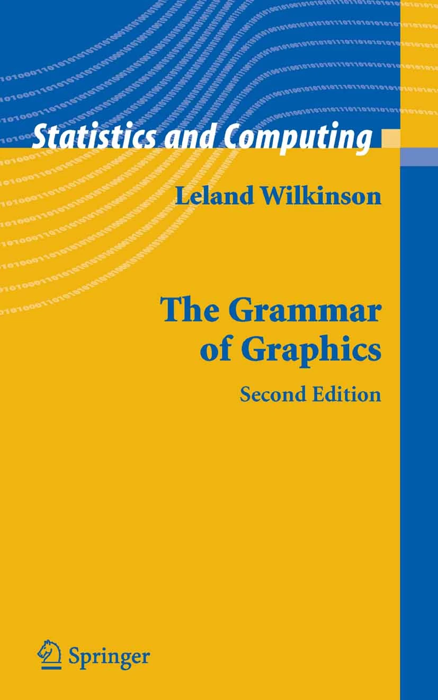

```{r data viz setup, include=FALSE}
library(tidyverse)

setwd('../')
source("setup_example_data.R")
setwd('slides')
```

# Data Visualization

## Data Visualization

* Data visualization is a core component of both exploring data and communicating
results
* The goal: present data in a graphical way that shows patterns that are otherwise invisible
* Effective data visualization is challenging!
* No "gold standard" to follow - only principles and judgment

## Properties of good data viz

An effective data visualization:

1. Depicts accurate data
2. Depicts data accurately
3. Shows enough, but not too much, of the data
4. Is self contained - no additional information (except a caption) is required
   to understand the contents of the figure

## Properties of great data viz

A *great* visualization has some additional properties:

5. Exposes patterns in the data not easily observable by other methods
6. Invites the viewer to ask more questions about the data

# Responsible Plotting

## Credits


## Responsible Plotting

* "Good plots empower us to ask good questions." - Alberto Cairo, How Charts Lie
* Plots convey *ideas* (and *beliefs*)
* Scientific papers often structured (and read) by its figures
* Making plots is easy
* Conveying ideas is *hard*

## The "Hockey Stick Chart"

{width=100%}

## 5 Qualities of An Effective Viz

1. **It is truthful**
2. **It is functional**
3. **It is insightful**
4. **It is enlightening**
5. **It is beautiful**

## Visualization Principles

* Visualizations *illustrate* (from latin *illustrare*, to light up or illuminate)
* Leverage humans' *visual perception system*
* This system is predictive/interpretive
  - i.e. it is a *pattern recognition* system
* When this system makes bad predictions, we can experience *optical illusions*

## Contextual Colors

<div class="centered">
{width=80%}
</div>


## Contextual Colors

<div class="centered">
{width=100%}
</div>

## Contextual Colors

<div class="centered">
{width=80%}
</div>

## Lines

<div class="centered">
{width=70%}
</div>

## Lines

<div class="centered">
{width=100%}
</div>

## Contextual Area

<div class="centered">
{width=100%}
</div>

## Seeing Shapes

<div class="centered">
{width=60%}
</div>

## Seeing Shapes

<div class="centered">
{width=100%}
</div>

## Key Distortions

1. We perceive value/hue of colors **relative to adjacency colors**
2. Certain geometry **interferes with assessing true spatial relationships**
3. We perceive area of shapes **relative to adjacent shapes**
4. We may perceive shapes **where there are none**
5. We may perceive shapes **that look like other shapes**

## Visual Encodings

* Visualizations *encode* data values as visual properties
* An encoding is a mapping between a data range and a visual property
* Properties may include:
  - Length/width/height
  - Position
  - Area
  - Angle/proportional area
  - Shape
  - Color hue/value

## 

{width=100%}

## Visual Decoding

* Every visualization uses one or more encodings
* Reading a plot requires *decoding* from visual back to numbers to form a mental model of the data
* Familiar encodings (e.g. position in a scatter plot) require less work to interpret than less conventional

## Encoding Example

```{r, fig.dim=c(8,3)}
data <- tibble(
  x=rnorm(100),
  y=rnorm(100,0,5)
)
data %>%
  ggplot(aes(x=x,y=y)) +
  geom_point()
```

##

```{r, fig.dim=c(8,3)}
data <- mutate(data,
  `x times y`=abs(x*y)
)
data %>%
  ggplot(aes(x=x,y=y,size=`x times y`)) +
  geom_point()
```

##

```{r, fig.dim=c(8,3)}
data <- mutate(data,
    z=runif(100),
    category=sample(c('A','B','C'), 100, replace=TRUE)
  )
data %>%
  ggplot(aes(x=x, y=y, size=`x times y`, color=z, shape=category)) +
  geom_point()
```

##

```r
data <-  mutate(data, `x + y`=x+y) %>%
  arrange(`x + y`) %>%
  mutate(
    xend=lag(x,1),
    yend=lag(y,1)
  )
data %>%
  ggplot() +
  geom_segment(aes(x=x,xend=xend,y=y,yend=yend,alpha=0.5)) +
  geom_point(aes(x=x, y=y, size=`x times y`, color=z, shape=category))
```

## 

```{r, echo=FALSE, warning=FALSE}
data <-  mutate(data, `x + y`=x+y) %>%
  arrange(`x + y`) %>%
  mutate(
    xend=lag(x,1),
    yend=lag(y,1)
  )
data %>%
  ggplot() +
  geom_segment(aes(x=x,xend=xend,y=y,yend=yend,alpha=0.5)) +
  geom_point(aes(x=x, y=y, size=`x times y`, color=z, shape=category))
```

##

<div class="columns-2">
```{r, fig.dim=c(4,6), echo=FALSE, warning=FALSE}
data <- arrange(data, `x + y`) %>%
  mutate(
    xend=lag(x,1),
    yend=lag(y,1)
  )
data %>%
  ggplot() +
  geom_segment(aes(x=x,xend=xend,y=y,yend=yend,alpha=0.5)) +
  geom_point(aes(x=x, y=y, size=`x times y`, color=z, shape=category))
```

1. $x$ - positional encoding
2. $y$ - positional encoding
3. $xy$ - area encoding
4. $z$ - quantitative encoding
5. Category - categorical encoding to shape
6. Adjacency along $x+y$ - length encoding

</div>

## More Complex Encodings

```{r, fig.dim=c(8,3)}
tibble(
  value=rnorm(100),
  category='A'
) %>%
  ggplot(aes(x=category,y=value,fill=category)) +
  geom_violin()
```

## Common Encodings

+-----------------------------+--------------+---------------------------------------+--------------------------------------------------------+
| Plot                        | $x$ encoding | $y$ encoding                          | note                                                   |
+=============================+==============+=======================================+========================================================+
| [scatter](scatter-plot)     | position     | position                              |                                                        |
+-----------------------------+--------------+---------------------------------------+--------------------------------------------------------+
| [vertical bar](bar-chart)   | position     | height                                |                                                        |
+-----------------------------+--------------+---------------------------------------+--------------------------------------------------------+
| [horizontal bar](bar-chart) | width        | position                              |                                                        |
+-----------------------------+--------------+---------------------------------------+--------------------------------------------------------+
| [lollipop](lollipop-plots)  | position     | height for line + position for "head" |                                                        |
+-----------------------------+--------------+---------------------------------------+--------------------------------------------------------+
| [violin](violin-plots)      | position     | width                                 | $x$ transformed to range, $y$ transformed to densities |
+-----------------------------+--------------+---------------------------------------+--------------------------------------------------------+

## Elementary Perceptual Tasks

* Decoded visualizations represent relationships between data
* Different encodings enable more or less precise estimates of those relationships
* Translating from visualizations to quantiative estimates are *perceptual tasks*
* These tasks developed into a theory of *elementary perceptual tasks* by Cleveland and McGill

##

<div class="centered">
{width=80%}
</div>

## Precision of Estimates

```r
# two groups of samples with similar random data profiles
data <- as.matrix(
  tibble(
    A=c(rnorm(10),rnorm(10,2)),
    B=c(rnorm(10),rnorm(10,2)),
    C=c(rnorm(10),rnorm(10,2)),
    D=c(rnorm(10,4),rnorm(10,-1)),
    E=c(rnorm(10,4),rnorm(10,-1)),
    F=c(rnorm(10,4),rnorm(10,-1))
  )
)
rownames(data) <- paste0('G',seq(nrow(data)))
heatmap(data)
```

## Precision of Estimates

```{r, echo=FALSE}
# these data have two groups of samples with similar random data profiles
data <- as.matrix(
  tibble(
    A=c(rnorm(10),rnorm(10,2)),
    B=c(rnorm(10),rnorm(10,2)),
    C=c(rnorm(10),rnorm(10,2)),
    D=c(rnorm(10,4),rnorm(10,-1)),
    E=c(rnorm(10,4),rnorm(10,-1)),
    F=c(rnorm(10,4),rnorm(10,-1))
  )
)
rownames(data) <- paste0('G',seq(nrow(data)))
heatmap(data)
```

## Precision of Estimates

```{r, echo=FALSE, warning=FALSE}
library(GGally)

as_tibble(data) %>% mutate(
  group=c(rep('Group 1',10),rep('Group 2',10))
) %>%
  ggparcoord(columns=1:6,groupColumn=7)
```

## Precision of Estimates

<div class="columns-2">
```{r, echo=FALSE, fig.dim=c(4,4)}
# these data have two groups of samples with similar random data profiles
data <- as.matrix(
  tibble(
    A=c(rnorm(10),rnorm(10,2)),
    B=c(rnorm(10),rnorm(10,2)),
    C=c(rnorm(10),rnorm(10,2)),
    D=c(rnorm(10,4),rnorm(10,-1)),
    E=c(rnorm(10,4),rnorm(10,-1)),
    F=c(rnorm(10,4),rnorm(10,-1))
  )
)
rownames(data) <- paste0('G',seq(nrow(data)))
heatmap(data)
```

```{r, echo=FALSE, fig.dim=c(4,4)}
library(GGally)

as_tibble(data) %>% mutate(
  group=c(rep('Group 1',10),rep('Group 2',10))
) %>%
  ggparcoord(columns=1:6,groupColumn=7)
```

</div>

## Data Viz Opinions

1. **Visualize data in multiple ways**
2. **Perform statistical analyses to confirm patterns**
3. **Informative is better than beautiful**
4. **No plot is better than a useless plot**
5. **Sometimes a table is the best way to present data**
6. **If there is text on a plot, it should be legible**
7. **Almost every plot should have properly labeled axes**
8. **Be color-blind friendly**
9. **Make differences appear as big as they mean**

## Be Faithful To The Data

```r
library(patchwork)
data <- tibble(
  percent=c(86,88,87,90,93,89),
  ID=c('A','B','C','D','E','F')
)
g <- ggplot(data, aes(x=ID,y=percent)) +
  geom_bar(stat="identity")

g + coord_cartesian(ylim=c(85,95)) | g
```

## Be Faithful To The Data

```{r, echo=FALSE}
library(patchwork)
data <- tibble(
  percent=c(86,88,87,90,93,89),
  ID=c('A','B','C','D','E','F')
)
g <- ggplot(data, aes(x=ID,y=percent)) +
  geom_bar(stat="identity")

g + coord_cartesian(ylim=c(85,95)) | g
```

# Grammar of Graphics

## Grammar of Graphics

<div class="columns-2">



* "Grammar of graphics": a system of rules that describes how data and graphical
  aesthetics  are combined to form graphics and plots
* Aesthetics == color, size, shape, et c
* First popularized in the book [The Grammar of Graphics](https://www.google.com/books/edition/_/ZiwLCAAAQBAJ?hl=en) by Leland
Wilkinson and co-authors in 1999

</div>

## `ggplot2`

<div class="columns-2">


* [ggplot2](https://ggplot2.tidyverse.org/) R package that implements grammar of graphics
* Written by Hadley Wickham in 2005

</div>

## `ggplot2` Fundamentals

* Every plot is the combination of three types of information:
  1. **data** (i.e. values)
  2. **geometry** (i.e. shapes)
  3. **aesthetics** (i.e. connects values and shapes)
  
## `ggplot2` Example

* A simple example dataset:

  ```r
  ## # A tibble: 20 × 8
  ##    ID    age_at_death condition    tau  abeta   iba1   gfap braak_stage
  ##    <chr>        <dbl> <fct>      <dbl>  <dbl>  <dbl>  <dbl> <fct>      
  ##  1 A1              73 AD         96548 176324 157501  78139 4          
  ##  2 A2              82 AD         95251      0 147637  79348 4          
  ##                              ...
  ## 10 A10             69 AD         48357  27260  47024  78507 2          
  ## 11 C1              80 Control    62684  93739 131595 124075 3          
  ## 12 C2              77 Control    63598  69838   7189  35597 3          
  ##                              ...
  ## 20 C10             73 Control    15781  16592  10271 100858 1
  ```

## Sidebar: Tau pathology

{width=60%}

## `ggplot2` Example

* Goal: visualize the relationship between age at death and the amount of tau pathology
* Try a scatter plot where each marker is a subject with
  - $x$ is `age_at_death`
  - $y$ is `tau`

  ```r
  ggplot(
      data=ad_metadata,
      mapping = aes(
        x = age_at_death,
        y = tau
      )
    ) +
    geom_point()
  ```

## Simple Scatter Plot
```{r echo=F}
fig_size <- c(4,2)
```

```{r, fig.dim=fig_size, out.width="100%"}
ggplot(data=ad_metadata, mapping=aes(x=age_at_death, y=tau)) +
  geom_point()
```

## `ggplot2` Plot Components

```r
ggplot(data=ad_metadata, mapping=aes(x=age_at_death, y=tau)) +
  geom_point()
```

1. `ggplot()` - function creates a plot
2. `data=` - pass a tibble with the **data**
2. `mapping=aes(...)` - Define an **aesthetics** mapping connecting data to plot properties
3. `geom_point(...)` - Specify **geometry** as points where marks will be made at pairs
  of x,y coordinates

## Adding More Aesthetics

Is this the whole story?

```{r, fig.dim=fig_size, out.width="100%", echo=F}
ggplot(data=ad_metadata, mapping=aes(x=age_at_death, y=tau)) +
  geom_point()
```

## Adding More Aesthetics

* There are both AD and Control subjects in this dataset!
* How does `condition` relate to this relationship we see?
* Layer on an additional aesthetic of color:

  ```r
  ggplot(
      data=ad_metadata,
      mapping = aes(
        x = age_at_death,
        y = tau,
        color=condition # color each point
      )
    ) +
    geom_point()
  ```
## Adding More Aesthetics

```{r, fig.dim=fig_size, out.width="100%"}
ggplot(data=ad_metadata, mapping=aes(
      x=age_at_death, y=tau, color=condition
    )) + geom_point()
```

## Other Plot Geometries

* Differences in distributions of variables can be important
* Examine the distribution of `age_at_death` for AD and Control samples
  with [violin geometry](https://ggplot2.tidyverse.org/reference/geom_violin.html) with
  `geom_violin()`:
  
  ```r
  ggplot(data=ad_metadata, mapping = aes(x=condition, y=age_at_death)) +
    geom_violin()
  ```

## Violin Plot

```{r, fig.dim=fig_size, out.width="100%"}
ggplot(data=ad_metadata, mapping = aes(x=condition, y=age_at_death)) +
  geom_violin()
```

## Multiple Plots

* Can put multiple plots in one figure with `patchwork` library:

```r
library(patchwork)
age_boxplot <- ggplot(
    data=ad_metadata,
    mapping = aes(x=condition, y=age_at_death)
  ) +
  geom_boxplot()
tau_boxplot <- ggplot(
    data=ad_metadata,
    mapping=aes(x=condition, y=tau)
  ) +
  geom_boxplot()

age_boxplot | tau_boxplot # this puts the plots side by side
```

## Side by Side Plots

```r
age_boxplot | tau_boxplot # this puts the plots side by side
```

```{r, fig.dim=fig_size, out.width="100%", echo=F}
library(patchwork)
age_boxplot <- ggplot(data=ad_metadata, mapping = aes(x=condition, y=age_at_death)) +
  geom_boxplot()
tau_boxplot <- ggplot(data=ad_metadata, mapping=aes(x=condition, y=tau)) +
  geom_boxplot()

age_boxplot | tau_boxplot # this puts the plots side by side
```

## R Graph Gallery

* Useful collection of plot types and examples:
* [R Graph Gallery](https://www.r-graph-gallery.com/)

# `ggplot` Mechanics

## `ggplot` Mechanics

* `ggplot` has two key concepts that give it great flexibility: **layers** and
   **scales**
* A *layer* is one set of data drawn with a geometry and an aesthetic
* A *scale* is the mapping from the data values to visual properties
* A plot may have one or more layers
* Different layers may share scales or have their own

## `ggplot` Layers

* Each layer is a set of data connected to a geometry and an aesthetic
* Each `geom_X()` function adds a layer to a plot
* The plot has three layers:

  ```r
  ggplot(data=ad_metadata, mapping=aes(x=age_at_death)) +
    geom_point(mapping=aes(y=tau, color='blue')) +
    geom_point(mapping=aes(y=abeta, color='red')) +
    geom_point(mapping=aes(y=iba1, color='cyan'))
  ```

## `ggplot` Layers

```{r, fig.dim=fig_size, out.width="100%", echo=F}
ggplot(data=ad_metadata, mapping=aes(x=age_at_death)) +
  geom_point(mapping=aes(y=tau, color='blue')) +
  geom_point(mapping=aes(y=abeta, color='red')) +
  geom_point(mapping=aes(y=iba1, color='cyan'))
```


## `ggplot` Scales

* A scale maps data onto a range, e.g.:
  - pixel range
  - color on a gradient/set of colors
  - shape type, circle or square
  - shape dimension, like circle radius
* Multiple layers on the same plot
  - Must share at least one scale to be plotted together
  - May differ in one or more scales to be distinguished from each other

## `ggplot` Scales

How many layers? How many scales?

```{r, fig.dim=fig_size, out.width="100%", echo=F}
ggplot(data=ad_metadata, mapping=aes(x=age_at_death)) +
  geom_point(mapping=aes(y=tau, color='blue')) +
  geom_point(mapping=aes(y=abeta, color='red')) +
  geom_point(mapping=aes(y=iba1, color='cyan'))
```

## `ggplot` Incompatible Scales

```r
ggplot(data=ad_metadata, mapping=aes(x=braak_stage)) +
  geom_point(mapping=aes(y=tau, color='blue')) +
  geom_point(mapping=aes(y=age_at_death, color='red'))
```

## `ggplot` Incompatible Scales

```{r, fig.dim=fig_size, out.width="100%", echo=F}
ggplot(data=ad_metadata, mapping=aes(x=braak_stage)) +
  geom_point(mapping=aes(y=tau, color='blue')) +
  geom_point(mapping=aes(y=age_at_death, color='red'))
```

# Plotting One Dimension

# Bar Charts

## Bar chart

* Map length (i.e. height or width of rectangle) proportional to scalar value

```r
ggplot(ad_metadata,
  mapping = aes(
    x=ID,
    y=tau)
  ) +
  geom_bar(stat="identity")
```

## Bar chart

``` {r, fig.dim=fig_size, out.width="100%", echo=T, results="show"}
ggplot(ad_metadata, mapping = aes(x=ID,y=tau)) +
  geom_bar(stat="identity")
```

## More insightful bar chart

* Change the fill color of the bars based on condition:

``` r
ggplot(ad_metadata, mapping = aes(x=ID,y=tau,fill=condition)) +
  geom_bar(stat="identity")
```

## More insightful bar chart

``` {r, fig.dim=fig_size, out.width="100%", echo=T, results="show"}
ggplot(ad_metadata, mapping = aes(x=ID,y=tau,fill=condition)) +
  geom_bar(stat="identity")
```

## Diverging bar chart

* Bar charts can also plot negative numbers

``` r
mutate(ad_metadata, tau_centered=(tau - mean(tau))) %>%
  ggplot(mapping = aes(x=ID, y=tau_centered, fill=condition)) +
  geom_bar(stat="identity")
```

## Diverging bar chart

``` {r, fig.dim=fig_size, echo=FALSE}
mutate(ad_metadata, tau_centered=(tau - mean(tau))) %>%
  ggplot(mapping = aes(x=ID, y=tau_centered, fill=condition)) +
  geom_bar(stat="identity")
```

# Lollipop plots

## Lollipop plots

* Similar to bar charts, "lollipop plots" replace bar with a line segment and a circle
* No dedicated geometry - use `geom_point` and `geom_segment` layers:

```r
ggplot(ad_metadata) +
  geom_point(mapping=aes(x=ID, y=tau)) +
  geom_segment(mapping=aes(x=ID, xend=ID, y=0, yend=tau))
```

## Lollipop plots

```{r, fig.dim=fig_size, out.width="100%", echo=F}
ggplot(ad_metadata) +
  geom_point(mapping=aes(x=ID, y=tau)) +
  geom_segment(mapping=aes(x=ID, xend=ID, y=0, yend=tau))
```

# Stacked Area charts

## Stacked Area charts

* Visualize multiple 1D data that share a common categorical axis

```r
pivot_longer(
    ad_metadata,
    c(tau,abeta,iba1,gfap),
    names_to='Marker',
    values_to='Intensity'
  ) %>%
  ggplot(aes(x=ID,y=Intensity,group=Marker,fill=Marker)) +
    geom_area()
```

## Stacked Area charts

```{r, fig.dim=fig_size, out.width="100%", echo=F}
pivot_longer(
  ad_metadata,
  c(tau,abeta,iba1,gfap),
  names_to='Marker',
  values_to='Intensity'
  ) %>%
  ggplot(aes(x=ID,y=Intensity,group=Marker,fill=Marker)) +
    geom_area()
```

## Stacked Area Charts Components

Stacked area plots require three pieces of data:

* **x** - a numeric or categorical axis for vertical alignment
* **y** - a numeric axis to draw vertical proportions
* **group** - a categorical variable that indicates which (x,y) pairs correspond
  to the same line

## Proportional Stacked Area Charts

* Can view the relative proportion of values in each category rather than the actual values

```r
pivot_longer(
    ad_metadata,
    c(tau,abeta,iba1,gfap),
    names_to='Marker',
    values_to='Intensity'
  ) %>%
  group_by(ID) %>% # divide each intensity values by sum markers
  mutate(
    `Relative Intensity`=Intensity/sum(Intensity)
  ) %>%
  ungroup() %>% # ungroup restores the tibble to original number of rows
  ggplot(aes(x=ID,y=`Relative Intensity`,group=Marker,fill=Marker)) +
    geom_area()
```

## Proportional Stacked Area Charts

```{r, fig.dim=fig_size, out.width="100%", echo=F, results="show"}
pivot_longer(
    ad_metadata,
    c(tau,abeta,iba1,gfap),
    names_to='Marker',
    values_to='Intensity'
  ) %>%
  group_by(ID) %>% # divide each intensity values by sum markers
  mutate(
    `Relative Intensity`=Intensity/sum(Intensity)
  ) %>%
  ungroup() %>% # ungroup restores the tibble to original number of rows
  ggplot(aes(x=ID,y=`Relative Intensity`,group=Marker,fill=Marker)) +
    geom_area()
```

# Visualizing Distributions

## Visualizing Distributions

* A distribution describes the general "shape" of a set of numbers
  - i.e. what is the relative frequency of the values, or ranges of values
* Must understand distribution of data to choose statistical methods appropriately

# Histogram

## Histogram

* First described by Karl Pearson
* Type of bar chart
* Divides up the range of a dataset from minimum to maximum into bins usually of 
  the same size
* Each bin represented by a bar with height or width proportional to number of 
  values that fall within that bin
  
```r
ggplot(ad_metadata) +
  geom_histogram(mapping=aes(x=age_at_death))
```

## Histogram

``` {r, fig.dim=fig_size, out.width="100%", echo=F, warning=FALSE}
ggplot(ad_metadata) +
  geom_histogram(mapping=aes(x=age_at_death))
```

## Changing histogram bins

``` {r, fig.dim=fig_size, out.width="100%", echo=T}
ggplot(ad_metadata) +
  geom_histogram(mapping=aes(x=age_at_death),bins=10)
```

## Histograms sensitive to number of data points

* Histogram of synthetic dataset of 1000 normally distributed values:

```r
tibble(x=rnorm(1000)) %>%
  ggplot() +
  geom_histogram(aes(x=x))
```

## Histograms sensitive to number of data points

```{r, fig.dim=fig_size, out.width="100%", echo=F, warning=FALSE}
tibble(x=rnorm(1000)) %>%
  ggplot() +
  geom_histogram(aes(x=x))
```

## Histograms with multiple distributions

* Can add multiple histograms to same plot

```r
tibble(
  x=c(rnorm(1000),rnorm(1000,mean=4)),
  type=c(rep('A',1000),rep('B',1000))
) %>%
  ggplot(aes(x=x,fill=type)) +
  geom_histogram(bins=30, alpha=0.6, position="identity")
```

## Histograms with multiple distributions

``` {r, fig.dim=fig_size, out.width="100%", echo=F}
tibble(
  x=c(rnorm(1000),rnorm(1000,mean=4)),
  type=c(rep('A',1000),rep('B',1000))
) %>%
  ggplot(aes(x=x,fill=type)) +
  geom_histogram(bins=30, alpha=0.6, position="identity")
```

# Density plots

## Density plot

* Similar to histogram, except instead of binning the values draws a smoothly interpolated line that approximates the distribution
* Density plot is always normalized so the integral under the curve is approximately 1

  ```r
  ggplot(ad_metadata) +
    geom_density(mapping=aes(x=age_at_death),fill="#c9a13daa")
  ```

## Density plot

```{r, fig.dim=fig_size, out.width="100%", echo=F}
ggplot(ad_metadata) +
  geom_density(mapping=aes(x=age_at_death),fill="#c9a13daa")
```

## Density plot vs histogram

```r
library(patchwork)
hist_g <- ggplot(ad_metadata) +
  geom_histogram(mapping=aes(x=age_at_death),bins=30)
density_g <- ggplot(ad_metadata) +
  geom_density(mapping=aes(x=age_at_death),fill="#c9a13daa")

hist_g | density_g
```

## Density plot vs histogram

```{r, fig.dim=fig_size, out.width="100%", echo=F}
library(patchwork)
hist_g <- ggplot(ad_metadata) +
  geom_histogram(mapping=aes(x=age_at_death),bins=30)
density_g <- ggplot(ad_metadata) +
  geom_density(mapping=aes(x=age_at_death),fill="#c9a13daa")

hist_g | density_g
```

## Density plot vs histogram

```r
library(patchwork)
normal_samples <- tibble(
  x=c(rnorm(1000),rnorm(1000,mean=4)),
  type=c(rep('A',1000),rep('B',1000))
)
hist_g <- ggplot(normal_samples) +
  geom_histogram(
    mapping=aes(x=x,fill=type),
    alpha=0.6, position="identity", bins=30
)
density_g <- ggplot(normal_samples) +
  geom_density(
    mapping=aes(x=x,fill=type),
    alpha=0.6, position="identity"
  )

hist_g | density_g
```

## Density plot vs histogram

```{r, fig.dim=fig_size+c(0,0.5), out.width="100%", echo=F}
library(patchwork)
normal_samples <- tibble(
  x=c(rnorm(1000),rnorm(1000,mean=4)),
  type=c(rep('A',1000),rep('B',1000))
)
hist_g <- ggplot(normal_samples) +
  geom_histogram(
    mapping=aes(x=x,fill=type),
    alpha=0.6, position="identity", bins=30
)
density_g <- ggplot(normal_samples) +
  geom_density(
    mapping=aes(x=x,fill=type),
    alpha=0.6, position="identity"
  )

hist_g | density_g
```

# Boxplots

## Boxplot

* The histogram depicts distribution as a "box and whiskers"
* Assume data are unimodal (i.e. roughly bell-shaped)
* Explicitly draws:
  - Median
  - 25th and 75th percentile (a.k.a. 1st and 3rd quartile)
  - "whiskers" that show further extents
  - Some have markers for outlier samples
  
```r
ggplot(ad_metadata) +
  geom_boxplot(mapping=aes(x=condition,y=age_at_death))
```

## Boxplot

``` {r, fig.dim=fig_size, out.width="100%", echo=T, results="show"}
ggplot(ad_metadata) +
  geom_boxplot(mapping=aes(x=condition,y=age_at_death))
```

## Boxplot Anatomy

{width=50%}

## Boxplot shortcomings

```{r, fig.dim=fig_size+c(0,-0.5), out.width="100%", echo=T}
normal_samples <- tibble(
  x=c(rnorm(1000),rnorm(1000,4),rnorm(1000,2,3)),
  type=c(rep('A',2000),rep('B',1000))
)
ggplot(normal_samples, aes(x=x,fill=type,alpha=0.6)) +
  geom_density()
```

## Boxplot shortcomings

```{r, fig.dim=fig_size+c(0,-0.5), out.width="100%", echo=T}
ggplot(normal_samples, aes(x=type,y=x,fill=type)) +
  geom_boxplot()
```

## Boxplot shortcomings

```r
library(patchwork)
g <- ggplot(normal_samples, aes(x=type,y=x,fill=type))
boxplot_g <- g + geom_boxplot()
violin_g <- g + geom_violin()

boxplot_g | violin_g
```

## Boxplot shortcomings

* Boxplots can be misleading

```{r, fig.dim=fig_size, out.width="100%", echo=F, results="show"}
library(patchwork)
normal_samples <- tibble(
  x=c(rnorm(1000),rnorm(1000,4),rnorm(1000,2,3)),
  type=c(rep('A',2000),rep('B',1000))
)
g <- ggplot(normal_samples, aes(x=type,y=x,fill=type))
boxplot_g <- g +  geom_boxplot()
violin_g <- g + geom_violin()

boxplot_g | violin_g
```

# Violin Plots

## Violin plot

* [violin plot](https://ggplot2.tidyverse.org/reference/geom_violin.html) produces a shape where the width is proportional to the density of values value along the x or y axis
*Similar in principle to a histogram or a density plot

```r
ggplot(ad_metadata) +
  geom_violin(aes(x=condition,y=tau,fill=condition))
```

## Violin plot

```{r, fig.dim=fig_size, out.width="100%", echo=F, results="show"}
ggplot(ad_metadata) +
  geom_violin(aes(x=condition,y=tau,fill=condition))
```

# Beeswarm Plots

## Beeswarm plot

* [beeswarm plot](https://r-charts.com/distribution/ggbeeswarm/) similar to
a violin plot
* Plots the data itself as points like in a scatter plot
* Points are 'jittered' so they don't overlap

```r
library(ggbeeswarm)
ggplot(ad_metadata) +
  geom_beeswarm(
    aes(x=condition,y=age_at_death,color=condition),
    cex=2,
    size=2
  )
```

## Beeswarm plot

``` {r, fig.dim=fig_size, out.width="100%", echo=F, results="show"}
library(ggbeeswarm)
ggplot(ad_metadata) +
  geom_beeswarm(
    aes(x=condition,y=age_at_death,color=condition),
    cex=2,
    size=2
  )
```

## Beeswarm plot limitations

* Typically only useful when the number of values is not too many or too few:

```r
normal_samples <- tibble(
  x=c(rnorm(1000),rnorm(1000,4),rnorm(1000,2,3)),
  type=c(rep('A',2000),rep('B',1000))
)
ggplot(normal_samples, aes(x=type,y=x,color=type)) +
  geom_beeswarm()
```

## Beeswarm plot limitations

``` {r, fig.dim=fig_size, out.width="100%", echo=T, results="show"}
ggplot(normal_samples, aes(x=type,y=x,color=type)) +
  geom_beeswarm()
```

## Seeing patterns in bees

* Can color bees by another value

```r
normal_samples <- tibble(
  x=c(rnorm(100),rnorm(100,4),rnorm(100,2,3)),
  type=c(rep('A',200),rep('B',100)),
  category=sample(c('healthy','disease'),300,replace=TRUE)
)
ggplot(normal_samples, aes(x=type,y=x,color=category)) +
  geom_beeswarm()
```

## Seeing patterns in bees

``` {r, fig.dim=fig_size, out.width="100%", echo=F, results="show"}
normal_samples <- tibble(
  x=c(rnorm(100),rnorm(100,4),rnorm(100,2,3)),
  type=c(rep('A',200),rep('B',100)),
  category=sample(c('healthy','disease'),300,replace=TRUE)
)
ggplot(normal_samples, aes(x=type,y=x,color=category)) +
  geom_beeswarm()
```

# Ridgeline Plots

## Ridgeline

* [ridgeline charts](https://www.r-graph-gallery.com/294-basic-ridgeline-plot.html) plot many non-trivial distributions
* Simply multiple density plots drawn for different variables
within the same plot

```r
library(ggridges)

tibble(
  x=c(rnorm(100),rnorm(100,4),rnorm(100,2,3)),
  type=c(rep('A',200),rep('B',100)),
) %>%
  ggplot(aes(y=type,x=x,fill=type)) +
  geom_density_ridges()
```

## Ridgeline

``` {r, fig.dim=fig_size, out.width="100%", echo=F, results="show"}
library(ggridges)

tibble(
  x=c(rnorm(100),rnorm(100,4),rnorm(100,2,3)),
  type=c(rep('A',200),rep('B',100)),
) %>%
  ggplot(aes(y=type,x=x,fill=type)) +
  geom_density_ridges()
```

## Many ridgelines

```r
tibble(
  x=rnorm(10000,mean=runif(10,1,10),sd=runif(2,1,4)),
  type=rep(c("A","B","C","D","E","F","G","H","I","J"),1000)
) %>%
  ggplot(aes(y=type,x=x,fill=type)) +
  geom_density_ridges(alpha=0.6,position="identity")
```

## Many ridgelines

``` {r, fig.dim=fig_size, out.width="100%", echo=F, results="show"}
tibble(
  x=rnorm(10000,mean=runif(10,1,10),sd=runif(2,1,4)),
  type=rep(c("A","B","C","D","E","F","G","H","I","J"),1000)
) %>%
  ggplot(aes(y=type,x=x,fill=type)) +
  geom_density_ridges(alpha=0.6,position="identity")
```

# Plotting Two or More Dimensions

## Scatter Plots

* Scatter plots visualize pairs of quantities, usually continuous, as points in
a two dimensional space
* Usually in [cartesian
coordinates](https://en.wikipedia.org/wiki/Cartesian_coordinate_system), but
[polar coordinates](https://en.wikipedia.org/wiki/Polar_coordinate_system) or
other types of coordinate systems are possible

```r
ggplot(ad_metadata,mapping=aes(x=abeta, y=tau)) +
  geom_point(size=3)
```

## Scatter Plots

```{r}
ggplot(ad_metadata,mapping=aes(x=abeta, y=tau)) +
  geom_point(size=3)
```

## Scatter Plots: Marker Shapes

```{r scatter shape enc}
ggplot(ad_metadata,mapping=aes(x=abeta, y=tau, shape=condition)) +
  geom_point(size=3)
```

## Scatter Plots: Marker Shapes

```{r, echo=FALSE}
g <- ggplot()
for(x in 0:5) {
  for(y in 0:4) {
    if(x+y*6 < 26) {
      g <- g + geom_point(aes(x=x,y=y),tibble(x=x,y=y),shape=x+y*6,size=8) +
       geom_label(aes(x=x,y=y+0.5,label=label),tibble(x=x,y=y,label=x+y*6))
    }
  }
}
g
```

## Scatter Plots: Marker Shapes

```r
g <- ggplot()
for(x in 0:5) {
  for(y in 0:4) {
    if(x+y*6 < 26) {
      g <- g + geom_point(
        tibble(x=x,y=y),
        aes(x=x,y=y),
        shape=x+y*6,size=8) +
       geom_label(
         tibble(x=x,y=y,label=x+y*6),
         aes(x=x,y=y+0.5,label=label)
       )
    }
  }
}
g
```

## Scatter Plots: Marker Shapes

* Controlling which shapes are mapped to which value can be accomplished with
[`scale_shape_manual()`](https://ggplot2.tidyverse.org/reference/scale_manual.html):

```r
ggplot(ad_metadata,mapping=aes(x=abeta, y=tau, shape=condition)) +
  geom_point(size=3) +
  scale_shape_manual(values=c(3,9))
```

## Scatter Plots: Marker Shapes

```{r scatter shape manual, echo=FALSE}
ggplot(ad_metadata,mapping=aes(x=abeta, y=tau, shape=condition)) +
  geom_point(size=3) +
  scale_shape_manual(values=c(3,9))
```

## Scatter Plots: Color Encodings

* Color encodings added using either continuous or discrete values:

```r
library(patchwork)
g <- ggplot(ad_metadata)
g_condition <- g + geom_point(mapping=aes(x=abeta, y=tau, color=condition),size=3)
g_age <- g + geom_point(mapping=aes(x=abeta, y=tau, color=age_at_death),size=3)
g_condition / g_age
```

## Scatter Plots: Color Encodings

```{r scatter color, echo=FALSE}
library(patchwork)
g <- ggplot(ad_metadata)
g_condition <- g + geom_point(mapping=aes(x=abeta, y=tau, color=condition),size=3)
g_age <- g + geom_point(mapping=aes(x=abeta, y=tau, color=age_at_death),size=3)
g_condition / g_age
```

## Bubble Plots

* Close relative of the scatter plot where the area of the point markers is proportional to a third dimension

```r
ggplot(ad_metadata,mapping=aes(x=abeta, y=tau, size=age_at_death)) +
  geom_point(alpha=0.5)
```

## Bubble Plots

```{r viz dim bubbl, echo=FALSE}
ggplot(ad_metadata,mapping=aes(x=abeta, y=tau, size=age_at_death)) +
  geom_point(alpha=0.5)
```

## Connected Scatter Plots

* Close relative of the scatter plot where certain pairs of points
are connected with a line 

```r
arrange(ad_metadata,age_at_death) %>%
  mutate(
    x=abeta,
    xend=lag(x,1),
    y=tau,
    yend=lag(y,1)
  ) %>%
  ggplot() +
  geom_segment(aes(x=abeta, xend=xend, y=tau, yend=yend)) +
  geom_point(aes(x=x,y=y,shape=condition,color=condition),size=3)
```

## Connected Scatter Plots

```{r viz connected scatter, echo=FALSE, warning=FALSE}
arrange(ad_metadata,age_at_death) %>%
  mutate(
    x=abeta,
    xend=lag(x,1),
    y=tau,
    yend=lag(y,1)
  ) %>%
  ggplot() +
  geom_segment(aes(x=abeta, xend=xend, y=tau, yend=yend)) +
  geom_point(aes(x=x,y=y,shape=condition,color=condition),size=3)
```

## Line Plots

* Line plots connect pairs of points with a line without drawing a symbol at each
point
* `geom_line()` function draws lines between pairs of points sorted by $x$ axis by default

```r
ggplot(ad_metadata,mapping=aes(x=abeta, y=tau)) +
    geom_line()
```

## Line Plots

```{r, echo=FALSE}
ggplot(ad_metadata,mapping=aes(x=abeta, y=tau)) +
    geom_line()
```

## Line Plots: Multiple Lines

* Plot multiple lines using the `group` aesthetic mapping

``` r
pivot_longer(ad_metadata,
  c(tau,abeta,iba1,gfap),
  names_to='Marker',
  values_to='Intensity'
  ) %>%
  ggplot(ad_metadata,mapping=aes(x=ID, y=Intensity, group=Marker, color=Marker)) +
    geom_line()
```

## Line Plots: Multiple Lines

* Plot multiple lines using the `group` aesthetic mapping

``` {r, echo=FALSE}
pivot_longer(ad_metadata,
  c(tau,abeta,iba1,gfap),
  names_to='Marker',
  values_to='Intensity'
  ) %>%
  ggplot(ad_metadata,mapping=aes(x=ID, y=Intensity, group=Marker, color=Marker)) +
    geom_line()
```

## Parallel Coordinate Plots

* Line plots where:
  - 2+ continuous variables given vertical position encodings and
  - Each sample has its own line
* Each vertical axis can have a different scale

```r
library(GGally)

ggparcoord(ad_metadata,
           columns=c(2,4:8),
           groupColumn=3,
           showPoints=TRUE
           ) +
  scale_color_manual(values=c("#bbbbbb", "#666666"))
```

## Parallel Coordinate Plots

```{r viz pcp ad, warning=FALSE, echo=FALSE}
library(GGally)

ggparcoord(ad_metadata,
           columns=c(2,4:8),
           groupColumn=3,
           showPoints=TRUE
           ) +
  scale_color_manual(values=c("#bbbbbb", "#666666"))
```

## Note: hexadecimal color codes

* Colors can be specified with a 6- or 8- hexit
[hexadecimal](https://en.wikipedia.org/wiki/Hexadecimal) code
* Hexit - `0 - f`, `0=0` and `f=16`
* Codes form a triplet `#rrggbb`
  - `rr` is the value of the color red
  - `gg` for green
  - `bb` for blue

* `#ffffff` is the color <span style="color: #ffffff; background: #000000">white</span>
* `#000000` is the color <span style="color: #000000">black</span>
* `#ff0000` is the color <span style="color: #ff0000">red</span>
* `#0000ff` is the color <span style="color: #0000ff">blue</span>
* `#7fff00` is <span style="color: #7fff00">this color</span> (called chartreuse)

# Heatmaps

## Heatmaps

* Heatmaps visualize values associated with a grid of points $(x,y,z)$ as a grid
of colored rectangles
* $x$ and $y$ define the grid point coordinates and $z$ is a continuous value
* A common heatmap you might have seen is the [weather
map](https://en.wikipedia.org/wiki/Weather_map), which plots current or
predicted weather patterns on top of a geographic map:

## Weathermaps

{width=100%}

## Heatmaps in R

* Heatmaps are often used to visualize matrices
* Can create heatmap in R using the base R
[`heatmap()`](https://www.rdocumentation.org/packages/stats/versions/3.6.2/topics/heatmap)
function:
* `heatmap()` function creates a *clustered heatmap* where the rows and columns
  have been hierarchically clustered
  
```r
# heatmap() requires a R matrix, and cannot accept a tibble or a dataframe
marker_matrix <- as.matrix(
  dplyr::select(ad_metadata,c(tau,abeta,iba1,gfap))
)
# rownames of the matrix become y labels
rownames(marker_matrix) <- ad_metadata$ID

heatmap(marker_matrix)
```

## Example Heatmap

```{r data viz marker heatmap}
# heatmap() requires a R matrix, and cannot accept a tibble or a dataframe
marker_matrix <- as.matrix(
  dplyr::select(ad_metadata,c(tau,abeta,iba1,gfap))
)
# rownames of the matrix become y labels
rownames(marker_matrix) <- ad_metadata$ID

heatmap(marker_matrix)
```

## `heatmap()` Functionality

* Performs hierarchical clustering of the rows and columns using a Euclidean distance function
* Draws dendrograms on the rows and columns
* Scales the data in the rows to have mean zero and standard deviation 1
* Can alter this behavior with arguments:

```r
heatmap(
  marker_matrix,
  Rowv=NA, # don't cluster rows
  Colv=NA, # don't cluster columns
  scale="none", # don't scale rows
)
```

## Less Fancy Heatmap

```{r data viz pure heatmap, echo=FALSE}
heatmap(
  marker_matrix,
  Rowv=NA, # don't cluster rows
  Colv=NA, # don't cluster columns
  scale="none", # don't scale rows
)
```

## `heatmap()` Drawback

* The scale mapping $z$ values to colors is very important when interpreting heatmaps
* `heatmap()` function has the major drawback that no color key is provided!
*  [`heatmap.2()`](https://www.rdocumentation.org/packages/gplots/versions/3.1.1/topics/heatmap.2)
  in [`gplots` package](https://cran.r-project.org/web/packages/gplots/index.html)
  has a similar interface
* Provides more parameters to control the behavior of the plot and includes a color key:

```r
library(gplots)
heatmap.2(marker_matrix)
```

## `heatmap.2()` Example

```{r heatmap.2, echo=FALSE}
library(gplots)
heatmap.2(marker_matrix)
```

The extra decoration (dashed and solid vertical lines called *traces* by the
package) provide another way to understand the magnitude of the value in each
cell. Refer to the [`gplots` documentation of
`heatmap2`](https://www.rdocumentation.org/packages/gplots/versions/3.1.1/topics/heatmap.2)
for more information on how to interpret the trace (hint: you may turn it off
with by passing the argument `trace = "none"` to the function call).

Both `heatmap()` and `heatmap.2()` provide a useful method to annotate rows and
columns with a categorical variable. Each of our subjects either has AD or is a
control, and we can add a color bar along the margin of the plot to indicate the
status of each subject:


```{r heatmap margin}
condition_colors <-
  transmute(
    ad_metadata,
    color=if_else(condition == "AD","red","blue")
  )
heatmap(
  marker_matrix,
  RowSideColors=condition_colors$color
)
```

And with `heatmap.2`:

```{r heatmap.2 margin}
heatmap.2(
  marker_matrix,
  RowSideColors=condition_colors$color
)
```

Heatmaps may also be created using ggplot and the
[`geom_tile`](https://ggplot2.tidyverse.org/reference/geom_tile.html) geometry.
This method of generating heatmaps is more "manual" than the other functions
covered so far, and so are both flexible and require more work to obtain certain
functionality (e.g. clustering, color bars on side margins, etc). This geometry
requires the data to be in long format, with one column for `x`, `y`, and `z`
values:

```{r heatmap geom tile}
pivot_longer(
  ad_metadata,
  c(tau,abeta,iba1,gfap),
  names_to="Marker",
  values_to="Intensity"
) %>%
  ggplot(aes(x=Marker,y=ID,fill=Intensity)) +
  geom_tile()
```

Note this ggplot method does not scale or reorder rows or columns.

## Specifying Heatmap Colors

The colors of the heatmap may be changed by passing one of the [native color
palettes](https://stat.ethz.ch/R-manual/R-patched/library/grDevices/html/palettes.html)
to the heatmap function with the `col` argument:

```{r heatmap cm colors}
# native R colors are:
# - rainbow(n, start=.7, end=.1)
# - heat.colors(n)
# - terrain.colors(n)
# - topo.colors(n)
# - cm.colors(n)
# the n argument specifies the number of colors (i.e. resolution) of the colormap to return
heatmap(marker_matrix,col=cm.colors(256))
```

To change the color using ggplot and `geom_tile()`, use the
[`scale_fill_gradientn`](https://ggplot2.tidyverse.org/reference/scale_gradient.html)
function to specify a different color palette:

```{r heatmap geom tile color change}
pivot_longer(
  ad_metadata,
  c(tau,abeta,iba1,gfap),
  names_to="Marker",
  values_to="Intensity"
) %>%
  ggplot(aes(x=Marker,y=ID,fill=Intensity)) +
  geom_tile() +
  scale_fill_gradientn(colors=cm.colors(256))
```
The native color palettes in R look as follows:

```{r data viz heatmap native palettes,echo=FALSE}
demo.pal <-
  function(n, border = if (n < 32) "light gray" else NA,
           main = paste("color palettes;  n=", n),
           ch.col = c("rainbow(n, start=.7, end=.1)", "heat.colors(n)",
                      "terrain.colors(n)", "topo.colors(n)",
                      "cm.colors(n)"))
{
    nt <- length(ch.col)
    i <- 1:n; j <- n / nt; d <- j/6; dy <- 2*d
    plot(i, i+d, type = "n", yaxt = "n", ylab = "", main = main)
    for (k in 1:nt) {
        rect(i-.5, (k-1)*j+ dy, i+.4, k*j,
             col = eval(str2lang(ch.col[k])), border = border)
        text(2*j*1.3,  (k * j + dy/4)+0.3, ch.col[k])
    }
}
demo.pal(16)
```

Instead of these color palettes, you may use one of the
[ColorBrewer](https://colorbrewer2.org/#type=sequential&scheme=BuGn&n=3)
palettes in the [RColorBrewer
package](https://cran.r-project.org/web/packages/RColorBrewer/index.html)

```{r heatmap colorbrewer palettes,fig.height=8}
library(RColorBrewer)
display.brewer.all()
```

There are very many color palettes to choose from, and you may also create your
own palettes. Creating color palettes is [somewhat
complicated](https://www.r-bloggers.com/2016/07/creating-color-palettes-in-r/)
in base R, but `ggplot()` provides [convenient
functions](https://ggplot2.tidyverse.org/reference/scale_gradient.html)
`scale_fill_gradient()` and `scale_fill_gradient2()` to produce gradient scales
with 2 or 3 colors, respectively. More discussion on how to choose colors is
described in the next section.

### How To Use Heatmaps Responsibly

While heatmaps may seem intuitive, they are actually quite complicated and can
be difficult to create in a way that accurately depicts the underlying matrix.
As described in the [Human Visual Perception] section, our visual system
estimates the hue and value of colors based on adjacent colors. For large
heatmaps with many rows and columns, it is therefore very difficult to
accurately estimate relationships across wide sections of the heatmap. This may
not always be problematic, as heatmaps might only be needed to convey general
patterns in a dataset. However, the designer has a large degree of control over
how the heatmap utilizes hue and value when mapping to the underlying numbers,
and those choices have a large impact on the interpretation of the chart. Before
data can be effectively visualized in a heatmap, some preprocessing is usually
required to yield a useful plot. 

There are four major factors that influence how a dataset can be visualized as
a heatmap:

1. The type of features, i.e. whether the features are continuous or discrete
2. The relative scales of the features
3. The total range of the data
4. Whether or not the data are centered

#### The Type of the Features

There are two broad types of features: discrete and continuous. The data
elements of a discrete feature take on one of a finite set of values. For
example, a discrete feature might include values like 0 and 1, `Case` and
`Control` or only the integers between 1 and 6. In general, we are primarily
interested to know whether samples with the same discrete value group together,
so ideally all colors that are mapped to discrete features will be easily
distinguishable from one another. As the number of possible values the feature
may take increases, finding a set of colors that are all distinguishable from
one another becomes increasingly difficult. Consider the following three
heatmaps that show different discrete data:

```{r viz discrete heatmap}
library(patchwork)
random_letters <- function(n) {
  letters <- c('A','B','C','D','E','F','G','H','I','J')
  sample(letters[1:n],10,replace=TRUE)
}
features <- paste0('F',seq(10))
g_binary <- tibble(
  feature=features,
  a=random_letters(2),
  b=random_letters(2),
  c=random_letters(2)
) %>%
  pivot_longer(c(a,b,c))  %>%
  ggplot(aes(x=name,y=feature,fill=value)) + geom_tile()
  
g_trinary <- tibble(
  feature=paste0('F',seq(10)),
  a=random_letters(3),
  b=random_letters(3),
  c=random_letters(3)
) %>%
  pivot_longer(c(a,b,c))  %>%
  ggplot(aes(x=name,y=feature,fill=value)) + geom_tile()

g_unmanageable <- tibble(
  feature=paste0('F',seq(10)),
  a=random_letters(10),
  b=random_letters(10),
  c=random_letters(10)
) %>%
  pivot_longer(c(a,b,c))  %>%
  ggplot(aes(x=name,y=feature,fill=value)) + geom_tile()

g_binary | g_trinary | g_unmanageable
```

The first and second heatmaps have 2 and 3 discrete values each, and the colors
are easy to tell apart. The third heatmap has 10 discrete values and it is very
difficult to distinguish between colors in different parts of the plot.

Continuous features can take any of a (possibly infinite) range of real values,
e.g. $-3.252$, $858,352$, or $0$. These values will be mapped to colors of a
*gradient*, where two or more colors are blended together linearly from one
color to another, and values are mapped within this range of colors in
proportion to their relative magnitudes. Two gradients, one with two colors and
one with three, are shown below:

```{r viz heatmap continuous}
g_two_up <- tibble(
  ID='a',
  x=seq(0,1,0.1),
  val=x
) %>%
  ggplot(aes(x=x,y=ID,fill=val)) +
  geom_tile() +
  scale_fill_gradient(low="#990000", high="#ffdddd")

g_two_down <- tibble(
  ID='a',
  x=seq(0,1,0.1),
  val=x
) %>%
  ggplot(aes(x=x,y=ID,fill=val)) +
  geom_tile() +
  scale_fill_gradient(low="#ffdddd", high="#990000")

g_three <- tibble(
  ID='a',
  x=seq(0,1,0.1),
  val=x
) %>%
  ggplot(aes(x=x,y=ID,fill=val)) +
  geom_tile() +
  scale_fill_gradient2(low="#990000", mid="#ffffff", high="#9999ff", midpoint=0.5)

g_two_up / g_two_down / g_three
```

These three example gradients comprise the most common types of color mappings.
The first two with one color differ in which color (i.e. lighter or darker) is
mapped to the largest value. The third gradient is called a *diverging* palette,
because the maximum and minimum values show divergence from some central value,
which in this case is 0.5. For diverging color palettes,
the value in the middle of the gradient is often very important, as it defines
which values are visualized in which color. More on diverging color palettes is
in the following sections.

In general, the types of features, i.e. discrete or continuous, must all be the
same for a heatmap to be meaningful. Once this has been determined, the values
of each feature must be examined and possibly transformed, as described next.

#### Scales of Features

The second important consideration when plotting a heatmap is to understand the
nature of the different features and how they relate to one another.
Specifically, the features must all be on a comparable scale, or transformed
appropriately to attain this, for the colors in the heatmap to be visible.
Consider the following heatmap with three features plotted as columns and 10
samples as rows:

```{r viz heatmap mismatch scale}
data <- tibble(
  ID=paste0('F',seq(10)),
  a=rnorm(10,0,1),
  b=rnorm(10,100,20),
  c=rnorm(10,20,5)
) %>%
  pivot_longer(c(a,b,c))

ggplot(data,aes(x=name,y=ID,fill=value)) +
  geom_tile()
```

The scales of the different features $a$, $b$, and $c$ are different, namely
they have means of 0, 100, and 20, respectively. This an be clearly seen when
the data are plotted as a [beeswarm plot](beeswarm-plots):

```{r viz heatmap violin}
library(ggbeeswarm)
ggplot(data) +
  geom_beeswarm(aes(x=name,y=value,color=name))
```

As the data are on dramatically different scales, only the feature with the
largest spread (b) can be distinguished in the heatmap.

In order to visualize all these data meaningfully in the same plot, the features
must be *scaled* so they are all comparable. Typically this is done by
standardizing the features to have a mean of zero and a standard deviation of 1:

```{r viz heatmap standard}
data %>%
  pivot_wider(id_cols='ID',names_from=name) %>%
  mutate(
    across(c(a,b,c),scale)
  ) %>%
  pivot_longer(c(a,b,c)) %>%
  ggplot(aes(x=name,y=ID,fill=value)) +
  geom_tile()
```
Now each feature has a mean of zero and standard deviation of one:

```{r viz standard violin}
data %>%
  pivot_wider(id_cols='ID',names_from=name) %>%
  mutate(
    across(c(a,b,c),scale)
  ) %>%
  pivot_longer(c(a,b,c)) %>%
  ggplot() +
  geom_beeswarm(aes(x=name,y=value,color=name))

```

Now that the data are all on the same scale, each is mapped across the full
range of the color palette. In this case, we explicitly scaled each feature, but
it is possible to scale by each sample as well:

```{r viz heatmap scale row}
data %>%
  pivot_wider(id_cols=name,names_from=ID) %>%
  mutate(
    across(starts_with('F'),scale)
  ) %>%
  pivot_longer(starts_with('F'),names_to="ID") %>%
  ggplot(aes(x=name,y=ID,fill=value)) +
  geom_tile()
```

This result is dramatically different, and possibly not what you intended. In
this case the effect is somewhat obvious - all the values in b are the largest,
the values in c are the smallest, and c is in between. However, in general this
may not be the case, and care should be taken to understand which dimension of
the data has been scaled.

:::{.box .warning}
Because features are typically not assumed to be on the same scale, the base R
`heatmap()` and `heatmap2()` functions **automatically scale the rows of the
data prior to visualization**. 
:::

#### Total data range

As we saw in the previous section on scaling features, the color mapping is
highly sensitive to the range of all values in the data. Even if the features or
samples have been properly scaled, extreme values in any of the features can
render a heatmap uninformative. Consider the following heatmap that visualizes
data that have a single extreme outlier:

```{r viz outlier}
tibble(
  ID=paste0('F',seq(10)),
  a=rnorm(10,0,1),
  b=rnorm(10,0,1),
  c=c(rnorm(9,0,1),1e9)
) %>%
  pivot_longer(c(a,b,c)) %>%
  ggplot(aes(x=name,y=ID,fill=value)) +
  geom_tile()
```

The single extreme value compressed all the other color values to the colors on
the lowest end of the color palette. This anomalous value must be removed before
differences between the other variables will be visible.

The issue above is caused by the fact that the default color gradient scales
assume there is a linear mapping between the values and the palette. This is
equivalent to assuming the data are relatively well distributed across a linear
range of values, as in a normal or uniform distribution. When the data do not
follow this assumption, any resulting heatmaps may suffer the same issue as
when there are extreme values. Consider the following heatmap with data randomly
sampled from an exponential distribution:

```{r viz exponential}
data <- tibble(
  ID=paste0('F',seq(10)),
  a=10**rnorm(10,4,1),
  b=10**rnorm(10,4,1),
  c=10**rnorm(10,4,1)
) %>%
  pivot_longer(c(a,b,c))
data %>%
  ggplot(aes(x=name,y=ID,fill=value)) +
  geom_tile()
```

The data are similarly compressed toward the lower end of the scale due to the
uneven distribution of data. In this case, we might consider taking a log
transformation of the data prior to drawing the heatmap:

```{r viz heatmap log}
mutate(data,
       value=log10(value)
       ) %>%
  ggplot(aes(x=name,y=ID,fill=value)) +
  geom_tile() 
```

On a log scale, the heatmap visualizes the range of values linearly across the
gradient. In this case, we knew a log transform was appropriate to cast the
data onto an approximately linear scale, though in general this will need to be
explored for each dataset.

#### Whether or not the data are centered

The final important consideration when creating a heatmap with continuous values
is determining if there is a meaningful center for each feature. For certain
kinds of data, data points above and below a certain value have a particular
meaning. For example, log2 fold change values from differential expression
greater or less than zero indicate a gene is increased or decreased,
respectively, in the comparison of interest. When visualizing these values as a
heatmap, it is therefore important to indicate this central value with a color,
usually white or black, appropriately, so that colors above and below this
value can be set accordingly, e.g. above zero is red, below zero blue.

To do this, first a 3-color diverging palette is required, i.e. a palette with
one color on one side, a different color on the other side, and a third color in
the middle, usually white or black. The following is a heatmap of normally
distributed values with mean 0 and standard deviation of 1 visualized on a
diverging color scale:

```{r viz }
tibble(
  ID=paste0('F',seq(10)),
  a=rnorm(10,0,1),
  b=rnorm(10,0,1),
  c=rnorm(10,0,1)
) %>%
  pivot_longer(c(a,b,c)) %>%
  ggplot(aes(x=name,y=ID,fill=value)) +
  geom_tile() +
  scale_fill_gradient2(low="#000099", mid="#ffffff", high="#990000", midpoint=0)
```

Note the `scale_fill_gradient2()` call, with `midpoint=0` argument. This
argument instructs the gradient to set the value of 0 to the middle color, which
is white. The midpoint of zero is default, but if your data are centered around
some other value, failing to specify this midpoint will produce misleading
visualizations:

```{r viz improper midpoint}
tibble(
  ID=paste0('F',seq(10)),
  a=rnorm(10,1,1),
  b=rnorm(10,1,1),
  c=rnorm(10,1,1)
) %>%
  pivot_longer(c(a,b,c)) %>%
  ggplot(aes(x=name,y=ID,fill=value)) +
  geom_tile() +
  scale_fill_gradient2(low="#000099", mid="#ffffff", high="#990000")
```

Here our data are centered with a mean of 1, but the midpoint is still at its
default of zero. If we intend for 1 to be the midpoint corresponding to the
color white, we must specify it explicitly:

```{r viz correct midpoint}
tibble(
  ID=paste0('F',seq(10)),
  a=rnorm(10,1,1),
  b=rnorm(10,1,1),
  c=rnorm(10,1,1)
) %>%
  pivot_longer(c(a,b,c)) %>%
  ggplot(aes(x=name,y=ID,fill=value)) +
  geom_tile() +
  scale_fill_gradient2(low="#000099", mid="#ffffff", high="#990000", midpoint=1)
```

If your features do not have a meaningful center, then the color palette scale
should generally have only two colors that range from either light to dark or
dark to light:

```{r viz two color}
data <- tibble(
  ID=paste0('F',seq(10)),
  a=runif(10,0,10),
  b=runif(10,0,10),
  c=runif(10,0,10)
) %>%
  pivot_longer(c(a,b,c))

g_up <- ggplot(data, aes(x=name,y=ID,fill=value)) +
  geom_tile() +
  scale_fill_gradient(low="#000099",high="#eeeeff")

g_dn <- ggplot(data, aes(x=name,y=ID,fill=value)) +
  geom_tile() +
  scale_fill_gradient(low="#ffffff",high="#000099")

g_up | g_dn
```

The direction of the color palette depends on the meaning of the data, and is
a subjective choice.