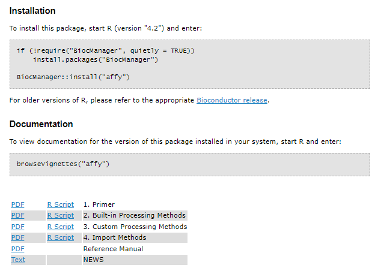
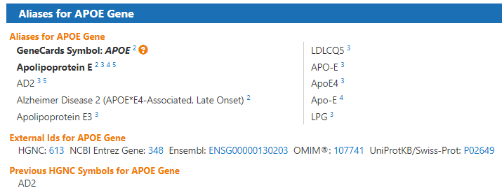

```{r bioinfo setup, include=FALSE}
setwd('../')
source("0700_bioinfo.R")
source("setup_example_data.R")
setwd('slides')
library(tidyverse)
library(ggplot2)
```

# R in Biology

## R in Biology

* R rose in popularity when [microarray
  technology](https://www.genome.gov/genetics-glossary/Microarray-Technology)
  came into widespread use
* A community of biological researchers and data analysts created a collection
  of software packages called [Bioconductor](https://www.bioconductor.org/)
* R packages form a bridge between:
  - biologists without a computational background and
  - statisticians and bioinformaticians, who invent new methods and implement
    the as R packages that are easily accessible by all

# Biological Data Overview

## Types of Biological Data

* There are five types of data used in biological data analysis:
  - raw/primary data
  - processed data
  - analysis results
  - metadata
  - annotation data

## Raw/primary data  

* The primary observations made by instruments/experiments
* Examples:
  - high-throughput sequencing data
  - mass/charge ratio data from mass spectrometry
  - 16S rRNA sequencing data from metagenomic studies
  - SNPs from genotyping assays,
* Often very large and not efficiently processed using R
* Specialized tools built outside of R are used to first process the
primary data into a form that is amenable to analysis
* The most common primary biological data types include [Microarrays], [High Throughput Sequencing] data,
and [mass spectrometry](https://en.wikipedia.org/wiki/Mass_spectrometry) data

## Processed data

* The result of any analysis or transformation of primary data into an intermediate, more interpretable form
* For example, in RNASeq:
  1. short reads aligned against a genome
  2. counted against annotated genes
  3. counts form counts matrix of genes x samples
* Processed data does not need to be stored long term if the raw data and code
  to produce it is available

## Analysis results

* Analysis results aren't data *per se* but are the results of analysis of
  primary data or processed data
* Usually what we use to form interpretations of our datasets
* Therefore we must manipulate them in much the same way as any other dataset

## Metadata

* Experiments usually study multiple samples
* Each sample typically has information associated with it
* "Data that is about data" is called *metadata*
* E.g. the information about human subjects included in a study including age at
  death, whether the person had a disease, the measurements of tissue quality,
  etc. is the metadata
* The primary and processed data and metadata are usually stored in
  different files, where the metadata (or *sample information* or *sample data*,
  etc) will have one column indicating the unique identifier (ID) of each sample.
* The processed data will typically have columns named for each of the sample IDs

## Annotation data

* Includes previously determined information about biological entities, e.g. genes
* Annotation data is publicly available information about the features we measure in our experiments
* Examples:
  - genomic coordinates where genes exist
  - any known functions of those genes
  - the domains found in proteins and their relative sequence
  - gene identifier cross references across different gene naming systems
  - single nucleotide polymorphism genomic locations and associations with traits or diseases

## Information flow in biological data analysis


# CSV Files

## CSV Files

* `csv` - character separated value file
* Most common, convenient, and flexible data file format in biology and bioinformatics
* Plain text files that contain rectangular data
* Each line of these files has some number of data values separated by a consistent character
  - most commonly the comma which are called [comma-separated value, or "CSV", files](https://en.wikipedia.org/wiki/Comma-separated_values)
* Filenames typically end with the extension `.csv`
* Other characters, especially the <Tab> character, may be used to create valid
files in this format

## Example CSV file

```
id,somevalue,category,genes
1,2.123,A,APOE
4,5.123,B,"HOXA1,HOXB1"
7,8.123,,SNCA
```

## Properties and principles of CSV files

* The first line often but not always contains the column names of each column
* Each value is delimited by the same character, in this case `,`
* Values can be any value, including numbers and characters
* When a value contains the delimiting character (e.g. HOXA1,HOXB1 contains a
  `,`), the value is wrapped in double quotes
* Values can be missing, indicated by sequential delimiters (i.e. `,,` or one
  `,` at the end of the line, if the last column value is missing)
* There is no delimiter at the end of the lines
* To be well-formatted *every line must have the same number of delimited
  values*

# Forms of Biological Data

## Common Biological Data Matrices

* *processed data* typically what we worked with in R
* Common features:
  - First row is column headers/sample names
  - First column is some *identifier* (gene symbol, genomic locus, etc)
  - Each row is a variable with sample values as columns

## Biological Data Matrix Example

```r
intensities <- readr::read_csv("example_intensity_data.csv")
intensities
# A tibble: 54,675 x 36
   probe     GSM972389 GSM972390 GSM972396 GSM972401 GSM972409
   <chr>         <dbl>     <dbl>     <dbl>     <dbl>     <dbl>
 1 1007_s_at      9.54     10.2       9.72      9.68      9.35
 2 1053_at        7.62      7.92      7.17      7.24      8.20
 3 117_at         5.50      5.56      5.06      7.44      5.19
 4 121_at         7.27      7.96      7.42      7.34      7.49
 5 1255_g_at      2.79      3.10      2.78      2.91      3.02
# ... with 54,665 more rows, and 26 more variables: GSM972433 <dbl>
#   GSM972487 <dbl>, GSM972488 <dbl>, GSM972489 <dbl>,
#   GSM972510 <dbl>, GSM972512 <dbl>, GSM972521 <dbl>
```

## Biological data is NOT Tidy!

* "tidy" data has the following properties:

  1. Each variable must have its own column
  2. Each observation must have its own row
  3. Each value must have its own cell

* Data from high throughput biological experiments have many more *variables*
  than *observations*!
* Biological data matrices are usually *transposed*
  - variables as rows
  - observations (i.e. samples) as columns

## Biological data is NOT Tidy!

```r
# A tibble: 54,675 x 36
   probe     GSM972389 GSM972390 GSM972396 GSM972401 GSM972409
   <chr>         <dbl>     <dbl>     <dbl>     <dbl>     <dbl>
 1 1007_s_at      9.54     10.2       9.72      9.68      9.35
 2 1053_at        7.62      7.92      7.17      7.24      8.20
```

##  Tidyverse works on tidy data

* Base R and tidyverse are optimized to perform computations on columns not rows
* Can perform operations on rows rather than columns, but code may perform poorly
* A couple options:

  * **Pivot into long format.**
  * **Compute row-wise statistics using `apply()`.**

    ```r
    intensity_variance <- apply(intensities, 2, var)
    intensities$variance <- intensity_variance
    ```

# Bioconductor

## Bioconductor

* [Bioconductor](https://www.bioconductor.org/) is an organized collection of
strictly biological analysis methods packages
* Hosted and maintained outside of [CRAN](https://cran.r-project.org/)
* Maintainers enforce [rigorous coding quality, testing, and documentation
standards](https://bioconductor.org/developers/package-guidelines/)
* Bioconductor is divided into roughly two sets of packages:
  - *core maintainer* packages
  - user contributed packages

## Bioconductor: Core maintainer packages

* Core maintainer packages define a set of common objects and classes e.g.:
  - [ExpressionSet class](https://www.bioconductor.org/packages/devel/bioc/vignettes/Biobase/inst/doc/ExpressionSetIntroduction.pdf)
in the [Biobase package](https://bioconductor.org/packages/release/bioc/html/Biobase.html))
* All Bioconductor packages must use these common objects and classes
* Ensures consistency among all Bioconductor packages

## Installing Bioconductor

* Bioconductor is itself a package called [BiocManager](https://www.bioconductor.org/install/)
* `BiocManager` must be installed prior to installing other Bioconductor packages
* To [install bioconductor] (note `install.packages()`):

  ```r
  if (!require("BiocManager", quietly = TRUE))
      install.packages("BiocManager")
  BiocManager::install(version = "3.16")
  ```

## Installing Bioconductor packages

```r
# installs the affy bioconductor package for microarray analysis
BiocManager::install("affy")
```

## Bioconductor package pages

{width=90%}

## Bioconductor documentation

* In addition, Biconductor provides three types of documentation:

  - [Workflow tutorials](https://bioconductor.org/packages/release/workflows/) on
    how to perform specific analysis use cases
  - [Package vignettes](https://bioconductor.org/help/package-vignettes/) for
    every package, provides worked example of how to use the package
  - Detailed, consistently formatted reference documentation that gives precise
    information on functionality and use of each package


## Base Bioconductor Packages & Classes

* Base Bioconductor packages define convenient data structures for storing and
  analyzing biological data
* The `SummarizedExperiment` class stores data and metadata for an experiment

## `SummarizedExperiment` Illustration

{width=80%}

## `SummarizedExperiment` Details

* `SummarizedExperiment` class is used ubiquitously throughout the Bioconductor
  package ecosystem
* `SummarizedExperiment` stores:
  - Processed data (`assays`)
  - Metadata (`colData` and `exptData`)
  - Annotation data (`rowData`)
  
# Microarrays

## Microarrays

<div class="columns-2">

{width=80%}

* Microarrays: devices that measure relative abundance of DNA molecules
* Measure 1000s of DNA molecules simultaneously
* Molecules are selected *a priori* and "hard coded" onto the device

</div>

## Microarray Design

{width=100%}

## Types of Microarrays 

* Microarrays measure DNA
* Usually one microarray is generated for an individual sample
* Sample preparation method depends on target molecules 
  - DNA: e.g. genetic variants, the DNA itself is biochemically extracted
  - RNA abundance: RNA extracted then reverse transcribed to complementary DNA (cDNA)
  
## Microarray Terminology

* **probe** - short (~25nt) cDNA molecule complementary to portion of target transcript
* **probe set** - a set of probes that all target the same gene
* **flowcell** - the glass slide portion of device that has probes deposited on it

## Microarray Data Generation Process

{width=100%}


# High Throughput Sequencing

## High Throughput Sequencing

* High throughput sequencing (HTS) technologies measure and digitize the
  nucleotide sequences of thousands to billions of DNA molecules simultaneously
* HTS instruments can determine sequence of any DNA molecule in a sample  
* HTS datasets sometimes called *unbiased* assays
* Most popular HTS technology today is provided by [Illumina biotechnology company](https://en.wikipedia.org/wiki/Illumina,_Inc.)

## Sequencing by synthesis

* Illumina sequencing uses biotechnological technique called *sequencing by synthesis*
* Sequencing instruments are called *sequencers*
* The process, briefly:
  1. $10^7$ to $10^9$ short (~300 nucleotide long) DNA molecules ligated to glass slide
  2. Denatured to become single stranded,
  3. Complementary strand by incorporating fluorescently tagged nucleotides
  4. Tagged nucleotides excited by a laser and photograph taken of slide
  5. Images are processed to reconstruct DNA sequences from fluorescence events

## HTS Measures DNA

* Any DNA molecules may be subjected to sequencing via this method
* Many different types of experiments are possible:

  - *Whole genome sequencing (WGS)*
  - *RNA Sequencing (RNASeq)*
  - *Whole genome bisulfite sequencing (WGBS)*
  - *Chromatin immunoprecipitation followed by sequencing (ChIPSeq)*

* Each of these experiments create the same type of data
* Each must be interpreted appropriately based on experiment

## Raw HTS Data

* Raw HTS data  are the digitized DNA sequences for the billions of molecules captured
  by the flow cell
* Each digitized nucleotide sequence is called a *read*
* Data stored in a standardized format called the [FASTQ file format](https://en.wikipedia.org/wiki/FASTQ_format)

## FASTQ Format

* Data for a single read in FASTQ format:

```
@SEQ_ID
GATTTGGGGTTCAAAGCAGTATCGATCAAATAGTAAATCCATTTGTTCAACTCACAGTTT
+
!''*((((***+))%%%++)(%%%%).1***-+*''))**55CCF>>>>>>CCCCCCC65
```

* `@` - header, unique read name per flowcell
* `GAT...` - the nucleotide sequence
* `+` - second header, usually blank
* `!''...` - the [phred quality scores](https://en.wikipedia.org/wiki/Phred_quality_score)
  for each base in the read

## HTS Sequence Analysis

* Raw sequencing reads must be processed with bioinformatic algorithms
* Two broad classes of sequence analysis:
  - *de novo* assembly to recover complete length of original molecules
  - *sequence alignment* against a set of reference sequences, e.g. genome
* Most data we analyze in R comes from aligned reads that have been produced by
  other software

## Sequence Alignment

* Reads aligned to a reference sequence form a distribution of read counts
  across all locations in the reference sequence
* Any given reference sequence location, or *locus*, has zero or more reads that
  align to it
* The number of reads aligning to a given locus is called the *read count*
* The read count is proportional to the copy number of molecules in the sample
  that correspond to that locus
* Read counts from all genes in a reference genome form *count data*

##

{width=100%}

## Count Data

* The *read counts* that align to each locus of a genome form a distribution
* Count data have two important properties:

  - **Count data are integers**
  - **Counts are non-negative**

* *count data are not normally distributed*

## Analyzing Count Data

* Techniques that assume data are normally distributed (like linear regression)
  are not appropriate for count data
* Must account for this in one of two ways:

  * **Use statistical methods that model counts data** - generalized linear models
  that model data using Poisson and Negative Binomial distributions
  * **Transform the data to have be normally distributed** - certain [statistical
  transformations](https://en.wikipedia.org/wiki/Data_transformation_(statistics)),
  such as [regularized log](https://rdrr.io/bioc/DESeq2/man/rlog.html) or rank
  transformations can make counts data more closely follow a normal distribution

# Gene Identifiers

## Gene Identifier Systems

* First gene sequence determined in 1965 - [an alanine
tRNA in yeast](https://pubmed.ncbi.nlm.nih.gov/14263761/)
* Genes are distinct entities - how do we name them?
* In 1979, formal guidelines for human gene nomenclature proposal gave
  researchers a common vocabulary for genes
* In 1989,  Human Genome Organisation (HUGO), become HUGO Gene Nomenclature Committee (HGNC)
* HGNC remains the official body providing guidelines and gene naming authority
* HGNC gene names called *gene symbols*

## HGNC Gene Name Guidelines

1. Each gene is assigned a unique symbol, HGNC ID and descriptive name.
2. Symbols contain only uppercase Latin letters and Arabic numerals.
3. Symbols should not be the same as commonly used abbreviations
4. Nomenclature should not contain reference to any species or “G” for gene.
5. Nomenclature should not be offensive or pejorative.

## Gene Symbols

* Gene symbols are the most human-readable system for naming genes
* e.g. *BRCA1*, *APOE*, and *ACE2*
* Symbols are convenient for humans when reading, identifying, communicating about genes
* However, symbols may be ambiguous, and some genes have many synonymous symbols
* Other gene identifier systems evolved in parallel to address this ambiguity

## Gene symbol ambiguity: APOE

{width=100%}

## Human Gene Identifier Systems: Ensembl

* [Ensembl](https://www.ensembl.org/) Project genome browser and genome annotation
  database
* Assigns automatic, systematic ID called *Ensembl Gene ID* during genome
  annotation
* Ensembl Gene ID follows convention `ENSGNNNNNNNNNNN`, where `N` are numbers
  - e.g. APOE is `ENSG00000130203`
* Gene annotation is
* Supports *versions* of genes, e.g. `ENSG00000130203.10` where `.10` indicates this
  is the 10th updated version of this gene
* Previous versions maintained

## Ensembl Gene IDs for Non-humans

* Ensembl Gene IDs have organism-specific conventions:

```{r echo=FALSE, results='asis'}
library(knitr)
kable(tribble(
  ~`Gene ID Prefix`, ~Organism, ~Symbol, ~Example,
  "`ENSG`", "Homo sapiens", "HOXA1", "ENSG00000105991",
  "`ENSMUSG`", "Mus musculus (mouse)", "Hoxa1", "ENSMUSG00000029844",
  "`ENSDARG`", "Danio rario (zebrafish)", "hoxa1a", "ENSDARG00000104307",
  "`ENSFCAG`", "Felis catus (cat)", "HOXA1",  "ENSFCAG00000007937",
  "`ENSMMUG`", "Macaca mulata (macaque)", "HOXA1", "ENSMMUG00000012807",
))
```

## Other Identifier Systems

* Ensembl is not the only gene identifier system besides gene symbol
* Entrez Gene IDs (UCSC Gene IDs) used by the [NCBI Gene
  database](https://www.ncbi.nlm.nih.gov/gene) are unique integers for each gene
  in each organism
  - APOE in humans is `384`, in mouse `11816`
* Online Mendelian Inheritance in Man (OMIM) database has identifiers that look like
  `OMIM:NNNNN`, where each OMIM ID refers to a unique gene or human phenotype
  - APOE is `OMIM:107741`
* UniProtKB/Swiss-Prot are protein sequence databases
  - APOE is `P02649`

## Mapping Between Identifier Systems

* Often must map between identifier systems
* e.g. We have Ensembl Gene ID, but want gene symbols
* Ensembl provides [BioMart](https://www.ensembl.org/biomart/martview) that provides
  gene identifier mappings
* Mappings can be downloaded as CSV files
* Ensembl website has [helpful
  documentation](https://useast.ensembl.org/info/data/biomart/index.html) on how
  to use BioMart to download annotation data

## Biomart in Bioconductor: `biomaRt`

* Ensembl also provides [the `biomaRt` Bioconductor
package](https://useast.ensembl.org/info/data/biomart/biomart_r_package.html)
* Allows programmatic access to the same information directly from R
* There is [much more information in the Ensembl
  databases](https://useast.ensembl.org/info/genome/index.html) than gene
  annotation data that can be accessed via BioMart

## `biomaRt` Example

```r
# this assumes biomaRt is already installed through bioconductor
library(biomaRt)

# the human biomaRt database is named "hsapiens_gene_ensembl"
ensembl <- useEnsembl(biomart="ensembl", dataset="hsapiens_gene_ensembl")
```

## `biomaRt` Example

```r
# listAttributes() returns a data frame, convert to tibble
as_tibble(listAttributes(ensembl))
# A tibble: 3,143 x 3
   name                          description                  page        
   <chr>                         <chr>                        <chr>       
 1 ensembl_gene_id               Gene stable ID               feature_page
 2 ensembl_gene_id_version       Gene stable ID version       feature_page
 3 ensembl_transcript_id         Transcript stable ID         feature_page
 4 ensembl_transcript_id_version Transcript stable ID version feature_page
 5 ensembl_peptide_id            Protein stable ID            feature_page
 6 ensembl_peptide_id_version    Protein stable ID version    feature_page
 7 ensembl_exon_id               Exon stable ID               feature_page
 8 description                   Gene description             feature_page
 9 chromosome_name               Chromosome/scaffold name     feature_page
10 start_position                Gene start (bp)              feature_page
# ... with 3,133 more rows
```

## `biomaRt` Example

* `name` column provides programmatic name associated with the attribute
that can be used to retrieve that annotation information using the `getBM()`
function:

```r
# create a tibble with ensembl gene ID, HGNC gene symbol, and gene description
gene_map <- as_tibble(
  getBM(
    attributes=c("ensembl_gene_id", "hgnc_symbol", "description"),
    mart=ensembl
  )
)
```

## `biomaRt` Example

```r
gene_map
# A tibble: 68,012 x 3
   ensembl_gene_id hgnc_symbol description                                                               
   <chr>           <chr>       <chr>                                                                     
 1 ENSG00000210049 MT-TF       mitochondrially encoded tRNA-Phe ...
 2 ENSG00000211459 MT-RNR1     mitochondrially encoded 12S rRNA ...
 3 ENSG00000210077 MT-TV       mitochondrially encoded tRNA-Val ...
 4 ENSG00000210082 MT-RNR2     mitochondrially encoded 16S rRNA ...
 5 ENSG00000209082 MT-TL1      mitochondrially encoded tRNA-Leu ...
 6 ENSG00000198888 MT-ND1      mitochondrially encoded NADH:ubiquinone
 7 ENSG00000210100 MT-TI       mitochondrially encoded tRNA-Ile ...
 8 ENSG00000210107 MT-TQ       mitochondrially encoded tRNA-Gln ...
 9 ENSG00000210112 MT-TM       mitochondrially encoded tRNA-Met ...
10 ENSG00000198763 MT-ND2      mitochondrially encoded NADH:ubiquinone
# ... with 68,002 more rows
```

## Mapping Homologs

* Many organisms share evolutionarily conserved genes (i.e. homologs)
* `biomaRt` links identifiers by explicitly [connecting
  different biomaRt
  databases](https://bioconductor.org/packages/release/bioc/vignettes/biomaRt/inst/doc/accessing_ensembl.html#given-the-human-gene-tp53-retrieve-the-human-chromosomal-location-of-this-gene-and-also-retrieve-the-chromosomal-location-and-refseq-id-of-its-homolog-in-mouse.)
  with the `getLDS()` function:

  ```r
  human_db <- useEnsembl("ensembl", dataset = "hsapiens_gene_ensembl")
  mouse_db <- useEnsembl("ensembl", dataset = "mmusculus_gene_ensembl")
  orth_map <- as_tibble(
    getLDS(attributes = c("ensembl_gene_id", "hgnc_symbol"),
         mart = human_db,
         attributesL = c("ensembl_gene_id", "mgi_symbol"),
         martL = mouse_db
    )
)
```

## Mapping Homologs

```r
orth_map
# A tibble: 26,390 x 4
   Gene.stable.ID  HGNC.symbol Gene.stable.ID.1   MGI.symbol
   <chr>           <chr>       <chr>              <chr>     
 1 ENSG00000198695 MT-ND6      ENSMUSG00000064368 "mt-Nd6"  
 2 ENSG00000212907 MT-ND4L     ENSMUSG00000065947 "mt-Nd4l"
 3 ENSG00000279169 PRAMEF13    ENSMUSG00000094303 ""        
 4 ENSG00000279169 PRAMEF13    ENSMUSG00000094722 ""        
 5 ENSG00000279169 PRAMEF13    ENSMUSG00000095666 ""        
 6 ENSG00000279169 PRAMEF13    ENSMUSG00000094741 ""        
 7 ENSG00000279169 PRAMEF13    ENSMUSG00000094836 ""        
 8 ENSG00000279169 PRAMEF13    ENSMUSG00000074720 ""        
 9 ENSG00000279169 PRAMEF13    ENSMUSG00000096236 ""        
10 ENSG00000198763 MT-ND2      ENSMUSG00000064345 "mt-Nd2"  
# ... with 26,380 more rows
```

## Alternative: `AnnotationDbi`

* BioMart/biomaRt is not the only ways to map different gene identifiers
* [AnnotateDbi](https://bioconductor.org/packages/release/bioc/html/AnnotationDbi.html)
  provides gene identifier mapping independent of Ensembl
* Also includes identifiers from technology platforms, e.g. probe set IDs from [microarrays](#microarrays)
* Also allows comprehensive and flexible homolog mapping


# Gene Expression

## Gene Expression

* Gene expression: the process by which information from a gene is used in the
  synthesis of functional gene products that affect a phenotype.
* Gene expression studies are often focused on protein coding genes, there are many
other functional molecules, e.g. [transfer
RNAs](https://www.genome.gov/genetics-glossary/Transfer-RNA),
[lncRNAs](https://en.wikipedia.org/wiki/Long_non-coding_RNA), etc, that are
produced by this process. The gene expression process has many steps and
intermediate products, as depicted in the following figure:

## Gene Expression Process

* Specific parts of the genome code for genes
* Gene sequences *transcribed* into RNA molecules called *transcripts*
* In lower organisms (e.g. bacteria), RNA molecules passed directly to ribosomes
* In most higher organisms (i.e. eukaryotes):
  1. Initial transcripts, called *pre-messenger RNA (pre-mRNA) transcripts* are
  processed via splicing 
  2. Splicing removes certain parts of pre-mRNA (*introns*) and concatenates
  adjacent sequences (*exons*) together into *mature RNA (mRNA)*
  3. mRNA exported from nucleus to be translated at ribosomes 
  
## Gene Expression Process

{width=80%}
 
## Gene Expression Measurements

* Measurements proportional to abundance (or copy number) of RNA transcripts
* Measurements are always non-negative
* Usually *relative* to some normalizing quantity
  - i.e. a value of zero does *not* mean gene is not expressed!
* Some methods (e.g. digital droplet PCR) can estimate absolute abundance
  (i.e. exact number of copies)

## Gene Expression Assays

* Many ways to measure the abundance of RNA transcripts

  - Light absorbance
  - [Northern blot](https://www.genome.gov/genetics-glossary/Northern-Blot) 
  - [quantitative polymerase chain reaction
  (qPCR)](https://www.thermofisher.com/blog/ask-a-scientist/what-is-qpcr/)
  - Oligonucleotide and microarrays
  - High throughput RNA sequencing (RNASeq)

# Gene Expression Data in Bioconductor

## Gene Expression Data in Bioconductor

* [SummarizedExperiment
container](https://bioconductor.org/packages/release/bioc/html/SummarizedExperiment.html)
 standard way to load and work with gene expression data in Bioconductor
This container requires the following information:

  - `assays` - one or more measurement assays (e.g. gene expression) in the form of a feature by sample matrix
  - `colData` - metadata associated with the samples (i.e. columns) of the assays
  - `rowData` - metadata associated with the features (i.e. rows) of the assays
  - `exptData` - additional metadata about the experiment itself, like protocol, project name, etc

## SummarizedExperiment Schematic

{width=70%}

## Creating SummarizedExperiments

*  Many Bioconductor packages for specific types of data, e.g.
  [limma](#differential-expression--microarrays-limma) create SummarizedExperiment
  objects for you
* You may also create your own...

## Creating `SummarizedExperiment`s

```{r load summarizedexperiment, include=FALSE}
library(SummarizedExperiment)
intensities <- readr::read_delim("../example_intensity_data.csv",delim=" ")
rowData <- intensities["probeset_id"]
intensities <- as.data.frame(
  dplyr::select(intensities, -probeset_id)
)
rownames(intensities) <- rowData$probeset_id
colData <- tibble(
  sample_name=colnames(intensities),
  condition=sample(c("case","control"),ncol(intensities),replace=TRUE)
)
se <- SummarizedExperiment(
   assays=list(intensities=intensities),
   colData=colData,
   rowData=rowData
)
```


```r
# microarray expression dataset intensities
intensities <- readr::read_delim(
  "example_intensity_data.csv",delim=" "
)

# the first column of intensities tibble is the probesetId,
# extract to pass as rowData
rowData <- intensities["probeset_id"]

# remove probeset IDs from tibble and turn into a R dataframe
# so that we can assign rownames since tibbles don't support
# row names
intensities <- as.data.frame(
  select(intensities, -probeset_id)
)
rownames(intensities) <- rowData$probeset_id
```

## `SummarizedExperiment` cont'd

```r
# these column data are made up, but you would have a
# sample metadata file to use
colData <- tibble(
  sample_name=colnames(intensities),
  condition=sample(c("case","control"),ncol(intensities),replace=TRUE)
)

se <- SummarizedExperiment(
   assays=list(intensities=intensities),
   colData=colData,
   rowData=rowData
)
```

## `SummarizedExperiment` cont'd

```
se
## class: SummarizedExperiment
## dim: 54675 35
## metadata(0):
## assays(1): intensities
## rownames(54675): 1007_s_at 1053_at ... AFFX-TrpnX-5_at AFFX-TrpnX-M_at
## rowData names(1): probeset_id
## colnames(35): GSM972389 GSM972390 ... GSM972512 GSM972521
## colData names(2): sample_name condition
```

# Differential Expression Analysis

## Differential Expression Analysis

* Goal: identify to what extent gene expression is associated with one or more
  variables of interest
* Typically analyze whole transcriptome (i.e. 1000s of genes)
* Two required components:
  - an expression matrix (e.g. genes x samples)
  - a *design matrix*
  
## The Design Matrix

* A design matrix is a numeric matrix that contains
  - the variables we wish to model
  - any covariates or confounders we wish to adjust for
* Encoded in a way that statistical procedures understand
* Construct these matrices from a tibble with the [`model.matrix()`
function](https://www.rdocumentation.org/packages/stats/versions/3.6.2/topics/model.matrix)

## Example Metadata
```{r, include=FALSE}
# subset down metadata to make examples clearer
ad_metadata <- dplyr::filter(ad_metadata, ID %in% c('A1','A2','A3','C1','C2','C3'))
```

```{r}
ad_metadata 
```

## Case vs Control Design

* Model matrix to identify genes that are increased or decreased in people with
AD compared with Controls
* The `~ condition` argument is an an R
[formula](https://rviews.rstudio.com/2017/02/01/the-r-formula-method-the-good-parts/)

```r
model.matrix(~ condition, data=ad_metadata)
```

## Case vs Control Design

```{r model matrix}
model.matrix(~ condition, data=ad_metadata)
```

## Formulas in R

The general format of a formula is as follows:

```r
# portions in [] are optional
[<outcome variable>] ~ <predictor 1> [+ <predictor 2>]...

# examples

# model Gene 3 expression as a function of disease status
`Gene 3` ~ condition

# model the amount of tau pathology as a function of abeta pathology,
# adjusting for age at death
tau ~ age_at_death + abeta

# can create a model without an outcome variable
~ age_at_death + condition
```

## More Complex Designs

* Can include other variables in model to adjust for covariates or test other
  contrasts
* e.g. adjust out the effect of age by including `age_at_death` as a covariate in the model:

```r
model.matrix(~ age_at_death + condition, data=ad_metadata)
```

## More Complex Designs

```{r model matrix cov}
model.matrix(~ age_at_death + condition, data=ad_metadata)
```

```{r, include=FALSE}
# we messed up ad_metadata, put it back
setwd('../')
source("0700_bioinfo.R")
source("setup_example_data.R")
setwd('slides')
```

## Microarray Gene Expression Data

Four steps involved in analyzing gene expression microarray data:

1. **Summarization of probes to probesets**
2. **Normalization**
3. **Quality control**
4. **Analysis**

## Microarray Data

* Raw probe intensity data stored in CEL data files
* [`affy` Bioconductor
package](https://www.bioconductor.org/packages/release/bioc/html/affy.html)
  - Loads CEL files into Bioconductor objects
  - Performs key preprocessing operations
* Typically have many CEL files, one per each sample

## Reading CEL Files

* Load CEL files with `affy::ReadAffy` function

```r
# read all CEL files in a single directory
affy_batch <- affy::ReadAffy(celfile.path="directory/of/CELfiles")

# or individual files in different directories
cel_filenames <- c(
  list.files( path="CELfile_dir1", full.names=TRUE, pattern=".CEL$" ),
  list.files( path="CELfile_dir2", full.names=TRUE, pattern=".CEL$" )
)
affy_batch <- affy::ReadAffy(filenames=cel_filenames)
```

## Probe summarization and normalization

* `affy` package provides functions to perform probe summarization and normalization
* Robust Multi-array Average (RMA) state of the art method for normalization
* `affy::rma` function implements RMA, performs summarization and normalization
  of multiple arrays simultaneously

## Aside: R package data

* Some packages include data with the R functionality
* Load package data into your workspace with `data()` function

```r
library(affydata)
data(Dilution)
```

## RMA normalization

```{r microarray norm 1, include=F}
library(affy)
library(affydata)
data(Dilution)

# normalize the Dilution microarray expression values
# note Dilution is an AffyBatch object
eset_rma <- affy::rma(Dilution,verbose=FALSE)
```

```r
library(affy)
library(affydata)
data(Dilution)

# normalize the Dilution microarray expression values
# note Dilution is an AffyBatch object
eset_rma <- affy::rma(Dilution,verbose=FALSE)
```

## `ExpressionSet` vs `SummarizedExperiment`

* `ExpressionSet` is a container that contains high throughput assay data
* Similar to and superseded by `SummarizedExperiment`
* Some older packages (notably `affy`) return `ExpressionSet` objects, not
  `SummarizedExperiment`s
* Similar interface, but some key differences

| Operation | ExpressionSet | SummarizedExperiment |
|-----------|-----------------|------------------------|
| Get expression values | `exprs(eset)` | `assays(se)` |
| Get column data | `phenoData(eset)` | `colData(se)` |
| Get row data | `annotation(eset)` | `rowData(se)` |

## RMA normalization

```{r microarray norm 2, echo=F}
# plot distribution of non-normalized probes
# note rma normalization takes the log2 of the expression values,
# so we must do so on the raw data to compare
raw_intensity <- as_tibble(exprs(Dilution)) %>%
  mutate(probeset_id=rownames(exprs(Dilution))) %>%
  pivot_longer(-probeset_id, names_to="Sample", values_to = "Intensity") %>%
  mutate(
    `log2 Intensity`=log2(Intensity),
    Category="Before Normalization"
  )

# plot distribution of normalized probes
rma_intensity <- as_tibble(exprs(eset_rma)) %>%
  mutate(probesetid=featureNames(eset_rma)) %>%
  pivot_longer(-probesetid, names_to="Sample", values_to = "log2 Intensity") %>%
  mutate(Category="RMA Normalized")

dplyr::bind_rows(raw_intensity, rma_intensity) %>%
  ggplot(aes(x=Sample, y=`log2 Intensity`)) +
  geom_boxplot() +
  facet_wrap(vars(Category))
```

## Differential Expression: Microarrays (limma)

* [limma](https://bioconductor.org/packages/release/bioc/html/limma.html): `li`near `m`odels of `mi`croarrays
* Designed for analyzing microarray gene expression data
* One of the [top most
downloaded](https://bioconductor.org/packages/stats/) Bioconductor packages
* Supports arbitrarily complex experimental designs while maintaining strong statistical power
* Can perform reliable inference even with small sample sizes

## limma Example Setup

* limma requires:
  - `ExpressionSet` or `SummarizedExperiment` container
  - a design matrix

```r
ad_se  <- SummarizedExperiment(
  assays=list(intensities=intensities),
  colData=ad_metadata,
  rowData=rownames(intensities)
)

# design matrix for AD vs control, adjusting for age at death
ad_vs_control_model <- model.matrix(
  ~ age_at_death + condition,
  data=ad_metadata
)
```

## limma Example: fit model

```r
# now run limma
# first fit all genes with the model
fit <- limma::lmFit(
  assays(se)$intensities,
  ad_vs_control_model
)

# now better control fit errors with the empirical Bayes method
fit <- limma::eBayes(fit)
```

```{r limma fit, include=FALSE}
ad_vs_control_model <- model.matrix(~ age_at_death + condition, data=ad_metadata)

# now run limma
# first fit all genes with the model
fit <- limma::lmFit(
  assays(ad_se)$intensities,
  ad_vs_control_model
)

# now better control fit errors with the empirical Bayes method
fit <- limma::eBayes(fit)
```


## limma Results

* Look at top results using `limma::topTable()` function:

```{r}
# the coefficient name conditionAD is the column name in the design matrix
topTable(fit, coef="conditionAD", adjust="BH", number=5)
```

# RNASeq

## RNASeq

* RNA sequencing (RNASeq) digitizes the RNA molecules in a sample
* Short reads (~100-300 nucleotides long) represent RNA fragments from longer
  transcripts
* RNA molecules are (in principle) sequenced in proportion to their relative copy
  number in the original sample
* Each sequencing dataset has a total number of reads called *library size*
* Relative copy number means *absence of evidence is not evidence of absence*
  - i.e. count of zero does *not necessarily mean* no molecules

## RNASeq Gene Expression Data

* When aligned, reads are counted using a *reference annotation* that defines
  locations of genes in the genome
* For a single sample, output is a vector of read counts for each gene in the
  annotation
* Genes with no reads mapping to them will have a count of zero
* All others will have a read count of one or more;
* Complex multicellular organisms have on the order of thousands to tens of
  thousands of genes

## The Counts Matrix

* Read counts from multiple samples of genes using the same annotation are
  usually concatenated into a *counts matrix*
* Counts matrix usually has genes as rows and samples as columns (not tidy!)
* Usually in `csv` or `tsv` (tab separated) format
* These counts are from O'Meara et al 2014

```r
counts <- read_tsv("verse_counts.tsv")
```

```{r rnaseq load, include=FALSE}
setwd('..')
counts <- read_tsv("verse_counts.tsv")
# the library size for these samples are very similar
# tweak some of them so that the counts normalization section plots look better... >.>
#counts$P0_1 <- round(counts$P0_1*1.2,0)
#counts$P7_2 <- round(counts$P7_2*2.0,0)
#counts$Ad_2 <- round(counts$Ad_2*0.7,0)
setwd('slides')
counts
```

## Example Counts Matrix

```{r}
counts
```

```{r, include=FALSE}
## A tibble: 55,416 × 9
#   gene                  P0_1  P0_2  P4_1  P4_2  P7_1  P7_2  Ad_1  Ad_2
#   <chr>                <dbl> <dbl> <dbl> <dbl> <dbl> <dbl> <dbl> <dbl>
# 1 ENSMUSG00000102693.2     0     0     0     0     0     0     0     0
# 2 ENSMUSG00000064842.3     0     0     0     0     0     0     0     0
# 3 ENSMUSG00000051951.6    19    24    17    17    17    12     7     5
# 4 ENSMUSG00000102851.2     0     0     0     0     1     0     0     0
# 5 ENSMUSG00000103377.2     1     0     0     1     0     1     1     0
# 6 ENSMUSG00000104017.2     0     3     0     0     0     1     0     0
# 7 ENSMUSG00000103025.2     0     0     0     0     0     0     0     0
# 8 ENSMUSG00000089699.2     0     0     0     0     0     0     0     0
# 9 ENSMUSG00000103201.2     0     0     0     0     0     0     0     1
#10 ENSMUSG00000103147.2     0     0     0     0     0     0     0     0
## … with 55,406 more rows
```

## Analyzing Counts Data

There are typically three steps when analyzing a RNASeq count matrix:

1. **Filter genes that are unlikely to be differentially expressed.**
2. **Normalize filtered counts to make samples comparable to one another.**
3. **Differential expression analysis of filtered, normalized counts.**

## Filtering Counts

* Genes not detected in any sample (counts are zero) should not be considered
* Genes with very low counts are not likely to be informative
* Eliminating these genes from consideration reduce multiple hypothesis testing
  burden later
* General approach: set read count criteria to filter out genes

## Filtering Undetected Genes

* Genes not detected in any sample should be filtered

```{r rnaseq filter zero counts}
nonzero_genes <- rowSums(counts[-1])!=0
filtered_counts <- counts[nonzero_genes,]
slice_head(filtered_counts, n=5)
```

## Filtering Very Low Count Genes

* Genes with fewer than 2 reads across all samples filtered

```{r rnaseq filter zero one counts}
nonzero_genes <- rowSums(counts[-1])>=2
filtered_counts <- counts[nonzero_genes,]
slice_head(filtered_counts, n=5)
```

## Filtering by Non-zero Sample Counts

* Statistical procedures don't work with too many zeros
* Small read counts may indicate very lowly abundant but biologically relevant genes
* Can filter genes based on *number of non-zero sample counts*
  - e.g. Filter out genes if they have zero counts in more than half of samples
  
## Filtering by Non-zero Sample Counts

```{r rnaseq nonzero samples, echo=FALSE}
library(patchwork)

nonzero_counts <- mutate(counts,`Number of samples`=rowSums(counts[-1]!=0)) %>%
  group_by(`Number of samples`) %>%
  summarize(`Number of genes`=n() ) %>%
  mutate(`Cumulative number of genes`=sum(`Number of genes`)-lag(cumsum(`Number of genes`),1,default=0))

sum_g <- ggplot(nonzero_counts) +
  geom_bar(aes(x=`Number of samples`,y=`Cumulative number of genes`,fill="In at least n"),stat="identity") +
  geom_bar(aes(x=`Number of samples`,y=`Number of genes`,fill="In exactly n"),stat="identity") +
  labs(title="Number of genes detected in n samples") +
  scale_fill_discrete(name="Nonzero in:")

sum_g
```


## Filtering by Non-zero Sample Counts

* Consider genes present in at least $n$ samples
* Plots distribution of mean counts within each number of nonzero samples:

```{r rnaseq nonzero dist, echo=FALSE, fig.dim=c(8,3), message=FALSE, warning=FALSE}
# calculate the mean count for non-zero counts in genes with exactly n non-zero counts
mutate(counts,`Number of nonzero samples`=factor(rowSums(counts[-1]!=0))) %>%
  pivot_longer(-c(gene,`Number of nonzero samples`),names_to="Sample",values_to="Count") %>%
  group_by(`Number of nonzero samples`) %>%
  group_by(gene, .add=TRUE) %>% summarize(`Nonzero Count Mean`=mean(Count[Count!=0]),.groups="keep") %>%
  ungroup() %>%
  ggplot(aes(x=`Number of nonzero samples`,y=`Nonzero Count Mean`,fill=`Number of nonzero samples`)) +
  geom_violin(scale="width") +
  scale_y_log10() +
  labs(title="Nonzero count mean for genes with exactly n nonzero counts")
```

## Mean-variance Relationship

* In counts data, genes with higher mean count also have higher variance
* Mean-variance dependence means these count data are *heteroskedastic*

```{r rnaseq mean variance, echo=FALSE, fig.dim=c(8,3)}
tibble(
  Mean=rowMeans(filtered_counts[-1]),
  Variance=apply(filtered_counts[-1],1,var)
) %>%
  ggplot(aes(x=Mean,y=Variance)) +
  geom_point(alpha=0.2) +
  geom_smooth(method = 'gam', formula=y ~ s(x, bs = "cs")) +
  scale_x_log10() + scale_y_log10()
```

## Filtering For Statistics

* Genes with very few counts do not enable reliable statistical inference
* **There is no biological meaning to any filtering threshold**
* The read counts for a gene depends upon the total number of reads generated
* We cannot use filtering to "remove lowly expressed genes"
* Can only filter out genes that are below the detection threshold afforded by
  the library size of the dataset

## Count Distributions

* The range of gene expression in a cell varies by orders of magnitude
* Consider the distribution of read counts on a log10 scale from one sample

```r
dplyr::select(filtered_counts, Ad_1) %>%
  filter(Ad_1 > 0) %>% # avoid taking log10(0)
  mutate(`log10(counts)`=log10(Ad_1)) %>%
  ggplot(aes(x=`log10(counts+1)`)) +
  geom_histogram(bins=50) +
  labs(title='log10(counts) distribution for Adult mouse')
```
## Count Distributions

```{r rnaseq sample count dist, echo=FALSE, fig.dim=c(8,3)}
dplyr::select(filtered_counts, Ad_1) %>%
  filter(Ad_1 > 0) %>% # avoid taking log10(0)
  mutate(`log10(counts)`=log10(Ad_1)) %>%
  ggplot(aes(x=`log10(counts)`)) +
  geom_histogram(bins=50) +
  labs(title='log10(counts) distribution for Adult mouse')
```

## Count Distributions

* Consider distribution for all the samples as a ridgeline plot

```{r rnaseq ridgeline, echo=FALSE}
library(ggridges)

pivot_longer(filtered_counts,-c(gene),names_to="Sample",values_to="Count") %>%
  filter(Count>0) %>%
  mutate(`log10(Count)`=log10(Count)) %>%
  ggplot(aes(y=Sample,x=`log10(Count)`,fill=Sample)) +
  geom_density_ridges(bandwidth=0.132) +
  labs(title="log10(Count) Distributions")
```

## Count Normalization

* Every sample will have a different number of reads (library size)
* The number of reads that maps to any given gene is dependent upon:
  - the relative abundance of the molecule in the sample
  - the library size of each sample
* The *raw read counts* are not directly comparable between samples
* Counts in each sample must be *normalized* so they are comparable

## Count Normalization

* Count normalization: the process by which the number of raw counts in each
  sample is scaled by a factor to make multiple samples comparable
* Many strategies have been proposed to do this
* The simplest is: divide ever count by some factor of the library size
  - e.g. compute *counts per million reads* or *CPM* normalization

$$
cpm_{s,i} =  \frac{c_{s,i}}{l_s} * 10^6
$$

## Counts Per Million

$$
cpm_{s,i} =  \frac{c_{s,i}}{l_s} * 10^6
$$
* $c_{s,i} =$ raw count of gene $i$ in sample $s$
* $l_s =$ library size for sample $s$
* In principle, the proportion of read counts for each gene will be comparable
  between samples

## CPM Normalization

```{r rnaseq ridgeline cpm, echo=FALSE}
library(ggridges)

raw <- pivot_longer(filtered_counts,-c(gene),names_to="Sample",values_to="Count") %>%
  filter(Count>0) %>%
  mutate(`log10(Count)`=log10(Count)) %>%
  ggplot(aes(y=Sample,x=`log10(Count)`,fill=Sample)) +
  geom_density_ridges(bandwidth=0.132) +
  labs(title="log10(Count) Distributions")

size_factors <- colSums(filtered_counts[-1])/10^6
cpm_counts <- as_tibble(filtered_counts[-1]/size_factors)
norm <- pivot_longer(cpm_counts,everything(),names_to="Sample",values_to="CPM") %>%
  filter(CPM>0) %>%
  mutate(`log10(CPM)`=log10(CPM)) %>%
  ggplot(aes(y=Sample,x=`log10(CPM)`,fill=Sample)) +
  geom_density_ridges(bandwidth=0.132) +
  labs(title="log10(CPM) Distributions")

raw / norm
```

## Library Size Normalization

* CPM is a *library size normalization*
* Library size normalizations are sensitive to extreme outlier genes
  - e.g. if one gene in one sample has abnormally large counts, this can cause
  other gene counts to be smaller than they truly are
* These outlier counts are common in RNASeq data!
* Normalization method should be robust to these outliers

## DESeq2 Normalization

* DESeq2 bioconductor package introduced a robust normalization method
* Assumes that *most genes are not differentially expressed*
* Uses the median geometric mean computed across all samples to determine the
  scale factor for each sample
* Currently the *de facto* standard normalization method for well characterized
  genomes

## DESeq2 Normalization

```{r rnaseq deseq2 norm, message=FALSE, warning=FALSE}
library(DESeq2)
# DESeq2 requires a counts matrix
# column data (sample information), and a formula
# the counts matrix *must be raw counts*
count_mat <- as.matrix(filtered_counts[-1])

row.names(count_mat) <- filtered_counts$gene

dds <- DESeqDataSetFromMatrix(
  countData=count_mat,
  colData=tibble(sample_name=colnames(filtered_counts[-1])),
  design=~1 # no formula needed, ~1 produces a trivial design matrix
)
```

## DESeq2 Normalization

```{r rnaseq deseq2 norm2}
# compute normalization factors
dds <- estimateSizeFactors(dds)

# extract the normalized counts
deseq_norm_counts <- as_tibble(counts(dds,normalized=TRUE)) %>%
  mutate(gene=filtered_counts$gene) %>%
  relocate(gene) # relocate changes column order
```

## DESeq2 vs CPM

```{r rnaseq ridgeline deseq2, echo=FALSE}
size_factors <- colSums(filtered_counts[-1])/10^6
cpm_counts <- as_tibble(filtered_counts[-1]/size_factors)
cpm_norm <- pivot_longer(cpm_counts,everything(),names_to="Sample",values_to="CPM") %>%
  filter(CPM>0) %>%
  mutate(`log10(CPM)`=log10(CPM)) %>%
  ggplot(aes(y=Sample,x=`log10(CPM)`,fill=Sample)) +
  geom_density_ridges(bandwidth=0.132) +
  labs(title="log10(CPM) Distributions")

deseq2_norm <- pivot_longer(deseq_norm_counts,-c(gene),names_to="Sample",values_to="Count") %>%
  filter(Count > 0) %>%
  mutate(`log10(Count)`=log10(Count)) %>%
  ggplot(aes(y=Sample,x=`log10(Count)`,fill=Sample)) +
  geom_density_ridges(bandwidth=0.132) +
  labs(title="log10(DESeq2 Norm) Distributions")

cpm_norm / deseq2_norm
```

## DESeq2 Considerations

The DESeq2 normalization procedure has two important considerations:

* **The procedure borrows information across all samples.**
* **The procedure does not use genes with any zero counts.**

The CPM normalization procedure does not borrow information across all samples,
and therefore is not subject to these considerations.

## Count Transformation

* One way to deal with the non-normality of count data is transform it to follow
  a normal distribution
* Enables more statistical methods like linear regression to be used
* Count data are roughly *log-normal*, however low and zero counts can be
  problematic for traditional `log()`
* The DESeq2 package provides the `rlog()` function that performs a regularized
  logarithmic transformation that avoids these biases

```r
# the dds is the DESeq2 object from earlier
rld <- rlog(dds)
```

## Count Transformation

```{r rnaseq rlog, echo=FALSE}
# the dds is the DESeq2 object from earlier
rld <- rlog(dds)

# extract rlog values as a tibble
rlog_counts <- as_tibble(assay(rld))
rlog_counts$gene <- filtered_counts$gene
pivot_longer(rlog_counts,-c(gene),names_to="Sample",values_to="rlog count") %>%
  ggplot(aes(y=Sample,x=`rlog count`,fill=Sample)) +
  geom_density_ridges(bandwidth=0.132) +
  labs(title="rlog Distributions")
```

## Differential Expression: RNASeq

The read counts for each gene or transcript form the primary data used to
identify genes whose expression correlates with some condition of interest. The
counts matrix created by concatenating read counts for all genes across a set of
samples where rows are genes or transcripts and columns are samples is the most
common form of expression data used for this purpose. As mentioned in the
[Count Data] section, these counts are not normally distributed and therefore
require a statistical approach that can accommodate the counts distribution.

The strong relationship between the mean and variance is characteristic of
RNASeq expression data, and motivates the use of a generalized linear model
called *negative binomial regression*. Negative binomial regression models count
data using the [negative binomial distribution](https://en.wikipedia.org/wiki/Negative_binomial_distribution),
which allows the relationship of mean and variance of a counts distribution to
vary. The statistical details of the negative binomial distribution and negative
binomial regression are beyond the scope of this book, but below we will discuss
the aspects necessary to implement differential expression analysis.

#### DESeq2/EdgeR

[DESeq2](https://bioconductor.org/packages/release/bioc/html/DESeq2.html) and
[edgeR](https://bioconductor.org/packages/release/bioc/html/edgeR.html) are bioconductor packages that both implement negative binomial
regression to perform differential expression on RNASeq data. Both perform
raw counts normalization as part of their function, though they differ in
the normalization method (DESeq2 method is described above, while edgeR uses
trimmed mean of M-values (TMM), see [@Robinson2010-ik]). The interface for using
both packages is also similar, so we will focus on DESeq2 in this section.

As mentioned briefly above, DESeq2 requires three pieces of information to
perform differential expression:

1. A **raw** counts matrix with genes as rows and samples as columns
2. A data frame with metadata associated with the columns
3. A design formula for the differential expression model

DESeq2 requires raw counts due to its normalization procedure, which borrows
information across samples when computing size factors, as described above in
the [Count Normalization] section.

With these three pieces of information, we construct a `DESeq` object:

```{r rnaseq deseq2 dataset}
library(DESeq2)

# filter counts to retain genes with at least 6 out of 8 samples with nonzero counts
filtered_counts <- counts[rowSums(counts[-1]!=0)>=6,]

# DESeq2 requires a counts matrix, column data (sample information), and a formula
# the counts matrix *must be raw counts*
count_mat <- as.matrix(filtered_counts[-1])
row.names(count_mat) <- filtered_counts$gene

# create a sample matrix from sample names
sample_info <- tibble(
  sample_name=colnames(filtered_counts[-1])
) %>%
  separate(sample_name,c("timepoint","replicate"),sep="_",remove=FALSE) %>%
  mutate(
    timepoint=factor(timepoint,levels=c("Ad","P0","P4","P7"))
  )

design <- formula(~ timepoint)

sample_info
```

The design formula `~ timepoint` is similar to that supplied to the
`model.matrix()` function as described in the [Differential Expression Analysis]
section, where DESeq2 implicitly creates the model matrix by combining the
column data with the formula. In this differential expression analysis, we wish
to identify genes that are different between the timepoints `P0`, `P4`, `P7`,
and `Ad`. With these three pieces of information prepared, we can create a DESeq
object and perform differential expression analysis:

```{r rnaseq deseq2 de}
dds <- DESeqDataSetFromMatrix(
  countData=count_mat,
  colData=sample_info,
  design=design
)
dds <- DESeq(dds)
resultsNames(dds)
```

DESeq2 performed differential expression on each gene and estimated parameters
for three different comparisons - P0 vs Ad, P4 vs Ad, and P7 vs Ad. Here, Ad is
the *reference group* so that we may interpret the statistics as relative to the
adult animals. The choice of reference group does not change the magnitude of
the results, but may change the sign of the estimated coefficients, which are
log2 fold changes. To extract out the differential expression statistics for the
P0 vs Ad comparison, we can use the `results()` function:

```{r rnaseq deseq2 results}
res <- results(dds, name="timepoint_P0_vs_Ad")
p0_vs_Ad_de <- as_tibble(res) %>%
  mutate(gene=rownames(res)) %>%
  relocate(gene) %>%
  arrange(pvalue)
p0_vs_Ad_de
```

These are the results of the differential expression comparing P0 with Ad; the
other contrasts (P4 vs Ad and P7 vs Ad) may be extracted by specifying the
appropriate result names to the `name` argument to the `results()` function. The columns in the DESeq2 results are defined as follows:

* *baseMean* - the mean normalized count of all samples for the gene
* *log2FoldChange* - the estimated coefficient (i.e. log2FoldChange) for the comparison of interest
* *lfcSE* - the standard error for the log2FoldChange estimate
* *stat* - the [Wald statistic](https://en.wikipedia.org/wiki/Wald_test) associated with the log2FoldChange estimate
* *pvalue* - the nominal p-value of the Wald test (i.e. the signifiance of the association)
* *padj* - the multiple testing adjusted p-value (i.e. false discovery rate)

In the P0 vs Ad comparison, we can check the number of significant results easily:

```{r rnaseq deseq2 sig}
# number of genes significant at FDR < 0.05
filter(p0_vs_Ad_de,padj<0.05)
```

There were 7,557 significantly differentially expressed genes associated with
this comparison, which includes both up- and down-regulated genes (examine the
signs of the log2FoldChange column). A common diagnostic plot of differenial
expression results is the so-called *volcano plot* which plots the
log2FoldChange on the x-axis against -log10 adjusted p-value on the y-axis:

```{r rnaseq deseq2 volcano}
mutate(
  p0_vs_Ad_de,
  `-log10(adjusted p)`=-log10(padj),
  `FDR<0.05`=padj<0.05
  ) %>%
  ggplot(aes(x=log2FoldChange,y=`-log10(adjusted p)`,color=`FDR<0.05`)) +
  geom_point()
```

The plot shows that there are significant genes at FDR < 0.05 that are increased
and decreased in the comparison.

DESeq2 has many capabilities beyond this basic differential expression
functionality as described in its [comprehensive documentation in its vignette](http://bioconductor.org/packages/devel/bioc/vignettes/DESeq2/inst/doc/DESeq2.html).

As mentioned, edgeR implements a very similar model to DESeq2 and also has
[excellent
documentation](https://bioconductor.org/packages/release/bioc/html/edgeR.html).

#### limma/voom

While the limma package was initially developed for microarray analysis, the
authors added support for RNASeq soon after the HTS technique became available.
limma accommodates count data by first performing a [Count Transformation] using
its own
[voom](https://genomebiology.biomedcentral.com/articles/10.1186/gb-2014-15-2-r29)
transformation procedure. voom transforms counts by first performing a counts
per million normalization, taking the logarithm of the CPM values, and finally
estimates the mean-variance relationship across genes for use in its empirical
Bayes statistical framework. The counts data being thus transformed, limma
performs statistical inference using its usual linear model framework to produce
differential expression results with arbitrarily complex statistical models.

This brief example is from the [limma User
Guide](https://www.bioconductor.org/packages/devel/bioc/vignettes/limma/inst/doc/)
chapter 15, and covers loading
and processing data from an RNA-seq experiment. We go into more depth while
working with limma in assignment 6.

Without going into too much detail, the `design` variable is how we inform limma
of our experimental conditions, and where limma draws from to construct its
linear models correctly. This design is relatively simple, just four samples
belonging to two different conditions (the `swirls` here refer to the swirl of
zebra fish, you can just see them as a phenotypic difference)

```r
design <- data.frame(swirl = c("swirl.1", "swirl.2", "swirl.3", "swirl.4"),
                     condition = c(1, -1, 1, -1))
dge <- DGEList(counts=counts)
keep <- filterByExpr(dge, design)
dge <- dge[keep,,keep.lib.sizes=FALSE]
```

`DGEList()` is a function from edgeR, of which limma borrows some loading and
filtering functions. This experiment filters by expression level, and uses
square bracket notation (`[]`) to reduce the number of rows.

Finally, the expression data is transformed into CPM, counts per million, and
a linear model is applied to the data with `lmFit()`. `topTable()` is used to view the most
differentially expressed data.

```r
# limma trend
logCPM <- cpm(dge, log=TRUE, prior.count=3)
fit <- lmFit(logCPM, design)
fit <- eBayes(fit, trend=TRUE)
topTable(fit, coef=ncol(design))
```
