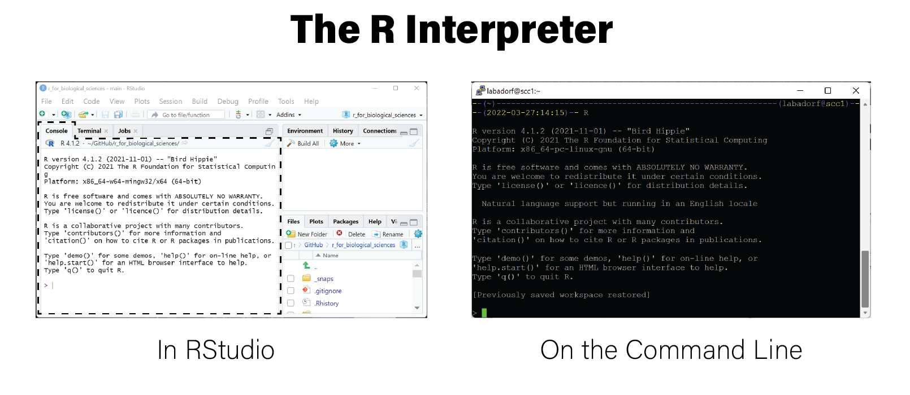

# Unit Testing

## Writing Correct Software

* Writing code that does what we intend is harder than it should be
* As code complexity increases, changing one piece of code may affect other code
  in unexpected ways
* How do we ensure our code does what we mean for it to do?

## Software Testing

* *Software testing* refers to writing code that tests other code
* Formal methods exist to test software for correctness
* Several *software testing frameworks* to choose from
* General strategy:
  1. Construct inputs for our code that have expected outputs
  2. Compare actual output with expected output
  3. Fail if they don't match

## Ad hoc testing

```
add <- function(x,y) {
  return(x+y)
}
```

* Can test this manually:

  ```
  result <- add(1,2)
  result == 3
  [1] TRUE
  ```
  
## Ad hoc failure

```
add <- function(x,y) {
  return(x+y+1)
}
```

* Test FAILS:

  ```
  result <- add(1,2)
  result == 3
  [1] FALSE
  ```

## Formal vs informal tests

* Manually testing code correctness is *informal*
* *Formal* testing frameworks involve writing code to perform this testing
* Formal tests are composed of *test cases* that cover different situations
* Can be run automatically whenever your code changes
* Write test cases when bugs are reported!

## Unit Testing

* *Unit testing* is one software testing approach that tests individual "units"
  of code
* A "unit" of code may be:
  - A function
  - A class
* Once all units are tested, sets of units that work together can be tested
  (called *integration testing*)
* Unit tests form a kind of "documentation" for the software

## `testthat` Package

* R package [testthat](https://testthat.r-lib.org/) provides a testing framework
* Authors: "tries to make testing as fun as possible, so that you get a visceral
  satisfaction from writing tests."
* Install using `install.packages("testthat")`

## `testthat` Unit Test
```
library(testthat)
test_that("add() correctly adds things", {
    expect_equal(add(1,2), 3)
    expect_equal(add(5,6), 11)
  }
)
Test passed
```

## `test_that` Anatomy

```
test_that("add() correctly adds things", {
    expect_equal(add(1,2), 3)
    expect_equal(add(5,6), 11)
  }
)
```

1. a concise, human readable description of the test (`add() correctly adds things`)
2. one or more tests enclosed by `{}` written using [`expect_X`
  functions](https://testthat.r-lib.org/reference/index.html) from the testthat
  package

## `test_that` Failures

```
test_that("add() correctly adds things", {
    expect_equal(add(1,2), 3)
    expect_equal(add(5,6), 10) # incorrect expected value
  }
)
-- Failure (Line 3): add() correctly adds things -------------------------------
add(5, 6) not equal to 10.
1/1 mismatches
[1] 11 - 10 == 1

Error: Test failed
```

## Writing tests

* Write an R script that only contains tests, e.g. `test_functions.R`
* *Separate from analysis code!*
* Your test script call the functions you have written in your other scripts
  to check for their correctness 
* Run tests whenever code changes substantially
* Add more tests to test new functionality/when you identify bugs


## Automated Testing

* Can run tests in test script automatically with `test_file()`

```
add <- function(x,y) {
return(x+y)
}
testthat::test_file("test_functions.R")

== Testing test_functions.R =======================================================
[ FAIL 0 | WARN 0 | SKIP 0 | PASS 2 ] Done!
```

## Test Driven Development

* Ultimate testing strategy is called [test driven
development](https://en.wikipedia.org/wiki/Test-driven_development)
* Idea: write your tests before developing *any* analysis code, even for
  functions that don't exist yet
* `testthat` tests calling functions that are not defined will fail like tests
  that find incorrect output

## Test Driven Development

```
test_that("mul() correctly multiplies things",{
  expect_equal(mul(1,2), 2)
})
-- Error (Line 1): new function ------------------------------------------------
Error in `mul(1, 2)`: could not find function "mul"
Backtrace:
 1. testthat::expect_equal(mul(1, 2), 2)
 2. testthat::quasi_label(enquo(object), label, arg = "object")
 3. rlang::eval_bare(expr, quo_get_env(quo))

Error: Test failed
```

# Toolification

## Toolification

* Some use cases make running scripts in RStudio ineffective

  1. The same script must be run on many different inputs
  2. Data stored on a system where interactive RStudio session are not available
  3. The script takes a very long time to run (e.g. days to weeks)
  4. The computational demands of the analysis exceed the resources of the
  computer where RStudio is being run
  
* Must turn an R script into a *tool*

## The R Interpreter

{width=80%}

## Running R Scripts

* Use the [`source()` function](https://www.rdocumentation.org/packages/base/versions/3.6.2/topics/source),
to execute all code in a file in an R interpreter

```
$ cat simple_script.R
print('hello moon')
print(1+2)
print(str(c(1,2,3,4)))
$ R
> source("simple_script.R")
[1] "hello moon"
[1] 3
 num [1:4] 1 2 3 4
```

## `Rscript`

* Base R includes the [`Rscript` command](https://www.rdocumentation.org/packages/utils/versions/3.6.2/topics/Rscript)
that can be run on the command line

##

```
$ Rscript
Usage: /path/to/Rscript [--options] [-e expr [-e expr2 ...] | file] [args]

--options accepted are
  --help              Print usage and exit
  --version           Print version and exit
  --verbose           Print information on progress
  --default-packages=list
                      Where 'list' is a comma-separated set
                        of package names, or 'NULL'
or options to R, in addition to --no-echo --no-restore, such as
  --save              Do save workspace at the end of the session
  --no-environ        Don't read the site and user environment files
  --no-site-file      Don't read the site-wide Rprofile
  --no-init-file      Don't read the user R profile
  --restore           Do restore previously saved objects at startup
  --vanilla           Combine --no-save, --no-restore, --no-site-file
                        --no-init-file and --no-environ
```

## `Rscript` Example

```
$ cat simple_script.R
print('hello moon')
print(1+2)
print(str(c(1,2,3,4)))
$ Rscript simple_script.R
[1] "hello moon"
[1] 3
 num [1:4] 1 2 3 4
$
```

## `Rscript` Specifics

* `Rscript` is a convenience function that runs the following `R` command:

```
$ Rscript simple_script.R # is equivalent to:
$ R --no-echo --no-restore --file=simple_script.R
```

## `commandArgs()`

* Can control the behavior of a script directly from the command line by
passing command line arguments to the `Rscript` command

```
$ Rscript simple_script.R abc
[1] "hello moon"
[1] 3
 num [1:4] 1 2 3 4
```

## `commandArgs()`

* Call the [`commandArgs()`
function](https://www.rdocumentation.org/packages/R.utils/versions/2.11.0/topics/commandArgs)
to access command line arguments in the shell

```r
args <- commandArgs(trailingOnly=TRUE)
```

## `commandArgs()`

* arguments passed in are available in the `args` variable:

```
$ cat echo_args.R
print(commandArgs(trailingOnly=TRUE))
$ Rscript echo_args.R abc
[1] "abc"
$ Rscript echo_args.R abc 123
[1] "abc" "123"
$ Rscript echo_args.R # no args
character(0)
```

## `trailingOnly=FALSE`

* By default the `commandArgs()` includes the `Rscript` command itself and any
additional arguments:

```
$ Rscript -e "commandArgs()" abc 123
[1] "/usr/bin/R"
[2] "--no-echo"
[3] "--no-restore"
[4] "-e"
[5] "commandArgs()"
[6] "--args"
[7] "abc"
[8] "123"
```

## `trailingOnly=TRUE`

The `trailingOnly=TRUE` argument returns only the arguments provided at the end
of the command, after the `Rscript` portion:
```
$ Rscript -e "commandArgs(trailingOnly=TRUE)" abc 123
[1] "abc" "123"
```


## Example Tool

```r
args <- commandArgs(trailingOnly=TRUE)
if(length(args) != 1) {
  # cat() writes characters to the screen
  cat("Usage: simple_script.R <csv file>\n")
  cat("Provide exactly one argument that is a CSV filename\n")
  quit(save="no", status=1)
}
fn <- args[1]
library(tidyverse)
read_csv(fn)
```

## Example Tool

```
$ cat data.csv
gene,sampleA,sampleB,sampleC
g1,1,35,20
g2,32,56,99
g3,392,583,444
g4,39853,16288,66928
```

##

```
$ Rscript inspect_csv.R data.csv
── Attaching packages ─────────────────────────────────────── tidyverse 1.3.1 ──
✔ ggplot2 3.3.5     ✔ purrr   0.3.4
✔ tibble  3.1.6     ✔ dplyr   1.0.7
✔ tidyr   1.2.0     ✔ stringr 1.4.0
✔ readr   2.1.2     ✔ forcats 0.5.1
── Conflicts ────────────────────────────────────────── tidyverse_conflicts() ──
✖ dplyr::filter() masks stats::filter()
✖ dplyr::lag()    masks stats::lag()
Rows: 4 Columns: 4
── Column specification ────────────────────────────────────────────────────────
Delimiter: ","
chr (1): gene
dbl (3): sampleA, sampleB, sampleC

ℹ Use `spec()` to retrieve the full column specification for this data.
ℹ Specify the column types or set `show_col_types = FALSE` to quiet this message   .
# A tibble: 4 × 4
  gene  sampleA sampleB sampleC
  <chr>   <dbl>   <dbl>   <dbl>
1 g1          1      35      20
2 g2         32      56      99
3 g3        392     583     444
4 g4      39853   16288   66928
```

## Numerical CLI Arguments

* `commandArgs()` always produces a vector of strings
* Numerical arguments must be parsed explicitly

## `head.R`

```r
args <- commandArgs(trailingOnly=TRUE)
if(length(args) != 2) {
      cat("Usage: head.R <filename> <N>\n")
  cat("Provide exactly two arguments: a CSV filename and an integer N\n")
    quit(save="no", status=1)
}

# read in arguments
fn <- args[1]
n <- as.integer(args[2])
```

## `head.R`

```r
# the csv output will include a header row, so reduce n by 1
n <- n-1

# suppressMessages() prevents messages like library loading text from being printed to the screen
suppressMessages(
    {
        library(tidyverse, quietly=TRUE)
        read_csv(fn) %>%
            slice_head(n=n) %>%
            write_csv(stdout())
    }
)
```

## `head.R`

```
$ Rscript head.R data.csv 3
gene,sampleA,sampleB,sampleC
g1,1,35,20
g2,32,56,99
```

## `argparser`

* Reading command line arguments into variables in a script can become tedious
* [`argparser` package](https://www.rdocumentation.org/packages/argparser/versions/0.7.1)
helps build CLI argument interfaces

```r
library(argparser, quietly=TRUE)
parser <- arg_parser("R implementation of GNU coreutils head command")
parser <- add_argument(parser, "filename", help="file to print lines from")
parser <- add_argument(parser, "-n", help="number of lines to print", type="numeric", default=10)
parser <- parse_args(parser, c("-n", 3, "data.csv"))
print(paste("printing from file:", parser$filename))
print(paste("printing top n:", parser$n))
```

## `head.R + argparse`

```r
library(argparser, quietly=TRUE)

parser <- arg_parser("R implementation of GNU coreutils head command")

parser <- add_argument(
  parser,
  arg="filename",
  help="file to print lines from"
)
parser <- add_argument(
  parser,
  arg="--top",
  help="number of lines to print",
  type="numeric",
  default=10,
  short='-n'
)
```

## `head.R + argparse`


```r
args <- parse_args(parser)

fn <- args$filename

# the csv output will include a header row, so reduce n by 1
n <- args$top-1

suppressMessages(
    {
        library(tidyverse, quietly=TRUE)
        read_csv(fn) %>%
            slice_head(n=n) %>%
            write_csv(stdout())
    }
)
```

## `head.R + argparse`

```
$ Rscript head.R -n 3 data.csv
gene,sampleA,sampleB,sampleC
g1,1,35,20
g2,32,56,99
```

## `head.R + argparse`

```
$ Rscript head.R -h
usage: head.R [--] [--help] [--opts OPTS] [--top TOP] filename

R implementation of GNU coreutils head command

positional arguments:
  filename    file to print lines from

flags:
  -h, --help  show this help message and exit

optional arguments:
  -x, --opts  RDS file containing argument values
  -n, --top   number of lines to print [default: 10]
```

# Parallel Processing

## Parallel Processing

* Most modern computers have multiple processing or CPU cores, e.g. a 4-core or
8-core processor
* Running processes simultaneously can divide time required to run an analysis 
by a factor equal to the number of machine cores
* e.g. a machine with 64 cores could run a computation that would normally take
two months in a single day
* Processes running at the same time on different cores are running *in parallel*
* A computation that is not parallelized runs *serially*

## Brief Introduction to Parallelization

* Not all computations can be parallelized
* Certain classes of problems are [*pleasingly
parallel*](https://en.wikipedia.org/wiki/Embarrassingly_parallel):
  - problem structure easily divided into parts that can be run in parallel
* In general, how "parallelizeable" a computation is depends on how the
subparts of the computation relate to one another

## Parallelizability

* The structure of a computation determines whether/how it can be parallelized
* Consider mapping [high throughput sequencing reads](#high-throughput-sequencing) against a reference genome:
  - i.e. identify the location(s) in the genome where each read matches
* Alignment locations of different reads don't depend on each other, i.e. they are independent
* Independent tasks can be performed in parallel 
* Most modern alignment programs like [`bwa`](http://bio-bwa.sourceforge.net/bwa.shtml) and
[`STAR`](https://github.com/alexdobin/STAR) exploit this inherently parallel
structure of read alignment problem

## Parallelization Limitations

* Splitting up a computation into pieces that can run in parallel does
not always lead to performance improvements
* Execution time of an algorithm depends on the slowest step
* Every algorithm is bounded by one of *compute*, *memory*, *input/output*, *network* 
* These concepts are covered in the field of [high-performance computing](https://en.wikipedia.org/wiki/High-performance_computing)

## Algorithm Boundedness

* An algorithm can be one of:
  - *compute-bound* - the computations take the largest amount of time
  - *memory-bound* - the amount of main memory (i.e. RAM) on the machine
  determines how quickly the computation can complete
  - *input/output (IO)-bound* - writing to and from hard disk takes the most time
  - *network-bound* - transfering data over a network, usually between processes
  running in parallel, takes the most time

## Multilevel parallelization

* Parallelism can be attained on both multiprocessor and distributed computing level:
  - Multiprocessor - one job utilizing multiple cores on a single machine
  - Distributed computing - running jobs on multiple separate machines
* Can utilize both levels of parallelization
  - e.g. 100 jobs via `qsub` and each job uses 16 cores = $100 * 16 =$ 1600x speedup!

## `apply` Is Pleasingly Parallel

* [`apply`](#apply-and-friends), `lapply`, `vapply` etc computations are *pleasantly parallel*
* `apply` iterates over the input collection and executes the function on each of them
* In general, any iteration using an `apply` function can be parallelized in R

## The `parallel` package

* R can leverage multiple core architectures to execute processes in parallel with
the [`parallel` package]
* [`mclapply()`](https://stat.ethz.ch/R-manual/R-devel/library/parallel/html/mclapply.html),
or `m`ulti`c`ore `apply` is multicore implementation of `apply`
* `mclapply` accepts all of the same arguments as `lapply` and a few additional starting with `mc.`
* `mc.cores`, which specifies the number of cores to use when executing tasks in parallel
* **NB:** `mclapply` is *not* available on Windows, only Mac and linux

## `mclapply` Example

```r
library(parallel)

args <- commandArgs(trailingOnly=TRUE)
cores <- as.integer(args[1])

ret <- mclapply(
    1:10,
    function(x) {
         print(paste(Sys.time(),'process',x))
         Sys.sleep(3)
    },
    mc.cores=cores
)
```

## `mclapply` Example - 1 core

```
$ Rscript mclapply.R 1
[1] "2022-03-23 20:33:09 process 1"
[1] "2022-03-23 20:33:12 process 2"
[1] "2022-03-23 20:33:15 process 3"
[1] "2022-03-23 20:33:18 process 4"
[1] "2022-03-23 20:33:21 process 5"
[1] "2022-03-23 20:33:24 process 6"
[1] "2022-03-23 20:33:27 process 7"
[1] "2022-03-23 20:33:30 process 8"
[1] "2022-03-23 20:33:33 process 9"
[1] "2022-03-23 20:33:36 process 10"

```

## `mclapply` Example - 3 cores

```
$ Rscript mclapply.R 3
[1] "2022-03-23 20:29:56 process 1"
[1] "2022-03-23 20:29:56 process 2"
[1] "2022-03-23 20:29:56 process 3"
[1] "2022-03-23 20:29:59 process 4"
[1] "2022-03-23 20:29:59 process 5"
[1] "2022-03-23 20:29:59 process 6"
[1] "2022-03-23 20:30:02 process 7"
[1] "2022-03-23 20:30:02 process 8"
[1] "2022-03-23 20:30:02 process 9"
[1] "2022-03-23 20:30:05 process 10"
```

## `mclapply` Example - 10 cores

```
- Rscript mclapply.R 10
[1] "2022-03-23 20:34:59 process 1"
[1] "2022-03-23 20:34:59 process 2"
[1] "2022-03-23 20:34:59 process 3"
[1] "2022-03-23 20:34:59 process 4"
[1] "2022-03-23 20:34:59 process 5"
[1] "2022-03-23 20:34:59 process 6"
[1] "2022-03-23 20:34:59 process 7"
[1] "2022-03-23 20:34:59 process 8"
[1] "2022-03-23 20:34:59 process 9"
[1] "2022-03-23 20:34:59 process 10"
```

# Object Oriented Programming in R

## Object Oriented Programming in R

* [Object-oriented programming](https://en.wikipedia.org/wiki/Object-oriented_programming)
(OOP) is a programming paradigm that encapsulates related code and data into
conceptual "objects"
* Objects organize code and make it easier to write, maintain, and understand
* There are several different styles of OOP, and a programming language may
implement more than one style, or none at all
* R supports several different OOP systems

## OOP Concepts

* *polymorphism* - enables considering a function's interface separately from its implementation
* *encapsulation* - enables organizing a function's implementation and data together under a common
interface

## OOP Terminology

* *class*: the "type" of the object
* *method*: something all objects of a class can do
* *field*: something all objects of a class have (e.g. data)
* *inheritance*: some classes share same behavior as other classes (i.e. they
*inherit* the behavior)
* *method dispatch*: the programming language decides which method implementation
to execute for a given class

## Polymorphism

```{r}
library(ggplot2)
ggplot2::diamonds
```

## Polymorphism

* Consider the `summary()` function:

```r
diamonds <- ggplot2::diamonds

summary(diamonds$carat)
#>    Min. 1st Qu.  Median    Mean 3rd Qu.    Max. 
#>    0.20    0.40    0.70    0.80    1.04    5.01

summary(diamonds$cut)
#>      Fair      Good Very Good   Premium     Ideal 
#>      1610      4906     12082     13791     21551
```

## Encapsulation

* Data and functionality combined into the same object
* Consider python class:

```python
class Read(object):
  def __init__(self, header, seq, qual):
    self.header = header
    self.seq = seq
    self.qual = qual
  def to_fastq(self):
    return '@{}\n{}\n+\n{}'.format(
      self.header,
      self.seq,
      self.qual
    )
read1 = Read("read1", "ACTG", "FFFF")
read1.seq # access sequence
read1.fastq() # output fastq format
```

## OOP in R

* R has three main OOP systems:
  - S3 - first, simplest, functional system
  - R6 - more recent, encapsulated system
  - S4 - like S3, but more restrictive
* Bioconductor requires packages be written using S4 system

## S3

```r
new_Read <- function(header, seq, qual=NULL) {
  structure(
    list(
      header=header,
      seq=seq,
      qual=qual
    ),
    class="Read"
  )
}
read1 <- new_Read("read1", "ACGT", "FFFF")
fastq.Read <- function(x) {
  UseMethod("fastq")
  paste0("@",self$header,"\n",self$seq,"+\n",self$qual,"\n")
}
fastq(read1)
```

## R6

```r
Read <- R6Class("Read", list(
  header = NULL,
  seq = NULL,
  qual = NULL,
  initialize = function(header, seq, qual=NULL) {
    self$header <- header
    self$seq <- seq
    self$qual <- qual
  },
  fastq = function() {
    invisible(paste0("@",self$header,"\n",self$seq,"+\n",self$qual,"\n"))
  }
}
}
))
read1 <- Read$new("read1","ACTG","FFFF")
read1$fastq()
```

# Building R Packages

## Building R Packages

Packages are the fundamental unit of reproducible code in R. Most of the time,
we as practitioners simply use packages that have been provided by others.
However, sometimes, when we have developed a methodology that others might find
useful, it may be advantageous to write our own R packages and share them with
the community. Writing an R package involves creating a directory with a
specific structure and adding code, documentation, and package metadata in a
way that allows it to be distributed.

Hadley Wickham and Jenny Bryan have written an excellent book on how to write
[R packages](https://r-pkgs.org/). If ever you need to write your own R package,
this should be the only place you need to go.

::: {.box .readmore}
* [R packages](https://r-pkgs.org/index.html) by Hadley Wickam and Jenny Bryan
:::
