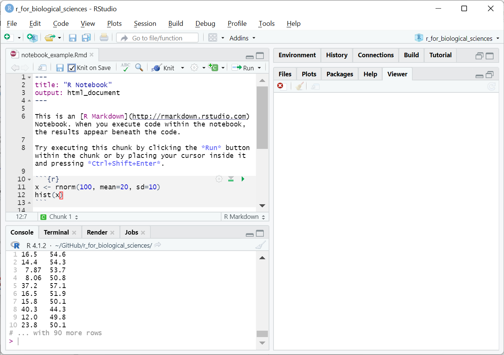

## Communicating with R

* All research results must be communicated at some point
* Results are encoded in text, tables, and plots
* Methods are described in text, and (ideally) the code itself

  - Many journals now require code to be made available upon publication

* Providing code can make analyses more reproducible
* Code notebooks are tools that combine code, results, and text into one place

## Markup langauges & markdown

* A [markup language](https://en.wikipedia.org/wiki/Markup_language) annotates and decorates plain text with
information about its formatting and structure
* Both machine- and human-readable
* The same markup text might be converted into different formats, e.g. HTML or PDF

* [markdown](https://daringfireball.net/projects/markdown/) is one such markup
language

## Markdown Examples

<pre class="codeblock">
You can *emphasize* text, or **really emphasize it**.

Lists are pretty easy to read as well:

* item 1
* item 2
* item 3
</pre>

<div class="box">
You can *emphasize* text, or **really emphasize it**.

Lists are pretty easy to read as well:

* item 1
* item 2
* item 3
</div>

## Markdown Examples

<pre class="codeblock">
If you need an enumerated list you can do that too:

1. item 1
2. item 2
3. item 3
</pre>

If you need an enumerated list you can do that too:

1. item 1
2. item 2
3. item 3

## Markdown Examples

<pre class="codeblock">
You can easily include links to web sites like
[Google](http://google.com) and images:

</pre>

You can easily include links to web sites like [Google](http://google.com) and
images:
<div class="center">
{width=40%}
</div>

## Markdown Tables

```
+------+------+-----+-------+
| some | data | and | stuff |
+======+======+=====+=======+
|   A  |   1  |  2  |   3   |
+------+------+-----+-------+
|   B  |   4  |  5  |   6   |
+------+------+-----+-------+
```

+------+------+-----+-------+
| some | data | and | stuff |
+======+======+=====+=======+
|   A  |   1  |  2  |   3   |
+------+------+-----+-------+
|   B  |   4  |  5  |   6   |
+------+------+-----+-------+

## RMarkdown

* [RMarkdown](https://rmarkdown.rstudio.com/index.html) is an extension of markdown that works in R
* Can include code blocks in R in between markdown formatted text that execute
* Files with RMarkdown are called *RMarkdown notebooks*
* RMarkdown files typically end with `.Rmd`
* RStudio has full RMarkdown integration to make writing RMarkdown notebooks very
easy

## R code blocks in RMarkdown

* Lines starting with `` `r '\x60\x60\x60{r}'` `` define a special code block
* Example:

  <pre class="codeblock">
  ```{r}
  a <- 1
  ```
  </pre>

* R code in the block will be executed
* Code output placed below the block in the report
* RStudio shows you the output of the notebook within its interface

## RMarkdown in RStudio

{width=80%}

## R code block output

{width=80%}

## knitr

* The [knitr](https://yihui.org/knitr/) R package turns RMarkdown into a report
* The process is called "knitting"
* Same report can be knitted into many different formats
  - HTML
  - PDF
  - Microsoft Word
  - Slides (like these ones)

## bookdown

* Another R package that processed RMarkdown documents is [bookdown](https://bookdown.org/)
* Designed to write books using RMarkdown
* This book you are reading was written in RMarkdown and generated using bookdown!
