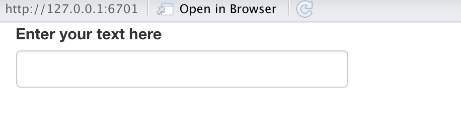

# Rshiny

## Major Resource for learning Rshiny

* Written by Hadley Wickham himself

* https://mastering-shiny.org/basic-app.html

* Slides paraphrase most of the fundamental information

## Advantages of Rshiny

* Provided UI functions that automatically wrap HTML, CSS and javascript
for common tasks:
  - Radio Buttons
  - Text Inputs
  - File Upload / Download
  
* Reactive Programming paradigm that tracks dependencies in code and inputs to 
only re-run the minimal amount of code in order to update outputs

* Natively separates UI (frontend) and server (backend) for readability and ease
of use

# Inputs - Basic UI elements

## Structures of Inputs

* Inputs allow us to interact with the app and specify different values

* All inputs have the same first argument: `inputId`
  - `inputId` can be accessed by the server function using `input$inputId`

* The second argument is typically a `label` which describes the input in the UI
  - The `inputId` will be used internally and the `label` shown externally in the UI

## Example common inputs

* Radio Buttons

* Selection Dropdown

* Text Boxes

## Basic input - Text

```{r, eval=FALSE}
# Function structure
textInput("ID", "IDLabel", additional arguments)

# Function example
ui <- fluidPage(
  textInput("text", "Enter your text here")
)
```

{width=80%}

## Basic input - Dropdown and Radio buttons

```{r, eval=FALSE}
# Function structure
selectInput("ID", "IDLabel", additional arguments)

# Function example
c <- ("Massachussets", "New York", "Maryland")
ui <- fluidPage(
  selectInput("state", "Choose your state", states)
)
```

{width=80%}
# Outputs

## Structure of outputs

* Outputs in the UI are elements created by the server function

* The first argument in most output functions is the ID
  - You will create UI specifications with IDs
  - Individual IDs can be accessed by the server function using `output$outputId`
  
## Output Example - textOutput

```{r, eval=FALSE}
ui <- fluidPage(
  textOutput("text")
)
server <- function(input, output, session) {
  output$text <- renderText( "Hello world!")
```
  
## Output Example - tableOutput

```{r, eval=FALSE}
ui <- fluidPage(
  tableOutput("table")
)
server <- function(input, output, session) {
  output$table <- renderTable(head(mtcars))
}
```
  
{width=80%}

## Output Example - plotOutput

```{r, eval=FALSE}
ui <- fluidPage(
  plotOutput("plot")
)
server <- function(input, output, session) {
  output$plot <- renderPlot(
    ggplot(mtcars, x=mpg, y=hp) + geom_point()
  )
}
```

{width=80%}

## Output and render functions will typically be used together

* Outputs will be in the UI and render functions in the server

* tableOutput() and renderTable()

* plotOutput() and renderPlot()

* textOutput() and renderText()

## Outputing the values contained within inputs
```{r, eval=FALSE}
# Function example
states <-c("Massachussets", "New York", "Maryland")
ui <- fluidPage(
  selectInput("state", "Choose your state", states),
  textOutput("selected")
)
server <- function(input, output, session) {
  output$selected <- renderText(input$state)
}
```

{width=80%}

# HTML Layouts organize your inputs and outputs

## fluidPage Simple Layout - Code

```{r, eval=FALSE}
fluidPage(
  titlePanel(
    # app title/description
  ),
  sidebarLayout(
    sidebarPanel(
      # inputs
    ),
    mainPanel(
      # outputs
    )
  )
)
```

## Simple Layout View

{width=80%}

## Multirow layout code

```{r, eval=FALSE}
fluidPage(
  fluidRow(
    column(4, 
      ...
    ),
    column(8, 
      ...
    )
  ),
  fluidRow(
    column(6, 
      ...
    ),
    column(6, 
      ...
    )
  )
)
```

## Multirow Layout View
{width=80%}

# Putting it all together

## Code - Basic Shiny App UI
```{r, eval=FALSE}
# Load libraries
library('shiny')
library('tidyverse')

# UI layout with a sidebar and mainpanel
# plotOutput contains the information from output$plot
ui <- fluidPage(
  titlePanel("mtcars Plot"),
  sidebarLayout(
    sidebarPanel("UI Elements could go here"
    ),
    mainPanel(
      plotOutput("plot")
    )
  )
)
```

## Code Basic Shiny App Server
```{r, eval=FALSE}
# renderPlot() creates the output sent to output$plot by calling ggplot
server <- function(input, output, session) {
  output$plot <- renderPlot(
    ggplot(mtcars, aes(x=mpg, y=hp)) + geom_point()
  )
}

shinyApp(ui = ui, server = server)
```

## View of basic Shiny App

{width=80%}

# Reactivity

## Reactivity Principles

* Reactive expressions and outputs will only change *if and only if* their inputs
change

* Laziness means code will only be re-run if needed
  - Shiny will handle figuring out the minimal amount of code that needs to be
  re-run based on what's changed
  
* Reactivity can be used to control the flow of data and actions through your application

* https://mastering-shiny.org/basic-reactivity.html