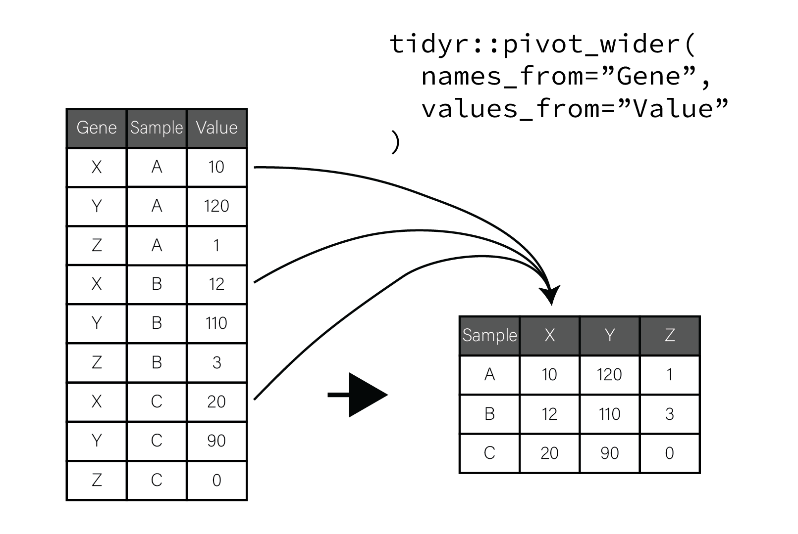

# Assignment Base R Checkin

# Installing R Packages

## Installing Packages

* Advanced functionality in R is provided through *packages* written and supported
by R community members
* With the exception of [bioconductor
packages](#bio-bioconductor), all R packages are hosted on the [Comprehensive R
Archive Network](https://cran.r-project.org/) (CRAN) web site
* There are [more than 18,000 packages](https://cran.r-project.org/web/packages/index.html) hosted on CRAN
* To install a package from CRAN, use the `install.packages` function in the R console:

  ```r
  # install one package
  install.packages("tidyverse")
  # install multiple packages
  install.packages(c("readr","dplyr"))
  ```

# Data Wrangling


``` {r include=FALSE}
library(tidyverse)
```

## The Tidyverse

* [The tidyverse](https://www.tidyverse.org/) is "an opinionated collection of R packages designed for data science."
* packages are all designed to work together
* tidyverse practically changes the R language into a data science language
* tidyverse uses a distinct set of coding conventions that lets it achieve
  greater expressiveness, conciseness, and correctness relative to the base R language


## Tidyverse Basics

* tidyverse is a set of packages that work together
* Load the most common tidyverse packages at the same time:

  ```r
  library(tidyverse)
  -- Attaching packages ---------- tidyverse 1.3.1 --
  v ggplot2 3.3.5     v purrr   0.3.4
  v tibble  3.1.6     v dplyr   1.0.7
  v tidyr   1.1.4     v stringr 1.4.0
  v readr   2.1.1     v forcats 0.5.1
  -- Conflicts ------------- tidyverse_conflicts() --
  x dplyr::filter() masks stats::filter()
  x dplyr::lag()    masks stats::lag()
  ```

## Default tidyverse packages

+-------------------------------------------+------------------------------------------------+
| Package                                   | Description                                    |
+===========================================+================================================+
| [ggplot2](https://ggplot2.tidyverse.org/) | Plotting using the grammar of graphics         |
+-------------------------------------------+------------------------------------------------+
| [tibble](https://tibble.tidyverse.org/)   | Simple and sane data frames                    |
+-------------------------------------------+------------------------------------------------+
| [tidyr](https://tidyr.tidyverse.org/)     | Operations for making data "tidy"              |
+-------------------------------------------+------------------------------------------------+
| [readr](https://readr.tidyverse.org/)     | Read rectangular text data into tidyverse      |
+-------------------------------------------+------------------------------------------------+
| [purrr](https://purrr.tidyverse.org/)     | Functional programming tools for tidyverse     |
+-------------------------------------------+------------------------------------------------+
| [dplyr](https://dplyr.tidyverse.org/)     | "A Grammar of Data Manipulation"               |
+-------------------------------------------+------------------------------------------------+
| [stringr](https://stringr.tidyverse.org/) | Makes working with strings in R easier         |
+-------------------------------------------+------------------------------------------------+
| [forcats](https://forcats.tidyverse.org/) | Operations for using categorical variables     |
+-------------------------------------------+------------------------------------------------+

## Importing Data

* [readr](https://readr.tidyverse.org/) package has functions to read in data
  from text files:

+--------------+--------------------------------------------------+
| Function     | Brief description/use                            |
+==============+==================================================+
| `read_csv`   | Delimiter: `,` - Decimal separator: `.`          |
+--------------+--------------------------------------------------+
| `read_csv2`  | Delimiter: `;` - Decimal separator: `,`          |
+--------------+--------------------------------------------------+
| `read_tsv`   | Delimiter: `<tab>` - Decimal separator: `.`      |
+--------------+--------------------------------------------------+
| `read_delim` | Delimiter: set by user  - Decimal separator: `.` |
+--------------+--------------------------------------------------+

## Note `readr` functions operate on zipped files

* Some CSV files can be very large and may be [compressed](https://computer.howstuffworks.com/file-compression.htm)
* the most common compression formats in data science and biology are
  [gzip](https://www.gnu.org/software/gzip/) and [bzip](http://www.bzip.org/).
* All the `readr` file reading functions can read compressed files directly, so
  you do not need to decompress them firs

## Writing tabular files

* Note that `readr` also has functions for [writing delimited
  files](https://readr.tidyverse.org/reference/write_delim.html):

+--------------+--------------------------------------------------+
| Function     | Brief description/use                            |
+==============+==================================================+
| `write_csv`  | Delimiter: `,` - Decimal separator: `.`          |
+--------------+--------------------------------------------------+
| `write_csv2` | Delimiter: `;` - Decimal separator: `,`          |
+--------------+--------------------------------------------------+
| `write_tsv`  | Delimiter: `<tab>` - Decimal separator: `.`      |
+--------------+--------------------------------------------------+
| `write_delim`| Delimiter: set by user  - Decimal separator: `.` |
+--------------+--------------------------------------------------+

# Sidebar: CSV Files

## CSV Files

* `csv` - character separated value file
* Most common, convenient, and flexible data file format in biology and bioinformatics
* Plain text files that contain rectangular data
* Each line of these files has some number of data values separated by a consistent character
  - most commonly the comma which are called [comma-separated value, or "CSV", files](https://en.wikipedia.org/wiki/Comma-separated_values)
* Filenames typically end with the extension `.csv`
* Other characters, especially the <Tab> character, may be used to create valid
files in this format

## Example CSV file

```
id,somevalue,category,genes
1,2.123,A,APOE
4,5.123,B,"HOXA1,HOXB1"
7,8.123,,SNCA
```

## Properties and principles of CSV files

* The first line often but not always contains the column names of each column
* Each value is delimited by the same character, in this case `,`
* Values can be any value, including numbers and characters
* When a value contains the delimiting character (e.g. HOXA1,HOXB1 contains a
  `,`), the value is wrapped in double quotes
* Values can be missing, indicated by sequential delimiters (i.e. `,,` or one
  `,` at the end of the line, if the last column value is missing)
* There is no delimiter at the end of the lines
* To be well-formatted *every line must have the same number of delimited
  values*

# Back to data wrangling

## The tibble

* Data in tidyverse organized in a special data frame object called a `tibble`

<pre class="codeblock">
  library(tibble)
  tbl <- tibble(
      x = rnorm(100, mean=20, sd=10),
      y = rnorm(100, mean=50, sd=5)
  )
  tbl
  # A tibble: 100 x 2
         x     y
     <dbl> <dbl>
   1 16.5   54.6
   2 14.4   54.3
   # ... with 98 more rows
</pre>

## The tibble is a data frame

* A `tibble` stores rectangular data that can be accessed like a data frame:

<pre class="codeblock">
  tbl$x
  [1] 29.57249 12.01577 15.25536 23.07761 32.25403 48.04651 21.90576
  [8] 15.51168 34.87285 21.32433 12.51230 23.60896  6.77630 12.34223
  ...
  tbl[1,"x"] # access the first element of x
  # A tibble: 1 x 1
      x
    <dbl>
  1  29.6
  tbl$x[1]
  [1] 29.57255
</pre>

## tibble column names

* `tibbles` (and regular data frames) typically have names for their columns
  accessed with the `colnames` function

<pre class="codeblock">
  tbl <- tibble(
      x = rnorm(100, mean=20, sd=10),
      y = rnorm(100, mean=50, sd=5)
  )
  colnames(tbl)
  [1] "x" "y"
</pre>

## Changing tibble column names

* Column names may be changed using this same function:

<pre class="codeblock">
  colnames(tbl) <- c("a","b")
  tbl
  # A tibble: 100 x 2
         a     b
     <dbl> <dbl>
   1 16.5   54.6
   2 14.4   54.3
  # ... with 90 more rows
</pre>

* Can also use `dplyr::rename` to rename columns as well:

<pre class="codeblock">
  dplyr::rename(tbl,
    a = x,
    b = y
  )
</pre>

## tibbles, data frames, and row names

* tibbles and dataframes also have row names as well as column names:

<pre class="codeblock">
  tbl <- tibble(
      x = rnorm(100, mean=20, sd=10),
      y = rnorm(100, mean=50, sd=5)
  )
  rownames(tbl)
  [1] "1" "2" "3"...
</pre>

* `tibble` support for row names is only included for compatibility with base R data frames
*  Authors of tidyverse believe row names are better stored as a normal column

## `tribble()` - Constructing tibbles by hand

* tibble package allows creating simple tibbles with the `tribble()` function:

```{r}
gene_stats <- tribble(
    ~gene, ~test1_stat, ~test1_p, ~test2_stat, ~test2_p,
   "hoxd1", 12.509293,   0.1032,   34.239521,   1.3e-5,
   "brca1",  4.399211,   0.6323,   16.332318,   0.0421,
   "brca2",  9.672011,   0.9323,   12.689219,   0.0621,
   "snca", 45.748431,   4.2e-4,    0.757188,   0.9146,
)
```

## Tidy Data

* tidyverse packages designed to operate with so-called "tidy data"
* the following rules make data tidy:

  1. Each variable must have its own column
  2. Each observation must have its own row
  3. Each value must have its own cell

* a *variable* is a quantity or property that every observation in our dataset has
* each *observation* is a separate instance of those variable
  - (e.g. a different sample, subject, etc)

## Example of tidy data

1. Each variable has its own column.
2. Each observation has its own row.
3. Each value has its own cell.

```{r}
gene_stats
```

## Tidy data illustration


# pipes with `%>%`

## pipes

* We often must perform serial operations on a data frame
* For example:
  1. Read in a file
  2. Rename one of the columns
  3. Subset the rows based on some criteria
  4. Compute summary statistics on the result

## Base R serial manipulations

* In base R we would need to do this with assignments

  ```r
  # data_file.csv has two columns: bad_cOlumn_name and numeric_column
  data <- readr::read_csv("data_file.csv")
  data <- dplyr::rename(data, "better_column_name"=bad_cOlumn_name)
  data <- dplyr::filter(data, better_column_name %in% c("condA","condB"))
  data_grouped <- dplyr::group_by(data, better_column_name)
  summarized <- dplyr::summarize(data_grouped, mean(numeric_column))
  ```

## pipes with `%>%`

* A key `tidyverse` programming pattern is chaining manipulations of `tibble`s together
  by passing the result of one manipulation as input to the next
* Tidyverse defines the `%>%` operator to do this:  

  ```r
  data <- readr::read_csv("data_file.csv") %>%
        dplyr::rename("better_column_name"=bad_cOlumn_name) %>%
        dplyr::filter(better_column_name %in% c("condA","condB")) %>%
        dplyr::group_by(better_column_name) %>%
        dplyr::summarize(mean(numeric_column))
  ```

* The `%>%` operator passes the result of the function immediately preceding it as the first argument to the
next function automatically

## Arranging Data

* Often need to manipulate data in tibbles in various ways
* Such manipulations might include:
  - Filtering out certain rows
  - Renaming poorly named columns
  - Deriving new columns using the values in others
  - Changing the order of rows etc.
* These operations may collectively be termed *arranging* the data
* Many provided in the *[`dplyr` package](https://dplyr.tidyverse.org/)

# Arranging Data - `dplyr::mutate()`

## `dplyr::mutate()` - Create new columns using other columns

* Sometimes we want to create new columns derived from other columns
* Example: [Multiple testing correction](https://en.wikipedia.org/wiki/Multiple_comparisons_problem)
* Adjusts nominal p-values to account for the number of tests that are significant simply bu chance
* [Benjamini-Hochberg or False Discovery Rate (FDR)](https://en.wikipedia.org/wiki/False_discovery_rate) procedure, a common procedure
* `p.adjust` function can perform several of these procedures, including FDR

## Made up gene statistics example

* Consider the following tibble with made up gene information

```{r}
gene_stats
```

## `dplyr::mutate()` - FDR example

```{r}
gene_stats <- dplyr::mutate(gene_stats,
  test1_padj=p.adjust(test1_p,method="fdr")
)
gene_stats
```

## `dplyr::mutate()` - FDR example

* You can create multiple columns in the same call to `mutate()`:

  ``` {r}
  gene_stats <- dplyr::mutate(gene_stats,
    test1_padj=p.adjust(test1_p,method="fdr"),
    test2_padj=p.adjust(test2_p,method="fdr")
  )
  gene_stats
  ```

## `dplyr::mutate()` - Deriving from multiple columns

* Here we create a column with `TRUE` or `FALSE` if either or both of the adjusted
  p-values are less than $0.05$:

  ```{r}
  gene_stats <- dplyr::mutate(gene_stats,
    signif_either=(test1_padj < 0.05 | test2_padj < 0.05),
    signif_both=(test1_padj < 0.05 & test2_padj < 0.05)
  )
  ```

* `|` and `&` operators execute 'or' and 'and' logic, respectively

## `dplyr::mutate()` - using derived columns

* Columns created first in a `mutate()` call can be used in subsequent column
definitions:

```{r}
gene_stats <- dplyr::mutate(gene_stats,
  test1_padj=p.adjust(test1_p,method="fdr"), # test1_padj created
  test2_padj=p.adjust(test2_p,method="fdr"),
  signif_either=(test1_padj < 0.05 | test2_padj < 0.05), #test1_padj used
  signif_both=(test1_padj < 0.05 & test2_padj < 0.05)
)
```

## `dplyr::mutate()` - Modifying columns

* `mutate()` can also be used to modify columns in place
* Example replaces the values in the `gene` column with upper cased values

  ```{r}
  dplyr::mutate(gene_stats, gene=stringr::str_to_upper(gene) )
  ```

```{r echo=F, results='hide'}
gene_stats <- dplyr::mutate(gene_stats,
  gene=stringr::str_to_upper(gene)
)
```
# Arranging Data - `dplyr::filter()`

## `dplyr::filter()` - Pick rows out of a data set

* Consider the following tibble with made up gene information

```{r}
gene_stats
```

## `dplyr::filter()` - Filter based on text values

* We can use `filter()` on the data frame to look for the genes BRCA1 and BRCA2

```{r}
gene_stats %>% filter(gene == "BRCA1" | gene == "BRCA2")
```

## `dplyr::filter()` - Filter based on numeric values


* We can use `filter()` to restrict genes to those that are significant at `padj < 0.01`

```{r}
gene_stats %>% filter(test1_padj < 0.01)
```

# `stringr` - Working with character values

## `stringr` - Working with character values

* Base R does not have very convenient functions for working with character strings
* We must frequently manipulate strings while loading, cleaning, and analyzing datasets
* The [stringr package](https://stringr.tidyverse.org/) aims to make working with strings "as
easy as possible."

## `stringr` - Working with character values

* Package includes many useful functions for operating on strings:
  - searching for patterns
  - mutating strings
  - lexicographical sorting
  - concatenation
  - complex search/replace operations
* [stringr documentation](https://stringr.tidyverse.org/reference/index.html) and the very helpful [stringr cheatsheet](https://github.com/rstudio/cheatsheets/blob/main/strings.pdf).

## `stringr` Example: upper case

* The function `stringr::str_to_upper()` with the `dplyr::mutate()` function to
  cast an existing column to upper case

  ``` {r}
  dplyr::mutate(gene_stats,
    gene=stringr::str_to_upper(gene)
  )
  ```

## Regular expressions

* Many operations in `stringr` package use [regular expression](https://en.wikipedia.org/wiki/Regular_expression) syntax
* A *regular expression* is a "mini" programming language that describes patterns in text
* Certain characters have special meaning that help in defining *search patterns* that
identifies the location of sequences of characters in text
* Similar to but more powerful than "Find" functionality in many word processors

## Regular expression example

* Consider the tibble with made up gene information:

```{r}
gene_stats
```

* Used `filter()` to look for literal "BRCA1" and "BRCA2"
* Names follow a pattern of BRCAX, where X is 1 or 2

## Regular expression example

* [`stringr::str_detect()`](https://stringr.tidyverse.org/reference/str_detect.html)
  returns `TRUE` if the provided pattern matches the input and `FALSE` otherwise

```{r}
stringr::str_detect(c("HOX1A","BRCA1","BRCA2","SNCA"), "^BRCA[12]$")
```
```{r}
dplyr::filter(gene_stats, str_detect(gene,"^BRCA[12]$"))
```

## Regular expression example

```r
dplyr::filter(gene_stats, str_detect(gene,"^BRCA[12]$"))
```

* The argument `"^BRCA[12]$"` is a regular expression that searches for the
  following:

  - Gene name starts with `BRCA` (`^BRCA`)
  - Of those, include genes only if followed by either `1` or `2` (`[12]`)
  - Of those, match successfully if the number is last character (`$`)

## Regular expression syntax

* Regular expression syntax has certain characters with special meaning:
  - `.` - match any single character
  - `*` - match zero or more of the character immediately preceding the `*` `"", "1", "11", "111", ...`
  - `+` - match one or more of the character immediately preceding the `*` `"1", "11", "111", ...`
  - `[XYZ]` - match one of any of the characters between `[]` (e.g. `X`, `Y`, or `Z`)
  - `^`, `$` - match the beginning and end of the string, respectively

* There are more special characters as well, good tutorial: [RegexOne - regular
  expression tutorial](https://regexone.com/)

# Arranging Data - `dplyr::select()`

## `dplyr::select()` - Subset Columns by Name

* [`dplyr::select()`
function](https://dplyr.tidyverse.org/reference/select.html) picks columns out of a `tibble`:

```{r}
stats <- dplyr::select(gene_stats, test1_stat, test2_stat)
stats
```

## `dplyr::select()` - Helper functions

* `dplyr` also has ["helper
functions"](https://tidyselect.r-lib.org/reference/starts_with.html) for more
flexible selection of columns
* For example, if all of the columns we wished to select ended with `_stat`, we
  could use the `ends_with()` helper function:

``` {r}
stats <- dplyr::select(gene_stats, ends_with("_stat"))
stats
```

## `dplyr::select()` - Renaming columns

* `select()` allows for the renaming of selected columns:

``` {r}
stats <- dplyr::select(gene_stats,
  t=test1_stat,
  chisq=test2_stat
)
stats
```

## `dplyr::select()` - Reorder columns

``` {r}
dplyr::select(gene_stats,
    gene,
    test1_stat, test1_p, test1_padj,
    test2_stat, test2_p, test2_padj,
    signif_either,
    signif_both
)
```

# Arranging Data - `dplyr::arrange()`

## `dplyr::arrange()` - Order rows based on their values

* Sometimes want to reorder rows, e.g. by p-value

``` {r}
dplyr::arrange(gene_stats, test1_p)
```

## `dplyr::arrange()` - Changing sort direction

* `dplyr::arrange()` sort ascending by default
* Can change order to descending with `desc()` helper function

``` {r}
# desc() sorts descending
dplyr::arrange(gene_stats, desc(abs(test1_stat)))
```

## Putting it all together

In the previous sections, we performed the following operations:

1. Created new FDR on the nominal p-values using the `dplyr::mutate()` and `p.adjust` functions
2. Created new boolean significance for each gene using `dplyr::mutate()`
3. Mutated the gene symbol case using `stringr::str_to_upper` and `dplyr::mutate()`
4. Reordered the columns to group related variables with `select()`
5. Filtered genes by FDR < 0.05 for either and both statistical tests using `dplyr::filter()`
6. Sorted the results by p-value using `dplyr::arrange()`

## Putting it all together

```{r}
gene_stats <- dplyr::mutate(gene_stats,
  test1_padj=p.adjust(test1_p,method="fdr"),
  test2_padj=p.adjust(test2_p,method="fdr"),
  signif_either=(test1_padj < 0.05 | test2_padj < 0.05),
  signif_both=(test1_padj < 0.05 & test2_padj < 0.05),
  gene=stringr::str_to_upper(gene)
) %>%
dplyr::select(
    gene,
    test1_stat, test1_p, test1_padj,
    test2_stat, test2_p, test2_padj,
    signif_either,
    signif_both
) %>%
dplyr::filter( test1_padj < 0.05 | test2_padj < 0.05 ) %>%
dplyr::arrange( test1_p )
```

# Grouping Data

## Grouping Data

* *Grouping* data together allow us to summarize them
* Consider:

  ``` {r}
  metadata <- tribble(
      ~ID, ~condition, ~age_at_death, ~Braak_stage, ~APOE_genotype,
    "A01",        "AD",            78,            5,       "e4/e4",
    "A02",        "AD",            81,            6,       "e3/e4",
    "A03",        "AD",            90,            5,       "e4/e4",
    "A04",   "Control",            80,            1,       "e3/e4",
    "A05",   "Control",            79,            0,       "e3/e3",
    "A06",   "Control",            81,            0,       "e2/e3"
  )
  ```

## Summarizing groups of data

```{r}
metadata
```

* How many samples of each condition are there?
* Are the age at death/Braak stage distributions similar?
* Must *group* samples together based on condition to answer these kinds of
  questions

## Grouping with `dplyr::group_by()`

* `dplyr::group_by()` groups rows together based on condition

  ``` {r}
  dplyr::group_by(metadata,
    condition
  )
  ```

## Summarizing with `dplyr::summarize()`

* `dplyr::summarize()` (or `summarise()`) to compute the mean age at death for each group:

  ``` {r}
  dplyr::group_by(metadata,
    condition
  ) %>% dplyr::summarize(mean_age_at_death = mean(age_at_death))
  ```

## Summarizing more

``` {r}
dplyr::group_by(metadata,
  condition
) %>% dplyr::summarize(
  mean_age_at_death = mean(age_at_death),
  sd_age_at_death = sd(age_at_death),
  lower_age = mean_age_at_death-sd_age_at_death,
  upper_age = mean_age_at_death+sd_age_at_death,
)
```

## Helper functions with `summarize()`

* `dplyr::summarize()` has some helper functions
* `n()` provides the number of rows each group has

``` {r}
dplyr::group_by(metadata,
  condition
) %>% dplyr::summarize(
  num_subjects = n(),
  mean_age_at_death = mean(age_at_death),
)
```

# Rearranging Data

## Rearranging Data

* Sometimes the shape and format of our data doesn't let us summarize easily
* Consider our previous example:

  ```{r}
  gene_stats <- tribble(
      ~gene, ~test1_stat, ~test1_p, ~test2_stat, ~test2_p,
     "APOE",   12.509293,   0.1032,   34.239521,   1.3e-5,
    "HOXD1",    4.399211,   0.6323,   16.332318,   0.0421,
     "SNCA",   45.748431,   4.2e-9,    0.757188,   0.9146,
  )
  ```

## Rearranging Data

* What are the mean and range of our statistic columns?
* Could do this manually like so:

  ```{r}
  tribble(
     ~test_name, ~min, ~mean, ~max,
     "test1_stat", min(gene_stats$test1_stat),
         mean(gene_stats$test1_stat), max(gene_stats$test1_stat),
     "test2_stat",  min(gene_stats$test2_stat),
         mean(gene_stats$test2_stat), max(gene_stats$test2_stat),
  )
  ```

## Summarizing by *column*

* In previous example, we were summarizing each statistic column
* `group_by()` and `summarize()` summarize rows!
* We can *pivot* the table so columns become rows with `tidyr::pivot_longer()`

## `tidyr::pivot_longer()`

```{r}
tidyr::pivot_longer(
  gene_stats,
  c(test1_stat, test2_stat), # columns to pivot
  names_to="test",
  values_to="stat"
)
```

## Pivot longer illustration


## `tidyr::pivot_longer()`

```{r}
long_gene_stats <- tidyr::pivot_longer(
  gene_stats,
  ends_with("_stat"), # was c(test1_stat, test2_stat),
  names_to="test",
  values_to="stat"
)
```

```{r echo=F}
long_gene_stats
```

## Pivot, Group, Summarize

* To summarize, `group_by()` on the `test` column and `summarize()` on the
  `stat` column:

```{r}
long_gene_stats %>%
  dplyr::group_by(test) %>%
  dplyr::summarize(
    min = min(stat), mean = mean(stat), max = max(stat)
  )
```

## Note: `tidyr::pivot_wider()`

* Inverse of `pivot_longer()` is [`pivot_wider()`](https://tidyr.tidyverse.org/reference/pivot_wider.html)
* If you have variables gathered in single columns like that produced by
  `pivot_longer()`, reverses process to create tibble with those variables as
  columns
* Can "reorganize" tibble by first `pivot_longer()` followed by `pivot_wider()`

## Pivot wider illustration



# R in Biology

## R in Biology

* R rose in popularity when [microarray
  technology](https://www.genome.gov/genetics-glossary/Microarray-Technology)
  came into widespread use
* A community of biological researchers and data analysts created a collection
  of software packages called [Bioconductor](https://www.bioconductor.org/)
* R packages form a bridge between:
  - biologists without a computational background and
  - statisticians and bioinformaticians, who invent new methods and implement
    them as R packages that are easily accessible by all

# Biological Data Overview

## Types of Biological Data

* There are five types of data used in biological data analysis:
  - raw/primary data
  - processed data
  - analysis results
  - metadata
  - annotation data

## Raw/primary data  

* The primary observations made by instruments/experiments
* Examples:
  - high-throughput sequencing data
  - mass/charge ratio data from mass spectrometry
  - 16S rRNA sequencing data from metagenomic studies
  - SNPs from genotyping assays,
* Often very large and not efficiently processed using R
* Specialized tools built outside of R are used to first process the
primary data into a form that is amenable to analysis
* The most common primary biological data types include [Microarrays], [High Throughput Sequencing] data,
and [mass spectrometry](https://en.wikipedia.org/wiki/Mass_spectrometry) data

## Processed data

* The result of any analysis or transformation of primary data into an intermediate, more interpretable form
* For example, in RNASeq:
  1. short reads aligned against a genome
  2. counted against annotated genes
  3. counts form counts matrix of genes x samples
* Processed data does not need to be stored long term if the raw data and code
  to produce it is available

## Analysis results

* Analysis results aren't data *per se* but are the results of analysis of
  primary data or processed data
* Usually what we use to form interpretations of our datasets
* Therefore we must manipulate them in much the same way as any other dataset

## Metadata

* Experiments usually study multiple samples
* Each sample typically has information associated with it
* "Data that is about data" is called *metadata*
* E.g. the information about human subjects included in a study including age at
  death, whether the person had a disease, the measurements of tissue quality,
  etc. is the metadata
* The primary and processed data and metadata are usually stored in
  different files, where the metadata (or *sample information* or *sample data*,
  etc) will have one column indicating the unique identifier (ID) of each sample.
* The processed data will typically have columns named for each of the sample IDs

## Annotation data

* Includes previously determined information about biological entities, e.g. genes
* Annotation data is publicly available information about the features we measure in our experiments
* Examples:
  - genomic coordinates where genes exist
  - any known functions of those genes
  - the domains found in proteins and their relative sequence
  - gene identifier cross references across different gene naming systems
  - single nucleotide polymorphism genomic locations and associations with traits or diseases

## Information flow in biological data analysis


# Forms of Biological Data

## Common Biological Data Matrices

* *processed data* typically what we worked with in R
* Common features:
  - First row is column headers/sample names
  - First column is some *identifier* (gene symbol, genomic locus, etc)
  - Each row is a variable with sample values as columns

## Biological Data Matrix Example

```r
intensities <- readr::read_csv("example_intensity_data.csv")
intensities
# A tibble: 54,675 x 36
   probe     GSM972389 GSM972390 GSM972396 GSM972401 GSM972409
   <chr>         <dbl>     <dbl>     <dbl>     <dbl>     <dbl>
 1 1007_s_at      9.54     10.2       9.72      9.68      9.35
 2 1053_at        7.62      7.92      7.17      7.24      8.20
 3 117_at         5.50      5.56      5.06      7.44      5.19
 4 121_at         7.27      7.96      7.42      7.34      7.49
 5 1255_g_at      2.79      3.10      2.78      2.91      3.02
# ... with 54,665 more rows, and 26 more variables: GSM972433 <dbl>
#   GSM972487 <dbl>, GSM972488 <dbl>, GSM972489 <dbl>,
#   GSM972510 <dbl>, GSM972512 <dbl>, GSM972521 <dbl>
```

## Biological data is NOT Tidy!

* "tidy" data has the following properties:

  1. Each variable must have its own column
  2. Each observation must have its own row
  3. Each value must have its own cell

* Data from high throughput biological experiments have many more *variables*
  than *observations*!
* Biological data matrices are usually *transposed*
  - variables as rows
  - observations (i.e. samples) as columns

## Biological data is NOT Tidy!

```r
# A tibble: 54,675 x 36
   probe     GSM972389 GSM972390 GSM972396 GSM972401 GSM972409
   <chr>         <dbl>     <dbl>     <dbl>     <dbl>     <dbl>
 1 1007_s_at      9.54     10.2       9.72      9.68      9.35
 2 1053_at        7.62      7.92      7.17      7.24      8.20
```

##  Tidyverse works on tidy data

* Base R and tidyverse are optimized to perform computations on columns not rows
* Can perform operations on rows rather than columns, but code may perform poorly
* A couple options:

  * **Pivot into long format.**
  * **Compute row-wise statistics using `apply()`.**

    ```r
    intensity_variance <- apply(intensities, 2, var)
    intensities$variance <- intensity_variance
    ```

# Bioconductor

## Bioconductor

* [Bioconductor](https://www.bioconductor.org/) is an organized collection of
strictly biological analysis methods packages
* Hosted and maintained outside of [CRAN](https://cran.r-project.org/)
* Maintainers enforce [rigorous coding quality, testing, and documentation
standards](https://bioconductor.org/developers/package-guidelines/)
* Bioconductor is divided into roughly two sets of packages:
  - *core maintainer* packages
  - user contributed packages

## Bioconductor: Core maintainer packages

* Core maintainer packages define a set of common objects and classes e.g.:
  - [ExpressionSet class](https://www.bioconductor.org/packages/devel/bioc/vignettes/Biobase/inst/doc/ExpressionSetIntroduction.pdf)
in the [Biobase package](https://bioconductor.org/packages/release/bioc/html/Biobase.html))
* All Bioconductor packages must use these common objects and classes
* Ensures consistency among all Bioconductor packages

## Installing Bioconductor

* Bioconductor is itself a package called [BiocManager](https://www.bioconductor.org/install/)
* `BiocManager` must be installed prior to installing other Bioconductor packages
* To [install bioconductor] (note `install.packages()`):

  ```r
  if (!require("BiocManager", quietly = TRUE))
      install.packages("BiocManager")
  BiocManager::install(version = "3.16")
  ```

## Installing Bioconductor packages

```r
# installs the affy bioconductor package for microarray analysis
BiocManager::install("affy")
```

## Bioconductor package pages


## Bioconductor documentation

* In addition, Biconductor provides three types of documentation:

  - [Workflow tutorials](https://bioconductor.org/packages/release/workflows/) on
    how to perform specific analysis use cases
  - [Package vignettes](https://bioconductor.org/help/package-vignettes/) for
    every package, provides worked example of how to use the package
  - Detailed, consistently formatted reference documentation that gives precise
    information on functionality and use of each package


## Base Bioconductor Packages & Classes

* Base Bioconductor packages define convenient data structures for storing and
  analyzing biological data
* The `SummarizedExperiment` class stores data and metadata for an experiment

## `SummarizedExperiment` Illustration


## `SummarizedExperiment` Details

* `SummarizedExperiment` class is used ubiquitously throughout the Bioconductor
  package ecosystem
* `SummarizedExperiment` stores:
  - Processed data (`assays`)
  - Metadata (`colData` and `exptData`)
  - Annotation data (`rowData`)
