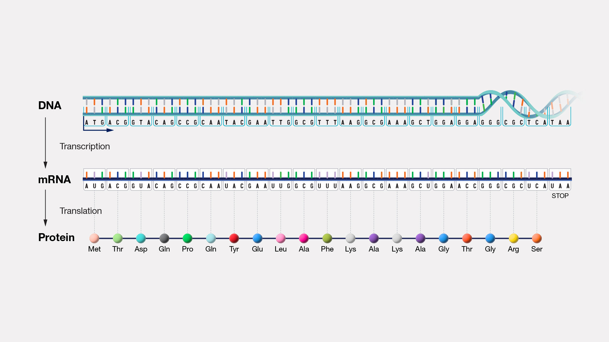
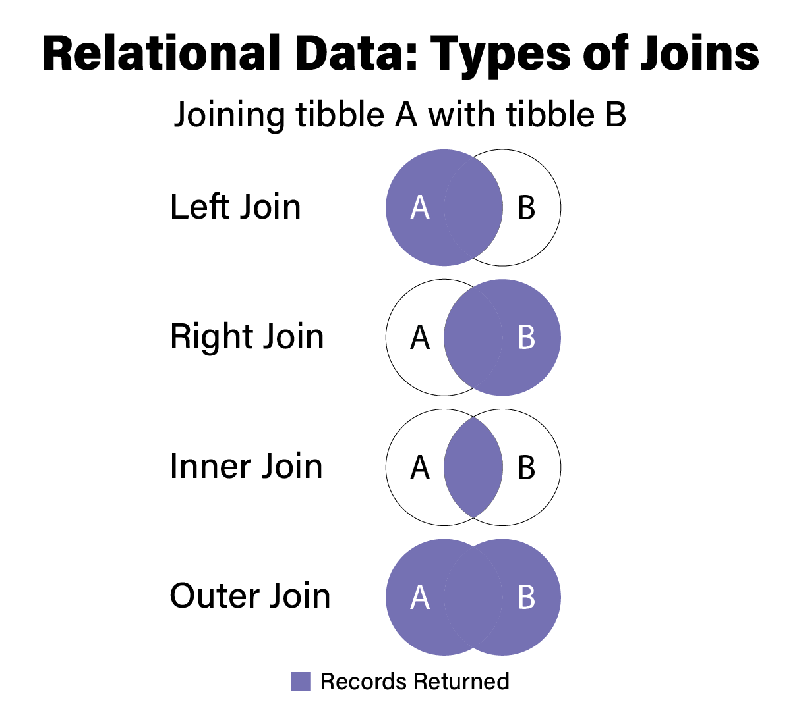

```{r, echo=F, results='hide', warning=F, message=F}
library(tidyverse)
setwd("..")
source("setup_example_data.R")
#ad_metadata <- readr::read_tsv('../../ad_metadata.tsv', show_col_types=F)
```

# Installing R Packages

## Installing Packages

* Advanced functionality in R is provided through *packages* written and supported
by R community members
* With the exception of [bioconductor
packages](#bio-bioconductor), all R packages are hosted on the [Comprehensive R
Archive Network](https://cran.r-project.org/) (CRAN) web site
* There are [more than 18,000 packages](https://cran.r-project.org/web/packages/index.html) hosted on CRAN
* To install a package from CRAN, use the `install.packages` function in the R console:

  ```r
  # install one package
  install.packages("tidyverse")
  # install multiple packages
  install.packages(c("readr","dplyr"))
  ```

# Gene Identifiers

## Central Dogma

{width=50%}

## Gene Expression Process

{width=75%}
 
## Gene Identifier Systems

* First gene sequence determined in 1965 - [an alanine
tRNA in yeast](https://pubmed.ncbi.nlm.nih.gov/14263761/)
* Genes are distinct entities - how do we name them?
* In 1979, formal guidelines for human gene nomenclature proposal gave
  researchers a common vocabulary for genes
* In 1989,  Human Genome Organisation (HUGO), become HUGO Gene Nomenclature Committee (HGNC)
* HGNC remains the official body providing guidelines and gene naming authority
* HGNC gene names called *gene symbols*

## HGNC Gene Name Guidelines

1. Each gene is assigned a unique symbol, HGNC ID and descriptive name.
2. Symbols contain only uppercase Latin letters and Arabic numerals.
3. Symbols should not be the same as commonly used abbreviations
4. Nomenclature should not contain reference to any species or “G” for gene.
5. Nomenclature should not be offensive or pejorative.

## Gene Symbols

* Gene symbols are the most human-readable system for naming genes
* e.g. *BRCA1*, *APOE*, and *ACE2*
* Symbols are convenient for humans when reading, identifying, communicating about genes
* However, symbols may be ambiguous, and some genes have many synonymous symbols
* Other gene identifier systems evolved in parallel to address this ambiguity

## Gene symbol ambiguity: APOE

{width=100%}

## Human Gene Identifier Systems: Ensembl

* [Ensembl](https://www.ensembl.org/) Project genome browser and genome annotation
  database
* Assigns automatic, systematic ID called *Ensembl Gene ID* during genome
  annotation
* Ensembl Gene ID follows convention `ENSGNNNNNNNNNNN`, where `N` are numbers
  - e.g. APOE is `ENSG00000130203`
* Gene annotation is
* Supports *versions* of genes, e.g. `ENSG00000130203.10` where `.10` indicates this
  is the 10th updated version of this gene
* Previous versions maintained

## Ensembl Gene IDs for Non-humans

* Ensembl Gene IDs have organism-specific conventions:

```{r echo=FALSE, results='asis', warning=F, message=F}
library(knitr)
kable(tribble(
  ~`Gene ID Prefix`, ~Organism, ~Symbol, ~Example,
  "`ENSG`", "Homo sapiens", "HOXA1", "ENSG00000105991",
  "`ENSMUSG`", "Mus musculus (mouse)", "Hoxa1", "ENSMUSG00000029844",
  "`ENSDARG`", "Danio rario (zebrafish)", "hoxa1a", "ENSDARG00000104307",
  "`ENSFCAG`", "Felis catus (cat)", "HOXA1",  "ENSFCAG00000007937",
  "`ENSMMUG`", "Macaca mulata (macaque)", "HOXA1", "ENSMMUG00000012807",
))
```

## Other Identifier Systems

* Ensembl is not the only gene identifier system besides gene symbol
* Entrez Gene IDs (UCSC Gene IDs) used by the [NCBI Gene
  database](https://www.ncbi.nlm.nih.gov/gene) are unique integers for each gene
  in each organism
  - APOE in humans is `384`, in mouse `11816`
* Online Mendelian Inheritance in Man (OMIM) database has identifiers that look like
  `OMIM:NNNNN`, where each OMIM ID refers to a unique gene or human phenotype
  - APOE is `OMIM:107741`
* UniProtKB/Swiss-Prot are protein sequence databases
  - APOE is `P02649`

## Mapping Between Identifier Systems

* Often must map between identifier systems
* e.g. We have Ensembl Gene ID, but want gene symbols
* Ensembl provides [BioMart](https://www.ensembl.org/biomart/martview) that provides
  gene identifier mappings
* Mappings can be downloaded as CSV files
* Ensembl website has [helpful
  documentation](https://useast.ensembl.org/info/data/biomart/index.html) on how
  to use BioMart to download annotation data

## Biomart in Bioconductor: `biomaRt`

* Ensembl also provides [the `biomaRt` Bioconductor
package](https://useast.ensembl.org/info/data/biomart/biomart_r_package.html)
* Allows programmatic access to the same information directly from R
* There is [much more information in the Ensembl
  databases](https://useast.ensembl.org/info/genome/index.html) than gene
  annotation data that can be accessed via BioMart

## `biomaRt` Example

```r
# this assumes biomaRt is already installed through bioconductor
library(biomaRt)

# the human biomaRt database is named "hsapiens_gene_ensembl"
ensembl <- useEnsembl(biomart="ensembl", dataset="hsapiens_gene_ensembl")
```

## `biomaRt` Example

```r
# listAttributes() returns a data frame, convert to tibble
as_tibble(listAttributes(ensembl))
# A tibble: 3,143 x 3
   name                          description                  page        
   <chr>                         <chr>                        <chr>       
 1 ensembl_gene_id               Gene stable ID               feature_page
 2 ensembl_gene_id_version       Gene stable ID version       feature_page
 3 ensembl_transcript_id         Transcript stable ID         feature_page
 4 ensembl_transcript_id_version Transcript stable ID version feature_page
 5 ensembl_peptide_id            Protein stable ID            feature_page
 6 ensembl_peptide_id_version    Protein stable ID version    feature_page
 7 ensembl_exon_id               Exon stable ID               feature_page
 8 description                   Gene description             feature_page
 9 chromosome_name               Chromosome/scaffold name     feature_page
10 start_position                Gene start (bp)              feature_page
# ... with 3,133 more rows
```

## `biomaRt` Example

* `name` column provides programmatic name associated with the attribute
that can be used to retrieve that annotation information using the `getBM()`
function:

```r
# create a tibble with ensembl gene ID, HGNC gene symbol, and gene description
gene_map <- as_tibble(
  getBM(
    attributes=c("ensembl_gene_id", "hgnc_symbol", "description"),
    mart=ensembl
  )
)
```

## `biomaRt` Example

```r
gene_map
# A tibble: 68,012 x 3
   ensembl_gene_id hgnc_symbol description                                                               
   <chr>           <chr>       <chr>                                                                     
 1 ENSG00000210049 MT-TF       mitochondrially encoded tRNA-Phe ...
 2 ENSG00000211459 MT-RNR1     mitochondrially encoded 12S rRNA ...
 3 ENSG00000210077 MT-TV       mitochondrially encoded tRNA-Val ...
 4 ENSG00000210082 MT-RNR2     mitochondrially encoded 16S rRNA ...
 5 ENSG00000209082 MT-TL1      mitochondrially encoded tRNA-Leu ...
 6 ENSG00000198888 MT-ND1      mitochondrially encoded NADH:ubiquinone
 7 ENSG00000210100 MT-TI       mitochondrially encoded tRNA-Ile ...
 8 ENSG00000210107 MT-TQ       mitochondrially encoded tRNA-Gln ...
 9 ENSG00000210112 MT-TM       mitochondrially encoded tRNA-Met ...
10 ENSG00000198763 MT-ND2      mitochondrially encoded NADH:ubiquinone
# ... with 68,002 more rows
```

# Relational Data

## Relational Data

* Often need to combine different sources of data together to aid in
  interpretation of results
* Consider our fake gene statistics tibble:

```{r}
tribble(
    ~gene, ~test1_stat, ~test1_p, ~test2_stat, ~test2_p,
   "APOE",   12.509293,   0.1032,   34.239521,   1.3e-5,
  "HOXD1",    4.399211,   0.6323,   16.332318,   0.0421,
   "SNCA",   45.748431,   4.2e-9,    0.757188,   0.9146,
)
```

## Match rows between tibbles

* `gene` column in tibble is a *gene symbol*
* Other gene IDs exist for the same gene, e.g. Ensembl Gene IDs, that are
  associated with other information
* Need to match up gene symbol with corresponding Ensembl Gene ID using a
  known mapping:

  ``` {r echo=T, results='hide'}
  gene_map <- tribble(
      ~symbol,            ~ENSGID,                    ~gene_name,
       "APOE",  "ENSG00000130203",            "apolipoprotein E",
      "BRCA1",  "ENSG00000012048", "BRCA1 DNA repair associated",
      "HOXD1",  "ENSG00000128645",                 "homeobox D1",
       "SNCA",  "ENSG00000145335",             "synuclein alpha",
  )
  ```

## Match rows between tibbles

  ```{r echo=F}
  gene_map
  ```

## Match rows between tibbles

* Term for matching up rows of two tibbles (tables) called *joining*
* We join the `gene_stats` tibble with the `gene_map` tibble
* Match the `gene` column with the `symbol` column
* `dplyr::left_join()` function accepts two data frames and the
  names of columns in each that share common values:

  ``` {r, results='hide'}
  dplyr::left_join(
      x=gene_stats,
      y=gene_map,
      by=c("gene" = "symbol")
  )
  ```

## Match rows between tibbles

  ``` {r, echo=F}
  dplyr::left_join(
      x=gene_stats,
      y=gene_map,
      by=c("gene" = "symbol")
  )
  ```

## Match rows between tibbles

* Same thing with pipe:

  ``` {r}
  gene_stats %>% dplyr::left_join(
    gene_map,
    by=c("gene" = "symbol")
  )
  ```

## Missing values in join

* The "direction" of the join determines which values appear in output
* *Left join* means include all rows in "left" tibble even if there is no match
* Note `BRCA1` is in `gene_map` but not `gene_stats`:

  ``` {r, results="hide"}
  dplyr::left_join(
    gene_map, # gene_map is "left"
    gene_stats, # gene_stats is "right"
    by=c("symbol" = "gene")
  )
  ```
  
## Missing values in join

  ``` {r, echo=F}
  dplyr::left_join(
    gene_map, # gene_map is "left"
    gene_stats, # gene_stats is "right"
    by=c("symbol" = "gene")
  )
  ```

## Join directions

* "Right joins" are simply the opposite of left joins:

  ``` {r}
  dplyr::right_join(
    gene_stats, # gene_stats is "left"
  gene_map, # gene_map is "right"
    by=c("gene" = "symbol")
  )
  ```

## Inner join

* *Inner joins* return results only for rows that have a match between the two tibbles
* Recall `gene_map` included BRCA1 even though it was not found in `gene_stats`
* Inner join will not include this row, because no match in `gene_stats` was found:

  ``` {r, results="hide"}
  dplyr::inner_join(
    gene_map,
    gene_stats,
    by=c("symbol" = "gene")
  )
  ```

## Inner join

  ``` {r, echo=F}
  dplyr::inner_join(
    gene_map,
    gene_stats,
    by=c("symbol" = "gene")
  )
  ```

## Full or outer join

* [`dplyr::full_join()`](https://dplyr.tidyverse.org/reference/mutate-joins.html)
  (also sometimes called an outer join)
* a full join will return all rows from both tibbles whether a match in the
  other table was found or not
  
##

<div class="centered">

</div>

## Multiple matches

* Sometimes one table will have multiple rows that match the values in the other
* Read the [textbook
  chapter](../data-wrangling.html#dealing-with-multiple-matches) on how to
  handle

# Mapping Homologs

## Mapping Homologs

```r
orth_map
# A tibble: 26,390 x 4
   Gene.stable.ID  HGNC.symbol Gene.stable.ID.1   MGI.symbol
   <chr>           <chr>       <chr>              <chr>     
 1 ENSG00000198695 MT-ND6      ENSMUSG00000064368 "mt-Nd6"  
 2 ENSG00000212907 MT-ND4L     ENSMUSG00000065947 "mt-Nd4l"
 3 ENSG00000279169 PRAMEF13    ENSMUSG00000094303 ""        
 4 ENSG00000279169 PRAMEF13    ENSMUSG00000094722 ""        
 5 ENSG00000279169 PRAMEF13    ENSMUSG00000095666 ""        
 6 ENSG00000279169 PRAMEF13    ENSMUSG00000094741 ""        
 7 ENSG00000279169 PRAMEF13    ENSMUSG00000094836 ""        
 8 ENSG00000279169 PRAMEF13    ENSMUSG00000074720 ""        
 9 ENSG00000279169 PRAMEF13    ENSMUSG00000096236 ""        
10 ENSG00000198763 MT-ND2      ENSMUSG00000064345 "mt-Nd2"  
# ... with 26,380 more rows
```

## Alternative: `AnnotationDbi`

* BioMart/biomaRt is not the only ways to map different gene identifiers
* [AnnotateDbi](https://bioconductor.org/packages/release/bioc/html/AnnotationDbi.html)
  provides gene identifier mapping independent of Ensembl
* Also includes identifiers from technology platforms, e.g. probe set IDs from [microarrays](#microarrays)
* Also allows comprehensive and flexible homolog mapping

# Data Visualization

## Data Visualization

* Data visualization is a core component of both exploring data and communicating
results
* The goal: present data in a graphical way that shows patterns that are otherwise invisible
* Effective data visualization is challenging!
* No "gold standard" to follow - only principles and judgment

## Properties of good data viz

An effective data visualization:

1. Depicts accurate data
2. Depicts data accurately
3. Shows enough, but not too much, of the data
4. Is self contained - no additional information (except a caption) is required
   to understand the contents of the figure

## Properties of great data viz

A *great* visualization has some additional properties:

5. Exposes patterns in the data not easily observable by other methods
6. Invites the viewer to ask more questions about the data

# Grammar of Graphics

## Grammar of Graphics {#dv-gg}

<div class="columns-2">


* "Grammar of graphics": a system of rules that describes how data and graphical
  aesthetics  are combined to form graphics and plots
* Aesthetics == color, size, shape, et c
* First popularized in the book [The Grammar of Graphics](https://www.google.com/books/edition/_/ZiwLCAAAQBAJ?hl=en) by Leland
Wilkinson and co-authors in 1999

</div>

## `ggplot2`

<div class="columns-2">


* [ggplot2](https://ggplot2.tidyverse.org/) R package that implements grammar of graphics
* Written by Hadley Wickham in 2005

</div>

## `ggplot2` Fundamentals

* Every plot is the combination of three types of information:
  1. **data** (i.e. values)
  2. **geometry** (i.e. shapes)
  3. **aesthetics** (i.e. connects values and shapes)
  
## `ggplot2` Example

* A simple example dataset:

  ```r
  ## # A tibble: 20 × 8
  ##    ID    age_at_death condition    tau  abeta   iba1   gfap braak_stage
  ##    <chr>        <dbl> <fct>      <dbl>  <dbl>  <dbl>  <dbl> <fct>      
  ##  1 A1              73 AD         96548 176324 157501  78139 4          
  ##  2 A2              82 AD         95251      0 147637  79348 4          
  ##                              ...
  ## 10 A10             69 AD         48357  27260  47024  78507 2          
  ## 11 C1              80 Control    62684  93739 131595 124075 3          
  ## 12 C2              77 Control    63598  69838   7189  35597 3          
  ##                              ...
  ## 20 C10             73 Control    15781  16592  10271 100858 1
  ```

## Sidebar: Tau pathology

{width=60%}

## `ggplot2` Example

* Goal: visualize the relationship between age at death and the amount of tau pathology
* Try a scatter plot where each marker is a subject with
  - $x$ is `age_at_death`
  - $y$ is `tau`

  ```r
  ggplot(
      data=ad_metadata,
      mapping = aes(
        x = age_at_death,
        y = tau
      )
    ) +
    geom_point()
  ```

## Simple Scatter Plot
```{r echo=F}
fig_size <- c(4,2)
```

```{r, fig.dim=fig_size, out.width="100%"}
ggplot(data=ad_metadata, mapping=aes(x=age_at_death, y=tau)) +
  geom_point()
```

## `ggplot2` Plot Components

```r
ggplot(data=ad_metadata, mapping=aes(x=age_at_death, y=tau)) +
  geom_point()
```

1. `ggplot()` - function creates a plot
2. `data=` - pass a tibble with the **data**
2. `mapping=aes(...)` - Define an **aesthetics** mapping connecting data to plot properties
3. `geom_point(...)` - Specify **geometry** as points where marks will be made at pairs
  of x,y coordinates

## Adding More Aesthetics

Is this the whole story?

```{r, fig.dim=fig_size, out.width="100%", echo=F}
ggplot(data=ad_metadata, mapping=aes(x=age_at_death, y=tau)) +
  geom_point()
```

## Adding More Aesthetics

* There are both AD and Control subjects in this dataset!
* How does `condition` relate to this relationship we see?
* Layer on an additional aesthetic of color:

  ```r
  ggplot(
      data=ad_metadata,
      mapping = aes(
        x = age_at_death,
        y = tau,
        color=condition # color each point
      )
    ) +
    geom_point()
  ```
## Adding More Aesthetics

```{r, fig.dim=fig_size, out.width="100%"}
ggplot(data=ad_metadata, mapping=aes(
      x=age_at_death, y=tau, color=condition
    )) + geom_point()
```

## Other Plot Geometries

* Differences in distributions of variables can be important
* Examine the distribution of `age_at_death` for AD and Control samples
  with [violin geometry](https://ggplot2.tidyverse.org/reference/geom_violin.html) with
  `geom_violin()`:
  
  ```r
  ggplot(data=ad_metadata, mapping = aes(x=condition, y=age_at_death)) +
    geom_violin()
  ```

## Violin Plot

```{r, fig.dim=fig_size, out.width="100%"}
ggplot(data=ad_metadata, mapping = aes(x=condition, y=age_at_death)) +
  geom_violin()
```

## Multiple Plots

* Can put multiple plots in one figure with `patchwork` library:

```r
library(patchwork)
age_boxplot <- ggplot(
    data=ad_metadata,
    mapping = aes(x=condition, y=age_at_death)
  ) +
  geom_boxplot()
tau_boxplot <- ggplot(
    data=ad_metadata,
    mapping=aes(x=condition, y=tau)
  ) +
  geom_boxplot()

age_boxplot | tau_boxplot # this puts the plots side by side
```

## Side by Side Plots

```r
age_boxplot | tau_boxplot # this puts the plots side by side
```

```{r, fig.dim=fig_size, out.width="100%", echo=F}
library(patchwork)
age_boxplot <- ggplot(data=ad_metadata, mapping = aes(x=condition, y=age_at_death)) +
  geom_boxplot()
tau_boxplot <- ggplot(data=ad_metadata, mapping=aes(x=condition, y=tau)) +
  geom_boxplot()

age_boxplot | tau_boxplot # this puts the plots side by side
```

## R Graph Gallery

* Useful collection of plot types and examples:
* [R Graph Gallery](https://www.r-graph-gallery.com/)
