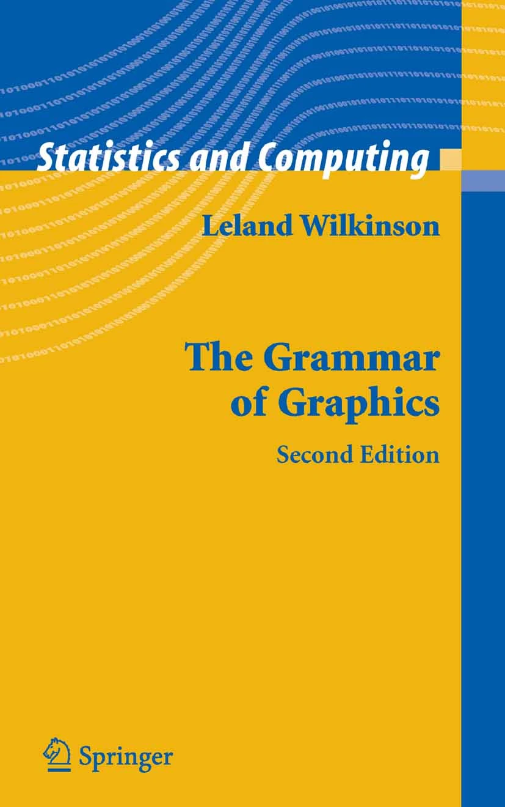

```{r, include=FALSE}
setwd('../')
source("0700_bioinfo.R")
source("setup_example_data.R")
setwd('slides')
library(tidyverse)
library(ggplot2)
```

# Grammar of Graphics

## Grammar of Graphics

<div class="columns-2">



* "Grammar of graphics": a system of rules that describes how data and graphical
  aesthetics  are combined to form graphics and plots
* Aesthetics == color, size, shape, et c
* First popularized in the book [The Grammar of Graphics](https://www.google.com/books/edition/_/ZiwLCAAAQBAJ?hl=en) by Leland
Wilkinson and co-authors in 1999

</div>

## `ggplot2`

<div class="columns-2">


* [ggplot2](https://ggplot2.tidyverse.org/) R package that implements grammar of graphics
* Written by Hadley Wickham in 2005

</div>

## `ggplot2` Fundamentals

* Every plot is the combination of three types of information:
  1. **data** (i.e. values)
  2. **geometry** (i.e. shapes)
  3. **aesthetics** (i.e. connects values and shapes)
  
## `ggplot2` Example

* A simple example dataset:

  ```r
  ## # A tibble: 20 × 8
  ##    ID    age_at_death condition    tau  abeta   iba1   gfap braak_stage
  ##    <chr>        <dbl> <fct>      <dbl>  <dbl>  <dbl>  <dbl> <fct>      
  ##  1 A1              73 AD         96548 176324 157501  78139 4          
  ##  2 A2              82 AD         95251      0 147637  79348 4          
  ##                              ...
  ## 10 A10             69 AD         48357  27260  47024  78507 2          
  ## 11 C1              80 Control    62684  93739 131595 124075 3          
  ## 12 C2              77 Control    63598  69838   7189  35597 3          
  ##                              ...
  ## 20 C10             73 Control    15781  16592  10271 100858 1
  ```

## Sidebar: Tau pathology

{width=60%}

## `ggplot2` Example

* Goal: visualize the relationship between age at death and the amount of tau pathology
* Try a scatter plot where each marker is a subject with
  - $x$ is `age_at_death`
  - $y$ is `tau`

  ```r
  ggplot(
      data=ad_metadata,
      mapping = aes(
        x = age_at_death,
        y = tau
      )
    ) +
    geom_point()
  ```

## Simple Scatter Plot
```{r echo=F}
fig_size <- c(4,2)
```

```{r, fig.dim=fig_size, out.width="100%"}
ggplot(data=ad_metadata, mapping=aes(x=age_at_death, y=tau)) +
  geom_point()
```

## `ggplot2` Plot Components

```r
ggplot(data=ad_metadata, mapping=aes(x=age_at_death, y=tau)) +
  geom_point()
```

1. `ggplot()` - function creates a plot
2. `data=` - pass a tibble with the **data**
2. `mapping=aes(...)` - Define an **aesthetics** mapping connecting data to plot properties
3. `geom_point(...)` - Specify **geometry** as points where marks will be made at pairs
  of x,y coordinates

## Adding More Aesthetics

Is this the whole story?

```{r, fig.dim=fig_size, out.width="100%", echo=F}
ggplot(data=ad_metadata, mapping=aes(x=age_at_death, y=tau)) +
  geom_point()
```

## Adding More Aesthetics

* There are both AD and Control subjects in this dataset!
* How does `condition` relate to this relationship we see?
* Layer on an additional aesthetic of color:

  ```r
  ggplot(
      data=ad_metadata,
      mapping = aes(
        x = age_at_death,
        y = tau,
        color=condition # color each point
      )
    ) +
    geom_point()
  ```
  
## Adding More Aesthetics

```{r, fig.dim=fig_size, out.width="100%"}
ggplot(data=ad_metadata, mapping=aes(
      x=age_at_death, y=tau, color=condition
    )) + geom_point()
```

## Other Plot Geometries

* Differences in distributions of variables can be important
* Examine the distribution of `age_at_death` for AD and Control samples
  with [violin geometry](https://ggplot2.tidyverse.org/reference/geom_violin.html) with
  `geom_violin()`:
  
  ```r
  ggplot(data=ad_metadata, mapping = aes(x=condition, y=age_at_death)) +
    geom_violin()
  ```

## Violin Plot

```{r, fig.dim=fig_size, out.width="100%"}
ggplot(data=ad_metadata, mapping = aes(x=condition, y=age_at_death)) +
  geom_violin()
```

## Multiple Plots

* Can put multiple plots in one figure with `patchwork` library:

```r
library(patchwork)
age_boxplot <- ggplot(
    data=ad_metadata,
    mapping = aes(x=condition, y=age_at_death)
  ) +
  geom_boxplot()
tau_boxplot <- ggplot(
    data=ad_metadata,
    mapping=aes(x=condition, y=tau)
  ) +
  geom_boxplot()

age_boxplot | tau_boxplot # this puts the plots side by side
```

## Side by Side Plots

```r
age_boxplot | tau_boxplot # this puts the plots side by side
```

```{r, fig.dim=fig_size, out.width="100%", echo=F}
library(patchwork)
age_boxplot <- ggplot(data=ad_metadata, mapping = aes(x=condition, y=age_at_death)) +
  geom_boxplot()
tau_boxplot <- ggplot(data=ad_metadata, mapping=aes(x=condition, y=tau)) +
  geom_boxplot()

age_boxplot | tau_boxplot # this puts the plots side by side
```

## R Graph Gallery

* Useful collection of plot types and examples:
* [R Graph Gallery](https://www.r-graph-gallery.com/)

# `ggplot` Mechanics

## `ggplot` Mechanics

* `ggplot` has two key concepts that give it great flexibility: **layers** and
   **scales**
* A *layer* is one set of data drawn with a geometry and an aesthetic
* A *scale* is the mapping from the data values to visual properties
* A plot may have one or more layers
* Different layers may share scales or have their own

## `ggplot` Layers

* Each layer is a set of data connected to a geometry and an aesthetic
* Each `geom_X()` function adds a layer to a plot
* The plot has three layers:

  ```r
  ggplot(data=ad_metadata, mapping=aes(x=age_at_death)) +
    geom_point(mapping=aes(y=tau, color='blue')) +
    geom_point(mapping=aes(y=abeta, color='red')) +
    geom_point(mapping=aes(y=iba1, color='cyan'))
  ```

## `ggplot` Layers

```{r, fig.dim=fig_size, out.width="100%", echo=F}
ggplot(data=ad_metadata, mapping=aes(x=age_at_death)) +
  geom_point(mapping=aes(y=tau, color='blue')) +
  geom_point(mapping=aes(y=abeta, color='red')) +
  geom_point(mapping=aes(y=iba1, color='cyan'))
```

## `ggplot` Scales

* A scale maps data onto a range, e.g.:
  - pixel range
  - color on a gradient/set of colors
  - shape type, circle or square
  - shape dimension, like circle radius
* Multiple layers on the same plot
  - Must share at least one scale to be plotted together
  - May differ in one or more scales to be distinguished from each other

## `ggplot` Scales

How many layers? How many scales?

```{r, fig.dim=fig_size, out.width="100%", echo=F}
ggplot(data=ad_metadata, mapping=aes(x=age_at_death)) +
  geom_point(mapping=aes(y=tau, color='blue')) +
  geom_point(mapping=aes(y=abeta, color='red')) +
  geom_point(mapping=aes(y=iba1, color='cyan'))
```

## `ggplot` Incompatible Scales

```r
ggplot(data=ad_metadata, mapping=aes(x=braak_stage)) +
  geom_point(mapping=aes(y=tau, color='blue')) +
  geom_point(mapping=aes(y=age_at_death, color='red'))
```

## `ggplot` Incompatible Scales

```{r, fig.dim=fig_size, out.width="100%", echo=F}
ggplot(data=ad_metadata, mapping=aes(x=braak_stage)) +
  geom_point(mapping=aes(y=tau, color='blue')) +
  geom_point(mapping=aes(y=age_at_death, color='red'))
```

# Plotting One Dimension

# Bar Charts

## Bar chart

* Map length (i.e. height or width of rectangle) proportional to scalar value

```r
ggplot(ad_metadata,
  mapping = aes(
    x=ID,
    y=tau)
  ) +
  geom_bar(stat="identity")
```

## Bar chart

``` {r, fig.dim=fig_size, out.width="100%", echo=T, results="show"}
ggplot(ad_metadata, mapping = aes(x=ID,y=tau)) +
  geom_bar(stat="identity")
```

## More insightful bar chart

* Change the fill color of the bars based on condition:

```r
ggplot(ad_metadata,
  mapping = aes(
    x=ID,
    y=tau,
    fill=condition)
  ) +
  geom_bar(stat="identity")
```

## More insightful bar chart

``` {r, fig.dim=fig_size, out.width="100%", echo=T, results="show"}
ggplot(ad_metadata, mapping = aes(x=ID,y=tau,fill=condition)) +
  geom_bar(stat="identity")
```

## Diverging bar chart

* Bar charts can also plot negative numbers

```r
mutate(ad_metadata, tau_centered=(tau - mean(tau))) %>%
  ggplot(mapping = aes(
    x=ID,
    y=tau_centered,
    fill=condition)
  ) +
  geom_bar(stat="identity")
```

## Diverging bar chart

``` {r, fig.dim=fig_size, out.width="100%", echo=T, results="show"}
mutate(ad_metadata, tau_centered=(tau - mean(tau))) %>%
  ggplot(mapping = aes(x=ID, y=tau_centered, fill=condition)) +
  geom_bar(stat="identity")
```

# Lollipop plots

## Lollipop plots

* Similar to bar charts, "lollipop plots" replace bar with a line segment and a circle
* No dedicated geometry - use `geom_point` and `geom_segment` layers:

```r
ggplot(ad_metadata) +
  geom_point(mapping=aes(x=ID, y=tau)) +
  geom_segment(mapping=aes(x=ID, xend=ID, y=0, yend=tau))
```

## Lollipop plots

``` {r, fig.dim=fig_size, out.width="100%", echo=T}
ggplot(ad_metadata) +
  geom_point(mapping=aes(x=ID, y=tau)) +
  geom_segment(mapping=aes(x=ID, xend=ID, y=0, yend=tau))
```

# Stacked Area charts

## Stacked Area charts

* Visualize multiple 1D data that share a common categorical axis

```r
pivot_longer(
    ad_metadata,
    c(tau,abeta,iba1,gfap),
    names_to='Marker',
    values_to='Intensity'
  ) %>%
  ggplot(aes(x=ID,y=Intensity,group=Marker,fill=Marker)) +
    geom_area()
```

## Stacked Area charts

```{r, fig.dim=fig_size, out.width="100%", echo=F}
pivot_longer(
  ad_metadata,
  c(tau,abeta,iba1,gfap),
  names_to='Marker',
  values_to='Intensity'
  ) %>%
  ggplot(aes(x=ID,y=Intensity,group=Marker,fill=Marker)) +
    geom_area()
```

## Stacked Area Charts Components

Stacked area plots require three pieces of data:

* **x** - a numeric or categorical axis for vertical alignment
* **y** - a numeric axis to draw vertical proportions
* **group** - a categorical variable that indicates which (x,y) pairs correspond
  to the same line

## Proportional Stacked Area Charts

* Can view the relative proportion of values in each category rather than the actual values

```r
pivot_longer(
    ad_metadata,
    c(tau,abeta,iba1,gfap),
    names_to='Marker',
    values_to='Intensity'
  ) %>%
  group_by(ID) %>% # divide each intensity values by sum markers
  mutate(
    `Relative Intensity`=Intensity/sum(Intensity)
  ) %>%
  ungroup() %>% # ungroup restores the tibble to original number of rows
  ggplot(aes(x=ID,y=`Relative Intensity`,group=Marker,fill=Marker)) +
    geom_area()
```

## Proportional Stacked Area Charts

```{r, fig.dim=fig_size, out.width="100%", echo=F, results="show"}
pivot_longer(
    ad_metadata,
    c(tau,abeta,iba1,gfap),
    names_to='Marker',
    values_to='Intensity'
  ) %>%
  group_by(ID) %>% # divide each intensity values by sum markers
  mutate(
    `Relative Intensity`=Intensity/sum(Intensity)
  ) %>%
  ungroup() %>% # ungroup restores the tibble to original number of rows
  ggplot(aes(x=ID,y=`Relative Intensity`,group=Marker,fill=Marker)) +
    geom_area()
```

# Visualizing Distributions

## Visualizing Distributions

* A distribution describes the general "shape" of a set of numbers
  - i.e. what is the relative frequency of the values, or ranges of values
* Must understand distribution of data to choose statistical methods appropriately

# Histogram

## Histogram

* First described by Karl Pearson
* Type of bar chart
* Divides up the range of a dataset from minimum to maximum into bins usually of 
  the same size
* Each bin represented by a bar with height or width proportional to number of 
  values that fall within that bin
  
```r
ggplot(ad_metadata) +
  geom_histogram(mapping=aes(x=age_at_death))
```

## Histogram

``` {r, fig.dim=fig_size, out.width="100%", echo=F}
ggplot(ad_metadata) +
  geom_histogram(mapping=aes(x=age_at_death))
```

## Changing histogram bins

``` {r, fig.dim=fig_size, out.width="100%", echo=T}
ggplot(ad_metadata) +
  geom_histogram(mapping=aes(x=age_at_death),bins=10)
```

## Histograms sensitive to number of data points

* Histogram of synthetic dataset of 1000 normally distributed values:

```r
tibble(x=rnorm(1000)) %>%
  ggplot() +
  geom_histogram(aes(x=x))
```

## Histograms sensitive to number of data points

```{r, fig.dim=fig_size, out.width="100%", echo=F}
tibble(x=rnorm(1000)) %>%
  ggplot() +
  geom_histogram(aes(x=x))
```

## Histograms with multiple distributions

* Can add multiple histograms to same plot

```r
tibble(
  x=c(rnorm(1000),rnorm(1000,mean=4)),
  type=c(rep('A',1000),rep('B',1000))
) %>%
  ggplot(aes(x=x,fill=type)) +
  geom_histogram(bins=30, alpha=0.6, position="identity")
```

## Histograms with multiple distributions

``` {r, fig.dim=fig_size, out.width="100%", echo=F}
tibble(
  x=c(rnorm(1000),rnorm(1000,mean=4)),
  type=c(rep('A',1000),rep('B',1000))
) %>%
  ggplot(aes(x=x,fill=type)) +
  geom_histogram(bins=30, alpha=0.6, position="identity")
```

# Density plots

## Density plot

* Similar to histogram, except instead of binning the values draws a smoothly interpolated line that approximates the distribution
* Density plot is always normalized so the integral under the curve is approximately 1

  ```r
  ggplot(ad_metadata) +
    geom_density(mapping=aes(x=age_at_death),fill="#c9a13daa")
  ```

## Density plot

```{r, fig.dim=fig_size, out.width="100%", echo=F}
ggplot(ad_metadata) +
  geom_density(mapping=aes(x=age_at_death),fill="#c9a13daa")
```

## Density plot vs histogram

```r
library(patchwork)
hist_g <- ggplot(ad_metadata) +
  geom_histogram(mapping=aes(x=age_at_death),bins=30)
density_g <- ggplot(ad_metadata) +
  geom_density(mapping=aes(x=age_at_death),fill="#c9a13daa")

hist_g | density_g
```

## Density plot vs histogram

```{r, fig.dim=fig_size, out.width="100%", echo=F}
library(patchwork)
hist_g <- ggplot(ad_metadata) +
  geom_histogram(mapping=aes(x=age_at_death),bins=30)
density_g <- ggplot(ad_metadata) +
  geom_density(mapping=aes(x=age_at_death),fill="#c9a13daa")

hist_g | density_g
```

## Density plot vs histogram

```r
library(patchwork)
normal_samples <- tibble(
  x=c(rnorm(1000),rnorm(1000,mean=4)),
  type=c(rep('A',1000),rep('B',1000))
)
hist_g <- ggplot(normal_samples) +
  geom_histogram(
    mapping=aes(x=x,fill=type),
    alpha=0.6, position="identity", bins=30
)
density_g <- ggplot(normal_samples) +
  geom_density(
    mapping=aes(x=x,fill=type),
    alpha=0.6, position="identity"
  )

hist_g | density_g
```

## Density plot vs histogram

```{r, fig.dim=fig_size+c(0,0.5), out.width="100%", echo=F}
library(patchwork)
normal_samples <- tibble(
  x=c(rnorm(1000),rnorm(1000,mean=4)),
  type=c(rep('A',1000),rep('B',1000))
)
hist_g <- ggplot(normal_samples) +
  geom_histogram(
    mapping=aes(x=x,fill=type),
    alpha=0.6, position="identity", bins=30
)
density_g <- ggplot(normal_samples) +
  geom_density(
    mapping=aes(x=x,fill=type),
    alpha=0.6, position="identity"
  )

hist_g | density_g
```

# Boxplots

## Boxplot

* The histogram depicts distribution as a "box and whiskers"
* Assume data are unimodal (i.e. roughly bell-shaped)
* Explicitly draws:
  - Median
  - 25th and 75th percentile (a.k.a. 1st and 3rd quartile)
  - "whiskers" that show further extents
  - Some have markers for outlier samples
  
```r
ggplot(ad_metadata) +
  geom_boxplot(mapping=aes(x=condition,y=age_at_death))
```

## Boxplot

``` {r, fig.dim=fig_size, out.width="100%", echo=T, results="show"}
ggplot(ad_metadata) +
  geom_boxplot(mapping=aes(x=condition,y=age_at_death))
```

## Boxplot Anatomy

<div class="centered">

</div>

## Boxplot shortcomings

```{r, fig.dim=fig_size+c(0,-0.5), out.width="100%", echo=T}
normal_samples <- tibble(
  x=c(rnorm(1000),rnorm(1000,4),rnorm(1000,2,3)),
  type=c(rep('A',2000),rep('B',1000))
)
ggplot(normal_samples, aes(x=x,fill=type,alpha=0.6)) +
  geom_density()
```

## Boxplot shortcomings

```{r, fig.dim=fig_size+c(0,-0.5), out.width="100%", echo=T}
ggplot(normal_samples, aes(x=type,y=x,fill=type)) +
  geom_boxplot()
```

## Boxplot shortcomings

```r
library(patchwork)
g <- ggplot(normal_samples, aes(x=type,y=x,fill=type))
boxplot_g <- g + geom_boxplot()
violin_g <- g + geom_violin()

boxplot_g | violin_g
```

## Boxplot shortcomings

* Boxplots can be misleading

```{r, fig.dim=fig_size, out.width="100%", echo=F, results="show"}
library(patchwork)
normal_samples <- tibble(
  x=c(rnorm(1000),rnorm(1000,4),rnorm(1000,2,3)),
  type=c(rep('A',2000),rep('B',1000))
)
g <- ggplot(normal_samples, aes(x=type,y=x,fill=type))
boxplot_g <- g +  geom_boxplot()
violin_g <- g + geom_violin()

boxplot_g | violin_g
```

# Violin Plots

## Violin plot

* [violin plot](https://ggplot2.tidyverse.org/reference/geom_violin.html) produces a shape where the width is proportional to the density of values value along the x or y axis
*Similar in principle to a histogram or a density plot

```r
ggplot(ad_metadata) +
  geom_violin(aes(x=condition,y=tau,fill=condition))
```

## Violin plot

```{r, fig.dim=fig_size, out.width="100%", echo=F, results="show"}
ggplot(ad_metadata) +
  geom_violin(aes(x=condition,y=tau,fill=condition))
```

# Beeswarm Plots

## Beeswarm plot

* [beeswarm plot](https://r-charts.com/distribution/ggbeeswarm/) similar to
a violin plot
* Plots the data itself as points like in a scatter plot
* Points are 'jittered' so they don't overlap

```r
library(ggbeeswarm)
ggplot(ad_metadata) +
  geom_beeswarm(
    aes(x=condition,y=age_at_death,color=condition),
    cex=2,
    size=2
  )
```

## Beeswarm plot

``` {r, fig.dim=fig_size, out.width="100%", echo=F, results="show"}
library(ggbeeswarm)
ggplot(ad_metadata) +
  geom_beeswarm(
    aes(x=condition,y=age_at_death,color=condition),
    cex=2,
    size=2
  )
```

## Beeswarm plot limitations

* Typically only useful when the number of values is not too many or too few:

```r
normal_samples <- tibble(
  x=c(rnorm(1000),rnorm(1000,4),rnorm(1000,2,3)),
  type=c(rep('A',2000),rep('B',1000))
)
ggplot(normal_samples, aes(x=type,y=x,color=type)) +
  geom_beeswarm()
```

## Beeswarm plot limitations

``` {r, fig.dim=fig_size, out.width="100%", echo=T, results="show"}
ggplot(normal_samples, aes(x=type,y=x,color=type)) +
  geom_beeswarm()
```

## Seeing patterns in bees

* Can color bees by another value

```r
normal_samples <- tibble(
  x=c(rnorm(100),rnorm(100,4),rnorm(100,2,3)),
  type=c(rep('A',200),rep('B',100)),
  category=sample(c('healthy','disease'),300,replace=TRUE)
)
ggplot(normal_samples, aes(x=type,y=x,color=category)) +
  geom_beeswarm()
```

## Seeing patterns in bees

``` {r, fig.dim=fig_size, out.width="100%", echo=F, results="show"}
normal_samples <- tibble(
  x=c(rnorm(100),rnorm(100,4),rnorm(100,2,3)),
  type=c(rep('A',200),rep('B',100)),
  category=sample(c('healthy','disease'),300,replace=TRUE)
)
ggplot(normal_samples, aes(x=type,y=x,color=category)) +
  geom_beeswarm()
```

# Ridgeline Plots

## Ridgeline

* [ridgeline charts](https://www.r-graph-gallery.com/294-basic-ridgeline-plot.html) plot many non-trivial distributions
* Simply multiple density plots drawn for different variables
within the same plot

```r
library(ggridges)

tibble(
  x=c(rnorm(100),rnorm(100,4),rnorm(100,2,3)),
  type=c(rep('A',200),rep('B',100)),
) %>%
  ggplot(aes(y=type,x=x,fill=type)) +
  geom_density_ridges()
```

## Ridgeline

``` {r, fig.dim=fig_size, out.width="100%", echo=F, results="show"}
library(ggridges)

tibble(
  x=c(rnorm(100),rnorm(100,4),rnorm(100,2,3)),
  type=c(rep('A',200),rep('B',100)),
) %>%
  ggplot(aes(y=type,x=x,fill=type)) +
  geom_density_ridges()
```

## Many ridgelines

```r
tibble(
  x=rnorm(10000,mean=runif(10,1,10),sd=runif(2,1,4)),
  type=rep(c("A","B","C","D","E","F","G","H","I","J"),1000)
) %>%
  ggplot(aes(y=type,x=x,fill=type)) +
  geom_density_ridges(alpha=0.6,position="identity")
```

## Many ridgelines

``` {r, fig.dim=fig_size, out.width="100%", echo=F, results="show"}
tibble(
  x=rnorm(10000,mean=runif(10,1,10),sd=runif(2,1,4)),
  type=rep(c("A","B","C","D","E","F","G","H","I","J"),1000)
) %>%
  ggplot(aes(y=type,x=x,fill=type)) +
  geom_density_ridges(alpha=0.6,position="identity")
```

# Gene Expression

## Gene Expression

* Gene expression: the process by which information from a gene is used in the
  synthesis of functional gene products that affect a phenotype.
* Gene expression studies are often focused on protein coding genes
* Many functional expressed molecules
  - protein coding genes
  - [lncRNAs](https://en.wikipedia.org/wiki/Long_non-coding_RNA)
  - [transfer RNAs](https://www.genome.gov/genetics-glossary/Transfer-RNA)
  - microRNAs

## Gene Expression Process

* Specific parts of the genome code for genes
* Gene sequences *transcribed* into RNA molecules called *transcripts*
* In lower organisms (e.g. bacteria), RNA molecules passed directly to ribosomes
* In most higher organisms (i.e. eukaryotes):
  1. Initial transcripts, called *pre-messenger RNA (pre-mRNA) transcripts* are
  processed via splicing 
  2. Splicing removes certain parts of pre-mRNA (*introns*) and concatenates
  adjacent sequences (*exons*) together into *mature RNA (mRNA)*
  3. mRNA exported from nucleus to be translated at ribosomes 
  
## Gene Expression Process

{width=75%}
 
## Gene Expression Measurements

* Measurements proportional to abundance (or copy number) of RNA transcripts
* Measurements are always non-negative
* Usually *relative* to some normalizing quantity
  - i.e. a value of zero does *not* mean gene is not expressed!
* Some methods (e.g. digital droplet PCR) can estimate absolute abundance
  (i.e. exact number of copies)

## Gene Expression Assays

* Many ways to measure the abundance of RNA transcripts

  - Light absorbance
  - [Northern blot](https://www.genome.gov/genetics-glossary/Northern-Blot) 
  - [quantitative polymerase chain reaction
  (qPCR)](https://www.thermofisher.com/blog/ask-a-scientist/what-is-qpcr/)
  - Oligonucleotide and microarrays
  - High throughput RNA sequencing (RNASeq)

# Gene Expression Data in Bioconductor

## Gene Expression Data in Bioconductor

* [SummarizedExperiment
container](https://bioconductor.org/packages/release/bioc/html/SummarizedExperiment.html)
 standard way to load and work with gene expression data in Bioconductor
* Stores the following information:

  - `assays` - one or more measurement assays (e.g. gene expression) in the form of a feature by sample matrix
  - `colData` - metadata associated with the samples (i.e. columns) of the assays
  - `rowData` - metadata associated with the features (i.e. rows) of the assays
  - `exptData` - additional metadata about the experiment itself, like protocol, project name, etc

## SummarizedExperiment Schematic

{width=70%}

## Creating SummarizedExperiments

*  Many Bioconductor packages for specific types of data, e.g.
  [limma](#differential-expression--microarrays-limma) create SummarizedExperiment
  objects for you
* You may also create your own...

## Creating `SummarizedExperiment`s

```{r load summarizedexperiment, include=FALSE}
library(SummarizedExperiment)
intensities <- readr::read_delim("../example_intensity_data.csv",delim=" ")
rowData <- intensities["probeset_id"]
intensities <- as.data.frame(
  dplyr::select(intensities, -probeset_id)
)
rownames(intensities) <- rowData$probeset_id
colData <- tibble(
  sample_name=colnames(intensities),
  condition=sample(c("case","control"),ncol(intensities),replace=TRUE)
)
se <- SummarizedExperiment(
   assays=list(intensities=intensities),
   colData=colData,
   rowData=rowData
)
```


```r
# microarray expression dataset intensities
intensities <- readr::read_delim(
  "example_intensity_data.csv",delim=" "
)

# the first column of intensities tibble is the probesetId,
# extract to pass as rowData
rowData <- intensities["probeset_id"]

# remove probeset IDs from tibble and turn into a R dataframe
# so that we can assign rownames since tibbles don't support
# row names
intensities <- as.data.frame(
  select(intensities, -probeset_id)
)
rownames(intensities) <- rowData$probeset_id
```

## `SummarizedExperiment` cont'd

```r
# these column data are made up, but you would have a
# sample metadata file to use
colData <- tibble(
  sample_name=colnames(intensities),
  condition=sample(c("case","control"),ncol(intensities),replace=TRUE)
)

se <- SummarizedExperiment(
   assays=list(intensities=intensities),
   colData=colData,
   rowData=rowData
)
```

## `SummarizedExperiment` cont'd

```r
se
## class: SummarizedExperiment
## dim: 54675 35
## metadata(0):
## assays(1): intensities
## rownames(54675): 1007_s_at 1053_at ... AFFX-TrpnX-5_at AFFX-TrpnX-M_at
## rowData names(1): probeset_id
## colnames(35): GSM972389 GSM972390 ... GSM972512 GSM972521
## colData names(2): sample_name condition
```

# Microarrays

## Microarrays

<div class="columns-2">

{width=80%}

* Microarrays: devices that measure relative abundance of DNA molecules
* Measure 1000s of DNA molecules simultaneously
* Molecules are selected *a priori* and "hard coded" onto the device

</div>


## Types of Microarrays 

* Microarrays measure DNA
* Usually one microarray is generated for an individual sample
* Sample preparation method depends on target molecules 
  - DNA: e.g. genetic variants, the DNA itself is biochemically extracted
  - RNA abundance: RNA extracted then reverse transcribed to complementary DNA (cDNA)
  
## Microarray Terminology

* **probe** - short (~25nt) cDNA molecule complementary to portion of target transcript
* **probe set** - a set of probes that all target the same gene
* **flowcell** - the glass slide portion of device that has probes deposited on it

## Microarray Design

{width=100%}

## Microarray Data Generation Process

{width=100%}

# Microarray Gene Expression Data

## Microarray Gene Expression Data

Four steps involved in analyzing gene expression microarray data:

1. **Summarization of probes to probesets**
2. **Normalization**
3. **Quality control**
4. **Analysis**

## Microarray Data

* Raw probe intensity data stored in CEL data files
* [`affy` Bioconductor package](https://www.bioconductor.org/packages/release/bioc/html/affy.html)
  - Loads CEL files into Bioconductor objects
  - Performs key preprocessing operations
* Typically have many CEL files, one per each sample

## Reading CEL Files

* Load CEL files with `affy::ReadAffy` function

```r
# read all CEL files in a single directory
affy_batch <- affy::ReadAffy(celfile.path="directory/of/CELfiles")

# or individual files in different directories
cel_filenames <- c(
  list.files( path="CELfile_dir1", full.names=TRUE, pattern=".CEL$" ),
  list.files( path="CELfile_dir2", full.names=TRUE, pattern=".CEL$" )
)
affy_batch <- affy::ReadAffy(filenames=cel_filenames)
```

## Probe summarization and normalization

* `affy` package provides functions to perform probe summarization and normalization
* Robust Multi-array Average (RMA) state of the art method for normalization
* `affy::rma` function implements RMA, performs summarization and normalization
  of multiple arrays simultaneously

## Aside: R package data

* Some packages include data with the R functionality
* Load package data into your workspace with `data()` function

```r
library(affydata)
data(Dilution)
```

## RMA normalization

```{r microarray norm 1, include=F}
library(affy)
library(affydata)
data(Dilution)

# normalize the Dilution microarray expression values
# note Dilution is an AffyBatch object
eset_rma <- affy::rma(Dilution,verbose=FALSE)
```

```r
library(affy)
library(affydata)
data(Dilution)

# normalize the Dilution microarray expression values
# note Dilution is an AffyBatch object
eset_rma <- affy::rma(Dilution,verbose=FALSE)
```

## `ExpressionSet` vs `SummarizedExperiment`

* `ExpressionSet` is a container that contains high throughput assay data
* Similar to and superseded by `SummarizedExperiment`
* Some older packages (notably `affy`) return `ExpressionSet` objects, not
  `SummarizedExperiment`s
* Similar interface, but some key differences

| Operation | ExpressionSet | SummarizedExperiment |
|-----------|-----------------|------------------------|
| Get expression values | `exprs(eset)` | `assays(se)` |
| Get column data | `phenoData(eset)` | `colData(se)` |
| Get row data | `annotation(eset)` | `rowData(se)` |

## RMA normalization

```{r microarray norm 2, echo=F}
# plot distribution of non-normalized probes
# note rma normalization takes the log2 of the expression values,
# so we must do so on the raw data to compare
raw_intensity <- as_tibble(exprs(Dilution)) %>%
  mutate(probeset_id=rownames(exprs(Dilution))) %>%
  pivot_longer(-probeset_id, names_to="Sample", values_to = "Intensity") %>%
  mutate(
    `log2 Intensity`=log2(Intensity),
    Category="Before Normalization"
  )

# plot distribution of normalized probes
rma_intensity <- as_tibble(exprs(eset_rma)) %>%
  mutate(probesetid=featureNames(eset_rma)) %>%
  pivot_longer(-probesetid, names_to="Sample", values_to = "log2 Intensity") %>%
  mutate(Category="RMA Normalized")

dplyr::bind_rows(raw_intensity, rma_intensity) %>%
  ggplot(aes(x=Sample, y=`log2 Intensity`)) +
  geom_boxplot() +
  facet_wrap(vars(Category))
```