```{r, include=FALSE}
setwd('../')
source("0700_bioinfo.R")
source("setup_example_data.R")
setwd('slides')
library(tidyverse)
library(ggplot2)
```


# Data Science

## Data Modeling

Data modeling goal:

* describe a dataset using a relatively small number of mathematical relationships, or
* use some parts of a dataset to try to accurately predict other parts of the dataset

## Models are human inventions

Models:

* reflect our beliefs about the way the universe works
* can identify patterns within a dataset that are the result of causal relationships
* separate meaningful signal of interest from noise
* *the model itself does not identify or even accurately reflect those causal effects*
* summarizes patterns and we as scientists are left to interpret those patterns

## Data Modeling Principles

1. **Data are never wrong.**
2. **Not all data are useful.**
3. **"All models are wrong, but some are useful."** - George Box
4. **Data do not contain causal information.**
   * i.e. "Correlation does not mean causation."
5. **All data have noise.** 

## Types of Models

* **Scientific model**:
  - conceptual representation of our belief of the universe
  - proposes causal explanations for phenomenon, i.e. *hypotheses*
  - helps us design experiments and collect data to test the accuracy of the model
* **Statistical model**:
  - maps a scientific model onto a mechanical procedure
  - quantifies how well our scientific model explains a dataset
  
*The scientific model and statistical model are related but independent choices we make*

## Data Exploration

* We might lack sufficient information to form a scientific model
* Must first gain knowledge by examining data
* Can then possibly generate a scientific model 
* This step sometimes called *exploratory data analysis* (EDA)

## A Worked Modeling Example

Consider three imaginary genes measured in Parkinson's Disease (PD) patients blood:

```{r data modeling pd, echo=TRUE}
set.seed(1337)
gene_exp <- tibble(
  sample_name = c(str_c("P",1:100), str_c("C",1:100)),
  `Disease Status` = factor(c(rep("PD",100),rep("Control",100))),
  `Gene 1` = c(rnorm(100,255,10), rnorm(100,250,10)),
  `Gene 2` = c(rnorm(100,520,100), rnorm(100,600,60)),
  `Gene 3` = c(rnorm(100,500,40), rnorm(100,330,40))
)
```

## A Worked Modeling Example

```{r}
gene_exp
```

## Data Exploration

```r
pivot_longer(
  gene_exp,
  c(`Gene 1`, `Gene 2`, `Gene 3`),
  names_to="Gene",
  values_to="Expression"
) %>% ggplot(
    aes(x=`Disease Status`,y=Expression,fill=`Disease Status`)
  ) +
  facet_wrap(vars(Gene)) +
  geom_violin()
```

## Data Exploration

```{r data modeling violin, echo=FALSE}
pivot_longer(
  gene_exp,
  c(`Gene 1`, `Gene 2`, `Gene 3`),
  names_to="Gene",
  values_to="Expression"
) %>% ggplot(
    aes(x=`Disease Status`,y=Expression,fill=`Disease Status`)
  ) +
  facet_wrap(vars(Gene)) +
  geom_violin()
```

## Observations

```{r data modeling violin 2, fig.dim=c(8,2), echo=FALSE}
pivot_longer(
  gene_exp,
  c(`Gene 1`, `Gene 2`, `Gene 3`),
  names_to="Gene",
  values_to="Expression"
) %>% ggplot(
    aes(x=`Disease Status`,y=Expression,fill=`Disease Status`)
  ) +
  facet_wrap(vars(Gene)) +
  geom_violin()
```

* Gene 1 does not look different between PD and control
* Gene 2 looks to have different means, but distributions overlap
* Gene 3 is very different in PD versus control
* Qualitative observations: *We made them with our eyes*
* How do we quantify these observations?

## Questions We Might Ask

* How much higher is Gene 3 expression in PD than control?
* If I know/suspect a patient has PD, what Gene 3 expression might we expect
  them to have?
* If all I know about a patient is their gene expression, how likely is it that
  they have PD?


# Exploratory Data Analysis

## Exploratory Data Analysis

* We might lack sufficient information to form a scientific model
* Must first gain knowledge by examining data
* Can then possibly generate a scientific model 
* This step sometimes called *exploratory data analysis* (EDA)

# Heatmaps

## Heatmaps

* Heatmaps visualize values associated with a grid of points $(x,y,z)$ as a grid
of colored rectangles
* $x$ and $y$ define the grid point coordinates and $z$ is a continuous value
* A common heatmap you might have seen is the [weather
map](https://en.wikipedia.org/wiki/Weather_map), which plots current or
predicted weather patterns on top of a geographic map:

## Weathermaps

<div class="centered">
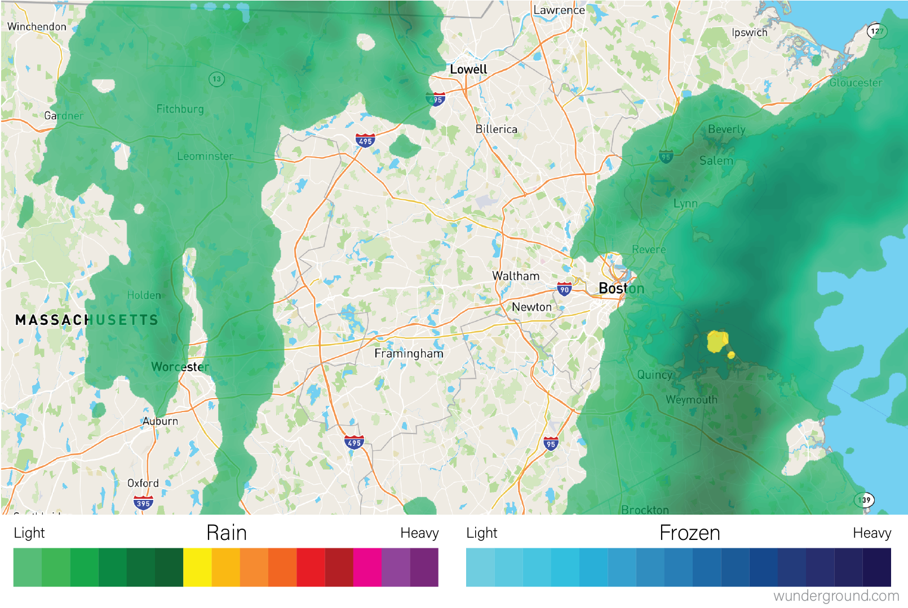
</div>

## Heatmaps in R

* Heatmaps are often used to visualize matrices
* Can create heatmap in R using the base R
[`heatmap()`](https://www.rdocumentation.org/packages/stats/versions/3.6.2/topics/heatmap)
function:
* `heatmap()` function creates a *clustered heatmap* where the rows and columns
  have been hierarchically clustered
  
```r
# heatmap() requires a R matrix, and cannot accept a tibble or a dataframe
marker_matrix <- as.matrix(
  dplyr::select(ad_metadata,c(tau,abeta,iba1,gfap))
)
# rownames of the matrix become y labels
rownames(marker_matrix) <- ad_metadata$ID

heatmap(marker_matrix)
```

## Example Heatmap

```{r data viz marker heatmap, echo=FALSE}
# heatmap() requires a R matrix, and cannot accept a tibble or a dataframe
marker_matrix <- as.matrix(
  dplyr::select(ad_metadata,c(tau,abeta,iba1,gfap))
)
# rownames of the matrix become y labels
rownames(marker_matrix) <- ad_metadata$ID

heatmap(marker_matrix)
```

## `heatmap()` Functionality

* Performs hierarchical clustering of the rows and columns using a Euclidean distance function
* Draws dendrograms on the rows and columns
* Scales the data in the rows to have mean zero and standard deviation 1
* Can alter this behavior with arguments:

```r
heatmap(
  marker_matrix,
  Rowv=NA, # don't cluster rows
  Colv=NA, # don't cluster columns
  scale="none", # don't scale rows
)
```

## Less Fancy Heatmap

```{r data viz pure heatmap, echo=FALSE}
heatmap(
  marker_matrix,
  Rowv=NA, # don't cluster rows
  Colv=NA, # don't cluster columns
  scale="none", # don't scale rows
)
```

## `heatmap()` Drawback

* The scale mapping $z$ values to colors is very important when interpreting heatmaps
* `heatmap()` function has the major drawback that no color key is provided!
*  [`heatmap.2()`](https://www.rdocumentation.org/packages/gplots/versions/3.1.1/topics/heatmap.2)
  in [`gplots` package](https://cran.r-project.org/web/packages/gplots/index.html)
  has a similar interface
* Provides more parameters to control the behavior of the plot and includes a color key:

```r
library(gplots)
heatmap.2(marker_matrix)
```

## `heatmap.2()` Example

```{r heatmap.2, echo=FALSE, message=FALSE, warning=FALSE}
library(gplots)
heatmap.2(marker_matrix)
```

# Cluster Analysis

## Cluster Analysis

* Cluster analysis groups similar objects together
* Can identify structure or organization in a dataset
* [clustering algorithms](https://en.wikipedia.org/wiki/Category:Cluster_analysis_algorithms)
have been developed for different situations

## Clustering Example

```{r, echo=FALSE}
# data drawn from three bivariate normal distributions))
set.seed(1337)
n <- 20
well_clustered_data <- tibble(
  ID=c(stringr::str_c("A",1:n),stringr::str_c("B",1:n),stringr::str_c("C",1:n)),
  cluster=c(rep("A",n),rep("B",n),rep("C",n)),
  f1=c(rnorm(n,0,1),rnorm(n,5,1),rnorm(n,0,1)),
  f2=c(rnorm(n,0,1),rnorm(n,5,1),rnorm(n,8,1))
)

unclustered <- ggplot(well_clustered_data, aes(x=f1,y=f2)) +
  geom_point() +
  labs(title="Unclustered")
clustered <- ggplot(well_clustered_data, aes(x=f1,y=f2,color=cluster,shape=cluster)) +
  geom_point() +
  labs(title="Clustered")

unclustered | clustered
```

## Hierarchical Clustering

* *Hierarchical clustering* groups data points together in nested, or *hierarchical*, groups
* Data points are compared for similarity using a *distance function*
* Two broad strategies: 
  - **Agglomerative**: each datum starts in their own groups, and groups are
  iteratively merged hierarchically into larger groups
  - **Divisive**: all data points start in the same group, and are recursively
  split into smaller groups based on their dissimilarity

## Clustering: Distance Function

* Must choose a *distance function*, e.g $d(x, y)$
* $d(x, y)$ produces a *metric* with magnitude proportional
  to difference between $x$ and $y$
* A *metric* is a non-negative number with no meaningful unit
* Many different metrics, *euclidean distance* often a reasonable choice

$$d(p, q) = \sqrt{(p - q)^2}$$

## Clustering: Linkage Function

* In hierarchical clustering, groups of data are compared to one another
* *Linkage function* is a distance function for groups of data
* Many choices of linkage function:
  - [Single-linkage](https://en.wikipedia.org/wiki/Single-linkage_clustering) - distance between two nearest members of the groups
  - [Complete-linkage](https://en.wikipedia.org/wiki/Complete-linkage_clustering) - distance between two farthest members of the groups
  - [Unweighted Pair Group Method with Arithmetic mean (UPGMA)](https://en.wikipedia.org/wiki/UPGMA) - distance is the average distance of all pairs of points between groups
  - [Weighted Pair Group Method with Arithmetic mean (WPGMA)](https://en.wikipedia.org/wiki/WPGMA) - similar to UPGMA, but weights distances from pairs of groups evenly when merging
  
##

<div class="centered">
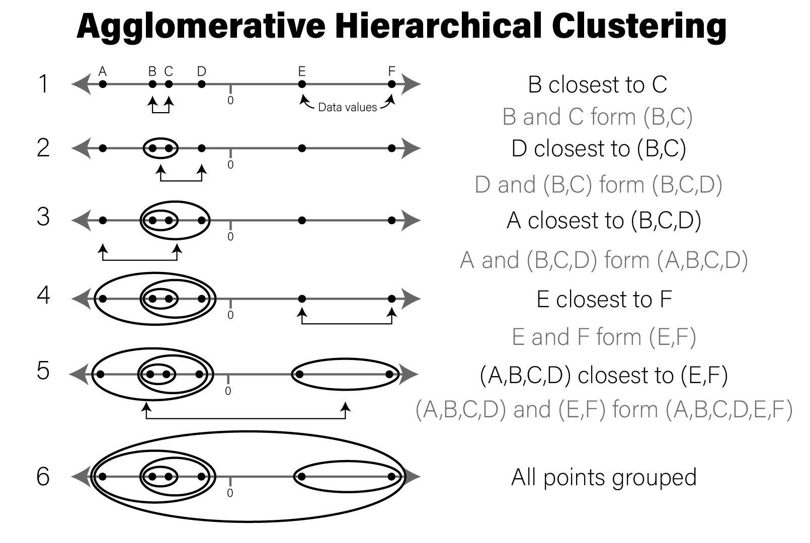
</div>

## Clustering Example in R

Below we will cluster the synthetic dataset introduced above in R:

```{r hclust data, fig.dim=c(8,3)}
ggplot(well_clustered_data, aes(x=f1,y=f2)) +
  geom_point() +
  labs(title="Unclustered")
```

## Clustering Example in R

```{r hclust dist, warning=FALSE, message=FALSE}
# compute all pairwise distances using euclidean distance
# as the distance metric
euc_dist <- dist(dplyr::select(well_clustered_data,-ID))

# produce a clustering of the data using the hclust for
# hierarchical clustering
hc <- hclust(euc_dist, method="ave")

# add ID as labels to the clustering object
hc$labels <- well_clustered_data$ID
```

## Clustering Example in R

```{r}
str(hc)
```

## `hclust()` output

* `hclust()` return object describes the clustering as a tree
* Can visualize using a [dendrogram](#dendrograms):

```{r hclust dendro, fig.dim=c(8,3), warning=FALSE, message=FALSE}
library(ggdendro)
ggdendrogram(hc)
```

##

<div class="centered">
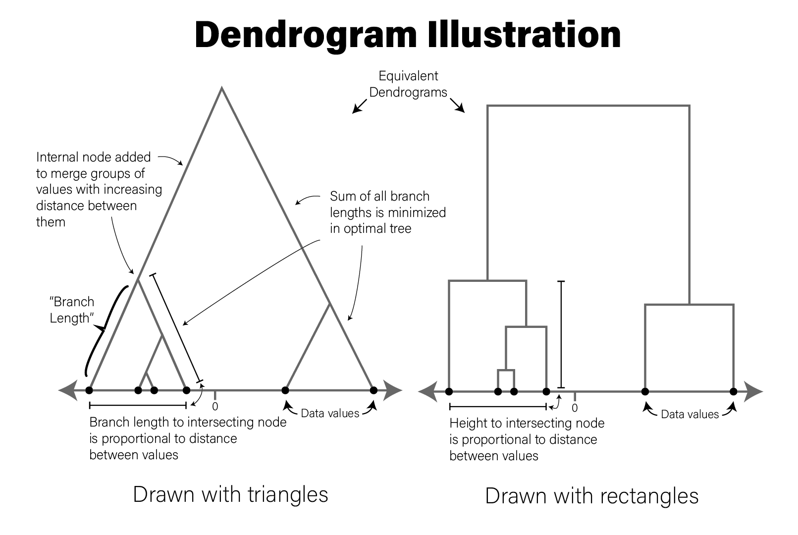
</div>

## Creating Flat Clusters

* Can split hierarchical clustering into groups based on their pattern
* Can use the
[`cutree`](https://www.rdocumentation.org/packages/stats/versions/3.6.2/topics/cutree)
to divide the tree into three groups using `k=3`:

```{r hclust cuttree}
labels <- cutree(hc,k=3)
labels
```

## Creating Flat Clusters

```r
# we turn our labels into a tibble so we can join them with the original tibble
well_clustered_data %>%
  left_join(
    tibble(
      ID=names(labels),
      label=as.factor(labels)
    )
  ) %>%
  ggplot(aes(x=f1,y=f2,color=label)) +
  geom_point() +
  labs(title="Clustered")
```

## Creating Flat Clusters

```{r hclust cutree color, fig.dim=c(8,3), echo=FALSE}
# we turn our labels into a tibble so we can join them with the original tibble
well_clustered_data %>%
  left_join(
    tibble(
      ID=names(labels),
      label=as.factor(labels)
    )
  ) %>%
  ggplot(aes(x=f1,y=f2,color=label)) +
  geom_point() +
  labs(title="Clustered")
```

# Principal Component Analysis

## Principal Component Analysis

* *principal component analysis* (PCA): statistical procedure that reduces the
  effective dimensionality of a dataset while preserving variance
* One of many [dimensionality reduction](https://en.wikipedia.org/wiki/Dimensionality_reduction) techniques
* Identifies so-called *directions of orthogonal variance* called *principal components*
  
## PCA Principles

* PCA decomposes a dataset into a set of [orthonormal basis vectors](https://en.wikipedia.org/wiki/Orthonormal_basis) (principal components)
* These principal components (PCs) collectively capture all the variance in the dataset
* First basis vector is called the *first principal component* and explains the largest fraction of the variance
* Second principal component explains the second largest fraction, and so on
* Always an equal number of principal components as there are dimensions in the dataset or the number of samples, whichever is smaller
* Typically only small number of PCs needed to explain most of the variance

## Principal Components

* Each principal component is a $p$-dimensional [unit vector](https://en.wikipedia.org/wiki/Unit_vector):
  - $p$ is the number of features in the dataset
  - values are *weights* that describe the component's direction of variance
* Product of each component with the values in each sample, we obtain a *projection*
* Projections of each sample made with each principal component produces a *rotation* of the dataset

##

<div class="centered">
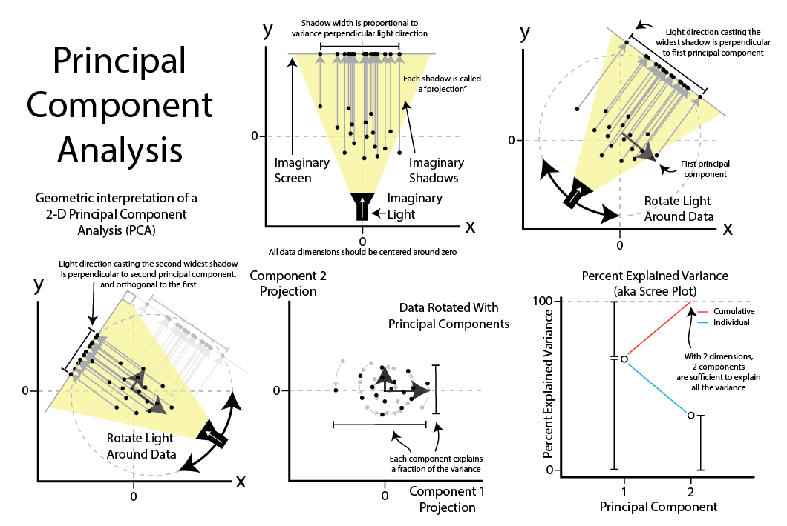
</div>

## PCA in Biological Analysis

* Biological datasets often have many thousands of features (e.g. genes) and comparatively few samples
* Maximum number of PCs in PCA is smaller of (number of features, number of samples)
* [`stats::prcomp()`](https://www.rdocumentation.org/packages/stats/versions/3.6.2/topics/prcomp)
function performs PCA in R

## PCA Example Setup

```{r pca setup, include=FALSE}
setwd('..')
source("setup_example_data.R")
setwd('slides')
```

```{r pca}
# intensities contains microarray expression data for ~54k probesets x 20
# samples

# transpose expression values so samples are rows
expr_mat <- intensities %>%
  pivot_longer(-c(probeset_id),names_to="sample") %>%
  pivot_wider(names_from=probeset_id)

# PCA expects all features (i.e. probesets) to be mean-centered,
# convert to dataframe so we can use rownames
expr_mat_centered <-  as.data.frame(
  lapply(dplyr::select(expr_mat,-c(sample)),function(x) x-mean(x))
)
rownames(expr_mat_centered) <- expr_mat$sample

```

## PCA in R

```{r}
# prcomp performs PCA
pca <- prcomp(
  expr_mat_centered,
  center=FALSE, # already centered
  scale=TRUE # prcomp scales each feature to have unit variance
)
```

## PCA Results in R

```{r}
# the str() function prints the structure of its argument
str(pca)
```

## PCA Results in R

The result of `prcomp()` is a list with five members:

* `sdev` - the standard deviation (i.e. the square root of the variance) for each component
* `rotation` - a matrix where the principal components are in columns
* `x` - the projections of the original data
* `center` - if `center=TRUE` was passed, a vector of feature means
* `scale` - if `scale=TRUE` was passed, a vector of the feature variances

## PC Fraction of Variance

* Each principal component explains a fraction of the overall variance in the dataset
* `prcomp()` result doesn't provide this fraction
* `sdev` variable returned by `prcomp()` may be used to first
calculate the variance explained by each component by squaring it, then dividing
by the sum

## PC Fraction of Variance

```r
library(patchwork)
pca_var <- tibble(
  PC=factor(str_c("PC",1:20),str_c("PC",1:20)),
  Variance=pca$sdev**2,
  `% Explained Variance`=Variance/sum(Variance)*100,
  `Cumulative % Explained Variance`=cumsum(`% Explained Variance`)
)
```

## PC Fraction of Variance Cont'd

```r
exp_g <- pca_var %>%
  ggplot(aes(x=PC,y=`% Explained Variance`,group=1)) +
  geom_point() +
  geom_line() +
  theme(axis.text.x=element_text(angle=90,hjust=0,vjust=0.5))

cum_g <- pca_var %>%
  ggplot(aes(x=PC,y=`Cumulative % Explained Variance`,group=1)) +
  geom_point() +
  geom_line() +
  ylim(0,100) + # set y limits to [0,100]
  theme(axis.text.x=element_text(angle=90,hjust=0,vjust=0.5))

exp_g | cum_g
```

## PC Fraction of Variance

```{r pca var, echo=FALSE}
library(patchwork)
pca_var <- tibble(
  PC=factor(str_c("PC",1:20),str_c("PC",1:20)),
  Variance=pca$sdev**2,
  `% Explained Variance`=Variance/sum(Variance)*100,
  `Cumulative % Explained Variance`=cumsum(`% Explained Variance`)
)

exp_g <- pca_var %>%
  ggplot(aes(x=PC,y=`% Explained Variance`,group=1)) +
  geom_point() +
  geom_line() +
  theme(axis.text.x=element_text(angle=90,hjust=0,vjust=0.5))

cum_g <- pca_var %>%
  ggplot(aes(x=PC,y=`Cumulative % Explained Variance`,group=1)) +
  geom_point() +
  geom_line() +
  ylim(0,100) + # set y limits to [0,100]
  theme(axis.text.x=element_text(angle=90,hjust=0,vjust=0.5))

exp_g | cum_g
```

## PCA and Outliers

* PCA can help identify outlier samples
* Idea:
  - plot the projections of each sample
  - examine the result by eye to identify samples that are "far away" from the other samples
* No general rules to decide when a sample is an outlier

## Pairwise PC Plots

* PC projects often plotted against each other, e.g. PC1 vs PC2:

```{r pca pairwise, fig.dim=c(8,3)}
as_tibble(pca$x) %>%
  ggplot(aes(x=PC1,y=PC2)) +
  geom_point()
```

## Pairwise PC Plots

* Can plot all pairs of the first six components using the [`ggpairs()
function`](https://ggobi.github.io/ggally/reference/ggpairs.html) in the
[GGally](https://ggobi.github.io/ggally/) package

```r
library(GGally)
as_tibble(pca$x) %>%
  dplyr::select(PC1:PC6) %>%
  ggpairs()
```

## Pairwise PC Plots

```{r pca pairs, echo=FALSE}
suppressMessages(library(GGally))
as_tibble(pca$x) %>%
  dplyr::select(PC1:PC6) %>%
  ggpairs()
```

## Beeswarm PC Plots

* Alternative to scatter plots: [beeswarm plot](#beeswarm-plots):

```{r pca proj beeswarm, fig.dim=c(8,2.75)}
library(ggbeeswarm)
as_tibble(pca$x) %>%
  pivot_longer(everything(),names_to="PC",values_to="projection") %>%
  mutate(PC=fct_relevel(PC,str_c("PC",1:20))) %>%
  ggplot(aes(x=PC,y=projection)) +
  geom_beeswarm() + labs(title="PCA Projection Plot")
```

## Adding Additional Information

* Can color our pairwise scatter plot by type like so:

```{r pca color scatter, fig.dim=c(8,3)}
as_tibble(pca$x) %>%
  mutate(type=stringr::str_sub(rownames(pca$x),1,1)) %>%
  ggplot(aes(x=PC1,y=PC2,color=type)) +
  geom_point()
```

## Adding Additional Information

* Can plot pairs of components as before but now with type information

```r
library(GGally)
as_tibble(pca$x) %>%
  mutate(type=stringr::str_sub(rownames(pca$x),1,1)) %>%
  dplyr::select(c(type,PC1:PC6)) %>%
  ggpairs(columns=1:6,mapping=aes(fill=type))
```

## Adding Additional Information

```{r pca pairs type, echo=FALSE, message=FALSE, warning=FALSE}
library(GGally)
as_tibble(pca$x) %>%
  mutate(type=stringr::str_sub(rownames(pca$x),1,1)) %>%
  dplyr::select(c(type,PC1:PC6)) %>%
  ggpairs(columns=1:6,mapping=aes(fill=type))
```


## Beeswarm PC Plots

```{r pca proj beeswarm type, echo=FALSE}
as_tibble(pca$x) %>%
  mutate(
    sample=rownames(pca$x),
    type=stringr::str_sub(sample,1,1)
  ) %>%
  pivot_longer(PC1:PC20,names_to="PC",values_to="projection") %>%
  mutate(PC=fct_relevel(PC,str_c("PC",1:20))) %>%
  ggplot(aes(x=PC,y=projection,color=type)) +
  geom_beeswarm() + labs(title="PCA Projection Plot")
```

# Data Summarization

## Data Summarization

* *data summarization* - process of finding a lower-dimensional representation of larger dataset
* A histogram is a summarization:

```{r data sci summ hist, fig.dim=c(8,2.5)}
ggplot(gene_exp, aes(x=`Gene 1`)) +
  geom_histogram(bins=30,fill="#a93c13")
```

## Point Estimates

* *point estimate*: data summarized to a single number
* Represent a data distribution's *central tendency*.
* e.g. `

```{r data sci summ hist2, fig.dim=c(8, 2)}
ggplot(gene_exp, aes(x=`Gene 1`)) +
  geom_histogram(bins=30,fill="#a93c13") +
  geom_vline(xintercept=mean(gene_exp$`Gene 1`))
```

## Poor Point Estimates

```r
library(patchwork)
well_behaved_data <- tibble(data = rnorm(1000))
# introduce some outliers
data_w_outliers <- tibble(data = c(rnorm(800), rep(5, 200))) 

g_no_outlier <- ggplot(well_behaved_data, aes(x = data)) +
  geom_histogram(fill = "#56CBF9", color = "grey", bins = 30) +
  geom_vline(xintercept = mean(well_behaved_data$data)) +
  ggtitle("Mean example, no outliers")

g_outlier <- ggplot(data_w_outliers, aes(x = data)) +
  geom_histogram(fill = "#7FBEEB", color = "grey", bins = 30) +
  geom_vline(xintercept = mean(data_w_outliers$data)) +
  ggtitle("Mean example, big outliers")

g_no_outlier | g_outlier
```

## Poor Point Estimates

```{r fig.align="center", fig.height=4, echo=FALSE}
library(patchwork)
well_behaved_data <- tibble(data = rnorm(1000))
# introduce some outliers
data_w_outliers <- tibble(data = c(rnorm(800), rep(5, 200))) 

g_no_outlier <- ggplot(well_behaved_data, aes(x = data)) +
  geom_histogram(fill = "#56CBF9", color = "grey", bins = 30) +
  geom_vline(xintercept = mean(well_behaved_data$data)) +
  ggtitle("Mean example, no outliers")

g_outlier <- ggplot(data_w_outliers, aes(x = data)) +
  geom_histogram(fill = "#7FBEEB", color = "grey", bins = 30) +
  geom_vline(xintercept = mean(data_w_outliers$data)) +
  ggtitle("Mean example, big outliers")

g_no_outlier | g_outlier
```

## Other Point Estimates

```r
g_no_outlier <- ggplot(well_behaved_data, aes(x = data)) +
  geom_histogram(fill = "#AFBED1", color = "grey", bins = 30) +
  geom_vline(xintercept = median(well_behaved_data$data)) +
  ggtitle("Median example")

g_outlier <- ggplot(data_w_outliers, aes(x = data)) +
  geom_histogram(fill = "#7FBEEB", color = "grey", bins = 30) +
  geom_vline(xintercept = median(data_w_outliers$data)) +
  ggtitle("Median example, big outliers")

g_no_outlier | g_outlier
```

## Other Point Estimates

```{r fig.align="center", fig.height=4, echo=FALSE}
g_no_outlier <- ggplot(well_behaved_data, aes(x = data)) +
  geom_histogram(fill = "#AFBED1", color = "grey", bins = 30) +
  geom_vline(xintercept = median(well_behaved_data$data)) +
  ggtitle("Median example")

g_outlier <- ggplot(data_w_outliers, aes(x = data)) +
  geom_histogram(fill = "#7FBEEB", color = "grey", bins = 30) +
  geom_vline(xintercept = median(data_w_outliers$data)) +
  ggtitle("Median example, big outliers")

g_no_outlier | g_outlier
```

## Dispersion

* *Dispersion* describes the "spread" of the data
* e.g. standard deviation `sd()`

```{r data sci summ sd, fig.dim=c(8,2)}
g1_mean <- mean(gene_exp$`Gene 1`)
g1_sd <- sd(gene_exp$`Gene 1`)
ggplot(gene_exp, aes(x=`Gene 1`)) +
  geom_histogram(bins=30,fill="#a93c13") +
  geom_vline(xintercept=g1_mean) +
  geom_segment(x=g1_mean-g1_sd, y=10, xend=g1_mean+g1_sd, yend=10)
```

## Standard deviation

* measure how close values are to the mean

```r
data <- tibble(data = c(rnorm(1000, sd=1.75)))
ggplot(data, aes(x = data)) +
  geom_histogram(fill = "#EAC5D8", color = "white", bins = 30) +
  geom_vline(xintercept = seq(-3,3,1) * sd(data$data)) +
  xlim(c(-6, 6)) +
  ggtitle("Standard deviations aplenty", paste("SD:", sd(data$data)))
```

## Standard deviation

```{r taylor sd, fig.align="center", echo=FALSE}
data <- tibble(data = c(rnorm(1000, sd=1.75)))
ggplot(data, aes(x = data)) +
  geom_histogram(fill = "#EAC5D8", color = "white", bins = 30) +
  geom_vline(xintercept = seq(-3,3,1) * sd(data$data)) +
  xlim(c(-6, 6)) +
  ggtitle("Standard deviations aplenty", paste("SD:", sd(data$data)))
```

# Distributions

## Normal Distribution

* *Central tendency* and *dispersion* estimates describe a *normal distribution*
* Can visually inspect fit of a distribution to data:

```r
g1_mean <- mean(gene_exp$`Gene 1`)
g1_sd <- sd(gene_exp$`Gene 1`)
ggplot(gene_exp, aes(x=`Gene 1`)) +
  geom_histogram(
    aes(y=after_stat(density)),
    bins=30,
    fill="#a93c13"
  ) +
  stat_function(fun=dnorm,
    args = list(mean=g1_mean, sd=g1_sd),
    linewidth=2
  )
```
## Distributions

```{r, echo=FALSE}
g1_mean <- mean(gene_exp$`Gene 1`)
g1_sd <- sd(gene_exp$`Gene 1`)
ggplot(gene_exp, aes(x=`Gene 1`)) +
  geom_histogram(
    aes(y=after_stat(density)),
    bins=30,
    fill="#a93c13"
  ) +
  stat_function(fun=dnorm, args = list(mean=g1_mean, sd=g1_sd), linewidth=2)
```

## Our First Model

* We chose to express the dataset as a normal distribution parameterized by:
  - arithmetic mean - `r round(g1_mean)`
  - standard deviation - `r round(g1_sd)`

$$
Gene\;1 \sim \mathcal{N}(254, 11)
$$

## Other distributions

```r
g_norm <- ggplot(tibble(data = rnorm(5000)), aes(x = data)) +
  geom_histogram(fill = "#D0FCB3", bins = 50, color = "gray") +
  ggtitle("Normal distribution", "rnorm(n = 1000)")

g_unif <- ggplot(tibble(data = runif(5000)), aes(x = data)) +
  geom_histogram(fill = "#271F30", bins = 50, color = "white") +
  ggtitle("Uniform distribution", "runif(n = 1000)")

g_logistic <- ggplot(tibble(data = rlogis(5000)), aes(x = data)) +
  geom_histogram(fill = "#9BC59D", bins = 50, color = "black") +
  ggtitle("Logistic distribution", "rlogis(n = 1000)")

g_exp <- ggplot(tibble(data = rexp(5000, rate = 1)), aes(x = data)) +
  geom_histogram(fill = "#6C5A49", bins = 50, color = "white") +
  ggtitle("Exponential distribution", "rexp(n = 1000, rate = 1)")

(g_norm | g_unif) / (g_logistic | g_exp)
```

## Other distributions

```{r fig.align="center", echo=FALSE}
g_norm <- ggplot(tibble(data = rnorm(5000)), aes(x = data)) +
  geom_histogram(fill = "#D0FCB3", bins = 50, color = "gray") +
  ggtitle("Normal distribution", "rnorm(n = 1000)")

g_unif <- ggplot(tibble(data = runif(5000)), aes(x = data)) +
  geom_histogram(fill = "#271F30", bins = 50, color = "white") +
  ggtitle("Uniform distribution", "runif(n = 1000)")

g_logistic <- ggplot(tibble(data = rlogis(5000)), aes(x = data)) +
  geom_histogram(fill = "#9BC59D", bins = 50, color = "black") +
  ggtitle("Logistic distribution", "rlogis(n = 1000)")

g_exp <- ggplot(tibble(data = rexp(5000, rate = 1)), aes(x = data)) +
  geom_histogram(fill = "#6C5A49", bins = 50, color = "white") +
  ggtitle("Exponential distribution", "rexp(n = 1000, rate = 1)")

(g_norm | g_unif) / (g_logistic | g_exp)
```

## Some notes on our model

We chose to model our gene 1 expression data using a normaly distribution
parameterized by the arithmetic mean and standard deviation

1. **Our model choice was totally subjective** 
2. **We can't know if this is the "correct" model for the data** 
3. **We don't know how well our model describes the data yet** 


# Linear Models

## Linear Models

* Data distributions are *descriptive*
* They may not be *informative*
* Recall one of our scientific questions:
  - If all I know about a patient is their gene expression, how likely is it that
    they have PD?
* Our model doesn't answer this question yet

## The Linear Model

* *linear model*: any statistical model that relates one outcome variable as a
linear combination (i.e. sum) of one or more explanatory variables
* For the mathematically inclined:

$$
Y_i = \beta_0 + \beta_1 \phi_1 ( X_{i1} ) + \beta_2 \phi_2 ( X_{i2} ) + \ldots + \beta_p \phi_p ( X_{ip} ) + \epsilon_i
$$

## Back To Working Example

* [beeswarm plot](#beeswarm-plot) plot of Gene 3:

```{r lin model gene 3 violin, fig.dim=c(8,3)}
library(ggbeeswarm)
ggplot(gene_exp, aes(x=`Disease Status`, y=`Gene 3`, color=`Disease Status`)) +
  geom_beeswarm()
```

## Plot Same Data Differently

```r
exp_summ <- pivot_longer( gene_exp, c(`Gene 3`)
  ) %>%
  group_by(`Disease Status`) %>%
  summarize(mean=mean(value),sd=sd(value))

pd_mean <- filter(exp_summ, `Disease Status` == "PD")$mean
c_mean <- filter(exp_summ, `Disease Status` == "Control")$mean

ggplot(gene_exp, aes(x=`Gene 3`, fill=`Disease Status`)) +
  geom_histogram(bins=20, alpha=0.6,position="identity") +
  annotate("segment", x=c_mean, xend=pd_mean, y=20, yend=20,
    arrow=arrow(ends="both", angle=90)) +
  annotate("text", x=mean(c(c_mean,pd_mean)), y=21, hjust=0.5,
    label="How different?")
```

## Plot Same Data Differently

```{r, echo=FALSE}
exp_summ <- pivot_longer(
  gene_exp,
  c(`Gene 3`)
) %>%
  group_by(`Disease Status`) %>%
  summarize(mean=mean(value),sd=sd(value))

pd_mean <- filter(exp_summ, `Disease Status` == "PD")$mean
c_mean <- filter(exp_summ, `Disease Status` == "Control")$mean

ggplot(gene_exp, aes(x=`Gene 3`, fill=`Disease Status`)) +
  geom_histogram(bins=20, alpha=0.6,position="identity") +
  annotate("segment", x=c_mean, xend=pd_mean, y=20, yend=20, arrow=arrow(ends="both", angle=90)) +
  annotate("text", x=mean(c(c_mean,pd_mean)), y=21, hjust=0.5, label="How different?")
```

## Estimate Difference

* make a point estimate of this difference by simply subtracting the means:

```{r lin model point diff}
pd_mean - c_mean
```

In other words, this point estimate suggests that on average Parkinson's
patients have `r round(pd_mean-c_mean,1)` greater expression than Controls.

## Visualizing this Difference

```{r lin model gene 3 fit, fig.dim=c(8,3)}
ggplot(gene_exp, aes(x=`Disease Status`, y=`Gene 3`,
                     color=`Disease Status`)) +
  geom_beeswarm() +
  annotate("segment", x=0, xend=3,
           y=2*c_mean-pd_mean, yend=2*pd_mean-c_mean)
```

## Linear Model Terminology

* Our difference is an *estimate*, but how good is it?
* Linear models estimate both the difference *and* our confidence in that estimate
* Mathematically:
  - $$Gene 3 = \beta_0 + \beta_1*Disease Status$$
* $\beta_0$ and $\beta_1$ are called *coefficients*
  - $\beta_0$ is our intercept term
  - $\beta_1$ is our point estimate of difference between PD and Control
* Computing these coefficients is called *fitting the model*
* This style of analysis is called *linear regression*
  
## Linear Models in  R

* In R, specify formula like `Y ~ X`, or `Gene 3 ~ Disease Status`

```{r lin model lm}
fit <- lm(`Gene 3` ~ `Disease Status`, data=gene_exp)
fit
```

## `lm()` Fit


```{r lin model summary}
summary(fit)
```

## Computing Fit: naive

```{r lin mod all fits naive}
# naive solution
fit1 <- lm(`Gene 1` ~ `Disease Status`, data=gene_exp)
fit2 <- lm(`Gene 2` ~ `Disease Status`, data=gene_exp)
fit3 <- lm(`Gene 3` ~ `Disease Status`, data=gene_exp)
```

## Computing Fit

```{r lin mod all fits}
gene_stats <- lapply(
  c("Gene 1", "Gene 2", "Gene 3"),
  function(gene) {
    model <- paste0('`',gene,'`',' ~ `Disease Status`')
    fit <- lm(model, data=gene_exp)
    v <- c(gene,
           coefficients(fit),
           summary(fit)$coefficients[2,4]
           )
    names(v) <- c("Gene", "Intercept", "PD", "pvalue")
    return(v)
  }
  ) %>%
  bind_rows() # turn the list into a tibble

# compute FDR from nominal p-values
gene_stats$padj <- p.adjust(gene_stats$pvalue,method="fdr")
```

## Computed Fit

```r
gene_stats
## A tibble: 3 × 5
#  Gene   Intercept  PD       pvalue      padj
#  <chr>  <chr>      <chr>    <chr>       <dbl>
#1 Gene 1 250.410    6.959    3.921e-06   3.92e- 6
#2 Gene 2 597.763    -93.629  2.373e-13   3.56e-13
#3 Gene 3 334.577    164.094  1.727e-66   5.18e-66
```

## Plotting fit

```{r lin model 3 genes, echo=FALSE}
pd_mean <- mean(filter(gene_exp,`Disease Status`=="PD")$`Gene 1`)
c_mean <- mean(filter(gene_exp,`Disease Status`=="Control")$`Gene 1`)
g1 <- ggplot(gene_exp, aes(x=`Disease Status`, y=`Gene 1`, color=`Disease Status`)) +
  geom_beeswarm() +
  annotate("segment", x=0, xend=3, y=2*c_mean-pd_mean, yend=2*pd_mean-c_mean) +
  theme(legend.position="none")

pd_mean <- mean(filter(gene_exp,`Disease Status`=="PD")$`Gene 2`)
c_mean <- mean(filter(gene_exp,`Disease Status`=="Control")$`Gene 2`)
g2 <- ggplot(gene_exp, aes(x=`Disease Status`, y=`Gene 2`, color=`Disease Status`)) +
  geom_beeswarm() +
  annotate("segment", x=0, xend=3, y=2*c_mean-pd_mean, yend=2*pd_mean-c_mean) +
  theme(legend.position="none")

pd_mean <- mean(filter(gene_exp,`Disease Status`=="PD")$`Gene 3`)
c_mean <- mean(filter(gene_exp,`Disease Status`=="Control")$`Gene 3`)
g3 <- ggplot(gene_exp, aes(x=`Disease Status`, y=`Gene 3`, color=`Disease Status`)) +
  geom_beeswarm() +
  annotate("segment", x=0, xend=3, y=2*c_mean-pd_mean, yend=2*pd_mean-c_mean) +
  theme(legend.position="none")
g1 | g2 | g3
```

## Generalized Linear Models

* Linear regression makes strong assumptions about the distribution of the data
* [Generalized linear
models](https://en.wikipedia.org/wiki/Generalized_linear_model) that allow these
  assumptions to be relaxed
* Mathematically, function $g$ allows different relationships between $X$ and $Y$:

$$Y = g^{-1}(\beta_0 + \beta_1 \phi_1 ( X_{i1} ) + \beta_2 \phi_2 ( X_{i2} ) + \ldots + \beta_p \phi_p ( X_{ip} ))$$

## Flavors of Linear Models

* **Logistic regression**
* **Multinomial regression**
* **Poisson regression**
* **Negative binomial regression**

# High Throughput Sequencing

## High Throughput Sequencing

* High throughput sequencing (HTS) technologies measure and digitize the
  nucleotide sequences of thousands to billions of DNA molecules simultaneously
* HTS instruments can determine sequence of any DNA molecule in a sample  
* HTS datasets sometimes called *unbiased* assays
* Most popular HTS technology today is provided by [Illumina biotechnology company](https://en.wikipedia.org/wiki/Illumina,_Inc.)

## Sequencing by synthesis

* Illumina sequencing uses biotechnological technique called *sequencing by synthesis*
* Sequencing instruments are called *sequencers*
* The process, briefly:
  1. $10^7$ to $10^9$ short (~300 nucleotide long) DNA molecules ligated to glass slide
  2. Denatured to become single stranded,
  3. Complementary strand by incorporating fluorescently tagged nucleotides
  4. Tagged nucleotides excited by a laser and photograph taken of slide
  5. Images are processed to reconstruct DNA sequences from fluorescence events

## HTS Measures DNA

* Any DNA molecules may be subjected to sequencing via this method
* Many different types of experiments are possible:

  - *Whole genome sequencing (WGS)*
  - *RNA Sequencing (RNASeq)*
  - *Whole genome bisulfite sequencing (WGBS)*
  - *Chromatin immunoprecipitation followed by sequencing (ChIPSeq)*

* Each of these experiments create the same type of data
* Each must be interpreted appropriately based on experiment

## Raw HTS Data

* Raw HTS data  are the digitized DNA sequences for the billions of molecules captured
  by the flow cell
* Each digitized nucleotide sequence is called a *read*
* Data stored in a standardized format called the [FASTQ file format](https://en.wikipedia.org/wiki/FASTQ_format)

## FASTQ Format

* Data for a single read in FASTQ format:

```
@SEQ_ID
GATTTGGGGTTCAAAGCAGTATCGATCAAATAGTAAATCCATTTGTTCAACTCACAGTTT
+
!''*((((***+))%%%++)(%%%%).1***-+*''))**55CCF>>>>>>CCCCCCC65
```

* `@` - header, unique read name per flowcell
* `GAT...` - the nucleotide sequence
* `+` - second header, usually blank
* `!''...` - the [phred quality scores](https://en.wikipedia.org/wiki/Phred_quality_score)
  for each base in the read

## HTS Sequence Analysis

* Raw sequencing reads must be processed with bioinformatic algorithms
* Two broad classes of sequence analysis:
  - *de novo* assembly to recover complete length of original molecules
  - *sequence alignment* against a set of reference sequences, e.g. genome
* Most data we analyze in R comes from aligned reads that have been produced by
  other software

## Sequence Alignment

* Reads aligned to a reference sequence form a distribution of read counts
  across all locations in the reference sequence
* Any given reference sequence location, or *locus*, has zero or more reads that
  align to it
* The number of reads aligning to a given locus is called the *read count*
* The read count is proportional to the copy number of molecules in the sample
  that correspond to that locus
* Read counts from all genes in a reference genome form *count data*

##

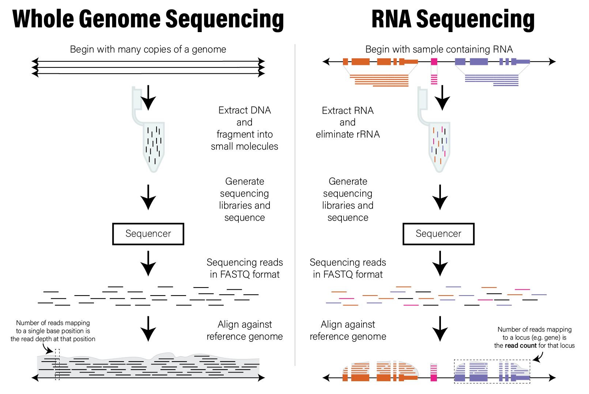{width=100%}

## Count Data

* The *read counts* that align to each locus of a genome form a distribution
* Count data have two important properties:

  - **Count data are integers**
  - **Counts are non-negative**

* *count data are not normally distributed*

## Analyzing Count Data

* Techniques that assume data are normally distributed (like linear regression)
  are not appropriate for count data
* Must account for this in one of two ways:

  * **Use statistical methods that model counts data** - generalized linear models
  that model data using Poisson and Negative Binomial distributions
  * **Transform the data to have be normally distributed** - certain [statistical
  transformations](https://en.wikipedia.org/wiki/Data_transformation_(statistics)),
  such as [regularized log](https://rdrr.io/bioc/DESeq2/man/rlog.html) or rank
  transformations can make counts data more closely follow a normal distribution
# RNASeq

## RNASeq

* RNA sequencing (RNASeq) digitizes the RNA molecules in a sample
* Short reads (~100-300 nucleotides long) represent RNA fragments from longer
  transcripts
* RNA molecules are (in principle) sequenced in proportion to their relative copy
  number in the original sample
* Each sequencing dataset has a total number of reads called *library size*
* Relative copy number means *absence of evidence is not evidence of absence*
  - i.e. count of zero does *not necessarily mean* no molecules

## RNASeq Gene Expression Data

* When aligned, reads are counted using a *reference annotation* that defines
  locations of genes in the genome
* For a single sample, output is a vector of read counts for each gene in the
  annotation
* Genes with no reads mapping to them will have a count of zero
* All others will have a read count of one or more;
* Complex multicellular organisms have on the order of thousands to tens of
  thousands of genes

## The Counts Matrix

* Read counts from multiple samples of genes using the same annotation are
  usually concatenated into a *counts matrix*
* Counts matrix usually has genes as rows and samples as columns (not tidy!)
* Usually in `csv` or `tsv` (tab separated) format
* These counts are from O'Meara et al 2014

```r
counts <- read_tsv("verse_counts.tsv")
```

```{r rnaseq load, include=FALSE}
setwd('..')
counts <- read_tsv("verse_counts.tsv")
# the library size for these samples are very similar
# tweak some of them so that the counts normalization section plots look better... >.>
#counts$P0_1 <- round(counts$P0_1*1.2,0)
#counts$P7_2 <- round(counts$P7_2*2.0,0)
#counts$Ad_2 <- round(counts$Ad_2*0.7,0)
setwd('slides')
counts
```

## Example Counts Matrix

```{r}
counts
```

```{r, include=FALSE}
## A tibble: 55,416 × 9
#   gene                  P0_1  P0_2  P4_1  P4_2  P7_1  P7_2  Ad_1  Ad_2
#   <chr>                <dbl> <dbl> <dbl> <dbl> <dbl> <dbl> <dbl> <dbl>
# 1 ENSMUSG00000102693.2     0     0     0     0     0     0     0     0
# 2 ENSMUSG00000064842.3     0     0     0     0     0     0     0     0
# 3 ENSMUSG00000051951.6    19    24    17    17    17    12     7     5
# 4 ENSMUSG00000102851.2     0     0     0     0     1     0     0     0
# 5 ENSMUSG00000103377.2     1     0     0     1     0     1     1     0
# 6 ENSMUSG00000104017.2     0     3     0     0     0     1     0     0
# 7 ENSMUSG00000103025.2     0     0     0     0     0     0     0     0
# 8 ENSMUSG00000089699.2     0     0     0     0     0     0     0     0
# 9 ENSMUSG00000103201.2     0     0     0     0     0     0     0     1
#10 ENSMUSG00000103147.2     0     0     0     0     0     0     0     0
## … with 55,406 more rows
```

## Analyzing Counts Data

There are typically three steps when analyzing a RNASeq count matrix:

1. **Filter genes that are unlikely to be differentially expressed.**
2. **Normalize filtered counts to make samples comparable to one another.**
3. **Differential expression analysis of filtered, normalized counts.**

## Filtering Counts

* Genes not detected in any sample (counts are zero) should not be considered
* Genes with very low counts are not likely to be informative
* Eliminating these genes from consideration reduce multiple hypothesis testing
  burden later
* General approach: set read count criteria to filter out genes

## Filtering Undetected Genes

* Genes not detected in any sample should be filtered

```{r rnaseq filter zero counts}
nonzero_genes <- rowSums(counts[-1])!=0
filtered_counts <- counts[nonzero_genes,]
slice_head(filtered_counts, n=5)
```

## Filtering Very Low Count Genes

* Genes with fewer than 2 reads across all samples filtered

```{r rnaseq filter zero one counts}
nonzero_genes <- rowSums(counts[-1])>=2
filtered_counts <- counts[nonzero_genes,]
slice_head(filtered_counts, n=5)
```

## Filtering by Non-zero Sample Counts

* Statistical procedures don't work with too many zeros
* Small read counts may indicate very lowly abundant but biologically relevant genes
* Can filter genes based on *number of non-zero sample counts*
  - e.g. Filter out genes if they have zero counts in more than half of samples
  
## Filtering by Non-zero Sample Counts

```{r rnaseq nonzero samples, echo=FALSE}
library(patchwork)

nonzero_counts <- mutate(counts,`Number of samples`=rowSums(counts[-1]!=0)) %>%
  group_by(`Number of samples`) %>%
  summarize(`Number of genes`=n() ) %>%
  mutate(`Cumulative number of genes`=sum(`Number of genes`)-lag(cumsum(`Number of genes`),1,default=0))

sum_g <- ggplot(nonzero_counts) +
  geom_bar(aes(x=`Number of samples`,y=`Cumulative number of genes`,fill="In at least n"),stat="identity") +
  geom_bar(aes(x=`Number of samples`,y=`Number of genes`,fill="In exactly n"),stat="identity") +
  labs(title="Number of genes detected in n samples") +
  scale_fill_discrete(name="Nonzero in:")

sum_g
```


## Filtering by Non-zero Sample Counts

* Consider genes present in at least $n$ samples
* Plots distribution of mean counts within each number of nonzero samples:

```{r rnaseq nonzero dist, echo=FALSE, fig.dim=c(8,3), message=FALSE, warning=FALSE}
# calculate the mean count for non-zero counts in genes with exactly n non-zero counts
mutate(counts,`Number of nonzero samples`=factor(rowSums(counts[-1]!=0))) %>%
  pivot_longer(-c(gene,`Number of nonzero samples`),names_to="Sample",values_to="Count") %>%
  group_by(`Number of nonzero samples`) %>%
  group_by(gene, .add=TRUE) %>% summarize(`Nonzero Count Mean`=mean(Count[Count!=0]),.groups="keep") %>%
  ungroup() %>%
  ggplot(aes(x=`Number of nonzero samples`,y=`Nonzero Count Mean`,fill=`Number of nonzero samples`)) +
  geom_violin(scale="width") +
  scale_y_log10() +
  labs(title="Nonzero count mean for genes with exactly n nonzero counts")
```

## Mean-variance Relationship

* In counts data, genes with higher mean count also have higher variance
* Mean-variance dependence means these count data are *heteroskedastic*

```{r rnaseq mean variance, echo=FALSE, fig.dim=c(8,3)}
tibble(
  Mean=rowMeans(filtered_counts[-1]),
  Variance=apply(filtered_counts[-1],1,var)
) %>%
  ggplot(aes(x=Mean,y=Variance)) +
  geom_point(alpha=0.2) +
  geom_smooth(method = 'gam', formula=y ~ s(x, bs = "cs")) +
  scale_x_log10() + scale_y_log10()
```

## Filtering For Statistics

* Genes with very few counts do not enable reliable statistical inference
* **There is no biological meaning to any filtering threshold**
* The read counts for a gene depends upon the total number of reads generated
* We cannot use filtering to "remove lowly expressed genes"
* Can only filter out genes that are below the detection threshold afforded by
  the library size of the dataset

## Count Distributions

* The range of gene expression in a cell varies by orders of magnitude
* Consider the distribution of read counts on a log10 scale from one sample

```r
dplyr::select(filtered_counts, Ad_1) %>%
  filter(Ad_1 > 0) %>% # avoid taking log10(0)
  mutate(`log10(counts)`=log10(Ad_1)) %>%
  ggplot(aes(x=`log10(counts+1)`)) +
  geom_histogram(bins=50) +
  labs(title='log10(counts) distribution for Adult mouse')
```
## Count Distributions

```{r rnaseq sample count dist, echo=FALSE, fig.dim=c(8,3)}
dplyr::select(filtered_counts, Ad_1) %>%
  filter(Ad_1 > 0) %>% # avoid taking log10(0)
  mutate(`log10(counts)`=log10(Ad_1)) %>%
  ggplot(aes(x=`log10(counts)`)) +
  geom_histogram(bins=50) +
  labs(title='log10(counts) distribution for Adult mouse')
```

## Count Distributions

* Consider distribution for all the samples as a ridgeline plot

```{r rnaseq ridgeline, echo=FALSE}
library(ggridges)

pivot_longer(filtered_counts,-c(gene),names_to="Sample",values_to="Count") %>%
  filter(Count>0) %>%
  mutate(`log10(Count)`=log10(Count)) %>%
  ggplot(aes(y=Sample,x=`log10(Count)`,fill=Sample)) +
  geom_density_ridges(bandwidth=0.132) +
  labs(title="log10(Count) Distributions")
```

## Count Normalization

* Every sample will have a different number of reads (library size)
* The number of reads that maps to any given gene is dependent upon:
  - the relative abundance of the molecule in the sample
  - the library size of each sample
* The *raw read counts* are not directly comparable between samples
* Counts in each sample must be *normalized* so they are comparable

## Count Normalization

* Count normalization: the process by which the number of raw counts in each
  sample is scaled by a factor to make multiple samples comparable
* Many strategies have been proposed to do this
* The simplest is: divide ever count by some factor of the library size
  - e.g. compute *counts per million reads* or *CPM* normalization

$$
cpm_{s,i} =  \frac{c_{s,i}}{l_s} * 10^6
$$

## Counts Per Million

$$
cpm_{s,i} =  \frac{c_{s,i}}{l_s} * 10^6
$$
* $c_{s,i} =$ raw count of gene $i$ in sample $s$
* $l_s =$ library size for sample $s$
* In principle, the proportion of read counts for each gene will be comparable
  between samples

## CPM Normalization

```{r rnaseq ridgeline cpm, echo=FALSE}
library(ggridges)

raw <- pivot_longer(filtered_counts,-c(gene),names_to="Sample",values_to="Count") %>%
  filter(Count>0) %>%
  mutate(`log10(Count)`=log10(Count)) %>%
  ggplot(aes(y=Sample,x=`log10(Count)`,fill=Sample)) +
  geom_density_ridges(bandwidth=0.132) +
  labs(title="log10(Count) Distributions")

size_factors <- colSums(filtered_counts[-1])/10^6
cpm_counts <- as_tibble(filtered_counts[-1]/size_factors)
norm <- pivot_longer(cpm_counts,everything(),names_to="Sample",values_to="CPM") %>%
  filter(CPM>0) %>%
  mutate(`log10(CPM)`=log10(CPM)) %>%
  ggplot(aes(y=Sample,x=`log10(CPM)`,fill=Sample)) +
  geom_density_ridges(bandwidth=0.132) +
  labs(title="log10(CPM) Distributions")

raw / norm
```

## Library Size Normalization

* CPM is a *library size normalization*
* Library size normalizations are sensitive to extreme outlier genes
  - e.g. if one gene in one sample has abnormally large counts, this can cause
  other gene counts to be smaller than they truly are
* These outlier counts are common in RNASeq data!
* Normalization method should be robust to these outliers

## DESeq2 Normalization

* DESeq2 bioconductor package introduced a robust normalization method
* Assumes that *most genes are not differentially expressed*
* Uses the median geometric mean computed across all samples to determine the
  scale factor for each sample
* Currently the *de facto* standard normalization method for well characterized
  genomes

## DESeq2 Normalization

```{r rnaseq deseq2 norm, message=FALSE, warning=FALSE}
library(DESeq2)
# DESeq2 requires a counts matrix
# column data (sample information), and a formula
# the counts matrix *must be raw counts*
count_mat <- as.matrix(filtered_counts[-1])

row.names(count_mat) <- filtered_counts$gene

dds <- DESeqDataSetFromMatrix(
  countData=count_mat,
  colData=tibble(sample_name=colnames(filtered_counts[-1])),
  design=~1 # no formula needed, ~1 produces a trivial design matrix
)
```

## DESeq2 Normalization

```{r rnaseq deseq2 norm2}
# compute normalization factors
dds <- estimateSizeFactors(dds)

# extract the normalized counts
deseq_norm_counts <- as_tibble(counts(dds,normalized=TRUE)) %>%
  mutate(gene=filtered_counts$gene) %>%
  relocate(gene) # relocate changes column order
```

## DESeq2 vs CPM

```{r rnaseq ridgeline deseq2, echo=FALSE}
size_factors <- colSums(filtered_counts[-1])/10^6
cpm_counts <- as_tibble(filtered_counts[-1]/size_factors)
cpm_norm <- pivot_longer(cpm_counts,everything(),names_to="Sample",values_to="CPM") %>%
  filter(CPM>0) %>%
  mutate(`log10(CPM)`=log10(CPM)) %>%
  ggplot(aes(y=Sample,x=`log10(CPM)`,fill=Sample)) +
  geom_density_ridges(bandwidth=0.132) +
  labs(title="log10(CPM) Distributions")

deseq2_norm <- pivot_longer(deseq_norm_counts,-c(gene),names_to="Sample",values_to="Count") %>%
  filter(Count > 0) %>%
  mutate(`log10(Count)`=log10(Count)) %>%
  ggplot(aes(y=Sample,x=`log10(Count)`,fill=Sample)) +
  geom_density_ridges(bandwidth=0.132) +
  labs(title="log10(DESeq2 Norm) Distributions")

cpm_norm / deseq2_norm
```

## DESeq2 Considerations

The DESeq2 normalization procedure has two important considerations:

* **The procedure borrows information across all samples.**
* **The procedure does not use genes with any zero counts.**

The CPM normalization procedure does not borrow information across all samples,
and therefore is not subject to these considerations.

## Count Transformation

* One way to deal with the non-normality of count data is transform it to follow
  a normal distribution
* Enables more statistical methods like linear regression to be used
* Count data are roughly *log-normal*, however low and zero counts can be
  problematic for traditional `log()`
* The DESeq2 package provides the `rlog()` function that performs a regularized
  logarithmic transformation that avoids these biases

```r
# the dds is the DESeq2 object from earlier
rld <- rlog(dds)
```

## Count Transformation

```{r rnaseq rlog, echo=FALSE}
# the dds is the DESeq2 object from earlier
rld <- rlog(dds)

# extract rlog values as a tibble
rlog_counts <- as_tibble(assay(rld))
rlog_counts$gene <- filtered_counts$gene
pivot_longer(rlog_counts,-c(gene),names_to="Sample",values_to="rlog count") %>%
  ggplot(aes(y=Sample,x=`rlog count`,fill=Sample)) +
  geom_density_ridges(bandwidth=0.132) +
  labs(title="rlog Distributions")
```
# Differential Expression Analysis

## Differential Expression Analysis

* Goal: identify to what extent gene expression is associated with one or more
  variables of interest
* Typically analyze whole transcriptome (i.e. 1000s of genes)
* Two required components:
  - an expression matrix (e.g. genes x samples)
  - a *design matrix*
  
## The Design Matrix

* A design matrix is a numeric matrix that contains
  - the variables we wish to model
  - any covariates or confounders we wish to adjust for
* Encoded in a way that statistical procedures understand
* Construct these matrices from a tibble with the [`model.matrix()`
function](https://www.rdocumentation.org/packages/stats/versions/3.6.2/topics/model.matrix)

## Example Metadata
```{r, include=FALSE}
# subset down metadata to make examples clearer
ad_metadata <- dplyr::filter(ad_metadata, ID %in% c('A1','A2','A3','C1','C2','C3'))
```

```{r}
ad_metadata 
```

## Case vs Control Design

* Model matrix to identify genes that are increased or decreased in people with
AD compared with Controls
* The `~ condition` argument is an an R
[formula](https://rviews.rstudio.com/2017/02/01/the-r-formula-method-the-good-parts/)

```r
model.matrix(~ condition, data=ad_metadata)
```

## Case vs Control Design

```{r model matrix}
model.matrix(~ condition, data=ad_metadata)
```

## Formulas in R

The general format of a formula is as follows:

```r
# portions in [] are optional
[<outcome variable>] ~ <predictor 1> [+ <predictor 2>]...

# examples

# model Gene 3 expression as a function of disease status
`Gene 3` ~ condition

# model the amount of tau pathology as a function of abeta pathology,
# adjusting for age at death
tau ~ age_at_death + abeta

# can create a model without an outcome variable
~ age_at_death + condition
```

## More Complex Designs

* Can include other variables in model to adjust for covariates or test other
  contrasts
* e.g. adjust out the effect of age by including `age_at_death` as a covariate in the model:

```r
model.matrix(~ age_at_death + condition, data=ad_metadata)
```

## More Complex Designs

```{r model matrix cov}
model.matrix(~ age_at_death + condition, data=ad_metadata)
```

```{r, include=FALSE}
# we messed up ad_metadata, put it back
setwd('../')
source("0700_bioinfo.R")
source("setup_example_data.R")
setwd('slides')
```

## Differential Expression: Microarrays (limma)

* [limma](https://bioconductor.org/packages/release/bioc/html/limma.html): `li`near `m`odels of `mi`croarrays
* Designed for analyzing microarray gene expression data
* One of the [top most
downloaded](https://bioconductor.org/packages/stats/) Bioconductor packages
* Supports arbitrarily complex experimental designs while maintaining strong statistical power
* Can perform reliable inference even with small sample sizes

## limma Example Setup

* limma requires:
  - `ExpressionSet` or `SummarizedExperiment` container
  - a design matrix

```r
ad_se  <- SummarizedExperiment(
  assays=list(intensities=intensities),
  colData=ad_metadata,
  rowData=rownames(intensities)
)

# design matrix for AD vs control, adjusting for age at death
ad_vs_control_model <- model.matrix(
  ~ age_at_death + condition,
  data=ad_metadata
)
```

## limma Example: fit model

```r
# now run limma
# first fit all genes with the model
fit <- limma::lmFit(
  assays(se)$intensities,
  ad_vs_control_model
)

# now better control fit errors with the empirical Bayes method
fit <- limma::eBayes(fit)
```

```{r limma fit, include=FALSE}
ad_vs_control_model <- model.matrix(~ age_at_death + condition, data=ad_metadata)

# now run limma
# first fit all genes with the model
fit <- limma::lmFit(
  assays(ad_se)$intensities,
  ad_vs_control_model
)

# now better control fit errors with the empirical Bayes method
fit <- limma::eBayes(fit)
```


## limma Results

* Look at top results using `limma::topTable()` function:

```{r}
# the coefficient name conditionAD is the column name in the design matrix
topTable(fit, coef="conditionAD", adjust="BH", number=5)
```

## Differential Expression: RNASeq

* Normalized read counts are suitable for differential expression
* Counts matrix created by concatenating read counts for all genes rows are genes
  or transcripts and columns are samples
* Read counts not normally distributed, requires statistical approach that either
  1. Models counts explicitly
  2. Transform counts to be normally distributed, use common statistical methods

## Modeling Count Data

* Poisson distribution: expresses probability that a given number of events
  occur in a fixed period, e.g. time, space, distance, area, volume
* Can model number of reads aligning to a given genome position/locus
* Whole Genome Sequencing (WGS) data are modeled this way
  
## Poisson Distribution

$$
f(k;\lambda) = \mathtt{Pr}(X=k) = \frac{\lambda^k e^{-\lambda}}{k!}
$$

* $\lambda$ is the average number of events observed in each period

$$
\lambda = \mathtt{E}(X) = \mathtt{Var}(X)
$$

* In Poisson, the mean and variance are assumed to be equal

## WGS Read Depth

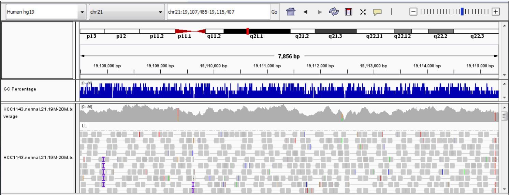{width=100%}

## WGS Read Depth Distribution

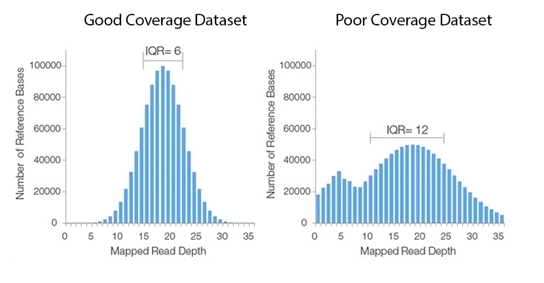{width=100%}

## RNASeq Read Depth

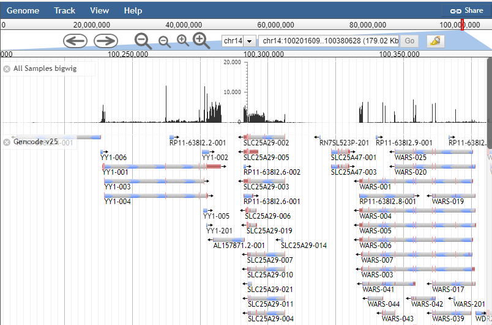{width=100%}

## Mean-variance Relationship

* In counts data, genes with higher mean count also have higher variance

```{r rnaseq mean variance 2, echo=FALSE, fig.dim=c(8,3)}
tibble(
  Mean=rowMeans(filtered_counts[-1]),
  Variance=apply(filtered_counts[-1],1,var)
) %>%
  ggplot(aes(x=Mean,y=Variance)) +
  geom_point(alpha=0.2) +
  geom_smooth(method = 'gam', formula=y ~ s(x, bs = "cs")) +
  scale_x_log10() + scale_y_log10()
```

## Negative Binomial Distribution

* In a set of Bernoulli trials, models the number of failures before a specified number of successes occurs

$$
f(k; r,p) = \mathtt{Pr}(X=k) = \binom{k+r-1}{k} (1-p)^k p^r
$$

* $r$ - number of "successes", $p$ - probability of success
* Alternate formulation:

$$
p = \frac{\mu}{\sigma^2}, r = \frac{\mu^2}{\sigma^2 - \mu}
$$

## DESeq2 Dispersion Estimation

* Index of dispersion $D$

$$
D = \frac{\sigma^2}{\mu}
$$

## DESeq2 Dispersion Estimation

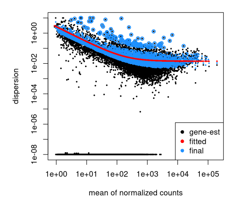{width=75%}

## DESeq2/EdgeR

* [DESeq2](https://bioconductor.org/packages/release/bioc/html/DESeq2.html) and
  [edgeR](https://bioconductor.org/packages/release/bioc/html/edgeR.html) are
  bioconductor packages that both implement negative binomial regression for RNASeq data
* Both perform raw counts normalization
  - DESeq2 - described earlier
  - edgeR - trimmed mean of M-values (TMM)

## DESeq2

As mentioned briefly above, DESeq2 requires three pieces of information to perform differential expression:

1. A **raw** counts matrix with genes as rows and samples as columns
2. A data frame with metadata associated with the columns
3. A design formula for the differential expression model

## DESeq2 Example

```r
library(DESeq2)

# the counts matrix *must be raw counts*
count_mat <- as.matrix(filtered_counts[-1])
row.names(count_mat) <- filtered_counts$gene

# create a sample matrix from sample names
sample_info <- tibblesample_name=colnames(filtered_counts[-1])) %>%
  separate(sample_name,
    c("timepoint","replicate"),sep="_",remove=FALSE
  ) %>%
  mutate(
    timepoint=factor(timepoint,levels=c("Ad","P0","P4","P7"))
  )

design <- formula(~ timepoint)
```

## DESeq2 Example

```{r rnaseq deseq2 dataset, include=FALSE}
library(DESeq2)

# DESeq2 requires a counts matrix, column data (sample information), and a formula
# the counts matrix *must be raw counts*
count_mat <- as.matrix(filtered_counts[-1])
row.names(count_mat) <- filtered_counts$gene

# create a sample matrix from sample names
sample_info <- tibble(
  sample_name=colnames(filtered_counts[-1])
) %>%
  separate(sample_name,c("timepoint","replicate"),sep="_",remove=FALSE) %>%
  mutate(
    timepoint=factor(timepoint,levels=c("Ad","P0","P4","P7"))
  )

design <- formula(~ timepoint)
```

```{r}
sample_info
```

## DESeq2 Example

```{r rnaseq deseq2 de, message=FALSE, error=FALSE}
dds <- DESeqDataSetFromMatrix(
  countData=count_mat,
  colData=sample_info,
  design=design
)
dds <- DESeq(dds)
resultsNames(dds)
```

## DESeq2 Results

```{r rnaseq deseq2 results}
res <- results(dds, name="timepoint_P0_vs_Ad")
p0_vs_Ad_de <- as_tibble(res) %>%
  mutate(gene=rownames(res)) %>%
  relocate(gene) %>%
  arrange(pvalue)
head(p0_vs_Ad_de, 5)
```

## DESeq2 Results

* *baseMean* - the mean normalized count of all samples for the gene
* *log2FoldChange* - the estimated coefficient (i.e. log2FoldChange) for the comparison of interest
* *lfcSE* - the standard error for the log2FoldChange estimate
* *stat* - the [Wald statistic](https://en.wikipedia.org/wiki/Wald_test) associated with the log2FoldChange estimate
* *pvalue* - the nominal p-value of the Wald test (i.e. the signifiance of the association)
* *padj* - the multiple testing adjusted p-value (i.e. false discovery rate)

## Filtering DESeq2 Results

```{r rnaseq deseq2 sig}
# number of genes significant at FDR < 0.05
filter(p0_vs_Ad_de,padj<0.05)
```

## Volcano Plot

* Volcano plots are log2 fold change vs -log10(p-value)

```r
mutate(
  p0_vs_Ad_de,
  `-log10(adjusted p)`=-log10(padj),
  `FDR<0.05`=padj<0.05
  ) %>%
  ggplot(aes(x=log2FoldChange,y=`-log10(adjusted p)`,color=`FDR<0.05`)) +
  geom_point()
```

## Volcano Plot

```{r rnaseq deseq2 volcano, echo=FALSE, message=F, error=F}
mutate(
  p0_vs_Ad_de,
  `-log10(adjusted p)`=-log10(padj),
  `FDR<0.05`=padj<0.05
  ) %>%
  ggplot(aes(x=log2FoldChange,y=`-log10(adjusted p)`,color=`FDR<0.05`)) +
  geom_point()
```

## limma/voom

* limma package (for microarrays) was extended to support RNASeq
* Transforms count with  [voom](https://genomebiology.biomedcentral.com/articles/10.1186/gb-2014-15-2-r29) transformation
  1. Compute CPM
  2. Take log of CPM
  3. Estimate mean-variance relationship to control errors
* Uses linear model on transformed counts

## limma/voom Example

* Brief example is from the [limma User
Guide](https://www.bioconductor.org/packages/devel/bioc/vignettes/limma/inst/doc/)
chapter 15

```r
design <- data.frame(swirl = c("swirl.1", "swirl.2", "swirl.3", "swirl.4"),
                     condition = c(1, -1, 1, -1))
dge <- DGEList(counts=counts)
keep <- filterByExpr(dge, design)
dge <- dge[keep,,keep.lib.sizes=FALSE]
```

## limma/voom results

* Use `topTable()` as in microarray limma results:

```r
# limma trend
logCPM <- cpm(dge, log=TRUE, prior.count=3)
fit <- lmFit(logCPM, design)
fit <- eBayes(fit, trend=TRUE)
topTable(fit, coef=ncol(design))
```

# Interpreting Gene Expression

## Gene Annotations

* Individual gene studies can characterize:
  - function
  - localization
  - structure
  - interactions
  - chemical properties
  - dynamics
* Genes are *annotated* with these properties via different databases
* Some annotations consolidated into centralized metadatabases
* e.g. `genecards.org`

## Example Gene Card

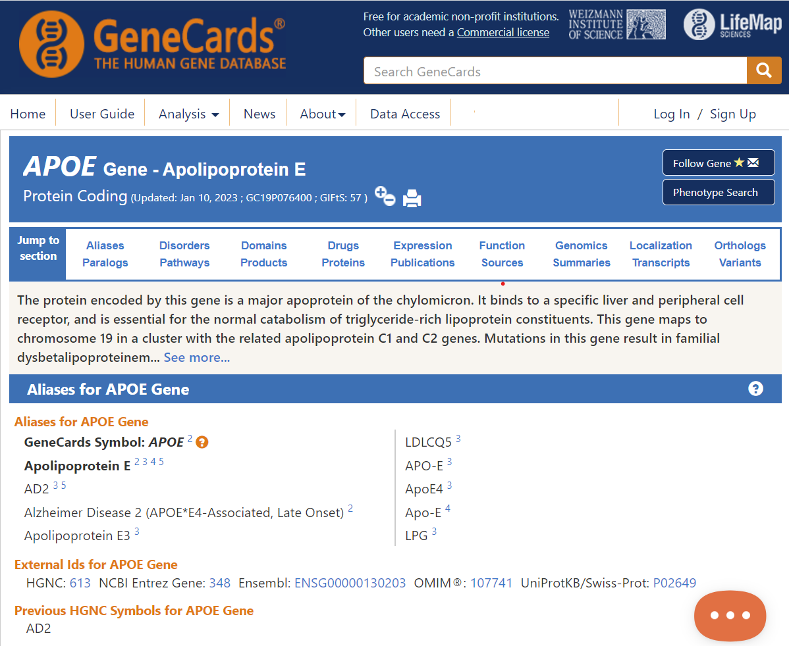{width=70%}
* [https://www.genecards.org/cgi-bin/carddisp.pl?gene=APOE&keywords=APOE](https://www.genecards.org/cgi-bin/carddisp.pl?gene=APOE&keywords=APOE)

## Gene Ontology (GO)

* *Ontology*: a controlled vocabulary of biological concepts
* The Gene Ontology (GO): a set of *terms* that describes what genes are, do, etc
* Each GO Term has a code like `GO:NNNNNNN`, e.g. `GO:0019319`
* GO Terms subdivided into three *namespaces*:
  - Biological Process (BP) - pathways, etc
  - Molecular Function (MF) - enzymatic activity, DNA binding, etc
  - Cellular Component (CC) - nucleus, cell membrane, etc
* Terms within each namespace are hierarchical, form a directed acyclic graph (DAG)

## Gene Ontology

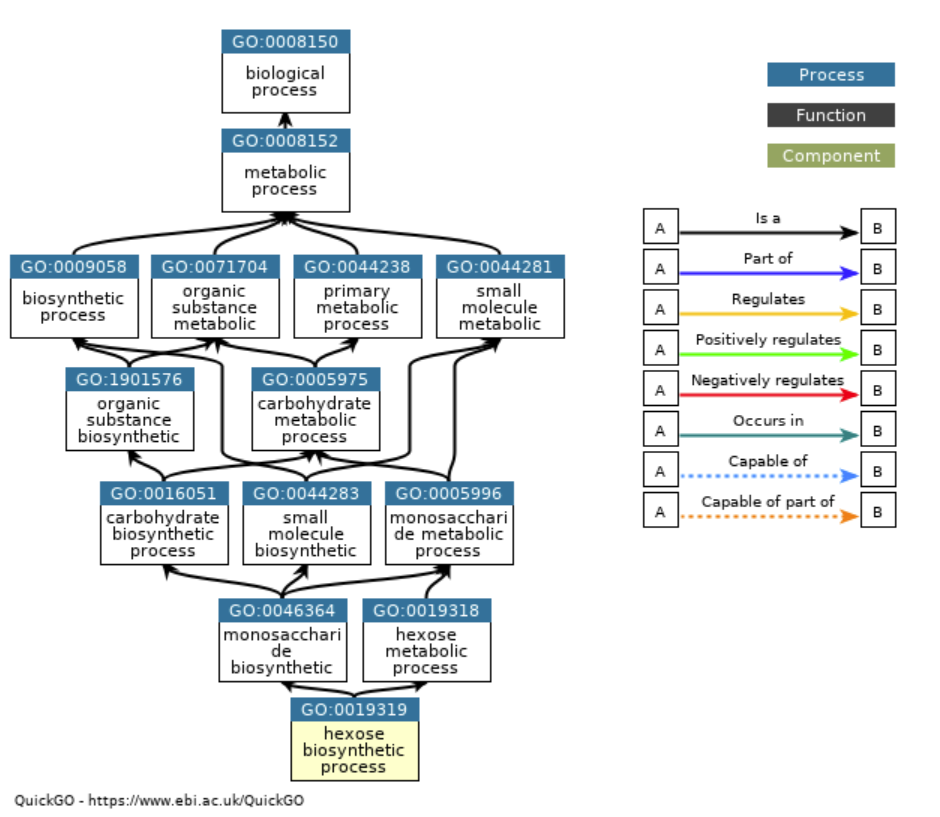{width=70%}

## Example GO Term

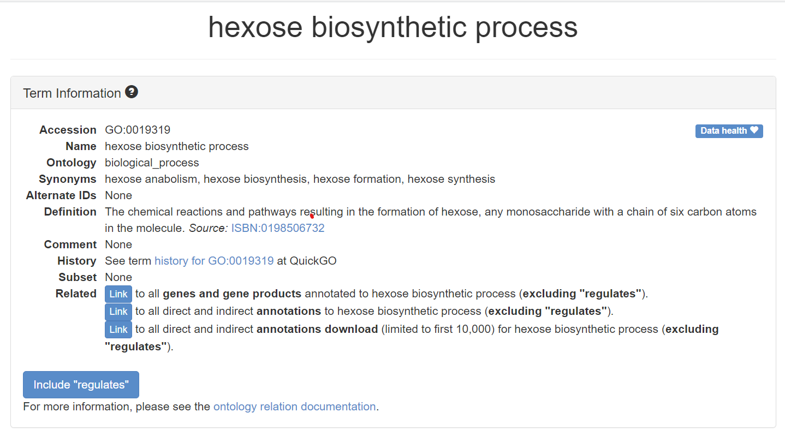{width=70%}

* [http://amigo.geneontology.org/amigo/term/GO:0019319](http://amigo.geneontology.org/amigo/term/GO:0019319)

## GO Annotation

* GO Terms can apply to genes from all biological systems
* The GO itself does not contain gene annotations
* *GO annotations* are provided/maintained separately for each organism
* A gene may be annotated to many GO terms
* A GO term may be annotated to many genes

## GO Annotation

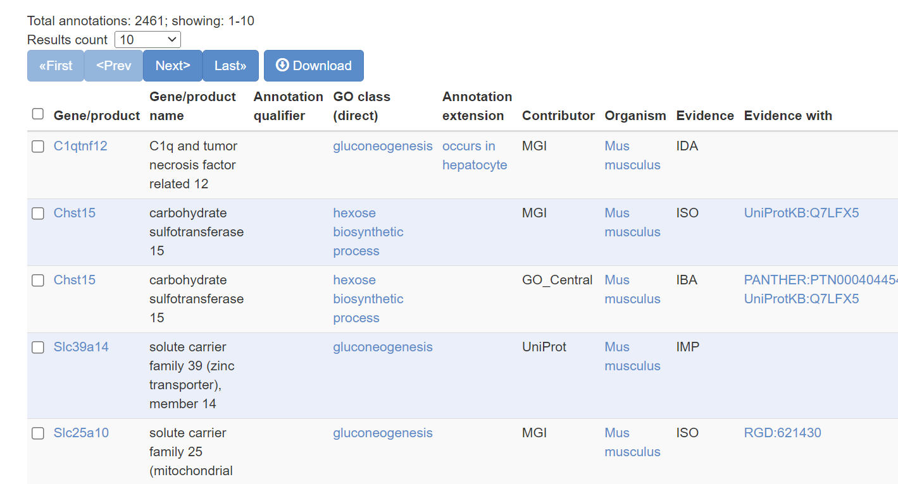{width=100%}

## Individual to Many Genes

* High throughput gene expression studies implicate many genes
* What biological processes are implicated by a differential expression analysis?
* Idea: examine the annotations of all implicated genes and look for patterns

## Gene Sets

* Genes can be organized by different attributes:
  - biochemical function, e.g. enzymatic activity
  - biological process, e.g. pathways
  - localization, e.g. nucleus
  - disease association
  - chromosomal locus
  - defined by differential expression studies!
  - any other reasonable grouping
* A *gene set* is a group of genes related in one way or another
* e.g. all genes annotated to GO Term GO:0019319 - hexose biosynthetic process

## Gene Set Databases

* Gene set database: a collection of gene sets
* Different databases organize/maintain different sets of genes for different
  purposes

## GO Annotations

* Available at [geneontology.org](https://geneontology.org) for many species
* Programmatic access as well
* Provided in tab-delimited GAF (GO Annotation Format) files

## KEGG

* Kyoto Encyclopedia of Genes and Genomcs
* "Gold standard" for curated pathways
* Highly detailed, validated gene sets with gene interaction information
* [https://www.genome.jp/kegg/pathway.html](https://www.genome.jp/kegg/pathway.html)

## KEGG

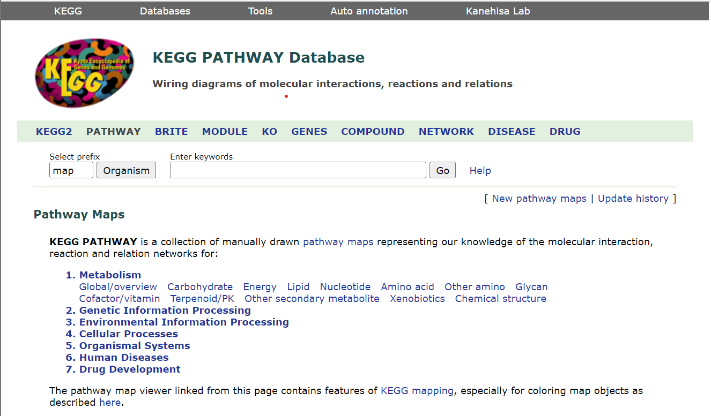{width=100%}

## KEGG: Huntington's Disease

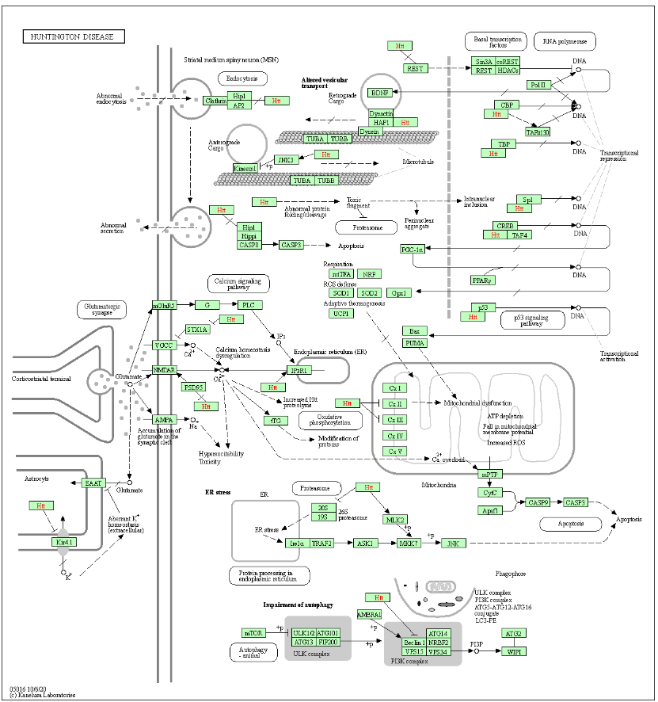{width=60%}

## KEGG: Huntington's Disease

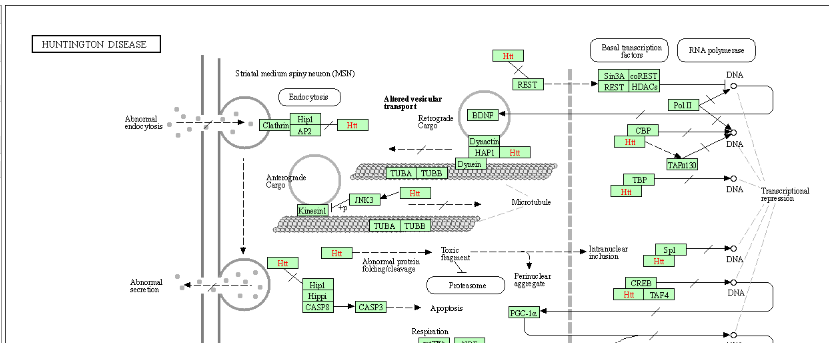{width=100%}

## MSigDB

* Molecular Signatures Data Base
* Originally, gene sets associated with cancer
* Contains 9 collections of gene sets:
  - H - well defined biological states/processes
  - C1 - positional gene sets
  - C2 - curated gene sets
  - C3 - regulatory targets
  - C4 - computational gene sets
  - C5 - GO annotations
  - C6 - oncogenic signatures
  - C7 - immunologic signatures
  - C8 - cell type signatures

## `.gmt` - Gene Set File Format

* `.gmt` - Gene Matrix Transpose
* Defined by Broad Institute for use in its GSEA software
* Contains gene sets, one per line
* Tab-separated format with columns:
  - 1st column: Gene set name
  - 2nd column: Gene set description (often blank)
  - 3rd and on: gene identifiers for genes in set

## GMT File

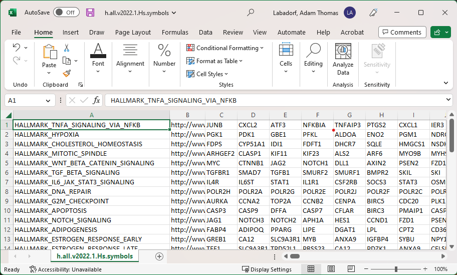{width=100%}

## GMT Files in R

```r
library('GSEABase')
hallmarks_gmt <- getGmt(con='h.all.v7.5.1.symbols.gmt')
hallmarks_gmt
## GeneSetCollection
##   names: HALLMARK_TNFA_SIGNALING_VIA_NFKB, HALLMARK_HYPOXIA, ..., HALLMARK_PANCREAS_BETA_CELLS (50 total)
##   unique identifiers: JUNB, CXCL2, ..., SRP14 (4383 total)
##   types in collection:
##     geneIdType: NullIdentifier (1 total)
##     collectionType: NullCollection (1 total)
```

## Gene Set Enrichment Analysis

* Compare
  - a gene list of interest (e.g. DE gene list) with
  - a gene set (e.g. genes annotated to `GO:0019319`)
* Are the genes in our gene list have more similarity to the genes in the gene
  set than we expect by chance?
  
## Gene Set Enrichment Flavors

* Over-representation: does our gene list overlap a gene set more than expected
  by chance?
* Rank-based: are the gene in a gene set more increased/decreased in our gene
  list than expected by chance?

## Over-representation

* Useful with a list of "genes of interest" e.g. DE genes at FDR < 0.05
* Compute overlap with genes in a gene set
* Is the overlap greater than we would expect by chance?

## Hypergeometric/Fisher's Exact Test

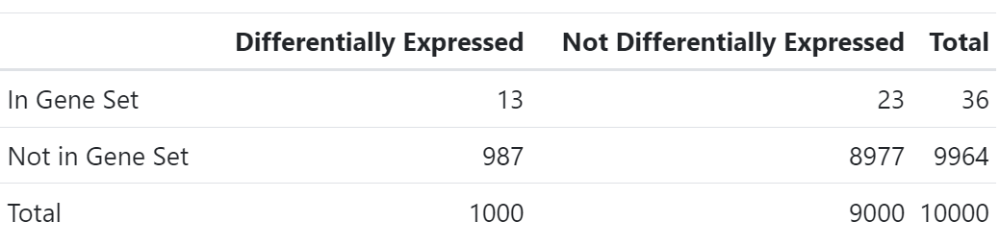{width=100%}

## Hypergeometric/Fisher's Exact Test

```r
contingency_table <- matrix(c(13, 987, 23, 8977), 2, 2)
fisher_results <- fisher.test(contingency_table, alternative='greater')
fisher_results
## 
##  Fisher's Exact Test for Count Data
## 
## data:  contingency_table
## p-value = 2.382e-05
## alternative hypothesis: true odds ratio is greater than 1
## 95 percent confidence interval:
##  2.685749      Inf
## sample estimates:
## odds ratio 
##   5.139308
```

## Rank Based: GSEA

* Inputs:
  - *all* genes irrespective of significance, ranked by a statistic e.g. log2 fold change
  - gene set database
* Examines whether genes in each gene set are more highly or lowly ranked than
  expected by chance
* Computes a Kolmogorov-Smirnov test to determine signficance
* Produces *Normalized Enrichment Score*
  - Positive if gene set genes are at the top of the sorted list
  - Negative if at bottom
* Official software: standalone JAVA package

## Rank Based: GSEA

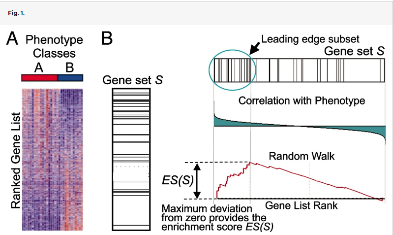{width=100%}

## fgsea

* [fgsea](https://bioconductor.org/packages/release/bioc/html/fgsea.html) package implements the GSEA preranked algorithm in R
* Requires
  - List of ranked genes
  - Database of gene sets