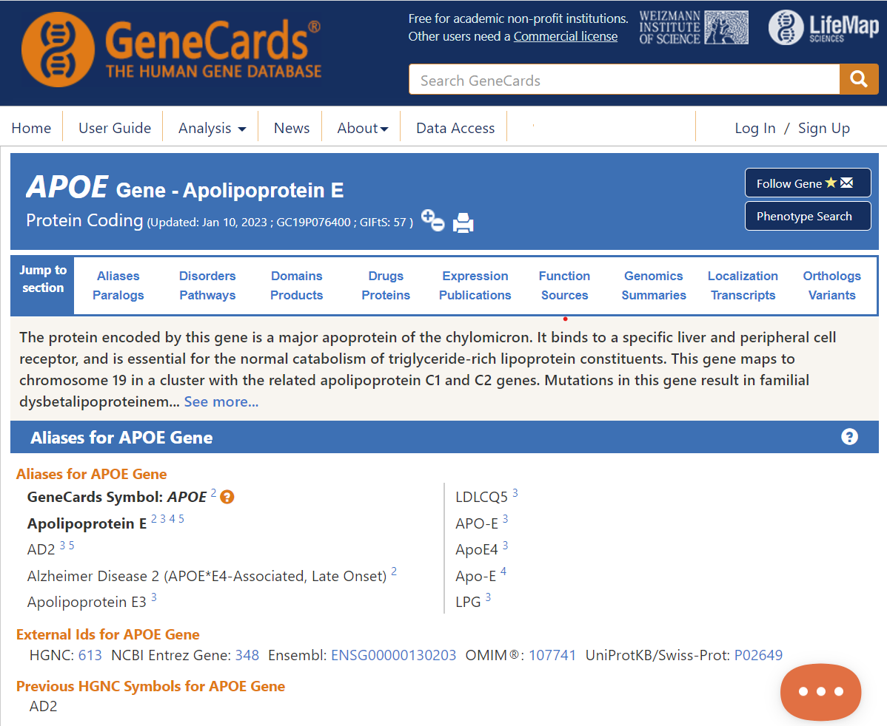
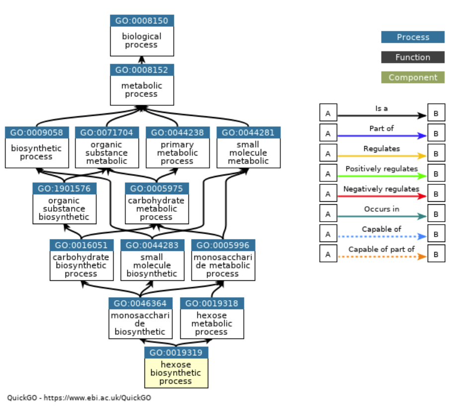
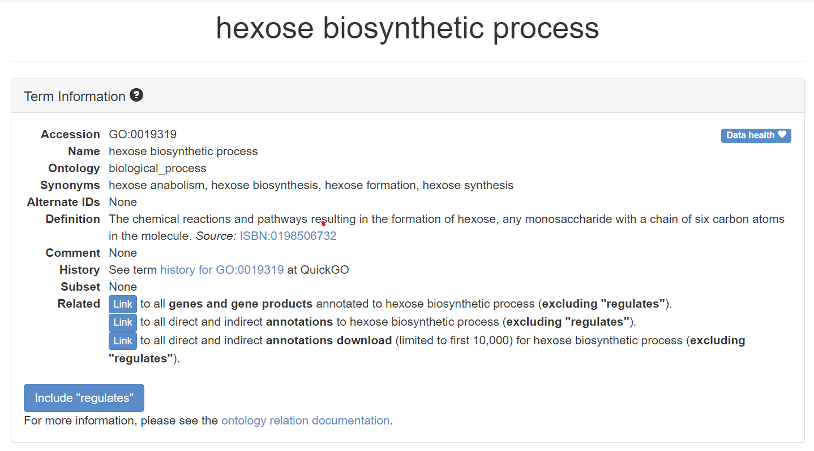
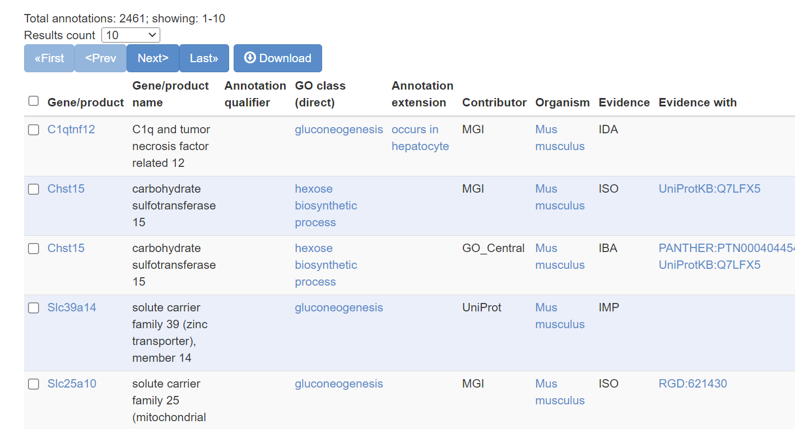
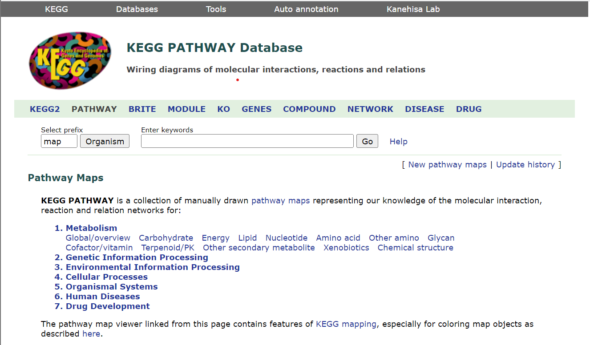
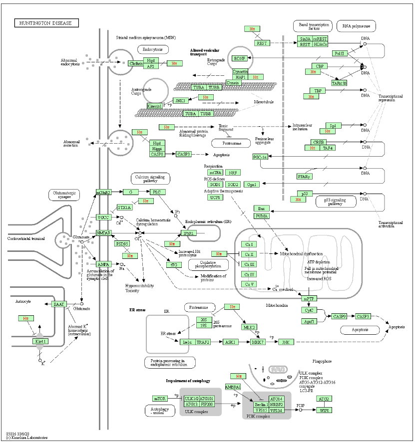
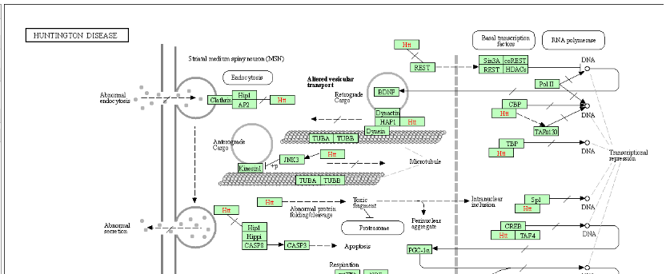

```{r, include=FALSE}
setwd('../')
source("0700_bioinfo.R")
source("setup_example_data.R")
setwd('slides')
library(tidyverse)
library(ggplot2)
```

# Interpreting Gene Expression

## Gene Annotations

* Individual gene studies can characterize:
  - function
  - localization
  - structure
  - interactions
  - chemical properties
  - dynamics
* Genes are *annotated* with these properties via different databases
* Some annotations consolidated into centralized metadatabases
* e.g. `genecards.org`

## Example Gene Card

{width=70%}
* [https://www.genecards.org/cgi-bin/carddisp.pl?gene=APOE&keywords=APOE](https://www.genecards.org/cgi-bin/carddisp.pl?gene=APOE&keywords=APOE)

## Gene Ontology (GO)

* *Ontology*: a controlled vocabulary of biological concepts
* The Gene Ontology (GO): a set of *terms* that describes what genes are, do, etc
* Each GO Term has a code like `GO:NNNNNNN`, e.g. `GO:0019319`
* GO Terms subdivided into three *namespaces*:
  - Biological Process (BP) - pathways, etc
  - Molecular Function (MF) - enzymatic activity, DNA binding, etc
  - Cellular Component (CC) - nucleus, cell membrane, etc
* Terms within each namespace are hierarchical, form a directed acyclic graph (DAG)

## Gene Ontology

{width=70%}

## Example GO Term

{width=70%}

* [http://amigo.geneontology.org/amigo/term/GO:0019319](http://amigo.geneontology.org/amigo/term/GO:0019319)

## GO Annotation

* GO Terms can apply to genes from all biological systems
* The GO itself does not contain gene annotations
* *GO annotations* are provided/maintained separately for each organism
* A gene may be annotated to many GO terms
* A GO term may be annotated to many genes

## GO Annotation

{width=100%}

## Individual to Many Genes

* High throughput gene expression studies implicate many genes
* What biological processes are implicated by a differential expression analysis?
* Idea: examine the annotations of all implicated genes and look for patterns

## Gene Sets

* Genes can be organized by different attributes:
  - biochemical function, e.g. enzymatic activity
  - biological process, e.g. pathways
  - localization, e.g. nucleus
  - disease association
  - chromosomal locus
  - defined by differential expression studies!
  - any other reasonable grouping
* A *gene set* is a group of genes related in one way or another
* e.g. all genes annotated to GO Term GO:0019319 - hexose biosynthetic process

## Gene Set Databases

* Gene set database: a collection of gene sets
* Different databases organize/maintain different sets of genes for different
  purposes

## GO Annotations

* Available at [geneontology.org](https://geneontology.org) for many species
* Programmatic access as well
* Provided in tab-delimited GAF (GO Annotation Format) files

## KEGG

* Kyoto Encyclopedia of Genes and Genomcs
* "Gold standard" for curated pathways
* Highly detailed, validated gene sets with gene interaction information
* [https://www.genome.jp/kegg/pathway.html](https://www.genome.jp/kegg/pathway.html)

## KEGG

{width=100%}

## KEGG: Huntington's Disease

{width=60%}

## KEGG: Huntington's Disease

{width=100%}

## MSigDB

* Molecular Signatures Data Base
* Originally, gene sets associated with cancer
* Contains 9 collections of gene sets:
  - H - well defined biological states/processes
  - C1 - positional gene sets
  - C2 - curated gene sets
  - C3 - regulatory targets
  - C4 - computational gene sets
  - C5 - GO annotations
  - C6 - oncogenic signatures
  - C7 - immunologic signatures
  - C8 - cell type signatures

## `.gmt` - Gene Set File Format

* `.gmt` - Gene Matrix Transpose
* Defined by Broad Institute for use in its GSEA software
* Contains gene sets, one per line
* Tab-separated format with columns:
  - 1st column: Gene set name
  - 2nd column: Gene set description (often blank)
  - 3rd and on: gene identifiers for genes in set

## GMT File

{width=100%}

## GMT Files in R

```r
library('GSEABase')
hallmarks_gmt <- getGmt(con='h.all.v7.5.1.symbols.gmt')
hallmarks_gmt
## GeneSetCollection
##   names: HALLMARK_TNFA_SIGNALING_VIA_NFKB, HALLMARK_HYPOXIA, ..., HALLMARK_PANCREAS_BETA_CELLS (50 total)
##   unique identifiers: JUNB, CXCL2, ..., SRP14 (4383 total)
##   types in collection:
##     geneIdType: NullIdentifier (1 total)
##     collectionType: NullCollection (1 total)
```

## Gene Set Enrichment Analysis

* Compare
  - a gene list of interest (e.g. DE gene list) with
  - a gene set (e.g. genes annotated to `GO:0019319`)
* Are the genes in our gene list have more similarity to the genes in the gene
  set than we expect by chance?
  
## Gene Set Enrichment Flavors

* Over-representation: does our gene list overlap a gene set more than expected
  by chance?
* Rank-based: are the gene in a gene set more increased/decreased in our gene
  list than expected by chance?

## Over-representation

* Useful with a list of "genes of interest" e.g. DE genes at FDR < 0.05
* Compute overlap with genes in a gene set
* Is the overlap greater than we would expect by chance?

## Hypergeometric/Fisher's Exact Test

{width=100%}

## Hypergeometric/Fisher's Exact Test

```r
contingency_table <- matrix(c(13, 987, 23, 8977), 2, 2)
fisher_results <- fisher.test(contingency_table, alternative='greater')
fisher_results
## 
##  Fisher's Exact Test for Count Data
## 
## data:  contingency_table
## p-value = 2.382e-05
## alternative hypothesis: true odds ratio is greater than 1
## 95 percent confidence interval:
##  2.685749      Inf
## sample estimates:
## odds ratio 
##   5.139308
```

## Rank Based: GSEA

* Inputs:
  - *all* genes irrespective of significance, ranked by a statistic e.g. log2 fold change
  - gene set database
* Examines whether genes in each gene set are more highly or lowly ranked than
  expected by chance
* Computes a Kolmogorov-Smirnov test to determine signficance
* Produces *Normalized Enrichment Score*
  - Positive if gene set genes are at the top of the sorted list
  - Negative if at bottom
* Official software: standalone JAVA package

## Rank Based: GSEA

{width=100%}

## fgsea

* [fgsea](https://bioconductor.org/packages/release/bioc/html/fgsea.html) package implements the GSEA preranked algorithm in R
* Requires
  - List of ranked genes
  - Database of gene sets
  
# Statistical Distributions

## Statistical Distributions

* Statistics was created to quantify uncertainty
* Statistics provides tools to separate *signal* from *noise*
* The *statistical distribution* is a tool we can use to estimate and quantify
  uncertainty

## Random Variables

* A random variable is an object or quantity which:
  - depends upon random events
  - can have samples drawn from it
* Each random variable has a potential set of possible outcomes (e.g. a real
  number, an integer, a category, a mathematical tree)
* Each possible outcome has some probability of appearing, relative to other outcomes
* The complete mapping of relative probabilities to outcomes for a random variable
  forms a *distribution*
  
## Random Variable Examples

* a six-sided die
* a coin
* transcription of a gene

## Random Variable Notation

* Usually notated as capital letters, like $X,Y,Z,$ etc
* A sample drawn from a random variable is usually notated as a lowercase of the
  same letter
* e.g. $x$ is a sample drawn from the random variable $X$
* Distribution of random variable usually described like
  - "$X$ follows a binomial distribution"
  - "$Y$ is a normally distributed random variable"
* Probability of a random variable taking one of its possible values: $P(X = x)$

## Statistical Distribution Basics

* A statistical distribution is a function that maps **the possible
values for a variable to how often they occur**
* Alternatively, distribution describes the probability of seeing a single value, or a
range of values, relative to all other possible values

```r
tibble(
  x = seq(-4,4,by=0.1),
  `Probability Density`=dnorm(x,0,1)
) %>%
  ggplot(aes(x=x,y=`Probability Density`)) +
  geom_line() +
  labs(title="Probability Density Function for a Normal Distribution")

```

## Normal Distribution

```{r stat normal, echo=FALSE}
tibble(
  x = seq(-4,4,by=0.1),
  `Probability Density`=dnorm(x,0,1)
) %>%
  ggplot(aes(x=x,y=`Probability Density`)) +
  geom_line() +
  labs(title="Probability Density Function for a Normal Distribution")

```


## Probability Density Functions

* *probability density function* (PDF) defines probability associated with every
  possible value of a random variable
* Many PDFs have a closed mathematical form
* The PDF for the normal distribution is:

$$
P(X = x|\mu,\sigma) = \frac{1}{\sigma\sqrt{2\pi}}e^{\frac{-(x-\mu)^2}{2\sigma}}
$$

## PDFs

$$
P(X = x|\mu,\sigma) = \frac{1}{\sigma\sqrt{2\pi}}e^{\frac{-(x-\mu)^2}{2\sigma}}
$$

* Notation $P(X = x|\mu,\sigma)$ - "the probability that the random
variable $X$ takes the value $x$, given mean $\mu$ and standard deviation
$\sigma$"
* Normal distribution is a *parametric distribution* because PDF requires two parameters
* *Non-parametric distributions* do not require parameters, but are determined from data

## Probability Mass Functions

* PDFs only defined for continuous distributions, with infinite possible values
* Discrete distributions have a finite set of possible values
* *Probability mass functions* discrete distribution analog for PDFs

```{r stat pois, echo=FALSE, fig.dim=c(8,3)}
tibble(
  x = seq(0,10,by=1),
  `Probability Density`=dpois(x,3)
) %>%
  ggplot(aes(x=x,y=`Probability Density`)) +
  geom_bar(stat="identity") +
  labs(title="Probability Mass Function for a Poisson Distribution")
```

## Note: Probability of Zero

* In probability theory, if a plausible event has a probability of zero, this
  *does not mean that event can never occur*
* Every specific value in a continuous distribution that supports all real
  numbers has a probability of zero
* PDF allows us to reason about the *relative likelihood* of
  observing values in one range of the distribution compared with the others

## Cumulative Distribution Function

* PDF provides the probability density of specific values within the
distribution
* Sometimes we want probability of a value being less/greater than or equal to a particular value
* *Cumulative distribution function* (CDF) useful for this purpose

```r
tibble(
  x = seq(-4,4,by=0.1),
  PDF=dnorm(x,0,1),
  CDF=pnorm(x,0,1)
) %>%
  ggplot() +
  geom_line(aes(x=x,y=PDF,color="PDF")) +
  geom_line(aes(x=x,y=CDF,color="CDF"),linetype="dashed")
```

## PDF vs CDF

```{r stat pdf cdf, echo=FALSE}
tibble(
  x = seq(-4,4,by=0.1),
  PDF=dnorm(x,0,1),
  CDF=pnorm(x,0,1)
) %>%
  ggplot() +
  geom_line(aes(x=x,y=PDF,color="PDF")) +
  geom_line(aes(x=x,y=CDF,color="CDF"), linetype="dashed")
```

## CDF

* CDF corresponds to area under density curve up to value of $x$
* 1 minus that value is the area under the curve greater than that value

```{r stat cdfs, echo=FALSE, fig.dim=c(8,3.5)}
d <- tibble(
  x = c(-4,4),
) 
g <- ggplot(d,aes(x=x)) +
  stat_function(fun=dnorm,mapping=aes(color="PDF")) +
  geom_point(aes(x=x,y=y),data=tibble(x=c(1.37),y=c(pnorm(1.37)))) +
  stat_function(fun=pnorm,linetype="dashed",mapping=aes(color="CDF"))+
  geom_segment(
    aes(x=x,y=y,xend=xend,yend=yend),
    data=tibble(x=1.37,xend=1.37,y=pnorm(1.37),yend=0),
    linetype="dashed"
    )

(g + stat_function(fun=dnorm,
                xlim=c(-4,1.37),
                geom="area",
                alpha=0.2,
                ) + labs(title=str_c("P(X < x| x=1.37) = ",round(pnorm(1.37),2)))) /
(g + stat_function(fun=dnorm,
                xlim=c(1.37,4),
                geom="area",
                alpha=0.2
                ) + labs(title=str_c("P(X > x| x=1.37) = ",round(1-pnorm(1.37),2))))
```


## Generating random samples

* CDF is useful for generating samples from the distribution

```{r stat inv cdf, echo=FALSE}
d <- tibble(
  p=runif(1000,0,1),
  x=qnorm(p,0,1)
)
unif <- ggplot(d,aes(y=x)) +
  geom_histogram(bins=30)
norm <- ggplot(d,aes(x=p)) +
  geom_histogram(bins=30)
scatter <- ggplot(d,aes(x=p,y=x)) +
  geom_point() +
  stat_function(
    fun=qnorm,
    xlim=c(0,1),
    linetype="dashed",
    color="red"
    )
 
norm + plot_spacer() + scatter + unif + 
  plot_layout(
    ncol = 2, 
    nrow = 2, 
    widths = c(4, 1),
    heights = c(1, 4)
  ) 
```

## Distributions in R

* Four key operations we perform with distributions:

1. Calculate probabilities using the PDF
2. Calculate cumulative probabilities using the CDF
3. Calculate the value associated with a cumulative probability
4. Sample values from a parameterized distribution

* Each of these operations has a dedicated function for each different distribution

## Distributions in R

* Each distribution has a family of 4 functions
* Functions end with shortened name of distribution, e.g. `norm` for normal distribution
* Distribution functions prefixed by `d`, `p`, `q`, and `r`, e.g.

1. `dnorm(x, mean=0, sd=1)` - PDF of the normal distribution
2. `pnorm(q, mean=0, sd=1)` - CDF of the normal distribution
3. `qnorm(p, mean=0, sd=1)` - inverse CDF; accepts quantiles between 0 and 1 and returns the
value of the distribution for those quantiles
4. `rnorm(n, mean=0, sd=1)` - generate `n` samples from a normal distribution

## Distributions in R

+-------------------+------------------------------+
| Distribution      | Probability Density Function |
+===================+==============================+
| Normal            | `dnorm(x,mean,sd)`           |
+-------------------+------------------------------+
| t Distribution    | `dt(x,df)`                   |
+-------------------+------------------------------+
| Poisson           | `dpois(n,lambda)`            |
+-------------------+------------------------------+
| Binomial          | `dbinom(x, size, prob)`      |
+-------------------+------------------------------+
| Negative Binomial | `dnbinom(x, size, prob, mu)` |
+-------------------+------------------------------+
| Exponential       | `dexp(x, rate)`              |
+-------------------+------------------------------+
| $\chi^2$          | `dchisq(x, df)`              |
+-------------------+------------------------------+

* [many more distributions available](https://www.stat.umn.edu/geyer/old/5101/rlook.html)

# Types of Distributions

## Types of Distributions

* Broadly 2 types of distributions:
  - Continuous - defined for real numbers within a range
  - Discrete - defined for all objects within a set
* A distribution may be either:
  - Theoretical (aka parametric) - defined by a parameterized family of mathematical functions
  - Empirical (aka non-parametric) - defined by data
  
## Discrete Distributions

* Discrete distributions defined over countable, possibly infinite sets
* Events take one of a set of discrete values
* Common discrete distributions include
  - binomial (e.g. coin flips)
  - multinomial (e.g. dice rolls)
  - Poisson (e.g. number of injuries by horse kick per day)

## Bernoulli random trails

* *Bernoulli trial* = a coin flip
* 2 outcomes with probabilities of $p$ and $1-p$
* Consider a coin flip:
  - $Pr(X = 0) = Pr(X = 1) = 0.5$ - coin is fair
  - $Pr(X = 0) = 0.1, Pr(X = 1) = 0.9$ - coin is not fair
* Consider dice roll where we count a 6 as a success and any other roll as failure:
  - $Pr(X = 0) = 5/6, Pr(X = 1) = 1/6$ - if dice are fair

## Bernoulli random trials

```r
library(statip) # NB: not a base R distribution
# dbern(x, prob, log = FALSE)
# qbern(p, prob, lower.tail = TRUE, log.p = FALSE)
# pbern(q, prob, lower.tail = TRUE, log.p = FALSE)
# rbern(n, prob)
rbern(10, 0.5)
```

## Bernoulli random trials

```{r, include=FALSE}
library(statip)
```

```{r}
rbern(10, 0.5)
```

## Binomial distribution

* Consider a sequence of coin flips, where chance of heads is $p$
* What is the probability of seeing $x$ heads out of $n$ flips?
* The *binomial distribution* models this situation

$$
Pr(X = x|n,p) = {n \choose x} p^x (1-p) ^{(n-x)}
$$

## Binomial distribution

```r
# dbinom(x, size, prob, log = FALSE)
# pbinom(q, size, prob, lower.tail = TRUE, log.p = FALSE)
# qbinom(p, size, prob, lower.tail = TRUE, log.p = FALSE)
# rbinom(n, size, prob)
rbinom(10, 10, 0.5)
```

## Binomial distribution

```{r}
rbinom(10, 10, 0.5)
```

```{r}
mean(rbinom(1000, 10, 0.5))
```

## Geometric distribution

* Consider a sequence of coin flips, where chance of heads is $p$
* What is the probability of seeing $x$ consecutive tails before a head?
* The *geometric distribution* models this situation

$$
Pr(X = x|p) = (1-p)^x p
$$

## Geometric distribution

```r
# dgeom(x, prob, log = FALSE)
# pgeom(q, prob, lower.tail = TRUE, log.p = FALSE)
# qgeom(p, prob, lower.tail = TRUE, log.p = FALSE)
# rgeom(n, prob)
rgeom(10, 0.5)
```

## Geometric distribution

```{r}
rgeom(10, 0.5)
```

## Poisson  

* Consider an event that occurs zero or more times in a particular time period
  at a known constant average rate $\lambda$
* What is the probability of seeing $k$ events in a time period?

$$
Pr(X=k|\lambda) = \frac {\lambda^k e^{-\lambda}} {k!}
$$

## Poisson

```r
# dpois(x, lambda, log = FALSE)
# ppois(q, lambda, lower.tail = TRUE, log.p = FALSE)
# qpois(p, lambda, lower.tail = TRUE, log.p = FALSE)
# rpois(n, lambda)
rpois(10, 5)
```

## Poisson

```{r}
rpois(10, 5)
```

```{r}
mean(rpois(1000, 5))
```

## Negative binomial distribution

* Consider a sequence of coin flips, where chance of heads is $p$
* What is the probability of seeing $x$ tails by the time we see the $r$ heads?

$$
Pr(X = x|r,p) = \frac {x+r-1} {r-1} p^r {(1-p)}^x
$$

## Negative binomial distribution

```r
# dnbinom(x, size, prob, mu, log = FALSE)
# pnbinom(q, size, prob, mu, lower.tail = TRUE, log.p = FALSE)
# qnbinom(p, size, prob, mu, lower.tail = TRUE, log.p = FALSE)
# rnbinom(n, size, prob, mu)
rnbinom(10, 10, 0.5)
```

## Negative binomial distribution

```{r}
# dnbinom(x, size, prob, mu, log = FALSE)
# pnbinom(q, size, prob, mu, lower.tail = TRUE, log.p = FALSE)
# qnbinom(p, size, prob, mu, lower.tail = TRUE, log.p = FALSE)
# rnbinom(n, size, prob, mu)
rnbinom(10, 10, 0.5)
```


## Continuous Distributions

* Continuous distributions defined over infinite, possibly bounded domains, e.g. all real numbers

## Uniform Distribution

* Consider a number in the range $[a, b]$
* All values in range appear with equal probability 

$$
P(X=x|a,b) = \begin{cases}
\frac{1}{b-a} & \text{for}\; a \le x \le b, \\
0 & \text{otherwise}
\end{cases}
$$

## Uniform Distribution

```r
dunif(x, min = 0, max = 1, log = FALSE)
punif(q, min = 0, max = 1, lower.tail = TRUE, log.p = FALSE)
qunif(p, min = 0, max = 1, lower.tail = TRUE, log.p = FALSE)
runif(n, min = 0, max = 1)
runif(10, min=0, max=10)
```

## Uniform Distribution

```{r}
runif(10)
```

```{r}
mean(runif(1000))
```

## Normal Distribution

* *Normal distribution (Gaussian distribution)*

$$
P(X = x|\mu,\sigma) = \frac{1}{\sigma\sqrt{2\pi}}e^{\frac{-(x-\mu)^2}{2\sigma}}
$$

## Normal Distribution

```r
# dnorm(x, mean = 0, sd = 1, log = FALSE)
# pnorm(q, mean = 0, sd = 1, lower.tail = TRUE, log.p = FALSE)
# qnorm(p, mean = 0, sd = 1, lower.tail = TRUE, log.p = FALSE)
# rnorm(n, mean = 0, sd = 1)
rnorm(10, mean=10, sd=10)
```

## Normal Distribution

```{r}
rnorm(10, mean=10, sd=10)
```

```{r}
mean(rnorm(1000, mean=10, sd=10))
```

## $\chi^2$ Distribution

* Models the distribution of $k$ independent standard normal random variables

$$
P(X=x|k) = \begin{cases}
\frac{
  x^{\frac{k}{2}-1}e^{-\frac{x}{2}}
}{
  2^{\frac{k}{2}}\left ( \frac{k}{2} \right )
}, & x>0;\\
0, & \text{otherwise}
\end{cases}
$$$


## $\chi^2$ Distribution

```r
# dchisq(x, df, ncp = 0, log = FALSE)
# pchisq(q, df, ncp = 0, lower.tail = TRUE, log.p = FALSE)
# qchisq(p, df, ncp = 0, lower.tail = TRUE, log.p = FALSE)
# rchisq(n, df, ncp = 0)
rchisq(10, 10)
```

## $\chi^2$ Distribution

```{r}
rchisq(10, 10)
```

```{r}
mean(rchisq(1000, 10))
```

## Empirical Distributions

* Empirical distributions describe the relative frequency of observed values in a dataset
* Empirical distributions may have any shape, and may be visualized using any of the methods described in the [Visualizing Distributions] section, e.g. a [density plot](#density-plots)
* Empirical distributions can be turned into an *empirical distribution function* similar to the `p*` theoretical distribution functions

## Empirical Distributions

```{r stat hist, echo=FALSE}
library(ggbeeswarm)
library(patchwork)
library(tidyverse)
# synthetic dataset generated with three normal distributions
d <- tibble(
  Value=c(rnorm(1000,0,2),rnorm(1000,5,1),rnorm(1000,10,5))  
)
g_dens <- ggplot(d,aes(x=Value,fill="orange")) +
  geom_density() +
  guides(fill="none") # turns off the legend
g_bee <- ggplot(d, aes(x=1,y=Value)) +
  geom_beeswarm()
g_bee | g_dens
```

## Empirical CDF

```{r}
ecdf(d$Value)
```

```{r}
plot(ecdf(d$Value))
```
